# Universitet Akademik Əməliyyat Sistemi — dərin biznes analizi və arxitektura

> **Nə üçün:** universitet daxilində qəbuldan (ATİS) elektron jurnalın avtomatik
> yaranmasına qədər bütün tədris prosesinin vahid rəqəmsal modelə çevrilməsi.
> Sənəd təsvir deyil — **qərar sənədidir**: hər bölmə «belə olmalıdır» deyir və
> mövcud EMSArena kodu ilə **VAR / QİSMƏN VAR / YOXDUR** işarəsi ilə tutuşdurulur.
>
> **Metod:** 12 paralel domen analizi + 3 lensli tənqid (tamlıq / daxili uyğunluq /
> repo faktları) + düzəliş tətbiqi. Normativ baza: NK 348, NK 117, ETN KQ-02/KQ-12.
> Kod bazası: EMSArena (Django modular monolith, PostgreSQL 16 + RLS, multi-tenant).
> Legacy müqayisə bazası: myedudb (MariaDB, 81 cədvəl, 0 xarici açar) — anti-pattern referansı.
>
> **Tarix:** 2026-08-21

## Mündəricat

**I HİSSƏ — PROSES**

- [A. Mövcud prosesin analizi — qəbuldan qrupa qədər](#a-mövcud-prosesin-analizi--qəbuldan-qrupa-qədər)
- [B. Təkmilləşdirilmiş proses](#b-təkmilləşdirilmiş-proses)
- [C. End-to-End Workflow — qəbuldan elektron jurnalın avtomatik yaranmasına qədər](#c-end-to-end-workflow--qəbuldan-elektron-jurnalın-avtomatik-yaranmasına-qədər)
- [D. BPMN məntiqi — swimlane diaqramları](#d-bpmn-məntiqi--swimlane-diaqramları)

**II HİSSƏ — DATA MODELİ**

- [E. Entity Relationship Model — nüvə domen modeli](#e-entity-relationship-model--nüvə-domen-modeli)
- [F. Database Architecture](#f-database-architecture)
- [§22. Entity xəritəsi — təklif siyahısı → EMSArena qarşılığı](#22-entity-xəritəsi--təklif-siyahısı--emsarena-qarşılığı)
- [§23. Çox vacib fərqlər — qarışdırılması sistemi çökdürən cütlüklər](#23-çox-vacib-fərqlər--qarışdırılması-sistemi-çökdürən-cütlüklər)
- [§5. Tədris planı: sənəd modeli, sahələr və fənn kateqoriyaları](#5-tədris-planı-sənəd-modeli-sahələr-və-fənn-kateqoriyaları)
- [§6. Curriculum versioning: version-per-cohort + düzəliş versiyası](#6-curriculum-versioning-version-per-cohort--düzəliş-versiyası)
- [§20. Fənn əvəzlənməsi halı: «Network Security» → «Advanced Network Security»](#20-fənn-əvəzlənməsi-halı-network-security--advanced-network-security)

**III HİSSƏ — TƏHLÜKƏSİZLİK VƏ SƏLAHİYYƏT**

- [G. RBAC/ABAC Təhlükəsizlik Modeli](#g-rbacabac-təhlükəsizlik-modeli)
- [§13. Rol × Əməliyyat Matrisi](#13-rol--əməliyyat-matrisi)
- [§21. ABAC qatı — atribut predikatları və dörd müdafiə xətti](#21-abac-qatı--atribut-predikatları-və-dörd-müdafiə-xətti)

**IV HİSSƏ — AKADEMİK ƏMƏLİYYAT**

- [H. Akademik yük modeli (Academic Workload Model)](#h-akademik-yük-modeli-academic-workload-model)
- [I. Elektron jurnal arxitekturası (§12)](#i-elektron-jurnal-arxitekturası-12)
- [J. Qiymət və qiymətləndirmə modeli](#j-qiymət-və-qiymətləndirmə-modeli)
- [K. Audit Modeli — «heç nə izsiz dəyişmir» qatı](#k-audit-modeli--heç-nə-izsiz-dəyişmir-qatı)
- [L. Workflow & Approval Modeli — engine sualı və vahid kontrakt](#l-workflow--approval-modeli--engine-sualı-və-vahid-kontrakt)

**V HİSSƏ — İNTEQRASİYA VƏ DAYANIQLIQ**

- [M (§25). ATİS inteqrasiyası — qəbul məlumatlarının dövlət sistemi ilə mübadiləsi](#m-25-atis-inteqrasiyası--qəbul-məlumatlarının-dövlət-sistemi-ilə-mübadiləsi)
- [N. Edge Case-lər — sistemin sınandığı yerlər (§18–19)](#n-edge-case-lər--sistemin-sınandığı-yerlər-1819)
- [O. Security Threat Model — akademik qeydlərin bütövlüyü](#o-security-threat-model--akademik-qeydlərin-bütövlüyü)
- [P. Scalability — 10.000 / 50.000 / 100.000 tələbə](#p-scalability--10000--50000--100000-tələbə)
- [Q. Performance — jurnal açılışı < 300ms p95](#q-performance--jurnal-açılışı--300ms-p95)
- [R. Reporting — hesabat modeli və dashboard arxitekturası](#r-reporting--hesabat-modeli-və-dashboard-arxitekturası)
- [S. API arxitekturası](#s-api-arxitekturası)

**VI HİSSƏ — YEKUN QƏRARLAR**

- [T. Final Architecture](#t-final-architecture)
- [Son qərarlar — 20 sual, 20 cavab](#son-qərarlar--20-sual-20-cavab)
- [Tövsiyə olunan yekun sistem modeli](#tövsiyə-olunan-yekun-sistem-modeli)

---

---

# I HİSSƏ — PROSES

## A. Mövcud prosesin analizi — qəbuldan qrupa qədər

> **Analiz olunan axın (istifadəçi təsviri):** ATİS-də qəbul → sənədlər fiziki formada
> Tələbə Mərkəzinə → Tələbə Mərkəzi yoxlayır/təsdiqləyir → siyahını Tələbə Şöbəsinə ötürür →
> Tələbə Şöbəsi Tədris Şöbəsinə ötürürür → Tədris Şöbəsi tələbələri fakültə/dekanlıqlara
> yönləndirir → Dekanlıq qruplara bölür.
>
> **İşarələr:** ✅ **VAR** — mövcud EMSArena-da hazırdır · 🟡 **QİSMƏN VAR** — özək mövcuddur,
> genişlənmə lazımdır · ❌ **YOXDUR** — sıfırdan qurulmalıdır.

### A.0 As-is axını və problem xəritəsi

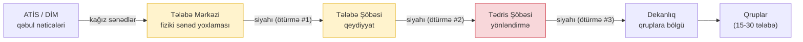

Bu zəncirdə **dörd struktur problem** var; hər biri aşağıda öz bölməsində açılır:

| # | Problem | Nəticəsi | Harada həll olunur |
|---|---|---|---|
| P1 | **3 dəfə siyahı ötürülür** — hər ötürmə eyni datanın yenidən köçürülməsidir (Excel/kağız) | Hər köçürmədə xəta + itki + gecikmə; legacy myedudb-nin «0 foreign key, əlaqələr CSV mətn sütununda» anti-patterni məhz belə əl-ötürmələrdən doğulub | §B.2 — ötürmə = status keçidi |
| P2 | **Tələbə Mərkəzi ↔ Tələbə Şöbəsi** iki ayrı «yoxlama-təsdiq» instansiyası kimi görünür | Eyni sənəd dəsti iki dəfə baxılır, məsuliyyət bulanıqlaşır | §B.1 ⚠ Proses tənqidi |
| P3 | **Tədris Şöbəsinin «yönləndirməsi»** insan qərarı kimi təsvir olunub | Halbuki ixtisas qəbul anında artıq məlumdur — bu, qərar deyil, lookup-dur | §A.3 ⚠ Proses tənqidi |
| P4 | Axında **qəbul əmri (rektor əmri) və hesab provisioning-i** ümumiyyətlə yoxdur | Hüquqi lövbərsiz status, sistemsiz tələbə | §A.2, §B.3 |

---

### A.1 ATİS inteqrasiyası və fiziki sənəd yoxlaması

#### A.1.1 ATİS-dən alınmalı sahələr

ATİS idxalı bir **`Admission`** (qəbul qeydi) obyektinə düşməlidir — tələbə hesabı və
akademik qeyd ondan **törədilir**, əl ilə yenidən yazılmır. Sahələr və EMSArena hədəfləri:

| Blok | Sahə | Hədəf model | Status |
|---|---|---|---|
| **Kimlik** | ATİS qeyd ID-si (iş nömrəsi) | `Admission.atis_id` — idempotent idxal açarı | ❌ YOXDUR |
| | **FİN** (şəxsiyyət vəsiqəsi, 7 simvol) | `UserProfile.fin` — unikal biznes açar | ✅ VAR (mig `accounts 0014`, nullable-unique, **qlobal**; `core.validators.validate_fin` = `^[A-Z0-9]{7}$`). Legacy adapteri doldurur (`student_placement` fazası); ATİS idxalı və əl ilə backfill səthi hələ açıqdır |
| | Ad / Soyad / Ata adı | `User.first_name/last_name` + profil | ✅ VAR |
| | Doğum tarixi, cins, vətəndaşlıq | `UserProfile` genişlənməsi | ❌ YOXDUR |
| | Şəxsiyyət sənədinin seriya/№ (əcnəbi üçün pasport) | `Admission` | ❌ YOXDUR |
| **Qəbul** | İxtisas kodu (DİM təsnifatı, məs. `060632` — **nümunə**; real kod dəsti universitetin ATİS uzlaşdırma cədvəlindən gəlir və `Program.dim_code`-a yazılır) | `Program.dim_code` uyğunlaşdırması → `StudentAcademicRecord.program` | ✅ VAR (Program/SAR) |
| | Təhsil səviyyəsi (bakalavr/magistr) | `Program.degree_level` | ✅ VAR |
| | **Təhsil forması** (əyani/qiyabi) | qrup atributu + plan sahəsi | ❌ YOXDUR — sistemdə heç yerdə modellənməyib (DERS_YUKU_SPEC §9.1 boşluğu) |
| | **Tədris dili / sektor** (AZ/EN/RU) | qrup OrgUnit konvensiyası (sektorlar ayrı qruplardır) | 🟡 QİSMƏN VAR (konvensiya var, struktur sahə yox) |
| | Qəbul balı, müsabiqə/güzəşt kateqoriyası | `Admission` (informativ + təqaüd modulu üçün) | ❌ YOXDUR |
| | Maliyyə mənbəyi (dövlət sifarişi / ödənişli) | `Admission` → gələcək maliyyə modulu; NK 348 §4.3 «ödənişli davam» qaydası buna söykənir | ❌ YOXDUR |
| | Qəbul ili | `StudentAcademicRecord.admission_year` + `Curriculum.admission_year` bağlaması | ✅ VAR |
| **Əlaqə** | Telefon, email, ünvan | `UserProfile.phone/…` | ✅ VAR (phone), 🟡 ünvan |
| **Əvvəlki təhsil** | Attestat/diplom seriya-№, məzun müəssisə | `DocumentItem` (sənəd checklist-i) | ❌ YOXDUR |

**Qərar:** idxal **fayl-agnostik adapter** üzərindən getməlidir (ATİS API varsa API, yoxdursa
Excel/CSV eksportu) — çünki ATİS-in maşın-oxunan interfeysi universitetdən-universitetə fərqli
əlçatandır və mövcud `import_users_from_excel` presedenti (✅ VAR) bu adapterin skeletidir.

**İdxalın yeganə yolu staging dəhlizidir.** Adapter `Admission`-a birbaşa yazmır: fayl/API cavabı
əvvəlcə `AdmissionImportBatch` (mənbə + SHA-256 checksum) və `AdmissionImportRow` (`raw_payload`,
`normalized`, `row_hash`) sətirlərinə düşür, uzlaşdırmadan sonra servis qatı `Admission`-a tətbiq
edir (m_atis §25.1). Manual daxiletmə də istisna deyil — o da 1 sətirlik batch yazır. Beləcə
«hansı fayl, hansı sətir, hansı dəyər» sualı hər qeyd üçün cavablanır; `Admission`-a staging-dən
kənar heç bir yazı yolu **yoxdur**. ❌ YOXDUR (staging modelləri qurulmalıdır).

#### A.1.2 Fiziki sənəd yoxlaması — statuslar və state machine

Sənəd yoxlaması **qeyd səviyyəsində status + sənəd səviyyəsində checklist** kimi
modellənməlidir, çünki «Çatışmazlıq var» heç vaxt bütöv işə aid deyil — konkret sənədə aiddir.

**Checklist (tenant-konfiqurasiyalı sənəd növləri):** attestat/diplom əsli · şəxsiyyət
vəsiqəsinin surəti · foto · tibbi arayış (086/U) · hərbi qeydiyyat vərəqəsi · DİM çıxarışı.
Hər `DocumentItem`: `kind, status(pending/ok/missing/invalid), note, checked_by, checked_at`.

Qəbul qeydi **iki paralel status daşıyır** və onlar qarışdırılmamalıdır — biri sənəd dəstinin
yoxlanmasını, digəri qeydin kontingent üzrə həyat dövrünü izləyir:

| Sahə | Dəyərlər | Nəyi izləyir | Sahib |
|---|---|---|---|
| `Admission.docs_status` | `received / in_review / verified / deficient / rejected` | Fiziki sənəd dəstinin yoxlanma vəziyyəti (bu bölmənin alt-maşını) | Tələbə Mərkəzi mərhələsi |
| `Admission.status` | `imported / confirmed / provisioned / enrolled / cancelled` | Qeydin kontingent üzrə həyat dövrü — **kanonik lüğət** (m_atis §25.3.3) | Tələbə Şöbəsi mərhələsi + avto-addımlar |

**İki maşının xəritəsi:** `docs_status=verified` **+** qəbul əmri rekviziti (№/tarix) →
`status=confirmed`; provisioning (hesab + ilk-giriş OTP) uğurlu → `status=provisioned`;
qrup təyini + məcburi fənlərə enrollment → `status=enrolled`; imtina / gəlmədi / əmr ləğvi →
`status=cancelled`. `docs_status=rejected` qeydi heç vaxt `confirmed`-ə keçə bilmir.

Sənəd yoxlaması alt-maşını (`docs_status` — istifadəçinin 5 statusu + yenidən-təqdim dövrəsi):

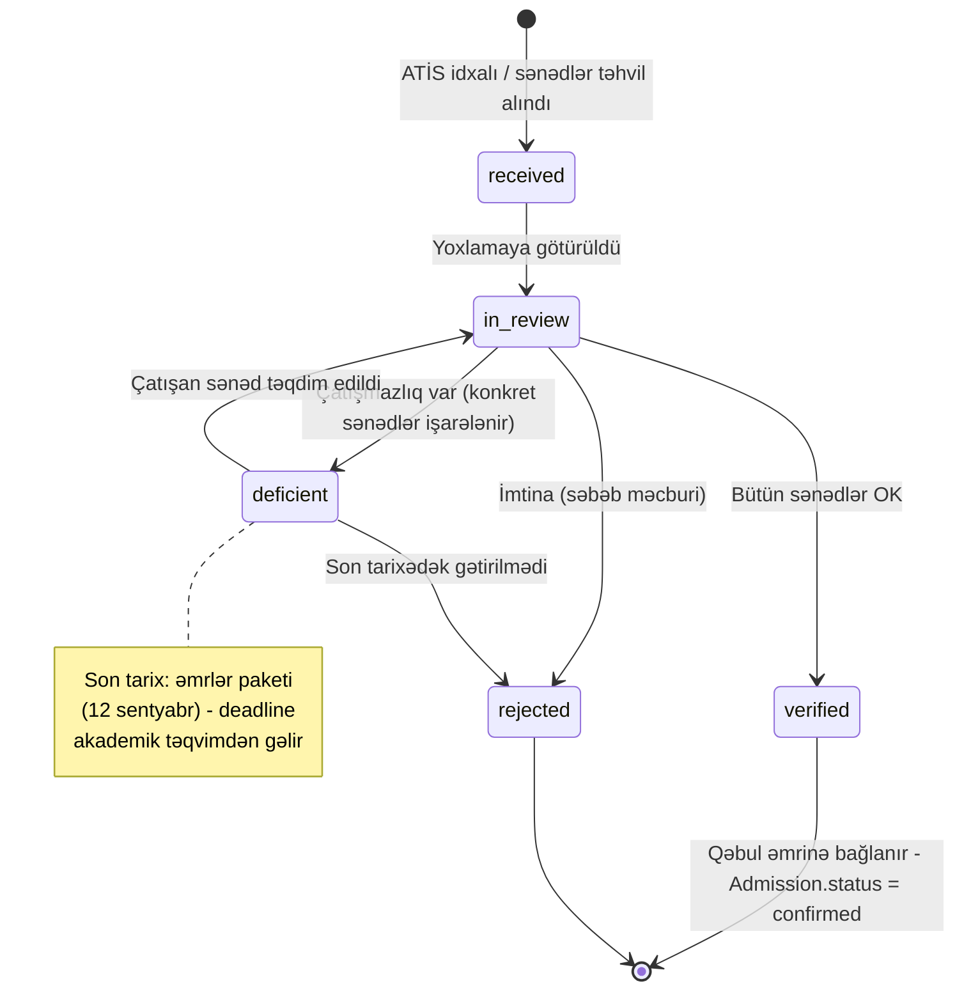

- **received** = «Qəbul edildi», **in_review** = «Yoxlanılır», **verified** = «Təsdiqləndi»,
  **deficient** = «Çatışmazlıq var», **rejected** = «İmtina».
- `docs_status: verified` → `status: imported → confirmed` keçidi **qəbul əmrinin
  nömrəsi/tarixi olmadan mümkün olmamalıdır** — tələbəni hüquqi şəxs edən sənəd əmrdir,
  sistem statusu deyil (bax P4).
- Keçidlər exams final-center üslubunda **şərti-UPDATE (compare-and-swap)** ilə icra
  olunmalıdır — iki əməkdaş eyni işi paralel bağlaya bilməsin. ✅ VAR (kanonik pattern
  `apps/exams/domain/final_center.py`-dədir, təkrar istifadə olunur).

#### A.1.3 Status dəyişikliyi auditi

Hər keçid `AdmissionTransition(admission, field=status|docs_status, from_status, to_status,
actor, at, reason, note, snapshot)` sətri yazır (iki paralel status olduğu üçün `field`
məcburidir — §A.1.2) **və** `core.audit.log_action`-a düşür. ✅ VAR (audit infrastrukturu
və journal-corrections snapshot presedenti hazırdır) / ❌ YOXDUR (qəbul obyektinin özü).
Legacy müqayisə: myedudb-də status «kim, nə vaxt, niyə» olmadan sütun üzərinə yazılırdı —
mübahisə anında sübut yoxdur; burada hər keçid sübutlu olmalıdır, çünki qəbul mərhələsi
şikayət/apellyasiyaların ən sıx nöqtəsidir.

#### A.1.4 Duplikatın qarşısının alınması

Üç səviyyəli unikallıq **belə olmalıdır**:

1. **`Admission.atis_id`** — `(organization, admission_year, atis_id)` unikal:
   eyni idxal faylı iki dəfə yüklənəndə ikinci yüklənmə **update** olur, insert yox
   (idempotent idxal — «AI caching» qaydamızla eyni fəlsəfə: eyni data → eyni nəticə).
2. **`UserProfile.fin`** — nullable-unique (əcnəbi tələbədə FİN yoxdur → pasport №
   `Admission`-da qalır). FİN normalizasiya olunur (upper-case, boşluqsuz, 7 simvol
   format validatoru).
3. **İkinci ixtisas duplikat DEYİL** — eyni FİN + fərqli proqram = mövcud
   `uniq_student_program` constraint-i (✅ VAR, `StudentAcademicRecord`) ilə ayrı akademik
   qeyddir; şəxs bir dəfə, qeyd proqram başına.

Toqquşma qaydası: `atis_id` tapıldı → update; `atis_id` yoxdur, amma FİN mövcud istifadəçiyə
düşür → **conflict queue** (insan baxışı, avtomatik merge QADAĞAN — səssiz merge legacy
sistemin «eyni adam 3 qeyd» xəstəliyinin tərs üzüdür); heç biri yoxdur → yeni qeyd.

---

### A.2 Tələbənin identifikatoru və status maşını

#### A.2.1 Əsas identifikator qərarı

| Rol | Daşıyıcı | Səbəb |
|---|---|---|
| **Primary key** | **Daxili UUID** | Mövcud `UUIDModel` konvensiyası + RLS/multi-tenant üçün yeganə təhlükəsiz seçim — xarici sistemin açarına tabelik yaratmır. ✅ VAR |
| **Biznes-unikal açar** | **FİN** | Dövlət sənədlərində şəxsin sabit açarıdır; amma PK ola bilməz — əcnəbidə yoxdur (nullable) və xarici sistemin sahəsidir. ❌ YOXDUR |
| **Xarici referans** | **ATİS ID** | Yalnız idxal-uzlaşdırma üçün; daxili heç bir FK ona bağlanmır. ❌ YOXDUR |

Legacy anti-pattern xatırlatması: myedudb-də əlaqələr `students_id='["9979"]'` kimi mətn
sütunlarında idi — identifikator intizamının olmaması bütün sistemin FK-sız qalmasının kök
səbəbidir. Bu üçlük (UUID daxildə, FİN şəxsdə, ATİS ID kənarda) həmin xəstəliyin peyvəndidir.

**Təkrar məlumat gələndə davranış:** A.1.4 qaydası + sahə-səviyyə diff: kimlik sahələri
(ad, FİN, doğum tarixi) dəyişibsə avtomatik yazılmır — **pending change** kimi Tələbə
Şöbəsinin təsdiqinə düşür (sənəd əsaslı düzəliş); qeyri-kritik sahələr (telefon, ünvan)
avtomatik yenilənir, audit ilə.

#### A.2.2 Tələbə statuslarının state machine-i

Mövcud `AcademicStatus` enum-u (enrolled / academic_leave / expelled / graduated) ✅ VAR,
amma **keçid maşını, guard-lar və audit YOXDUR** (roadmap U5+ «sonra» statusundadır) —
bu bölmə onu KQ-02 (2024) əsasında rəsmiləşdirir:

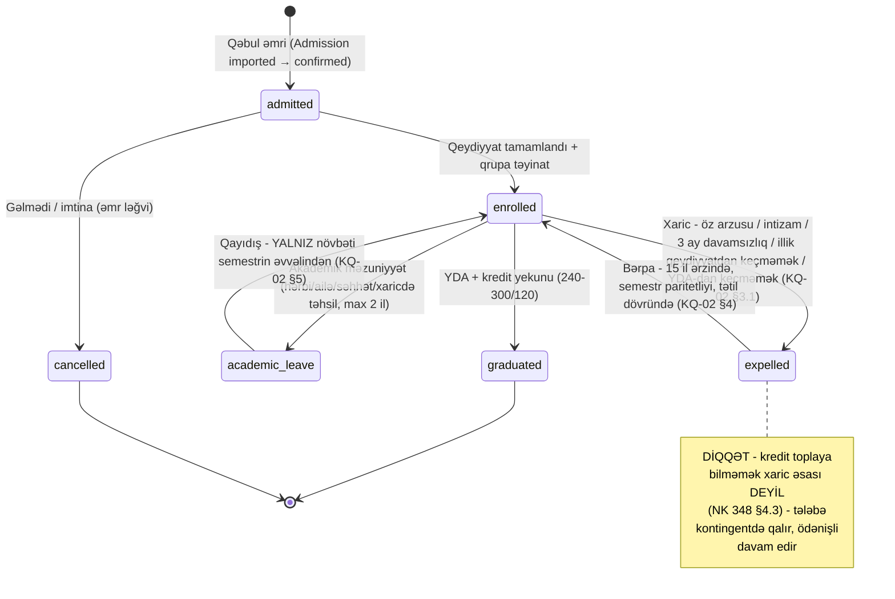

Guard-lar (servis qatında kodlaşdırılmalı):

- **Hər keçid əmr rekviziti tələb edir** (`order_no, order_date`) — əmrsiz status dəyişməz;
  keçid `StudentStatusTransition` (❌ YOXDUR) + `core.audit`-ə yazılır.
- **Bərpa paritet guard-ı:** payızda xaric olunan yalnız payızda bərpa olunur (KQ-02 §4);
  sistem tarix pəncərəsini akademik təqvimdən oxuyub bloklamalıdır.
- **`academic_leave → enrolled`** yalnız semestr sərhədində — semestr ortasında qayıdış
  keçidi UI-da mövcud olmamalıdır.
- **«Kredit çatışmazlığı» üçün ayrıca status YOXDUR** — bu, statusla yox,
  `Enrollment(kind=retake)` + borclu fənn mexanizmi ilə modellənir (✅ VAR retake kind;
  axın sənədi §8.3: borc qrupu dəyişmir, fənn qrupunu böyüdür).

#### A.2.3 Tələbə məlumatını kim dəyişə bilər — sahə sahibliyi matrisi

«Hamı hər şeyi redaktə edir» modeli qadağandır; hər sahə dəstinin **bir sahibi** olmalıdır:

| Sahə dəsti | Sahib | Mexanizm | Status |
|---|---|---|---|
| Kimlik (FİN, ad, doğum) | Tələbə Şöbəsi | Yalnız **sənədli audited correction** (PDF + tarixçə) — jurnal-düzəliş infrastrukturunun eyni rejimi | ✅ VAR (corrections infrastrukturu) / ❌ bu domenə tətbiqi |
| Akademik status | Tələbə Şöbəsi icra edir, dekanlıq təqdimat verir | State machine + əmr rekviziti (§A.2.2) | ❌ YOXDUR |
| İxtisas / kurikulum bağlaması | Tədris Şöbəsi | Köçürmə əmri ilə, yeni `StudentAcademicRecord` | 🟡 QİSMƏN VAR (model var, axın yox) |
| Qrup | Dekanlıq (öz fakültə scope-u) | `GroupMembership` keçidi + audit (§A.4) | 🟡 QİSMƏN VAR |
| Əlaqə (telefon, email) | Tələbənin özü | Self-service + OTP təsdiqi | ✅ VAR (profil + OTP axını) |
| İKT Rəhbəri (level 88) | Hər şeyə — amma yalnız **audited correction** rejimi ilə | Mövcud super-korrektor kontraktı pozulmur | ✅ VAR |

---

### A.3 Yönləndirmə zənciri → EMSArena OrgUnit ağacı

İstifadəçinin dediyi zəncir: *Universitet → Fakültə → Dekanlıq → İxtisas → Səviyyə → Forma →
Qəbul ili → Qrup*. Bunun EMSArena-ya düşməsi **iki fərqli təbiətli hissəyə** ayrılır —
zəncirin bir hissəsi **struktur qovşağıdır** (OrgUnit), digəri **qrupun atributudur**:

| Zəncir həlqəsi | EMSArena qarşılığı | Status |
|---|---|---|
| Universitet | `Organization` (tenant, RLS sərhədi) | ✅ VAR |
| Fakültə | `OrgUnit(unit_type=faculty)` | ✅ VAR |
| Dekanlıq | `OrgUnit(unit_type=deanery)` — opsional qovşaq; kiçik universitetdə fakültə=dekanlıq | ✅ VAR |
| İxtisas | `OrgUnit(unit_type=specialty)` + `Program` (specialty_unit FK ilə bağlı) | ✅ VAR |
| Səviyyə (bakalavr/magistr) | **OrgUnit deyil** — `Program.degree_level` atributudur | ✅ VAR |
| **Forma (əyani/qiyabi)** | **OrgUnit deyil** — qrup atributu (`OrgUnit.settings.education_form`) + kurikulum sahəsi | ✅ VAR (legacy-idxal qrupları üçün): `academic_structure` fazası `settings["education_form"]`-u `full_time`/`part_time` kimi yazır. **Kurikulum sahəsi hələ YOXDUR** (§B.4 sətir 6) |
| Qəbul ili | Qrup atributu (`settings.admission_year`) + `Curriculum.admission_year` lövbəri | ✅ VAR (legacy-idxal qrupları üçün): `academic_structure` fazası `settings["admission_year"]`-i `int` və ya `null` kimi yazır (`1950..2100`-dan kənar və `0` sentineli → `null`); kurikulum lövbəri onsuz da VAR idi |
| Qrup | `OrgUnit(unit_type=group)`; dil sektoru (AZ/EN) ayrı qrup — mövcud konvensiya | ✅ VAR |

**Qərar:** Səviyyə/Forma/Qəbul ili ağac qovşağı **edilməməlidir** — ağacı 3 səviyyə dərinləşdirib
hər il yeni budaq yaratmaq scope/RLS sorğularını ağırlaşdırır; bunlar qrupun tipləşdirilmiş
atributları olmalıdır (`settings` JSON-dan tipli sahələrə keçid ayrı miqrasiya addımıdır).
Ağacın forması tenant-konfiqurasiyalıdır (ixtisas kafedra altında da, fakültə altında da ola
bilər — universitetdən-universitetə dəyişir; `parent` FK bunu artıq dəstəkləyir ✅ VAR).

> **⚠ Proses tənqidi — «Tədris Şöbəsi tələbələri fakültələrə yönləndirir» addımı artıqdır.**
> Tələbənin ixtisası ATİS/DİM qəbulunda artıq təyin olunub; ixtisas OrgUnit ağacında öz
> fakültəsinin altındadır. Deməli «yönləndirmə» insan qərarı deyil — `specialty.path` üzrə
> **deterministik lookup-dur** və sistemdə sıfır kliklə baş verməlidir. Tədris Şöbəsinin bu
> addımdakı real (və saxlanmalı) funksiyaları başqadır: (1) ixtisas kodu ↔ daxili `Program`
> kataloqu uzlaşdırması (idxal xəritəsi), (2) plan yeri / kvota-uyğunsuzluq nəzarəti,
> (3) 12 sentyabr əmr paketinin və «sistemə yükləmə» son tarixinin sahibliyi (axın sənədi §2.3:
> «sistem mənasında başlatma» tədris şöbəsindədir). Yəni Tədris Şöbəsi **marşrutlaşdırıcıdan
> nəzarətçiyə** çevrilir — siyahı daşımır, istisnaları həll edir.

---

### A.4 Qrup formalaşdırma

#### A.4.1 Avtomatik təklif + manual düzəliş

Bölgü açarı: **(ixtisas, səviyyə, forma, qəbul ili, dil sektoru)** — bu beşlik daxilində
tələbələr qruplara bölünür (sektorlar heç vaxt qarışmır — mövcud konvensiya).

Alqoritm (NK 75 §8.8 normasına kodlaşdırılmış):

```
N = beşlik üzrə qəbul olunan tələbə sayı
N < 30            → 1 qrup (NK 75 §8.8: «30 nəfərdən az olduqda bölünmə aparılmır»)
N = 30            → 1 qrup (yuxarı hədd, bölünmə tələb olunmur)
N > 30            → k = ceil(N / 30) qrup, ölçülər balanslı (fərq ≤ 1)
yaranan ölçü < 15 → sarı xəbərdarlıq (15–30 aralığı pozulur; birləşdirmə təklifi
                    və ya rektor əsaslandırması)
```

- Sistem **təklif edir, insan təsdiq edir** — dekanlıq drag-drop redaktoru ilə tələbələri
  qruplar arasında köçürə bilir; validator canlı işləyir: >30 → qırmızı (əsaslandırma
  mətni məcburi, bloklamır — real həyatda istisna rəhbər qərarı ilə olur, sistem izi saxlayır,
  workload modulundakı «bloklamır, xəbərdarlıq edir» prinsipi ilə eyni), <15 → sarı.
- **Ad konvensiyası tenant-şablonludur:** `{ixtisas qısaltması}{qəbul ili son 2 rəqəm}{sıra}
  {sektor}` (real nümunələr: `236 İ ing`, `036`, `336 F`) — sərbəst mətn yox, şablon,
  çünki dərs yükü modulu qrup adlarını birləşmə yazılışlarında istifadə edir.
- Yarımqrup **bu mərhələdə yaradılmır** — yarımqrup inzibati struktur deyil, dərs yükünün
  hesablama vahididir (KQ-12) və fənn-səviyyə qərardır (DERS_YUKU_SPEC §9.11).

#### A.4.2 Qrup lifecycle-ı

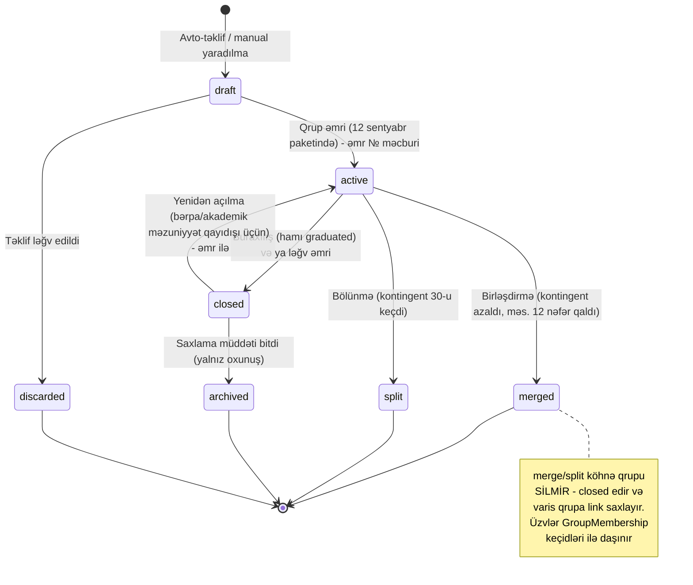

Qaydalar:

- `draft → active` **yalnız əmr rekviziti ilə** — 12 sentyabr «qrupların sistemə yüklənməsi
  son tarixi»nin sistem qarşılığı budur: həmin gün bütün draft-lar ya active olur, ya səbəbli
  gecikmə qeydi alır.
- **Hard-delete yoxdur** — qrup OrgUnit-inə jurnal, cədvəl, imtahan, workload sətirləri FK ilə
  bağlanır; «silmək» = `closed` + audit (exam soft-delete presedenti ilə eyni fəlsəfə ✅ VAR).
- Birləşmə/bölünmə **Elmi Şura/rektorluq qərarı ilə auditlənməlidir** (KQ-12 qeyd 1 dərs-yükü
  birləşmələri üçün bunu açıq tələb edir; inzibati qrup dəyişikliyi də eyni sənəd intizamına
  düşməlidir) — səbəb + əsas sənəd + kim/nə vaxt.

#### A.4.3 Bir tələbə = bir aktiv qrup — və mövcud «iki mənbə» problemi

**İnvariant:** bir tələbənin bir anda **bir açıq qrup üzvlüyü** olur. Modeli:

```python
class GroupMembership(UUIDModel, TimeStampedModel):        # ❌ YOXDUR — yeni
    organization, student, group = FK-lər
    valid_from = DateField
    valid_to   = DateField(null=True)                      # NULL = açıq (cari)
    reason     = Char(formation/transfer/merge/split/leave_return/restore/close)
    order_ref  = Char                                      # əmr №/tarix
    created_by = FK user
    # Partial unique: (student, organization) WHERE valid_to IS NULL
```

Bu, axın sənədinin «`GroupMembership` tarixçəli olmalıdır, hard-delete yox» tələbinin (§8.4)
birbaşa icrasıdır: akademik məzuniyyətdən qayıdan tələbənin köhnə qrupu irəli gedib —
qayıdış = köhnə üzvlüyün bağlanması + bir aşağı ilin qrupunda yeni üzvlük; tarixçə
transkript/arxiv üçün itmir.

> **⚠ Proses tənqidi — mövcud EMSArena-da qrup üzvlüyünün İKİ mənbəyi var.** Tələbə↔qrup
> əlaqəsi həm `Membership(role=student, scope_unit=group)`-da, həm `StudentAcademicRecord.group`-da
> saxlanılır (hər ikisi ✅ VAR) — tarixçəsiz və bir-biri ilə constraint-siz. Bu, sinxron pozulma
> riskidir (biri yenilənib, digəri yox → RLS scope bir şeyi, jurnal başqa şeyi göstərir).
> **Qərar:** `GroupMembership` yeganə yazı mənbəyi olur; `Membership.scope_unit` və
> `StudentAcademicRecord.group` ondan törədilən güzgülərdir və yalnız servis qatından
> (tək transaction-da) yenilənir — birbaşa redaktələri boundary/CI qaydası ilə bağlamaq lazımdır.

#### A.4.4 Köçürmə, bağlanma, yenidən açılma — hamısı audit ilə

| Əməliyyat | Kim | Nə yazılır |
|---|---|---|
| Qrupdan-qrupa köçürmə | Dekanlıq (öz fakültə scope-u); fakültələrarası → Tədris Şöbəsi | Köhnə üzvlük `valid_to`, yeni üzvlük `valid_from`, səbəb + əmr; Enrollment-lər yeni qrupun offering-lərinə uyğunlaşdırılır (köhnə qrupun məcburi fənləri → yeni qrupunkular; fərqli seçmə qərarı varsa conflict siyahısı) |
| Qrup bağlanması | Dekanlıq təqdimatı + Tədris Şöbəsi icrası | `closed` + bütün açıq üzvlüklərin təyinat qrupu (merge target) və ya status keçidi |
| Yenidən açılma | Tələbə Şöbəsi (bərpa əmri kontekstində) | `closed → active` + səbəb; yalnız semestr sərhədində (bərpa tətil dövründə aparılır — KQ-02) |
| Hamısında | — | `core.audit.log_action` + keçid sətri; PDF sənəd org siyasəti ilə opsional (İKT Rəhbəri müdaxilələrində məcburi) |

---

## B. Təkmilləşdirilmiş proses

### B.1 ⚠ Proses tənqidi — Tələbə Mərkəzi ↔ Tələbə Şöbəsi ayrımı real dəyər verirmi?

**Vermir — bu, iki şöbə deyil, bir workflow-un iki statusudur.** Sübut: Tələbə Mərkəzinin
çıxışı «yoxlanmış siyahı», Tələbə Şöbəsinin girişi «həmin siyahı»dır — arada heç bir yeni
məlumat yaranmır, heç bir müstəqil qərar verilmir; ötürmə aktının özü (siyahının köçürülməsi)
yeganə «iş»dir və o, xəta mənbəyindən başqa heç nə deyil. Normativ baxımdan da ayrım tələb
olunmur: NK 348 qəbul-qeydiyyat zəncirində belə iki instansiya tanımır.

**Qərar:** sistemdə **bir «Qəbul qeydiyyatı» pipeline-ı** olur (A.1.2 state machine-i);
Tələbə Mərkəzi = `docs_status: received → verified` mərhələlərinin sahibi (fiziki sənəd
checklist-i), Tələbə Şöbəsi = `status: imported → confirmed` mərhələsinin sahibi (əmrə bağlama
+ hesab provisioning → `provisioned`). Təşkilati cədvəldə iki bölmə qala bilər — amma sistemdə onlar **eyni obyektin
iki rol-qapılı mərhələsidir**, iki ayrı reyestr deyil. Kiçik universitetdə (bir şöbə hər
ikisini görür) mərhələ sahibliyi konfiqurasiya ilə birləşdirilir — axın dəyişmir, rol xəritəsi
dəyişir. «Siyahını ötürmək» anlayışı sistemdən tamamilə çıxır: ötürmə = status keçidi, növbəti
rolun iş siyahısında avtomatik görünmə (bildiriş ✅ VAR — notifications infrastrukturu).

### B.2 To-be axını — nə avtomatlaşır, nə birləşir

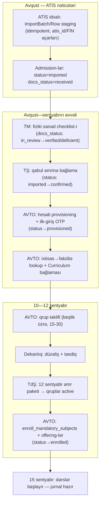

Əl addımlarının taleyi:

| As-is əl addımı | To-be | Qazanc |
|---|---|---|
| ATİS-dən siyahının köçürülməsi | **Avtomatlaşır** — adapter idxalı, idempotent | Sıfır köçürmə xətası; təkrar idxal təhlükəsiz |
| TM yoxlaması | **Qalır** (fiziki sənəd fiziki qalır) — amma checklist + status sistemdə | Kim harada dayandı — görünür; çatışmazlıq tələbəyə bildirişlə |
| TM → TŞ siyahı ötürməsi | **Ləğv** — status keçidi (§B.1) | Bir reyestr, iki rol |
| TŞ → TdŞ ötürməsi | **Ləğv** — `confirmed` qeydlər TdŞ nəzarət panelində avtomatik | — |
| TdŞ fakültə yönləndirməsi | **Ləğv** — deterministik lookup (§A.3); TdŞ istisna/kvota nəzarətçisidir | İnsan yalnız uzlaşdırma konfliktlərinə baxır |
| Hesab yaradılması (as-is-də ümumiyyətlə yox idi) | **Avtomatlaşır** — mövcud provisioning + ilk-giriş OTP zənciri ✅ VAR | Tələbə 15 sentyabrda sistemə girə bilir |
| Dekanlıq qrup bölgüsü | **Yarı-avto** — sistem təklif edir, dekanlıq təsdiqləyir | 15-30 norması yazılma anında yoxlanır |
| Qrup əmri + «sistemə yükləmə» | **Birləşir** — əmr rekviziti daxil edilir, `draft→active` kütləvi keçid = «yükləmə» | 12 sentyabr deadline-ı sistem hadisəsidir, Excel təhvili deyil |
| Məcburi fənlərə yazılma + jurnal açılışı | **Avtomatlaşır** — `enroll_mandatory_subjects` + `ensure_offering_course` zənciri ✅ VAR | Qrup active olan andan jurnal 15 sentyabra hazır |

### B.3 Normativ təqvimə bağlanma

Bütün deadline-lar akademik təqvimdən (first-class obyekt — ❌ YOXDUR; `AcademicPeriod`-un
pəncərə sahələri 🟡 QİSMƏN VAR-dır, amma həftə nömrələnməsi və inzibati son tarixlər yoxdur)
qidalanmalıdır — hardcode tarix olmaz, çünki illər üzrə sürüşür:

| Tarix | Normativ əsas | Sistem hadisəsi |
|---|---|---|
| 5–15 iyul | NK 348 b. 3.3.1 | **Davam edən** tələbələrin fərdi plan pəncərəsi (qəbul axınına aid deyil — I kurs default plana düşür, b. 3.3.4) |
| 13–19 iyul | Təqvim praktikası | `promote_students` + növbəti ilin qrup proyeksiyası (yük proqnozu üçün) |
| 10–16 avqust | Təqvim praktikası | Yeni ilin akademik təqvimi sistemə daxil edilir → bütün aşağıdakı deadline-lar buradan törəyir |
| Avqust (DİM elanı) | — | ATİS idxal pəncərəsi açılır; qəbul pipeline-ı işə düşür |
| 1–10 sentyabr | Təqvim + NK 348 | Fənn qeydiyyatına düzəliş pəncərəsi (qanuni son: 10 sentyabr) |
| 1–12 sentyabr | Təqvim | Sənəd çatışmazlıqlarının bağlanması (`docs_status: deficient → verified`); deadline = əmrlər paketi, 12 sentyabr |
| **10 sentyabr** | NK 348 (qanuni) | Fərdi plan düzəlişlərinin sonu + dərs yükünün yekun bölgüsü → **qrup sayları bu tarixə sabitlənməlidir**, çünki yük I kurs qəbulundan asılıdır |
| **12 sentyabr** | Təqvim (real universitet sənədi) | Əmrlər paketi: qrup/yarımqrup, bərpa, qeydiyyat əmrləri → `draft→active` kütləvi keçid; gecikən qrup səbəb qeydi ilə görünür |
| **15 sentyabr** | Prezident sərəncamı + NK 117 b. 2.9 | Dərslər başlayır: offering-lər aktiv, jurnal yazıla bilir. **Mövcud:** keçmiş tarixə `Lesson` qadağandır (`gradebook.py:142,185` — `parsed < timezone.localdate()`, İKT `allow_past` ilə keçir) ✅ VAR. **Çatışmayan:** dərsin `period.start_date`-dən əvvələ və `end_date`-dən sonraya düşməsinin bloklanması ❌ YOXDUR — akademik təqvim obyekti ilə birlikdə əlavə olunmalıdır |

Deadline engine davranışı: hər mərhələnin son tarixi yaxınlaşanda məsul rola xatırlatma
(notifications + Celery beat ✅ VAR), keçəndə eskalasiya (Tədris Şöbəsi panelində qırmızı
siyahı). Bloklamır — görünür edir; bloklayan yalnız normativ-sərt pəncərələrdir (fərdi plan
dəyişikliyi 10 sentyabrdan sonra, KQ-02 tarix guard-ları).

### B.4 İcra boşluqlarının xülasəsi (bu bölmədən çıxan iş siyahısı)

| # | Tikinti bloku | Status | Qeyd |
|---|---|---|---|
| 1 | `apps/admissions`: `Admission` (`status` + `docs_status`) + `DocumentItem` + `AdmissionTransition` + `AdmissionImportBatch/Row` staging + idxal adapteri | ❌ YOXDUR | State machine pattern-i exams-dan, snapshot pattern-i corrections-dan götürülür; `Admission`-a staging-dən kənar yazı yolu yoxdur (§A.1.1) |
| 2 | `UserProfile.fin` (nullable-unique) + kimlik sahələri + FİN validatoru | 🟡 QİSMƏN VAR | `fin` + validator ✅ VAR (mig `accounts 0014`; legacy adapteri doldurur). Qalan: digər kimlik sahələri (doğum tarixi/cins/vətəndaşlıq) və conflict queue |
| 3 | `StudentStatusTransition` + status guard servisi (KQ-02) | ❌ YOXDUR | `AcademicStatus` enum-u ✅ VAR — üstünə qurulur (roadmap U5+) |
| 4 | `GroupMembership` (tarixçəli) + iki güzgünün servis-sinxronu | ❌ YOXDUR | P4.3 «iki mənbə» riskini bağlayır |
| 5 | Qrup lifecycle + avto-bölgü təklifi + dekanlıq redaktoru | ❌ YOXDUR | OrgUnit/scoping ✅ VAR — yalnız üst qat |
| 6 | `education_form` (qrup + kurikulum səviyyəsində) | ❌ YOXDUR | DERS_YUKU_SPEC ilə ortaq asılılıq — bir dəfə, bir yerdə həll olunmalı |
| 7 | Akademik təqvim first-class obyekt + deadline engine | ❌ YOXDUR (🟡 `AcademicPeriod` pəncərələri) | Bütün modulların (qəbul, plan, yük, jurnal) ortaq asılılığıdır — birinci qurulmalıdır |
| 8 | Hesab provisioning + ilk-giriş OTP + audit infrastrukturu | ✅ VAR | Dəyişiklik tələb etmir — pipeline sadəcə çağırır |

### B.5 Ölçmə çərçivəsi — as-is → to-be nə ilə sübut olunur

§B.2-nin «Qazanc» sütunu keyfiyyət ifadəsidir; təkmilləşmənin **baş verdiyini** yalnız ölçü sübut
edir. Aşağıdakı altı metrik prosesin qəbul meyarıdır — hər biri konkret obyektdən hesablanır,
yəni sonradan birbaşa dashboard sətrinə çevrilir (r_report §R.3.2 «Tədris Şöbəsi paneli»):

| # | Metrik | As-is (təxmin) | To-be hədəf | Hesablama mənbəyi |
|---|---|---|---|---|
| M1 | Siyahı ötürməsi sayı (qəbuldan qrupa qədər) | 3 (TM→TŞ→TdŞ→Dekanlıq) | **0** — ötürmə status keçidinə çevrilir | `AdmissionTransition` sətirləri: fayl/Excel ötürməsi yoxdursa metrik konstruksiya ilə 0-dır (§B.1) |
| M2 | Eyni tələbə üçün əl daxiletmə nöqtəsi | N (hər ötürmədə yenidən yazılır) | **1** — yalnız istisna/manual forma | `AdmissionImportRow.source ∈ {file, api, manual}`; hədəf: `manual` sətirlərin payı < 5% |
| M3 | Eyni tələbənin təkrar yazılması (dublikat qeyd) | 2–3 | **0** | `Admission` sayı ÷ unikal `fin_code` sayı = 1,00; conflict queue-da həll olunmuş sətirlər ayrıca sayılır (§A.1.4) |
| M4 | Dövr müddəti: idxaldan tələbənin ilk girişinə | günlər (kağız zənciri) | **saatlar** (median ≤ 24 saat) | `AdmissionTransition.created_at` fərqi: `status=imported` → `status=provisioned` sətirləri |
| M5 | 12 sentyabr əmr paketinə düşən qrupların faizi | ölçülmür | **≥ 95%** (qalanı səbəb qeydi ilə görünür) | `GroupMembership.order_ref` dolu olan `active` qruplar ÷ bütün qruplar, təqvim deadline-ı ilə müqayisədə (§A.4.2) |
| M6 | 15 sentyabra hazır jurnalların faizi | ölçülmür | **100%** | `AssessmentScheme`-i olan `CourseOffering` sayı ÷ dərs yükü (AWP) sətirlərindən doğan gözlənilən offering sayı |

Oxunuş qaydası: M1–M3 **struktur** metrikləridir (dizayn düzgündürsə hədəf avtomatik tutulur —
regressiya detektoru kimi işləyirlər), M4–M6 isə **əməliyyat** metrikləridir (hər qəbul mövsümü
yenidən ölçülür və deadline engine-in eskalasiyası ilə eyni panelə düşür — §B.3). As-is sütunu
təxmindir: mövcud prosesdə heç bir addım ölçülmür, ona görə ilk ilin rəqəmi **baza xətti** kimi
qeyd olunur və müqayisə ikinci ildən başlayır.

## C. End-to-End Workflow — qəbuldan elektron jurnalın avtomatik yaranmasına qədər

Bu bölmə tam illik lifecycle-ı **bir zəncir** kimi formalizə edir: ATİS/DİM yerləşdirmə
nəticəsindən başlayır, elektron jurnalın (CourseOffering + AssessmentScheme + Lesson)
avtomatik açılışı ilə bitir. Zəncirin hər halqası (a) kimin əlindədir, (b) hansı statusda
gözləyir, (c) hansı keçid hansı side-effect-i işə salır — bunların hamısı aşağıda
**icra planına çevrilə bilən** formada verilir: hər sətirdə «mövcud EMSArena-da **VAR /
QİSMƏN VAR / YOXDUR**» işarəsi.

### C.0 Dəyişməz arxitektura prinsipləri

1. **State-based orkestrasiya.** Hər sənədin öz status maşını var (`Curriculum`,
   `AnnualWorkingPlan`, `TeachingTask`, `AssessmentScheme`); keçidlər şərti UPDATE
   (compare-and-swap) ilə edilir — final-center imtahan state machine-in mövcud
   konvensiyası (**VAR**, `apps/exams/domain/final_center.py` nümunəsi).
2. **Side-effect-lər explicit servis çağırışı ilə.** Django signal işlədilmir — keçidi
   edən servis side-effect-ləri özü, eyni tranzaksiya konturunda çağırır. Səbəb: zəncir
   oxunaqlı və test edilə bilən qalır, «görünməz» kaskadlar yaranmır (**VAR** —
   layihə konvensiyası; `enroll_mandatory_subjects`, `ensure_offering_course` belə işləyir).
3. **İdempotentlik unikal açarlarla.** `CourseOffering(org, subject, period, group)`,
   `Enrollment(org, student, offering)`, `TeachingTask(org, year, chair)`,
   `TaskFacultySlice(task, faculty, revision)` — hər avtomatik generasiya təkrar
   çağırılanda ikinci nüsxə yaratmır, mövcudu tapıb yeniləyir (**VAR** registrar
   qatında; workload açarları **YOXDUR**, spec-də təyin olunub).
4. **Cross-app sərhəd.** `workload → registrar` yalnız `registrar/public.py` fasadı və
   string-FK ilə (boundary gate, modular monolith qaydası) — jurnal yaranışı workload-un
   içindən birbaşa model import-u ilə edilmir (**VAR** — CI boundary-ratchet qapısı).
5. **Hər avtomatik addımın əks-yoxlama hesabatı var.** «Offering var, bölgüdə yoxdur /
   tərsi» tipli uyğunsuzluq siyahısı — avtomatlaşma səssiz drift-ə çevrilməsin (**YOXDUR**,
   DERS_YUKU_SPEC §7.1-də tələb kimi).
6. **Anti-pattern lövhəsi (legacy myedudb).** Köhnə sistemdə jurnal **sillabus sətrindən**
   yaranır, tələbə bağlantısı `journals.students_id='["9979"]'` kimi JSON-mətn sütunundadır,
   81 cədvəldə 0 foreign key var. Nəticə: jurnalın **şəcərəsi yoxdur** — kim, hansı plana,
   hansı təsdiqə əsasən açıb, bərpa edilə bilmir. Bizim zəncirin əsas dəyəri məhz budur:
   hər jurnal FK zənciri ilə geriyə izlənir —
   `Lesson → CourseOffering → TeacherAssignment → TeachingTaskRow → AnnualWorkingPlanRow →
   CurriculumSubject → Curriculum (Elmi Şura protokolu №)`. Buna **jurnal şəcərəsi
   (lineage)** deyirik və o, akkreditasiya hesabatına birbaşa material verir.

### C.1 Mərhələ-mərhələ zəncir (master cədvəl)

| № | Mərhələ | Aktyor | Giriş datası | Çıxış datası | Status keçidi | Avtomatlaşma | EMSArena |
|---|---|---|---|---|---|---|---|
| 1 | Qəbul nəticələrinin idxalı | Tələbə Mərkəzi (mənbə: ATİS/DİM) | Yerləşdirmə siyahısı (ixtisas + sektor + təhsil forması) — Excel/API | Abituriyent qeydləri (draft kontingent) | `— → imported` | Yarı: import sehrbazı + uyğunlaşdırma önizləməsi | **QİSMƏN VAR** — `import_users_from_excel` bazası var; ATİS/DİM inteqrasiya qatı **YOXDUR** |
| 2 | Sənəd qəbulu / şəxsi iş | Tələbə Mərkəzi | Abituriyent qeydi + fiziki sənədlər | Tam şəxsi iş (çeklist bağlı) | `imported → docs_verified` (`Admission.docs_status`) | Manual (sistem çeklisti aparır) | **YOXDUR** |
| 3 | Qəbul əmri | Tələbə Şöbəsi → rektor imzası | Tam şəxsi işlər | Əmr (№ + tarix) + tələbə statusu «qəbul edilib» | `imported → confirmed` (qəbul əmri № + tarix rekviziti) | Manual approval (əmr reyestri) | **YOXDUR** — əmr/order modulu yoxdur |
| 4 | Hesab provisioning | Sistem (əmr keçidi trigger edir) | Əmrdəki siyahı | `User` + `Membership(student, scope=…)` + OTP-li ilk giriş | — | Tam avto | **VAR** — provisioning + `FirstLoginPasswordMiddleware` |
| 5 | Akademik qeyd | Registrar (konsol formu) | Program + qəbul ili | `StudentAcademicRecord(program, curriculum)` — hədəf modeldə curriculum `admission_year` üzrə avto-match | — | **Manual** (registrar konsol formu); hədəf: tam avto | **QİSMƏN VAR** — `StudentAcademicRecord` modeli və `StudentRecordForm` (`apps/registrar/forms.py:253`) **VAR**; qəbul zəncirindən idempotent avto-yaratma servisi (`provision_admission` → `curriculum = Curriculum(program, admission_year)` lookup-u) **YOXDUR** (m_atis §25.8 A2 fazası) |
| 6 | Qrup formalaşdırma | Dekanlıq (əmr: 12 sentyabr paketi) | İxtisas üzrə tələbə siyahısı + dil sektoru (AZ/EN) | `OrgUnit(group)` + `Membership(scope=group)` | qrup: `draft → active` — **əmr rekviziti məcburidir** (12 sentyabr paketi) | Yarı: sistem 15–30 nəfər + sektor balansı **təklif** edir (NK 75 §8.8), insan təsdiqləyir | **QİSMƏN VAR** — OrgUnit qrupu + sektor konvensiyası var; avto-təklif və **tarixçəli üzvlük** (from/to + səbəb) **YOXDUR** |
| 7 | Tədris planının təsdiqi | Kafedra → Fakültə şurası → Tədris Şöbəsi → Elmi Şura + rektor | Plan sətirləri (13 sütun: kredit, saat bölgüsü, prerekvizit, tədris edən kafedra) | `approved` Curriculum — **kilidli**, protokol № + tarix | `draft → chair_review → faculty_review → office_review → approved` (Elmi Şura ayrıca status deyil — `office_review → approved` keçidində protokol № + tarix + rektor imzası məcburi rekvizitdir, k_audit §L.4) | Manual approval zənciri + **avto canlı balans paneli** (30 kredit/semestr, seçmə 25–30%, humanitar 15–20%) | **QİSMƏN VAR** — `Curriculum`/`CurriculumSubject` var; status, saat sahələri, `teaching_chair`, blok strukturu **YOXDUR** (TEDRIS_PLANI_SPEC T0–T2) |
| 8 | Avto-enrollment | Sistem (+qrup seçmə qərarı: tyutor/dekanlıq) | Record + curriculum + `GroupElectiveChoice` | `Enrollment(mandatory/elective)` — qrupun bütün aktiv üzvlərinə | — | Tam avto (seçmə blok qərarı manual, qrup səviyyəsində) | **VAR** — `enroll_mandatory_subjects`, `choose_group_elective` |
| 9 | İllik işçi plan (AWP) generasiyası | Tədris Şöbəsi (sistem icra edir) | `approved` Curriculum-lar + qrup reyestri + aktiv tələbə sayları | `AnnualWorkingPlanRow`-lar (fənn × kurs × fəsil × qruplar × tələbə sayı × tədris edən kafedra) | `— → generated` | Tam avto generasiya | **YOXDUR** — normativ «itmiş həlqə» (NK 348 b. 3.2.12) |
| 10 | AWP dekanlıq qərarları | Dekanlıq | AWP sətirləri | Birləşmə (axın) / yarımqrup / «yetərli tələbə yoxdur» istisnası (b. 3.3.3) / seçmə blok qərarları | `generated → approved` | Manual approval — sistem `ceil(tələbə/40)` və birləşmə şərtlərini (kredit + məzmun eyniliyi) **təklif** edir | **YOXDUR** |
| 11 | Kafedra tapşırıqlarının generasiyası + göndərmə | Tədris Şöbəsi | `approved` AWP | `TeachingTask(draft)` hər kafedraya + sətirlər (`cəmi = plan × hesablama vahidi` düsturu); göndərişdə `TaskFacultySlice(pending)` hər toxunan fakültəyə | `draft → submitted` | Avto generasiya + manual göndərmə (validasiya xülasəsi ilə) | **YOXDUR** — DERS_YUKU_SPEC F1 |
| 12 | Dilim təsdiqi | Proqram koordinatoru (viza) + Dekan | Dilim sətirləri + **plan↔tapşırıq müqayisə paneli** | Viza (`reviewed/flagged`) + dilim `approved` və ya sətir-səviyyə `returned` (səbəb məcburi) | slice: `pending → approved/returned`; bütün dilimlər approved → task `approved` (avto, şərti UPDATE) | Manual approval | **YOXDUR** — F2 |
| 13 | Müəllim bölgüsü | Kafedra müdiri | `approved` task + `TeacherWorkloadProfile` (ştat, norma) | `TeacherAssignment`-lər (fəaliyyət növü üzrə; Vakant = teacher NULL) | `approved → distributing → distributed` | Yarı: saat balansı (`Σ ≤ cəmi`) və norma yoxlamaları (500 saat, 1,5 ştat, ≥60% auditoriya) avto; **seçim insan qərarıdır** | **YOXDUR** — F3 |
| 13a | Cədvəl tərtibi | Dekanlıq / Tədris Şöbəsi | Təsdiqlənmiş bölgü (`TeacherAssignment`) + auditoriya fondu | `ScheduleSlot`-lar (fənn × qrup × müəllim × auditoriya × həftə günü/saat) | `— → published` | Yarı: konflikt yoxlaması (müəllim/auditoriya/qrup üst-üstə düşməsi) **avto**, avto-tərtib **yox** | **QİSMƏN VAR** — cədvəl strukturu var, konflikt yoxlaması və nəşr statusu **YOXDUR** |
| 14 | Offering sinxronu + jurnal yaranışı | Sistem (`distributed` keçidi trigger edir) | Uyğun assignment-lər (subject FK + period + qrup + müəllim dolu) | `CourseOffering(instructor, lesson_hours)` + LMS `Course` + `AssessmentScheme(draft, 50/51/17)` + enrollment uzlaşması | — | Tam avto + əks-yoxlama hesabatı | **QİSMƏN VAR** — `get_or_create_offering` → `ensure_offering_course` → `ensure_assessment_scheme` zənciri **VAR**; `distributed` trigger-i, `instructor`/`lesson_hours` ötürülməsi **YOXDUR** |
| 15 | Jurnal istifadəsi | Müəllim / Tələbə | Offering + enrollment-lər | `Lesson`/`LessonMark`, giriş balı (max 50), yekun, transkript | scheme: `draft → submitted → chair_approved → approved` | Manual data girişi + avto hesablama, 2 saatlıq kilid + PG trigger | **VAR** |
| 16 | Təsdiqdən sonrakı düzəlişlər | İKT Rəhbəri (88) / tədris şöbəsi | Düzəliş sorğusu + sənəd | `WorkloadAmendment` (yük) / audited correction PDF (jurnal) | `distributed → amended → distributed` | Manual, tam audit-li | **QİSMƏN VAR** — jurnal audited-correction infrastrukturu **VAR**; workload amendment **YOXDUR** |

> **⚠ Proses tənqidi — istifadəçi zəncirindəki sıra səhvi.** Təklif olunan 16-cı bölmə
> zənciri «qrup yaradılır → tədris planı avto tətbiq → **qrupun CourseOffering-ləri avto
> yaranır** → akademik yük yaranır → …» deyir. Bu sıra yanlışdır: offering qrup yaranan
> anda açılsa, `instructor=NULL` (jurnal sahibsiz) və `lesson_hours=0` (qayıb limiti səssiz
> sönür — mövcud, sənədləşmiş bug) vəziyyətində doğulur. **Belə olmalıdır:** offering-in
> **kanonik yaradıcısı yük sinxronudur** (`distributed` keçidi) — çünki yalnız o anda
> jurnal sahibi və kontakt saatı məlumdur. Qrup yaranan andakı «fənlər» isə offering yox,
> **AWP sətirləridir** (plan proyeksiyası). Mövcud `enroll_mandatory_subjects` yolu
> `get_or_create` sayəsində saxlanıla bilər, amma **`instructor` və `lesson_hours`-un tək
> yazı mənbəyi workload sinxronu olmalıdır** — enrollment yolu bu sahələrə toxunmur; sinxron
> mövcud offering-i upsert edib bu iki sahəni doldurur. Bu qərar həm yarışı (iki yaradıcı
> yol), həm də `lesson_hours=0` bug-ını birdəfəlik bağlayır.

> **⚠ Proses tənqidi — «Tədris təsdiqləyir» authority conflict-i.** İstifadəçi zəncirində
> yükü Tədris Şöbəsi həm **yaradır**, həm də **təsdiqləyir**, sonra kafedraya yönləndirir —
> dekanlıq mərhələsi yoxdur. Bu, dörd-göz prinsipini pozur və normativ axına ziddir:
> real sənəddə tapşırığı tədris şöbəsi **hazırlayır/göndərir**, təsdiq **dekanlıqdadır**
> (fakültə dilimləri + koordinator vizası; xidməti tədrisə görə bir kafedra tapşırığı bir
> neçə fakültəyə toxunur). **Belə olmalıdır:** Tədris Şöbəsi = generator + göndərən;
> Dekanlıq = təsdiq orqanı (dilim-səviyyə); Kafedra = bölgü. Prorektor yekun təsdiqi
> org-konfiqurasiyalı opsional mərhələ kimi qalır (default söndürülü).

> **⚠ Proses tənqidi — «akademik yük avto yaranır» illüziyası.** Yük generasiyasının
> düsturu avtomatikdir (`cəmi = plan × hesablama vahidi`, Excel-in 855 sətri üzərində
> yoxlanılıb), amma **üç nöqtə hüquqən insan qərarıdır**: mühazirə birləşməsi, yarımqrup
> bölgüsü, «yetərli tələbə yoxdur» istisnası. KQ-12 qeyd 1-ə görə birləşmə/bölünmə «ali
> idarəetmə orqanının qərarı»dır → sistem **təklif edir, insan təsdiqləyir, qərar
> auditlənir**. Zəncirdə bu mərhələni «tam avto» kimi qurmaq normativ pozuntudur.

> **⚠ Proses tənqidi — Tələbə Mərkəzi ↔ Tələbə Şöbəsi dublikatı.** İki lane-in də əlində
> «tələbə datası» var: mərkəz sənəd qəbul edir, şöbə əmri yazır. Sərhəd dəqiq çəkilməsə,
> eyni tələbə iki dəfə əl ilə daxil ediləcək (legacy sistemlərin klassik xəstəliyi).
> **Belə olmalıdır:** data **bir dəfə** 1-ci mərhələdə (idxal) yaranır; Tələbə Mərkəzi
> yalnız çeklist/status işlədir, Tələbə Şöbəsi yalnız status keçidi (əmr) edir — heç biri
> tələbə atributlarını yenidən yazmır. Əmr keçidi provisioning-i **avtomatik** trigger edir
> (mərhələ 3→4 arasında əl köçürməsi yoxdur).

### C.2 State keçidi → side-effect xəritəsi (event-based görünüş)

Zəncir dörd status maşınının bir-birinə ötürülməsidir. Signal yox — keçidi edən servis
side-effect-i **explicit** çağırır; hər keçid `core.audit.log_action`-a yazılır.

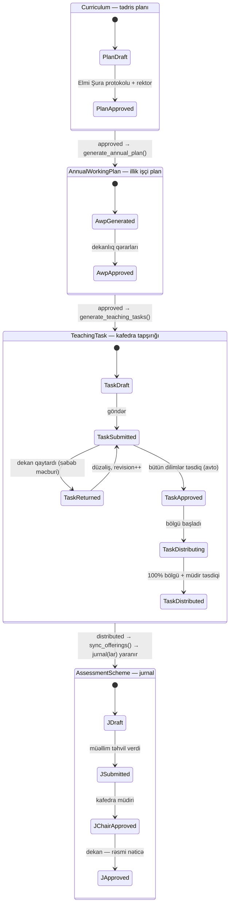

| # | Keçid (event) | Trigger edən servis (explicit) | Side-effect-lər | İdempotentlik / qoruma | EMSArena |
|---|---|---|---|---|---|
| E1 | `Curriculum → approved` | `curriculum.approve()` | Plan sətirləri kilidlənir; AWP generasiyasına icazə açılır; protokol № + tarix yazılır | Status compare-and-swap; approved plan yalnız versiya-klonla dəyişir | **YOXDUR** (T2) |
| E2 | `StudentAcademicRecord` yaranışı / tələbə qrupa təyini | provisioning servisi → `enroll_mandatory_subjects()` | Cari semestrin **məcburi** fənlərinə `Enrollment` (`CurriculumSubject.is_elective=False` sətirləri) | `uniq(org, student, offering)` | **VAR** — `apps/registrar/services.py:61-79` |
| E2b | Tələbə **mövcud qrupa sonradan** əlavə olundu | `apply_group_electives(record, period)` (yeni servis) | Qrupun artıq verilmiş `GroupElectiveChoice` qərarlarını yeni üzvə tətbiq edir → seçmə `Enrollment`-lər | `uniq(org, student, offering)` | **YOXDUR** — `enroll_mandatory_subjects` seçməyə toxunmur; `GroupElectiveChoice` yalnız `choose_group_elective` (yazı, o anki üzvlər) və `get_student_semester_plan` (oxu) yollarında işlədilir. İcra planına: registrar, orta prioritet |
| E3 | `GroupElectiveChoice` yaranışı | `choose_group_elective()` | Qrupun bütün aktiv üzvlərinə `Enrollment(elective)` bulk | `uniq(group, period, elective_group)` | **VAR** |
| E4 | `AnnualWorkingPlan → approved` | `annual_plan.approve()` → `generate_teaching_tasks()` | Hər `teaching_chair` üzrə `TeachingTask(draft)` + sətirlər (`cəmi = plan × hesablama vahidi`) | `uniq(org, year, chair)` — təkrar generasiya mövcud draft-ı yeniləyir, submitted+ statusa toxunmur | **YOXDUR** (F1) |
| E5 | `TeachingTask → submitted` | `workload.submit_task()` | Toxunan hər fakültəyə `TaskFacultySlice(pending)`; dekanlıq + koordinatorlara bildiriş | `uniq(task, faculty, revision)` | **YOXDUR** (F2) |
| E6 | Sonuncu `TaskFacultySlice → approved` | `workload.approve_slice()` | Task `submitted → approved` (şərti UPDATE — iki dekanın paralel təsdiqində yarış təhlükəsizdir); kafedra müdirinə bildiriş | Compare-and-swap; «hamısı approved?» yoxlaması aqreqat sorğu ilə eyni tranzaksiyada | **YOXDUR** (F2) |
| E7 | `TeachingTask → distributed` | `workload.confirm_distribution()` → `registrar.public.sync_offering()` | Hər uyğun assignment üçün: offering upsert (`instructor`, `lesson_hours`) → `ensure_offering_course()` → `ensure_assessment_scheme()` → enrollment uzlaşması → müəllim bildirişi → əks-yoxlama hesabatı | `uniq(org, subject, period, group)`; `instructor`/`lesson_hours`-un tək yazı mənbəyi bu sinxrondur | **QİSMƏN VAR** — registrar zənciri var, trigger + upsert **YOXDUR** (F5) |
| E7b | `TeachingTask → distributed` → cədvəl açılır | `schedule.open_planning()` | Bölgü sətirlərindən cədvəl qaralaması; auditoriya fondu bağlanır; `published` keçidində müəllim/qrup konflikti yoxlanılır | `uniq(org, period, room, weekday, slot)` + `uniq(org, period, teacher, weekday, slot)` | **QİSMƏN VAR** — cədvəl strukturu var, konflikt qorumaları **YOXDUR** |
| E8 | `AssessmentScheme → approved` | `approval.py` zənciri | Jurnal kilidi, `is_published`, transkript-hazır nəticə | Mövcud ApprovalStatus maşını | **VAR** |
| E9 | `distributed → amended → distributed` | `workload.apply_amendment()` | Köhnə-yeni snapshot (JSON) + səbəb + sənəd; dəyişiklik offering-ə yenidən sinxronlanır | Amendment qeydi + audit; jurnal tərəfində İKT-88 audited-correction rejimi | **QİSMƏN VAR** |

**Uğursuzluq / geri dönüş qaydaları (zəncirin «unudulan yarısı»):**

- Hər `returned` keçidi **sətir-səviyyə** işarələnir (bütöv sənəd yox) və `revision++`
  ilə yeni dilim dəsti yaradır — köhnə vizalar tarixçədə qalır.
- E7 sinxronu qismən uğursuz olarsa (məs. bir qrupun OrgUnit-i tapılmır), keçid geri
  alınmır: uğurlu offering-lər qalır, uğursuzlar əks-yoxlama hesabatına düşür və təkrar
  sinxron idempotentdir. Səbəb: `distributed` inzibati faktdır, texniki sinxron isə
  təkrarlana bilən əməliyyatdır — ikisini bir tranzaksiyaya bağlamaq bütün kafedranı
  bir sətrin xətasına girov qoyardı.
- Offering yarandıqdan sonra tapşırıq sətri silinə bilməz — yalnız amendment (E9).

### C.3 Təqvim lövbərləri — zəncir hansı tarixlərə bağlanır

Bütün deadline-lar akademik təqvimdən (first-class obyekt, **YOXDUR** — spec tələbi)
qidalanır; kod sabiti yox, tenant-konfiqurasiya:

| Tarix | Zəncir hadisəsi | Mərhələ (C.1) |
|---|---|---|
| Aprel | Proqnoz yük (kurs 2+ üçün AWP + task ilkin generasiyası) | 9–11 |
| 5–15 iyul | Tələbələr fərdi planları təqdim edir (qanuni pəncərə, sərt blok) | 8 |
| 13–19 iyul | `promote_students` — növbəti təhsil ilinə keçid əmrləri | 5–6 |
| 10–16 avqust | Akademik təqvim tərtib olunur (tədris şöbəsi) → rektor təsdiqi | — |
| 1–10 sentyabr | Fənn qeydiyyatına düzəliş pəncərəsi (qanuni son: 10 sentyabr — NK 348) | 8 |
| 1–12 sentyabr | Sənəd çatışmazlıqlarının bağlanması (deadline = əmrlər paketi, 12 sentyabr) | 2 |
| 10 sentyabr | **Fərdi plan düzəlişlərinin sonu**; **yükün yekun bölgüsü** (I kurs daxil) | 10–13 |
| 12 sentyabr | Əmrlər paketi + qrupların/cədvəllərin sistemə yüklənməsinin son tarixi | 3, 6, 13a |
| 15 sentyabr | Dərslər başlayır — jurnal aktiv istifadədə olmalıdır | 14–15 |

> **⚠ Proses tənqidi — iki dalğa problemi.** Yekun bölgü 10 sentyabra qədər bağlana
> bilmir (I kurs qəbulu gec bilinir), dərslər isə 15 sentyabrda başlayır — jurnalın avto
> yaranışına **cəmi 3–5 iş günü** qalır. Zənciri «hamısı sentyabrda» işlətmək bu pəncərəni
> partladır. **Belə olmalıdır:** zəncir **iki dalğada** işləyir — (1) aprel proqnoz dalğası:
> kurs 2+ üçün AWP/task/bölgü yayda tam hazırdır, offering-lər avqustda sinxronlanır;
> (2) sentyabr dalğası: yalnız I kurs sətirləri «qeyri-müəyyən yük» statusunda gözləyir və
> qəbul rəqəmləri gələn kimi eyni idempotent generasiya yalnız onları doldurur. Sistem
> «qeyri-müəyyən yük» vəziyyətini birinci dərəcəli status kimi dəstəkləməlidir.

### C.4 Avtomatlaşma balansı (xülasə)

17 mərhələdən (13a daxil): **hədəf modeldə tam avto 5** (4, 5, 8, 9, 14) — 5-ci mərhələ
**bu günkü vəziyyətdə manualdır** (registrar konsol formu), avtomatlaşma m_atis §25.8 A2
fazasına aiddir; **yarı 5** (1, 6, 11, 13, 13a), **manual approval 7** (2, 3, 7, 10, 12, 15, 16). Manual mərhələlərin hamısı ya hüquqi imza
tələbidir (əmr, Elmi Şura, dekan), ya da KQ-12-nin insan-qərarı tələbidir — bunları
avtomatlaşdırmağa cəhd etmirik; sistemin işi **qərarı hazırlamaq** (təklif, balans paneli,
müqayisə) və **qərardan sonrasını sıfır əl əməyi ilə icra etməkdir**. Rəqib mənzərəsində
(EDUMAN, Unibook) zəncirin məhz bu «qərardan sonrası» yoxdur — hər halqa əl ilə yenidən
yazılır.

---

## D. BPMN məntiqi — swimlane diaqramları

Lane-lər istifadəçinin təşkilati modelinə uyğundur: **ATİS, Tələbə Mərkəzi, Tələbə
Şöbəsi, Tədris Şöbəsi, Dekanlıq, Kafedra, Müəllim, Tələbə**. Avtomatik (service task)
addımlar ⚙ ilə işarələnir və prosesin sahibi olan lane-in içində durur — ayrıca «sistem»
lane-i açmırıq, çünki BPMN-də service task icraçının hovuzunda qalır. Elmi Şura / rektor
gündəlik dövriyyədə deyil — onların imzası status keçidinin atributu kimi modellənir
(protokol №, əmr №), ayrıca lane tələb etmir.

### D.1 Tam dövr — böyük diaqram

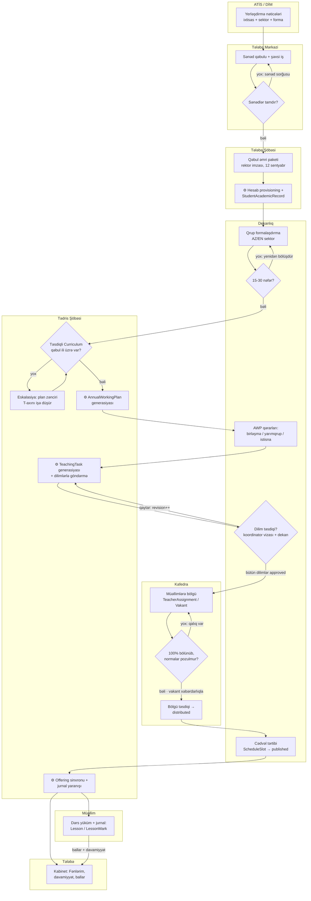

Oxunuş qaydası: rombların hər «yox» qolu geri dönüş dövrüdür (loop) — istisna yolu deyil,
prosesin normal hissəsidir və hər dövr sistemdə iz qoyur (səbəb + revision). `E1` qapısı
zəncirin ən vacib qoruyucusudur: təsdiqli tədris planı olmadan heç nə «avto tətbiq»
olunmur — sistem səssizcə köhnə ili götürmür, eskalasiya yaradır (E0). NK 348 b. 3.3.4-ün
«vaxtında təqdim etməyənə standart qrafik» qaydası yalnız **tələbə fərdi planına** aiddir,
ixtisas planının yoxluğuna yox.

> **➜ Davamı:** bu diaqram zənciri **jurnalın yaranışı ilə** (`E4`) bitir. Semestrin icrası —
> jurnal təsdiq zənciri, tələbə pəncərələri, apellyasiya və kontingent hərəkəti — **§D.6**-da,
> eyni lane konvensiyası ilə davam edir.

### D.2 Kiçik diaqram 1 — qəbul axını (ATİS → qrup → avto-enrollment)

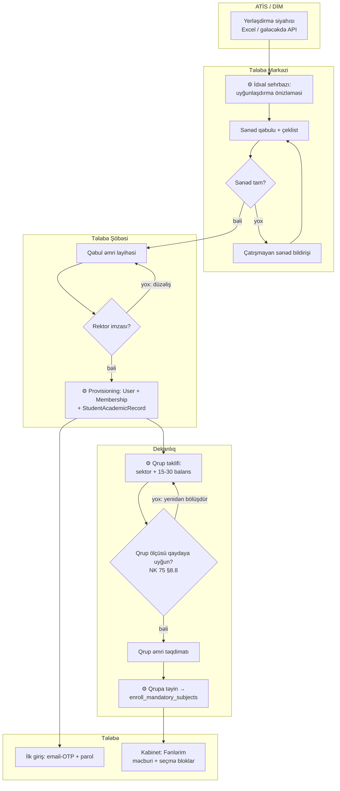

Bu axının EMSArena vəziyyəti: `c3`, `d4`, `e1`, `e2` **VAR**; `a1→b1` idxal qatı
**QİSMƏN VAR** (istifadəçi importu var, ATİS formatı yoxdur); `b2–b3` sənəd çeklisti və
`c1–c2` əmr reyestri **YOXDUR**; `d1` qrup-təklif alqoritmi **YOXDUR** (qrup əl ilə
yaradılır).

### D.3 Kiçik diaqram 2 — yük axını (plan → tapşırıq → bölgü)

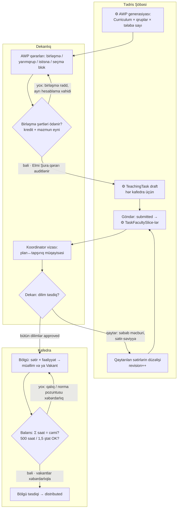

İki vacib semantika: (1) `k2` rombu KQ-12-nin iki məcburi birləşmə şərtini **avtomatik**
yoxlayır — sistem kredit fərqli qrupları bir axına yığmağı heç təklif etməməlidir;
(2) `m2` rombundakı norma pozuntuları **bloklamır, xəbərdarlıq edir** — real həyatda
istisnalar rəhbər qərarı ilə olur, sistemin işi izi saxlamaqdır (AzTU-nun akkreditasiyada
aşkarlanan 900-saat halı bizdə yazıla bilər, amma **görünməz qala bilməz**).

### D.4 Kiçik diaqram 3 — jurnal yaranışı (distributed → jurnal, servis zənciri)

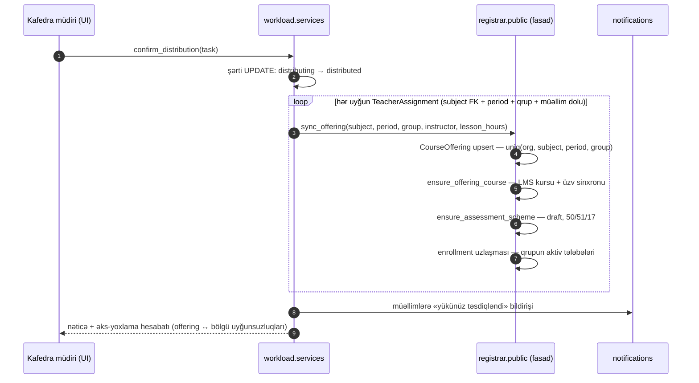

Qaydalar:

1. **Xüsusi sətirlər sinxrona düşmür** — `Təcrübə`, `Buraxılış işi`, subject-siz sətirlər
   jurnal yaratmır (`row_kind ≠ teaching`).
2. **Jurnal sahibi qaydası:** mühazirə və seminar ayrı müəllimlərdədirsə, offering
   `instructor`-u default olaraq **mühazirəçidir**; seminar müəllimi `Lesson.instructor`
   sahəsi ilə öz dərsini yazır (bu sahə **VAR**). Tam köməkçi-instruktor dəstəyi sonrakı
   fazadır.
3. **Vakant sətirlər jurnal yaratmır** — müəllim təyin olunanda (amendment) eyni sinxron
   idempotent şəkildə yalnız o offering-i əlavə edir.
4. Sinxron `registrar.public` fasadından keçir — workload registrar modellərini birbaşa
   import etmir (boundary gate).

### D.5 Lane ↔ rol xəritəsi (diaqramdan icazə sisteminə)

Diaqram icra planına çevriləndə hər lane konkret rol + permission ailəsinə bağlanır:

| Lane | Rol (slug, level) | Əsas permission-lar | EMSArena |
|---|---|---|---|
| ATİS / DİM | xarici sistem (aktyor deyil, mənbə) | — (idxalı `admissions.import` icazəsi ilə `registrar_office` icra edir) | **YOXDUR** — inteqrasiya qatı |
| Tələbə Mərkəzi + Tələbə Şöbəsi | **`registrar_office` (65, ORG)** | `admissions.import`, `admissions.apply`, `admissions.provision`, `contingent.order.draft/approve`, `contingent.group.manage` | **YOXDUR** (rol g_rbac §G.5 №1-də seed olunur; provisioning mexanizmi **VAR**) |
| Tədris Şöbəsi | `teaching_office_head` (85) / `teaching_office_staff` (60) | `workload.manage/submit`, `annual_plan.manage` | **YOXDUR** — spec-də; `ADMIN_ALIAS_EXEMPT` siyahısına düşməlidir (level ≥ 80 tələsi) |
| Dekanlıq | `dean` (80), `program_coordinator` (45) | `workload.approve`, `workload.review`, `curriculum.review` | **VAR** (rollar); workload permission-ları **YOXDUR** |
| Kafedra | `chair_head` (70) | `workload.distribute`, `curriculum.manage` | **VAR** (rol); permission-lar **YOXDUR** |
| Müəllim | `teacher` (50) | `workload.view`, jurnal yazısı (offering-instructor əsaslı) | **VAR** |
| Tələbə | `student` | kabinet oxu icazələri | **VAR** |

> **Lane ≠ rol.** Diaqramdakı «Tələbə Mərkəzi» və «Tələbə Şöbəsi» iki ayrı **lane**dir,
> amma **bir roldur** — `registrar_office` (65, ORG); g_rbac §G.2 üç köhnə rolu
> (STUDENT_CENTER · STUDENT_OFFICE · REGISTRAR) məhz bu tək rolda birləşdirir və
> t_decisions §2 bunu yekun qərar kimi təsbit edir. Mərhələ sahibliyi fərqi **rol** yox,
> **əməliyyat** fərqi ilə verilir: mərkəz = `S` (sənəd çeklisti + təqdim), şöbə = `A`
> (əmr rekviziti + status keçidi). Permission ad konvensiyası bütün sənəddə
> **`admissions.*`** (qəbul pipeline-ı) + **`contingent.*`** (əmr dövriyyəsi) formasındadır;
> tək hallı `admission.*` formaları işlədilmir.

Scope qaydası dəyişmir: hər lane yalnız öz `Membership.scope_unit` alt-ağacını görür
(`organizations.scoping` + RLS, tətbiq qatında `offering_or_404` tipli ikinci xətt —
defence-in-depth). Bu, swimlane sərhədlərinin UI-da deyil, **data qatında** icra
olunması deməkdir — myedudb-nin `kollec_or_uni` string-sütun «tenant ayrımı»nın tam əksi.

### D.6 Kiçik diaqram 4 — semestr icrası (jurnalın yaranışından transkriptə)

D.1 zənciri jurnalın avtomatik açılışı ilə bitir. Aşağıdakı diaqram eyni lane
konvensiyası ilə semestrin icra yarısını verir — fərdi plan pəncərələrindən jurnalın
rəsmi təsdiqinə (`is_published`), oradan transkriptə və kontingent hərəkətinə qədər.
Yeddi lane işləyir: **Tələbə Mərkəzi** semestr icrasında iştirak etmir (onun işi D.2-də
bitir); `⚙` yenə service task-dır və sahib lane-in içində qalır. Approval zənciri
C.2-nin `E8` keçidini açır.

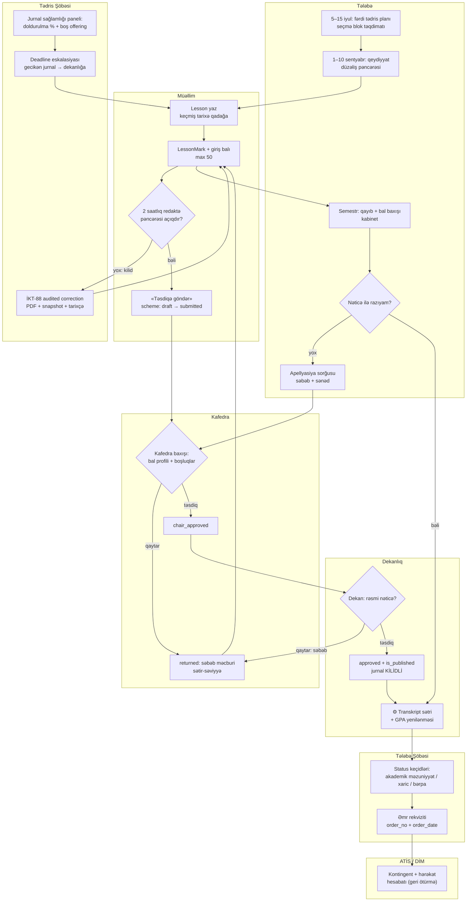

Oxunuş qeydləri:

1. **2 saatlıq pəncərə tək qapıdır.** Pəncərə bağlananda müəllim yolu yoxdur — düzəliş
   yalnız İKT Rəhbərinin (88) **audited correction** rejimi ilə (PDF + snapshot + tarixçə),
   yəni `t3 → e3 → t2` dövrü. PG trigger-i ikinci xətdir (**VAR**).
2. **Apellyasiya jurnalı geri açmır.** `s5` sorğusu kafedra baxışına (`c1`) düşür; nəticə
   dəyişirsə, dəyişiklik `is_published`-dən sonra yenə audited correction ilə yazılır —
   `approved` statusu geri qaytarılmır.
3. **Tədris Şöbəsi lane-i icraya toxunmur, ölçür.** `e1`/`e2` yalnız müşahidə +
   eskalasiyadır (jurnal doldurulma faizi, gecikən təsdiq); bal yazmaq icazəsi yoxdur.
4. **Kontingent hərəkəti transkriptdən sonra gedir** — `r1` status keçidləri əmr rekviziti
   olmadan icra olunmur, ATİS-ə hesabat (`a1`) isə geri ötürmə istiqamətidir (bizdən ATİS-ə).

EMSArena vəziyyəti: `t1`, `t2`, `t3`, `t4`, `c1–c3`, `d1–d2`, `e3`, `s3` **VAR**;
`s1`/`s2` tələbə pəncərələri (sərt təqvim bloku) **QİSMƏN VAR** (təqvim obyekti yoxdur);
`e1`/`e2` jurnal sağlamlığı + deadline eskalasiyası **YOXDUR**; `r1`/`r2` əmr reyestri
**YOXDUR**; `a1` ATİS geri ötürməsi **YOXDUR** (m_atis §25).


---

# II HİSSƏ — DATA MODELİ

## E. Entity Relationship Model — nüvə domen modeli

Bu bölmə «Academic Operating System»-in varlıq modelini dörd ERD-də təsvir edir: (1) nüvə akademik model (struktur + akademik təqvim + tədris planı + fənn açılışı + qeydiyyat), (2) dərs yükü zənciri, (3) elektron jurnal / qiymətləndirmə, (4) qəbul və kontingent. Model boş vərəqdən çəkilməyib — EMSArena-nın Develop budağındakı **işlək** modellərin (`apps/registrar/models/academic.py`, `apps/registrar/models/grading.py`, `apps/organizations/models.py`) və təsdiqlənmiş spesifikasiyaların (`docs/workload/TEDRIS_PLANI_SPEC.md`, `docs/workload/DERS_YUKU_SPEC.md`) üzərində qurulub. Hər varlığın yanında icra statusu göstərilir: **VAR** (Develop-da işlək), **QİSMƏN VAR** (nüvəsi var, genişlənmə spec-dədir), **YOXDUR** (yalnız spec/plan).

### E.1 Modelləşdirmə qərarları — dəyişməz prinsiplər

Bu altı qərar bütün ERD-lərin təməlidir; hər biri artıq kodda tətbiq olunub və ya spesifikasiyada təsbit edilib:

| # | Qərar | Səbəb (bir cümlə) |
|---|---|---|
| 1 | **Təşkilati struktur cədvəl dəsti deyil, typed ağacdır.** University/Faculty/DeanOffice/Department üçün ayrı cədvəllər YOXDUR — hamısı `Organization` + `OrgUnit(unit_type, parent, path)` materialized-path ağacıdır. | Akademik struktur universitetdən-universitetə dəyişir (fakültəsiz institut, opsional dekanlıq, mərkəz/lab) — sabit cədvəl dəsti hər yeni tenantda sxem dəyişikliyi tələb edərdi; ağac isə tenant-konfiqurasiyalıdır. |
| 2 | **Zamanlı anlayışlar tək dövr obyektinə bağlanır.** AcademicYear + Semester → `AcademicPeriod` (period_type + `academic_year="2025/2026"` + Payız/Yaz/Yay adı + tarix pəncərələri). | İki ayrı cədvəl (il + semestr) hər sorğuda ikiqat join və iki yerdə sinxron saxlanmalı dövr açar deməkdir; dövr onsuz da həmişə birlikdə işlənir. |
| 3 | **Kataloq ↔ icra ayrılığı hər domendə təkrarlanır.** `Subject` (kataloq) ≠ `CourseOffering` (semestr icrası); `Curriculum` (statik plan) ≠ `AnnualWorkingPlan` (bu ilin icra proyeksiyası); `TeachingTaskRow` (tapşırıq) ≠ `Lesson` (faktiki keçirilən dərs). | NK 348-in özü 5 sənədi ayırır (plan / qrafik / fərdi plan / illik işçi plan / müəllim planı) — model normativ sənəd sərhədlərini təkrarlamalıdır ki, hər sənədin öz təsdiq dövrü və kilidi ola bilsin. |
| 4 | **Jurnal ayrıca varlıq DEYİL.** Elektron jurnal = `CourseOffering`-in özü (+ `AssessmentScheme` OneToOne konfiqurasiya); jurnalın içi `Lesson` (sütun) × `LessonMark` (hüceyrə). | Ayrıca «Journal» cədvəli offering ilə 1:1 dublikat olur və legacy sistemlərdəki «jurnal öz tələbə siyahısını daşıyır» xəstəliyinin qapısını açır (bax §23.8). |
| 5 | **İnsan ≠ rol ≠ akademik funksiya.** `User` (şəxsiyyət) + `Membership(role, scope_unit)` (təşkilati rol) + `StudentAcademicRecord` / `TeacherWorkloadProfile` (illik akademik funksiya) üç ayrı qatdır. | «Student» və «Teacher» cədvəlləri şəxsiyyəti rola pərçimləyir — eyni adam həm magistrant, həm laborant ola bilər; rol dəyişəndə şəxsiyyət və tarixçə itməməlidir. |
| 6 | **Hər domen cədvəli `organization` FK + RLS siyasəti daşıyır.** | Multi-tenancy sütun-filtr intizamına deyil, verilənlər bazası səviyyəsində məcburiyyətə söykənməlidir (bax F.1). |

### E.2 ERD 1 — Nüvə akademik model (struktur + plan + açılış + qeydiyyat)

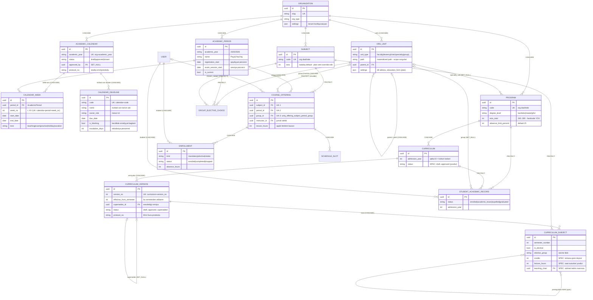

**Oxunuş qaydası.** `CourseOffering` bütün sistemin lövbər nöqtəsidir: *fənn × semestr(AcademicPeriod) × qrup(OrgUnit)*, `(org, subject, period, group)` unikaldır — bir semestrdə bir qrupa bir fənn yalnız bir dəfə açılır, «dublikat jurnal» sinfi xətalar sxem səviyyəsində mümkünsüzdür. Tələbənin fənnə bağlılığı yalnız `Enrollment` üzərindəndir; qrup üzvlüyü (`Membership`/`StudentAcademicRecord.group`) rosteri **törədir**, amma roster deyil (bax §23.4-23.5).

### E.2.1 Akademik təqvim — deadline mexanizminin daşıyıcısı

Statusu: **YOXDUR** — bütün sənəd boyu (a_process §B.3 deadline engine, c_flow §C.3 təqvim lövbərləri, n_edge EC-04/EC-20, r_report §R.4, t_decisions Y.5 F0) tarixlər bu obyektdən qidalanır, amma model heç yerdə mövcud deyil. Aşağıdakı üç varlıq bu boşluğu bağlayır və F0 fazasının çatdırılışıdır.

| Varlıq | Sahələr | Rolu |
|---|---|---|
| `AcademicCalendar` | `organization` FK, `academic_year` («2025/2026»), `status` (draft/approved/closed), `approved_by` (SET_NULL) + `approved_at`, `protocol_no` | İlin təqvim sənədinin kökü; təsdiqlənmiş təqvim rektor əmri/protokolu ilə bağlanır və immutable olur (dəyişiklik = audited correction). |
| `CalendarWeek` | `calendar` FK (CASCADE), `period` FK (`AcademicPeriod`, PROTECT), `week_no` (I–XV), `start_date`, `end_date`, `kind` = `teaching\|exam\|practice\|holiday\|vacation` | Həftə toru — normativ «I-XV tədris həftəsi» nömrələnməsinin yeganə mənbəyi; jurnal, cədvəl və yük hesabatları həftəyə bu cədvəldən çıxır. |
| `CalendarDeadline` | `calendar` FK (CASCADE), `code` (maşın açarı, məs. `individual_plan_close`), `name`, `owner_role`, `due_date`, `is_blocking`, `escalation_days` | İnzibati son tarixlərin kataloqu; `is_blocking=True` olan deadline keçəndə müvafiq əməliyyat (plan seçimi, yük təsdiqi, jurnal göndərişi) bağlanır, `escalation_days` isə xatırlatma/eskalasiya cədvəlini qurur. |

**Unikal açarlar:** `(org, academic_year)` — ildə bir təqvim sənədi; `(calendar, period, week_no)` — həftə nömrəsi dövr daxilində təkdir; `(calendar, code)` — bir deadline kodu ildə bir dəfə (bax E.6).

**`AcademicPeriod` ↔ `CalendarWeek` bağlantısı.** Dövrün tarix pəncərələri (`registration_start`, `exam_session_start`) **dublikat saxlanmır** — dövrün ilk/son tədris həftəsi, sessiya və təcrübə pəncərələri `CalendarWeek` sətirlərindən oxunur (`kind` üzrə min/max). `AcademicPeriod`-dakı mövcud tarix sahələri təqvim tətbiq olunandan sonra oxunan proyeksiyaya çevrilir (miqrasiya: mövcud dəyərlər ilk təqvim sənədinə köçürülür).

**`deadline_for(code, academic_year)` resolver-i.** Bütün modullar — qəbul, tədris planı, dərs yükü, jurnal, rollup hesabatları — hardcode tarix və ya setting əvəzinə **yalnız** bu funksiyadan qidalanır; funksiya təqvim yoxdursa (və ya `status != approved`) açıq xəta qaytarır, səssiz default vermir. Bu, «10 sentyabr», «5-15 iyul», «15 sentyabr» kimi rəqəmlərin sənəd və koda səpələnməsini qapadır: normativ rəqəm seed-də `CalendarDeadline` sətri kimi doğulur, tenant onu öz əmri ilə dəqiqləşdirir.

**Qrafik ≠ təqvim.** `CurriculumScheduleRow` (tədris qrafiki, NK 348 sənədi №2) **normadır** — «hansı kursda neçə həftə nəzəri təlim / sessiya / təcrübə / tətil» — və plan versiyası ilə birlikdə klonlanır; `AcademicCalendar` isə **konkret ilin** icra təqvimidir (hansı tarixdə hansı həftə, hansı bayram). Qrafik dəyişməz normanı, təqvim isə həmin normanın bu ilki tarixlərə oturmasını saxlayır.

### E.3 ERD 2 — Dərs yükü zənciri (tədris planı → illik işçi plan → tapşırıq → bölgü)

Statusu: bütöv zəncir **YOXDUR** — spesifikasiya (`TEDRIS_PLANI_SPEC.md` + `DERS_YUKU_SPEC.md`) hazırdır, `apps/workload` icra gözləyir. ERD spec-dəki modelləri əks etdirir.

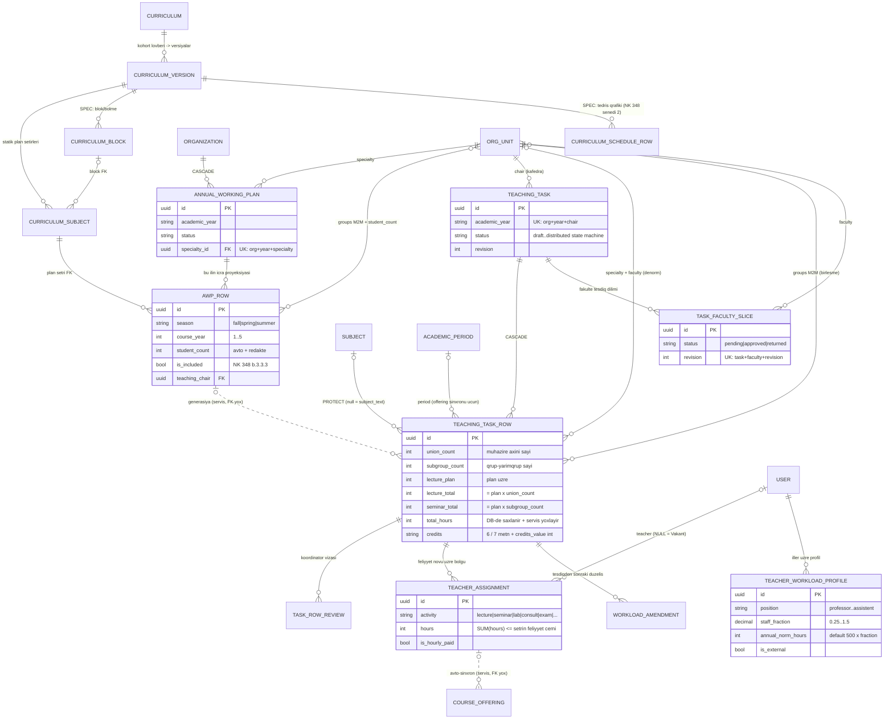

**Zəncirin riyazi özəyi** (KQ-12 + 855 sətirlik real Excel üzərində doğrulanıb): yük sətri *(fənn × dərs növü × hesablama vahidi)* üzərində qurulur — mühazirə cəmi = plan × **birləşmə sayı**, seminar/lab cəmi = plan × **yarımqrup sayı**. Bu iki vurma sxemdə açıq sütunlardır (`union_count`, `subgroup_count`), hesablanmış «total» sütunları DB-də saxlanır və servis qatında düsturla tutuşdurulur (kənarlaşma bloklanmır, işarələnir — real sənədlərdə istisnalar var). `AWP_ROW → TEACHING_TASK_ROW` və `TEACHER_ASSIGNMENT → COURSE_OFFERING` keçidləri **FK deyil, servis generasiyasıdır** (diaqramda qırıq xətt): hər mərhələ öz sənəd sərhədində müstəqil redaktə/təsdiq dövrü yaşayır, əks-yoxlama hesabatı uyğunsuzluqları çıxarır.

### E.4 ERD 3 — Elektron jurnal və qiymətləndirmə

Statusu: **VAR** — Develop-da tam işləkdir (U3/U3+/U7/U22 fazaları).

```mermaid
erDiagram
    COURSE_OFFERING ||--o| ASSESSMENT_SCHEME : "OneToOne, lazy (ensure_assessment_scheme)"
    COURSE_OFFERING ||--o{ LESSON : "jurnal sutunu (CASCADE)"
    COURSE_OFFERING ||--o{ ASSESSMENT_COMPONENT : "CASCADE"
    COURSE_OFFERING ||--o{ SELF_WORK_TOPIC : "CASCADE"
    LESSON ||--o{ LESSON_MARK : "CASCADE"
    ENROLLMENT ||--o{ LESSON_MARK : "CASCADE - UK: lesson+enrollment"
    ASSESSMENT_COMPONENT ||--o{ COMPONENT_SCORE : "CASCADE"
    ENROLLMENT ||--o{ COMPONENT_SCORE : "UK: component+enrollment"
    RUBRIC |o--o{ ASSESSMENT_COMPONENT : "SET_NULL (sablon)"
    RUBRIC ||--o{ RUBRIC_CRITERION : "CASCADE"
    RUBRIC_CRITERION ||--o{ CRITERION_SCORE : "CASCADE"
    ENROLLMENT ||--o| FINAL_GRADE : "0..1 - yekun imtahan yazilanda"
    ENROLLMENT ||--o| RESIT_RECORD : "0..1 (uniq_resit_per_enrollment)"
    ENROLLMENT ||--o| COURSE_WORK : "OneToOne - giris balina daxil deyil"
    SELF_WORK_TOPIC ||--o{ SELF_WORK_MARK : "UK: topic+enrollment"

    ASSESSMENT_SCHEME {
        uuid id PK
        int entry_score_max "default 50"
        int pass_threshold "default 51"
        int min_final_exam_score "default 17"
        string approval_status "draft-submitted-chair_approved-approved / returned"
        bool is_published "tesdiq = jurnal kilidi"
    }
    LESSON {
        uuid id PK
        date date "kecmis tarixe qadagan (IKT istisna)"
        string kind "lecture|seminar|lab"
        int hours "qayib hesabinin bazasi"
        uuid instructor_id FK "dersi kecen (bolusdurulmus fenn)"
    }
    LESSON_MARK {
        uuid id PK
        string status "present|absent|excused"
        decimal score "yalniz seminar/lab"
        uuid entered_by FK "SET_NULL"
    }
    FINAL_GRADE {
        uuid id PK
        decimal exam_score "max 50"
        decimal bonus "+/- duzelis, 0..100 clamp"
        bool is_published
    }
    RESIT_RECORD {
        uuid id PK
        string reason "absence|total|exam"
        string status "eligible|completed"
        decimal resit_score "imtahan balini evez edir"
    }
```

**Oxunuş qaydası.** Jurnalın hər hüceyrəsi `LessonMark`-dır: davamiyyət (`status`) və bal (`score`) **eyni sətirdə** — çünki müəllim real jurnalda ikisini bir hərəkətlə yazır (UNEC modeli). Giriş balı (max 50) `LessonMark.score` + `ComponentScore` cəmindən **hesablanır**, ayrıca saxlanmır; yekun bal = giriş + `FinalGrade.exam_score`. Bütün yazma yolları üç kilid xəttindən keçir: 2 saatlıq redaktə pəncərəsi (PG trigger ilə DB-də də), `ApprovalStatus` təsdiq zənciri kilidi və İKT Rəhbərinin (level 88) yalnız sənədli audited-correction (PDF + tarixçə) yolu.

Diaqramdakı `o|` işarəsi obyektin **lazy** yarandığını bildirir — sxemsiz offering və yekunsuz enrollment leqal aralıq vəziyyətlərdir: `AssessmentScheme` offering yaranan anda deyil, ilk müraciətdə `ensure_assessment_scheme` `get_or_create`-i ilə açılır; `FinalGrade` isə yalnız yekun imtahan balı yazılanda doğulur. Ona görə bu iki əlaqə `||--||` (hər iki tərəfdə məcburi bir) deyil, `||--o|`-dir.

### E.4.1 ERD 4 — Qəbul və kontingent (admissions → kohort → statuslar)

Statusu: **YOXDUR** — sənədin yeganə tamamilə yeni domenidir (t_decisions §1, Y.1). Ən çox yeni FK və ən çox `on_delete` qərarı məhz burada verilir, ona görə ayrıca ERD-lə çəkilir.

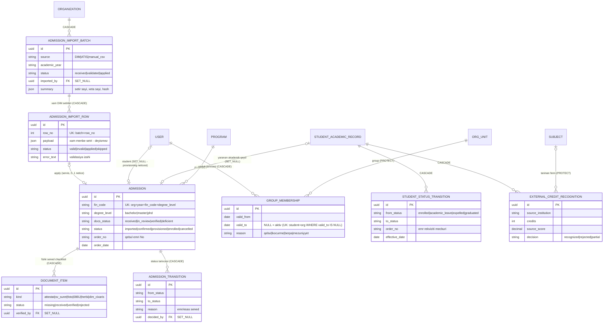

**Oxunuş qaydası.** Zəncir üç qatdır və hər qat öz sənəd sərhədini saxlayır: **xam idxal** (`AdmissionImportBatch/Row` — mənbə sətri heç vaxt redaktə olunmur, yalnız `payload` snapshot-u kimi qalır) → **qəbul işi** (`Admission` — fiziki sənəd checklist-i `DocumentItem`, əmr rekvizitləri, status maşını `imported → confirmed → provisioned → enrolled | cancelled`) → **akademik qeyd** (`User` + `StudentAcademicRecord` + `GroupMembership`). `Admission.student` və `Admission.record` **SET_NULL**-dur: qəbul işi hesabın taleyindən asılı deyil, hesab silinsə/anonimləşdirilsə də qəbul sənədi qalır. `GroupMembership.group` isə **PROTECT** — qrup `OrgUnit`-i üzvlük tarixçəsi varkən silinə bilməz (E.5-dəki `CourseOffering.group` düzəlişi ilə eyni prinsip). Üzvlük **hard-delete olunmur**: köçürmə = köhnə sətrin `valid_to` bağlanması + yeni sətir; `(student, org) WHERE valid_to IS NULL` qismən unikal indeksi bir anda yalnız bir aktiv qrupa təminat verir.

### E.5 FK istiqamətləri və silmə siyasəti — PROTECT / CASCADE / SET_NULL

Qayda üçpilləlidir və hər yeni FK bu cədvəllə seçilməlidir:

| Kateqoriya | on_delete | Nümunələr | Səbəb |
|---|---|---|---|
| **Kataloq / normativ istinad** — silinməsi tarixi qeydləri korlayar | `PROTECT` | `CurriculumSubject.subject`, `CourseOffering.subject`, `CourseOffering.period`, `StudentAcademicRecord.program/curriculum`, `GroupElectiveChoice.period/chosen_subject`, `TeachingTaskRow.subject`, **`GroupMembership.group`**, **`Admission.program`**, **`CalendarWeek.period`**, **`ExternalCreditRecognition.subject`** | Fənn kataloqdan silinə bilməz nə qədər ki, ona istinad edən plan sətri/açılış var; «sil» əvəzinə `is_active=False` deaktivasiya. Qrup üzvlük tarixçəsi varkən, dövr isə təqvim həftəsi varkən silinmir. |
| **Sənəd-daxili uşaq sətirlər** — valideynsiz mənasızdır | `CASCADE` | `Curriculum → CurriculumVersion → CurriculumSubject`, `CourseOffering → Lesson/AssessmentComponent`, `Lesson → LessonMark`, `TeachingTask → TeachingTaskRow`, `Enrollment → LessonMark/ComponentScore`, **`Admission → DocumentItem/AdmissionTransition`**, **`AdmissionImportBatch → AdmissionImportRow`**, **`AcademicCalendar → CalendarWeek/CalendarDeadline`**, **`StudentAcademicRecord → StudentStatusTransition`** | Uşaq sətir müstəqil həyat yaşamır; kök obyekt onsuz da PROTECT/soft-delete ilə qorunur (imtahan modulundakı soft-delete presedenti kimi). |
| **Aktyor / audit imzası** — kim etdi | `SET_NULL` | `entered_by`, `created_by`, `decided_by`, `CourseOffering.instructor`, `Lesson.instructor`, **`Admission.student`**, **`Admission.record`**, **`AcademicCalendar.approved_by`**, **`CurriculumVersion.supersedes`** | İşçi sistemdən gedəndə akademik qeyd qalmalıdır; audit üçün istifadəçi adı ayrıca audit-log sətrində onsuz da snapshot-lanır. Qəbul işi hesabın taleyindən asılı deyil — hesab getsə də sənəd qalır. |

**⚠ Proses tənqidi — mövcud kodda bir kənarlaşma.** `CourseOffering.group` FK-sı hazırda `CASCADE`-dir: qrup `OrgUnit`-i silinsə (və ya valideyn zəncirindən kaskadla düşsə) həmin qrupun **bütün açılışları, jurnalları və qiymətləri** səssizcə silinər. Qrup silinməsi real ssenaridir (struktur yenidən qurulanda) və jurnal qanuni sənəddir — bu FK `PROTECT`-ə keçirilməli, qrupun ləğvi isə `is_active=False` + tarixçəli üzvlük (aşağıda §22, StudentGroup sətri) ilə həll olunmalıdır. Eyni yoxlama `Enrollment.student` (User CASCADE) üçün siyasət kimi təsbitlənməlidir: istifadəçi **heç vaxt hard-delete olunmur** (deaktivasiya), əks halda 4 illik akademik tarixçə bir DELETE ilə gedir.

### E.6 Unikal açarlar = kodlaşdırılmış biznes qaydaları

Unikal constraint burada «texniki detal» deyil — hər biri bir normativ/təşkilati qaydanın DB-yə köçürülməsidir:

| Constraint | Qayda (insan dilində) |
|---|---|
| `uniq_offering_subject_period_group` `(org, subject, period, group)` | Bir semestrdə bir qrupa bir fənn bir dəfə açılır — dublikat jurnal mümkünsüz. |
| `uniq_curriculum_program_year` `(org, program, admission_year)` | Hər qəbul kohortunun bir plan **lövbəri** var; plan məzmununun versiyaları isə `CurriculumVersion` sətirləridir (§23.6). |
| `(org, curriculum, version_no)` — CurriculumVersion (spec) | Bir kohort lövbərində versiya nömrəsi təkdir; `effective_from_semester` versiyanın hansı semestrdən qüvvəyə mindiyini deyir. |
| `uniq_curriculum_subject_semester` `(org, curriculum_version, subject, semester_number)` | Eyni fənn eyni plan versiyasında eyni semestrə iki dəfə yazıla bilməz. |
| `uniq_student_offering` `(org, student, offering)` | Tələbə bir açılışa bir dəfə yazılır; retake **yeni semestrin yeni offering-inə** yeni Enrollment-dir. |
| `uniq_student_program` `(org, student, program)` | Bir proqramda bir akademik qeyd. |
| `uniq_group_elective_block` `(org, group, period, elective_group)` | Qrup bir seçmə blokda bir semestrdə bir qərar verir. |
| `uniq_lesson_enrollment_mark` `(lesson, enrollment)` | Jurnal hüceyrəsi təkdir — bir dərs × bir tələbə = bir qeyd. |
| `uniq_resit_per_enrollment` `(enrollment)` | Bir qeydiyyata bir təkrar-imtahan hüququ. |
| `(org, academic_year, chair)` — TeachingTask (spec) | Kafedraya ildə bir tapşırıq sənədi. |
| `(task, faculty, revision)` — TaskFacultySlice (spec) | Hər revision-da fakültə dilimi təzələnir — köhnə təsdiq yeni məzmuna «yapışmır». |
| `(org, teacher, academic_year)` — TeacherWorkloadProfile (spec) | Müəllimin ildə bir yük profili (norma müqayisəsinin bazası). |
| `(org, academic_year, specialty)` — AnnualWorkingPlan (spec) | İxtisasa ildə bir illik işçi plan (NK 348 b.3.2.12). |
| `(org, academic_year)` — AcademicCalendar (spec) | Təşkilata ildə bir təsdiqlənmiş akademik təqvim — «iki fərqli deadline cədvəli» mümkünsüz (E.2.1). |
| `(calendar, period, week_no)` — CalendarWeek (spec) | Dövr daxilində həftə nömrəsi (I–XV) təkdir — həftə toru dublikatsızdır. |
| `(calendar, code)` — CalendarDeadline (spec) | Bir inzibati son tarix kodu ildə bir dəfə təyin olunur; `deadline_for(code, year)` birmənalı cavab verir. |
| `(org, academic_year, fin_code, degree_level)` — Admission (spec) | Bir şəxs bir ildə bir dərəcə səviyyəsinə bir dəfə qəbul olunur — dublikat qəbul işi mümkünsüz. |
| `(batch, row_no)` — AdmissionImportRow (spec) | İdxal paketində sətir nömrəsi təkdir — təkrar yükləmə xam sətri çoxaltmır. |
| `(batch, fin_code) WHERE status IN ('valid','applied')` — AdmissionImportRow (spec) | Eyni paketdə eyni FİN iki dəfə tətbiq oluna bilməz (qismən unikal indeks; `invalid`/`skipped` sətirlər istisna). |
| `(student, org) WHERE valid_to IS NULL` — GroupMembership (spec) | Tələbənin bir anda yalnız bir aktiv qrup üzvlüyü var; köçürmə = köhnəni bağla + yeni sətir (tarixçə itmir). |

---

## F. Database Architecture

### F.1 PostgreSQL 16 + Row-Level Security — multi-tenancy nüvəsi

Sistem **tək PostgreSQL 16 klasterində, tək sxemdə** çox-tenantlıdır: hər domen cədvəli `organization` FK daşıyır və **100 cədvəldə org-scoped RLS siyasəti** aktivdir. Sorğu icra olunmazdan əvvəl bağlantı kontekstinə aktiv təşkilat yazılır; siyasət sətirləri həmin təşkilata filtrlə məhdudlaşdırır. Nəticə: tətbiq kodunda bir `filter(organization=...)` unudulsa belə, yad tenantın sətri **fiziki olaraq görünmür**. Bu yanaşma «hər tenantə ayrı DB» modelindən şüurlu imtinadır: 5-10 min istifadəçilik universitet miqyasında əməliyyat sadəliyi (bir miqrasiya, bir backup, bir monitorinq) izolyasiya riskini üstələyir, izolyasiya isə RLS ilə DB səviyyəsində qalır.

İki əməliyyat qaydası bu memarlıqdan törəyir və pozulmamalıdır:
1. **RLS testləri yalnız real Postgres-də mənalıdır** — sqlite-də siyasətlər icra olunmur; CI-da `-m postgres` marker-li testlər real konteynerdə işləyir.
2. **Prod transaction pooling** aktivdir → sessiya-səviyyə vəziyyətə (session GUC-a uzunömürlü güvən, `SET` sonrası ayrı sorğu) arxalanan pattern qadağandır; kontekst hər tranzaksiya daxilində qurulur. Əlaqəli tələ: `select_for_update()` + nullable FK `select_related` Postgres-də outer-join səbəbindən çökür — `of=("self",)` məcburidir.

Nəzarətli istisnalar sənədləşdirilib: imtahan mərkəzinin public-entry axını (tələbə hələ login olmadan otaq sessiyasına qoşulanda) RLS bypass-ı **dar, açıq funksiya** ilə edir — «gizli super-user bağlantısı» yoxdur.

### F.2 Defence-in-depth: RLS tək xətt deyil

RLS **ikinci** müdafiə xəttidir, birinci yox. Tətbiq qatında hər jurnal/registrar əməliyyatı `offering_or_404` (obyekt + scope həlli) və `can_edit_journal` (rol + kilid pəncərəsi + təsdiq statusu) yoxlamasından keçir. Bu ikiqat quruluş qəsdəndir: RLS «yad tenantı görmə» qaydasını, tətbiq qatı isə «öz tenantında da yalnız öz scope-unu redaktə et» qaydasını (dekan → fakültə alt-ağacı, kafedra müdiri → kafedra, müəllim → öz offering-i) tətbiq edir. Scope həlli `OrgUnit.path` materialized-path prefiksi üzərindən tək sorğu ilə işləyir (`user_scope_subtree_q`) — rekursiv CTE-yə ehtiyac qalmır. Üçüncü xətt DB-dədir: kritik invariantlar (2 saatlıq jurnal kilidi) PG trigger ilə də tətbiq olunur ki, tətbiq qatından yan keçən heç bir yol (məs. gələcək bir admin skripti) qaydanı poza bilməsin.

### F.3 İdentifikator, zaman və dəyişməzlik standartı

- **UUID primary key** hər domen cədvəlində (`UUIDModel`) — ID-lər tenantlar arası təxmin edilə bilməz (IDOR sinfi hücumların kökü kəsilir), import/merge ssenariləri toqquşmasız.
- **`TimeStampedModel`** (`created_at`/`updated_at`) hər yerdə; domen-kritik anlar üçün ayrıca imzalı sahələr (`submitted_by/at`, `approved_by/at`).
- **Dəyişməzlik mərhələlidir:** yazı → qısa redaktə pəncərəsi (2 saat) → təsdiq zənciri kilidi → rəsmi status (`is_published`). Kilidlənmiş məlumatın yeganə dəyişmə yolu **audited correction**: səbəb + PDF sənəd + köhnə/yeni dəyər snapshot-u + tarixçə sətri; düzəlişin özü də geri alına bilir. Workload amendment axını eyni nümunə üzərindədir.
- **Soft-delete** əməliyyat sənədlərində (imtahan presedenti: `is_deleted` + Trash/restore/purge): nəticələri olan obyekt heç vaxt fiziki silinmir.
- Praktik konvensiya: audit `JSONField`-lərinə yazılan hər dəyər `str()`-ə salınır — lazy translation proxy JSON serializasiyada INSERT-i partladıb `@transaction.atomic`-i səssiz geri qaytara bilir (istehsalatda tapılmış real tələ).

### F.4 Tenant-konfiqurasiya: sxem yox, JSON + parametr cədvəlləri

Universitetdən-universitetə dəyişən hər şey **konfiqurasiyadır, sxem deyil**: `Organization.settings` / `OrgUnit.settings` JSONField-ləri (dil sektoru, rəy görünürlüyü, jurnal sahibi qaydası), `AssessmentScheme` per-offering qiymət parametrləri (50/51/17 default-ları), plan/yük spesifikasiyasında `credit_hour=30`, `weeks_per_term=15` (bayram override-ı), yarımqrup həddi ~40 (təklif, insan override edir), norma cədvəlləri (illik 500 saat, 1.5 ştat, 250 saathesabı — universitetlər 500-600 arası dəyişdirir). Blok adları, vəzifə siyahısı, «kurs/təhsil ili» terminologiyası — hamısı tenant lüğətidir, enum deyil. Qayda: **normativ akt rəqəm verirsə default olur, rəqəm vermirsə (və ya universitetlər fərqli tətbiq edirsə) parametr olur.** İkinci qayda: yeni Django setting-i mütləq `production.py`-ın explicit import siyahısına düşməlidir — əks halda prod-da səssizcə tətbiq olunmur (sənədləşdirilmiş tələ).

### F.5 DB-səviyyə invariantlar: trigger, şərti UPDATE, constraint

Üç mexanizm bir-birini tamamlayır:

1. **Check/unique constraint** — statik invariantlar (E.6 cədvəli; `SUM(hours) ≤ activity_total` kimi cəm yoxlamaları servis + DB check kombinasiyası ilə).
2. **PG trigger** — zamandan asılı invariant (2 saatlıq jurnal redaktə pəncərəsi): tətbiq qatının yoxlaması UI üçündür, trigger isə «heç bir yol yoxdur» təminatıdır.
3. **Şərti UPDATE (compare-and-swap) state machine** — statuslu sənədlərdə (`UPDATE ... WHERE status='submitted'`) yarış vəziyyətlərini lock tutmadan kəsir; imtahan final-mərkəzində işlənmiş bu nümunə `TeachingTask` (draft→submitted→returned→approved→distributing→distributed→amended) və `Curriculum` status maşınları üçün kanonik şablondur.

State machine-lər **domen-daxilidir**: ümumi «Approval» cədvəli yoxdur (bax §22, Approval sətri) — hər sənədin öz status sütunu + keçid cədvəli + imza sahələri var, ortaq olan yalnız audit-log və bildiriş mexanizmidir.

### F.6 Modular monolith sərhədləri DB-də necə görünür

Sistem intizamlı modular monolithdir (boundary gate CI-da): app-lər arası FK-lər **string label** ilə (`"organizations.OrgUnit"`, `"registrar.Subject"`) yazılır, Python importu isə yalnız qarşı app-in `public.py` fasadından mümkündür. Bu, DB-də tam bütövlük (real FK constraint) + kodda zəif bağlılıq (app-i ayırmaq mümkün) deməkdir. `workload → registrar` istiqaməti buna nümunədir: `TeachingTaskRow.subject` real FK-dir, amma offering sinxronu servis fasadından çağırılır və FK asılılığı yaratmır. Aqreqatlar (kafedra yekunu, fakültə cəmi, «DepartmentWorkload») **cədvəl deyil, sorğudur** — saxlanmış aqreqat yalnız sənəd rekviziti kimi lazım olanda (Excel/PDF çapı) snapshot-lanır.

### F.7 Legacy anti-nümunə: myedudb bizə nəyi qadağan edir

Köhnə MyEdu bazası (myedudb) bu sənəddəki hər qərarın «əks-sübutudur» və miqrasiya mənbəyi kimi qarşımızdadır:

| myedudb (legacy) | Nəticəsi | EMSArena qərarı |
|---|---|---|
| 81 cədvəl, **0 foreign key** | 4.9M ballıq cədvəldə orphan sətirlər; bütövlük yalnız tətbiq kodunun «yadında» | Hər əlaqə real FK + on_delete siyasəti (E.5) |
| Əlaqələr CSV/JSON mətn sütunlarında (`journals.students_id='["9979"]'`) | Roster jurnala **dondurulub**: tələbə köçəndə/borclu əlavə olunanda JSON string əllə redaktə olunur, JOIN mümkün deyil, hesabat üçün full-scan + parse | Roster = `Enrollment` sətirləri; qrup ↔ fənn qrupu ayrılığı (§23.4) |
| Jurnal sillabus sətrindən yaranır | Kataloq/plan/icra bir-birinə qarışıb — fənnin adı dəyişəndə tarixçə itir, iki qrupun eyni fənni ayrıla bilmir | Subject → CurriculumSubject → CourseOffering üçpilləli zəncir (E.1 qərar 3) |
| Tenant ayrımı `kollec_or_uni` string sütunu ilə | Filtr unudulan hər sorğu cross-tenant sızmadır; siyasət yoxdur | `organization` FK + RLS + defence-in-depth (F.1-F.2) |
| Parollar açıq mətndə | Bir DB dump = bütün hesablar | Django hasher + OTP ilk-giriş + provisioning axını |
| Audit yoxdur | «Balı kim, nə vaxt dəyişdi» sualı cavabsız | TimeStamped + entered_by + audit-log + audited correction PDF (F.3) |

Miqrasiya nəticəsi: legacy-dən köçürmə ETL-i JSON-mətn əlaqələri parse edib **real FK-lərə çevirməli**, uyğunsuz sətirləri (mövcud olmayan tələbə ID-ləri) istisna hesabatına yazmalıdır — «olduğu kimi köçür» qəbuledilməzdir. Strategiyanın özü F.8-dədir.

### F.8 Miqrasiya strategiyası — legacy myedudb → EMSArena

Bu, icra planının ən riskli hissəsidir və ayrıca faza tələb edir (**F7 — miqrasiya**, Y.5 fazalar siyahısına əlavə olunur; həcm qiyməti: 81 mənbə cədvəli, 4.9M sətirlik bal cədvəli).

**1. Mənbə → hədəf cədvəl xəritəsi.**

| Legacy (myedudb) | Hədəf (EMSArena) | Qeyd |
|---|---|---|
| `students` | `User` + `StudentAcademicRecord` (+ `GroupMembership` aktiv sətri) | Şəxsiyyət/akademik qeyd ayrılığı miqrasiya anında qurulur (E.1 qərar 5). |
| `teachers` | `User` + `Membership(role=teacher)` | Parollar **köçürülmür** — hər hesab OTP-li ilk-giriş axını ilə açılır. |
| struktur cədvəlləri (fakültə/kafedra/qrup) | `OrgUnit` typed ağacı (`path` yenidən hesablanır) | Qrup dil sektoru `settings` JSON-una düşür. |
| `subjects` / sillabus sətirləri | `Subject` (kataloq) + `CurriculumVersion` → `CurriculumSubject` | Legacy-də bu üç qat bir sətirdə idi — ayırma ETL-in ən çox əl işi tələb edən yeri. |
| `journals` | `CourseOffering` + `Enrollment` (JSON `students_id` parse) | Roster JSON string-dən sətirlərə açılır; parse olunmayan ID → istisna hesabatı. |
| ballar (4.9M sətir) | `LessonMark` / `ComponentScore` / `FinalGrade` | Bax bənd 3 — hamısı köçürülmür. |

**2. Uyğunlaşdırma açarları.** Şəxslər üçün **FİN natural key**-dir (dublikat FİN → manual həll növbəsi). Jurnal üçün natural açar yoxdur: `(subject_text, group_text, academic_year, season)` üçlüyü normallaşdırılıb (böyük/kiçik hərf, boşluq, transliterasiya) `CourseOffering`-ə uyğunlaşdırılır; qeyri-müəyyən uyğunluq **avtomatik həll edilmir**, `MigrationConflict` növbəsinə düşür və registrator əl ilə bağlayır.

**3. Qərar: tarixi semestrlər «read-only arxiv» kimi köçürülür.** Bitmiş semestrlərdən yalnız **yekun bal + transkript sətri** (`FinalGrade` ekvivalenti + kredit/hərf) köçürülür; xam jurnal hüceyrələri (dərs-dərs davamiyyət və bal) yalnız **son N il** üçün (default N=2, tenant qərarı) gətirilir, ondan əvvəlkilər sıxılmış arxiv dump kimi saxlanılır və UI-da «arxiv» nişanı ilə göstərilir. Səbəb: 4.9M sətrin böyük hissəsi orphan və mənbəsizdir — onu canlı sxemə tökmək legacy-nin bütövlük problemini yeni bazaya köçürmək deməkdir.

**4. İstisna hesabatı formatı.** Hər qaçış CSV sətri: `source_table`, `source_pk`, `rule_code` (`ORPHAN_STUDENT`, `UNPARSEABLE_JSON`, `AMBIGUOUS_OFFERING`, `DUPLICATE_FIN`, `SCORE_OUT_OF_RANGE`), `raw_payload`, `suggested_action`. Hesabat miqrasiya paketinin rəsmi çatdırılışıdır — sıfır istisna gözlənmir, **izahsız istisna** qəbul olunmur.

**5. Kəsim tarixi və paralel işləmə.** Miqrasiya semestr sərhədində icra olunur (sessiya bitdikdən sonra, yeni semestr başlamazdan əvvəl — E.2.1 təqvimindəki `migration_cutover` deadline kodu). Kəsimdən sonra legacy **yalnız-oxu** rejimə keçir; paralel işləmə dövrü ≤ 1 semestr və yalnız hesabat üçün (ikiqat yazma yoxdur — iki mənbəli həqiqət qadağandır). Geri-qayıtma planı: kəsim anının legacy dump-ı + EMSArena-da miqrasiya batch-inin `batch_id` ilə tam geri-alına bilməsi.

---

## §22. Entity xəritəsi — təklif siyahısı → EMSArena qarşılığı

**⚠ Proses tənqidi (siyahının özü haqqında).** Təklif «28 entity» adlanır, amma sadalanan 30-dur — say yox, məzmun vacibdir, lakin bu, siyahının bir-iki iterasiya cilalanmadığına işarədir. Daha əsaslı üç struktur iradı var: (1) University/Faculty/DeanOffice/Department **dörd ayrı cədvəl kimi** düşünülüb — bu, AZ reallığında (fakültəsiz institut, opsional dekanlıq, mərkəz/lab) hər tenant üçün sxem dəyişikliyi tələb edən sərt modeldir; typed `OrgUnit` ağacı ilə əvəzlənməlidir. (2) **Workload və DepartmentWorkload dublikatdır** — kafedra yükü elə tapşırıq sənədinin özüdür (`TeachingTask`), «kafedra üzrə yekun» isə sorğu ilə hesablanan aqreqatdır; iki cədvəl saxlamaq iki mənbəli həqiqət yaradır. (3) **Assessment/Grade/Attendance/JournalEntry ayrımı yanlış hündürlükdədir** — real jurnalda davamiyyət və bal eyni hüceyrədə yazılır (`LessonMark`), «Grade» isə tək cədvəl deyil, mərhələli obyektlər silsiləsidir (dərs balı → komponent → yekun → resit). Aşağıdakı cədvəl hər sətir üçün qərarı verir.

| # | Təklif entity | EMSArena qarşılığı | Vəziyyət | Qərar və səbəb |
|---|---|---|---|---|
| 1 | University | `Organization` (org_type=university) | **VAR** | Birləşdirilir — tenant kökü; ayrıca «University» cədvəli multi-tenant modeldə artıqdır. |
| 2 | Faculty | `OrgUnit(unit_type=faculty)` | **VAR** | Birləşdirilir (typed tree) — struktur tenant-dəyişkəndir, ayrı cədvəl sxemi kilidləyir. |
| 3 | Dean's Office | `OrgUnit(unit_type=deanery)` — opsional qovşaq | **VAR** | Birləşdirilir — dekanlıq hər universitetdə ayrıca vahid deyil; opsional unit_type kimi mövcuddur. |
| 4 | Department | `OrgUnit(unit_type=chair)`; inzibati şöbələr üçün ayrıca `department` tipi | **VAR** | Birləşdirilir — «kafedra» (akademik) və «şöbə» (inzibati) eyni ağacda fərqli tiplərdir; tədris şöbəsi də bu ağacda vahiddir. |
| 5 | Program | `registrar.Program` + `specialty_unit` FK (OrgUnit lövbəri) | **VAR** | Ayrı qalır — kataloq varlığıdır (kod, dərəcə, ECTS cəmi, qayıb limiti); OrgUnit-lə lövbərlənir ki, iyerarxiya və kataloq sinxron qalsın. |
| 6 | EducationLevel | `Program.degree_level` (bachelor/master/phd) | **VAR** (sahə) | Cədvəl YOX — üç dəyərli sabit lüğət üçün cədvəl artıq JOIN-dur; enum sahə kifayətdir. |
| 7 | EducationForm | `Curriculum.education_form` + `TeachingTaskRow.education_form` (əyani/qiyabi/intensiv/distant) | **YOXDUR** (spec-də) | Sahə kimi əlavə olunmalıdır, cədvəl yox — forma semestr kredit normasını (30 əyani / 24 qiyabi — NK 348 b. 3.2.2/3.2.3) və **effektiv həftə sayını** seçir; default 15, bayram/təqvim override-ı ilə 14-ə enə bilər (h_workload §H.7.1). Qiyabi forma üçün həftə sayı **tenant-parametrdir**, sabit rəqəm kimi verilmir. Sistemdə bu anlayış hazırda ümumiyyətlə modellənməyib, spec-in təsdiqlənmiş boşluğudur. |
| 8 | AcademicYear | `AcademicPeriod.academic_year` («2025/2026») | **QİSMƏN VAR** | Birləşdirilir — il ayrıca cədvəl deyil, dövrün atributudur. Boşluq: **akademik təqvim** (həftə nömrələnməsi I-XV, inzibati son tarixlər, bayramlar) first-class obyekt kimi **YOXDUR**; model E.2.1-də verilib — `AcademicCalendar` + `CalendarWeek` + `CalendarDeadline`, bütün deadline-lar `deadline_for(code, year)` resolver-indən qidalanır (TAM_AXIN §3: təqvim iş axını qrafikidir). |
| 9 | Semester | `AcademicPeriod` (Payız/Yaz/Yay + qeydiyyat/sessiya pəncərələri) | **VAR** | Birləşdirilib — bax №8; «semestr 1..10» nömrələməsi yox, il+fəsil modeli (təsdiqlənmiş konvensiya). |
| 10 | Student | `User` + `Membership(role=student, scope_unit=group)` + `StudentAcademicRecord` | **VAR** | Üç qat ayrı qalır — şəxsiyyət / təşkilati rol / akademik qeyd fərqli ömür yaşayır (bax E.1 qərar 5). |
| 11 | Admission | — | **YOXDUR** | YENİ `apps/admissions` — qəbul əmri, DİM nəticəsi, kohort formalaşması; hazırda `admission_year` əllə yazılır, qəbul prosesi sistemdən kənardadır. `StudentAcademicRecord` yaradılışının rəsmi mənbəyi bu app olmalıdır. Model E.4.1-də (ERD 4): `AdmissionImportBatch/Row` → `Admission` (+`DocumentItem`, `AdmissionTransition`) → `User`/`StudentAcademicRecord`/`GroupMembership`. |
| 12 | StudentGroup | `OrgUnit(unit_type=group)` + dil sektoru (AZ/EN qrupları ayrı unit-lərdir) | **VAR / QİSMƏN** | Birləşdirilir (typed tree). Boşluq: üzvlük **tarixçəsiz**dir — akademik məzuniyyətdən qayıdan tələbənin qrup dəyişməsi from/to + səbəb ilə izlənməlidir (TAM_AXIN tələb 6: `GroupMembership` tarixçəli, hard-delete yox). |
| 13 | Curriculum | `registrar.Curriculum` | **VAR** | Ayrı qalır — plan sənədinin kökü; status maşını (draft→…→approved+kilid), senate protokolu, klonlama spec-dədir (T2 fazası). |
| 14 | CurriculumVersion | `registrar.CurriculumVersion` (`curriculum` FK + `version_no` + `effective_from_semester` + `supersedes`) | **YOXDUR** (F2) | Ayrı qalır — `Curriculum(program, admission_year)` kohort **lövbəridir** (identity, `uniq_curriculum_program_year`), plan məzmunu isə versiyadadır. Mid-cohort dəyişiklik (məs. 2024 kohortunun 5-ci semestrdən dəyişən planı) yeni versiya klonu ilə həll olunur: `version_no=n+1`, `effective_from_semester=k`, `supersedes=v_n`; təsdiqdən sonra əvvəlki versiya `superseded` olur və **heç vaxt silinmir** (`Enrollment.curriculum_row` PROTECT). Bax e_curriculum §6.2. |
| 15 | Course | `registrar.Subject` (fənn kataloqu) | **VAR** | Ayrı qalır — zamansız kataloq; §23.1-23.3-dəki bütün fərqlərin sol tərəfi. |
| 16 | CourseType | `CurriculumSubject.subject_kind` + `exam_form` (spec) · dərs səviyyəsində `LessonKind`/`SlotKind` | **QİSMƏN** | Sahə/enum kimi — «fənn növü» tək anlayış deyil: plan sətrində məcburi/seçmə növü, imtahan forması; dərsdə mühazirə/seminar/lab. Blok adları isə enum YOX, tenant lüğəti (`CurriculumBlock.kind`). |
| 17 | CourseOffering | `registrar.CourseOffering` | **VAR** | Ayrı qalır — sistemin lövbər varlığı (E.2); jurnal, yük sinxronu, cədvəl, imtahan hamısı buna bağlanır. |
| 18 | CourseGroup | `CourseOffering.group` + yükdə hesablama vahidi (`union_count`/`subgroup_count`) | **QİSMƏN** | Ayrıca cədvəl YOX (hələlik) — «fənn qrupu» offering-in özüdür; mühazirə axını (birləşmə) və yarımqrup **hesablama vahidləridir** və yük sətrində açıq sütunlardır (KQ-12: axın = 1 vahid). Formal yarımqrup modeli gələcək faza (DERS_YUKU_SPEC §9.11). |
| 19 | Workload | `TeachingTask` + `TeachingTaskRow` (`apps/workload`) | **YOXDUR** (spec hazır) | Ayrı app — illik tapşırıq sənədi + Excel-in 1:1 sətir qarşılığı; state machine + fakültə dilimləri (E.3). |
| 20 | DepartmentWorkload | = `TeachingTask` (sənəd elə kafedra-səviyyədir); yekunlar aqreqat sorğudur | **YOXDUR** | Ayrıca entity YOX — bax bölmə əvvəlindəki tənqid (2): iki cədvəl = iki mənbəli həqiqət; «kafedra üzrə yekun 8 965 saat» sorğu nəticəsidir, saxlanmış sətir deyil. |
| 21 | Teacher | `User` + `Membership(role=teacher/assistant)` + `TeacherWorkloadProfile` (il üzrə) | **QİSMƏN VAR** | Üç qat — şəxsiyyət/rol VAR, illik profil (vəzifə, ştat hissəsi, norma, kənar işarəsi) spec-dədir; norma validatorları (500 saat, 1.5 ştat, 250 saathesabı) bu profilə bağlanır. |
| 22 | TeacherAssignment | `workload.TeacherAssignment` (sətir × fəaliyyət növü × saat × müəllim, NULL=Vakant) | **YOXDUR** (spec §5.5) | Ayrı qalır — bölgünün atomudur; `Σ hours ≤` fəaliyyət cəmi constraint-i ilə; offering sinxronunun mənbəyi. |
| 23 | StudentEnrollment | `registrar.Enrollment` (kind: mandatory/elective/retake + absence_hours) | **VAR** | Ayrı qalır — tələbə↔fənn iştirakının yeganə daşıyıcısı; borclu tələbə də məhz bu səviyyədə modellənir (qrupu dəyişmir, aşağı ilin fənn qrupuna Enrollment alır). |
| 24 | Journal | `CourseOffering` + `AssessmentScheme` (OneToOne) | **VAR** | Birləşdirilib — jurnal ayrıca cədvəl DEYİL (E.1 qərar 4); «jurnal aç» = offering yaranışında sxem + boş roster avtomatik hazırdır. |
| 25 | JournalEntry | `Lesson` (sütun: tarix+növ+saat+mövzu) + `LessonMark` (hüceyrə) | **VAR** | İki varlığa bölünüb — «entry» əslində iki fərqli şeydir: keçirilən dərs faktı və tələbənin o dərsdəki qeydi; bax §23.8. |
| 26 | Assessment | `AssessmentScheme` (parametrlər + təsdiq zənciri) + `AssessmentComponent` (+`Rubric`) | **VAR** | Ayrı qalır — qiymətləndirmə **konfiqurasiyası** balın özündən ayrılır; komponentsiz offering köhnə dərs-cəm məntiqi ilə işləyir (geriyə-uyğun). |
| 27 | Grade | `LessonMark.score` → `ComponentScore` → `FinalGrade` → `ResitRecord` | **VAR** | Tək «Grade» cədvəli YOX — bal mərhələli obyektlər silsiləsidir; giriş balı saxlanmır, hesablanır. Tək cədvəl bütün bu mərhələləri sütun-selinə çevirər (legacy-nin 4.9M-lik cədvəli məhz belə idi). |
| 28 | Attendance | `LessonMark.status` (present/absent/excused) + `Enrollment.absence_hours` (yığım) | **VAR** | Ayrıca cədvəl YOX — davamiyyət jurnal hüceyrəsinin yarısıdır; `excused` yalnız sənədli düzəliş axını ilə yazılır, qayıb-limitə sayılmır. |
| 29 | Approval | Domen-daxili state machine-lər: `ApprovalStatus` (jurnal), `TaskFacultySlice` (yük), `Curriculum.status` (plan) | **QİSMƏN VAR** | Generic «Approval» cədvəli YOX — hər sənədin təsdiq semantikası fərqlidir (jurnalda zəncir, yükdə paralel fakültə dilimləri, planda Elmi Şura protokolu); ümumi cədvəl hamısını ən kasıb ortaq formaya sıxardı. Ortaq olan: audit-log + bildiriş + «gözləyən təsdiqlərim» aqreqat görünüşü (sorğu, cədvəl yox). |
| 30 | AuditLog | `core.audit.log_action` + correction/amendment snapshot-ları (PDF-li) | **VAR** | Ayrı qalır — iki səviyyə: ümumi hərəkət jurnalı + sənədli düzəliş obyektləri (köhnə/yeni dəyər, səbəb, PDF, geri-alma). |

**Vacib mapping-lərin xülasəsi:** University+Faculty+DeanOffice+Department → **bir typed ağac** (№1-4); AcademicYear+Semester → **AcademicPeriod** (№8-9); Journal → **CourseOffering+AssessmentScheme** (№24); JournalEntry → **Lesson+LessonMark** (№25); Workload → **TeachingTask/Row** (№19-20); TeacherAssignment → **workload.TeacherAssignment** (№22); Admission → **yeni app** (№11) — siyahıda EMSArena-da heç bir qarşılığı olmayan yeganə varlıq budur.

---

## §23. Çox vacib fərqlər — qarışdırılması sistemi çökdürən cütlüklər

Legacy myedudb bu fərqlərin demək olar hamısını qarışdırıb; nəticələri (FK-sız 4.9M ballıq cədvəl, jurnal içinə dondurulmuş `students_id='["9979"]'` JSON-u) hər bənddə konkret göstərilir.

### 23.1 Course ≠ CourseOffering

`Subject` zamansız kataloq yazısıdır («Proqramlaşdırmanın əsasları, 6 ECTS»); `CourseOffering` isə onun konkret icrasıdır: hansı semestrdə, hansı qrupa, hansı müəllimlə. myedudb-də jurnal sillabus sətrindən yarandığı üçün bu iki anlayış bir sətirdə yaşayırdı — nəticədə hər semestr «fənn» yenidən yaradılır, fənnin çoxillik tarixçəsi (proqram, ballar, statistika) heç bir açarla birləşmir, eyni fənnin iki qrupda iki müəllimi isə ümumiyyətlə ifadə oluna bilmirdi. Ayrılıq həm də təhlükəsizlik sərhədidir: müəllimin səlahiyyəti fənnə yox, **açılışa** verilir.

### 23.2 Course ≠ TeacherAssignment

«Bu fənni kim deyir» fənnin atributu deyil — illik, fəaliyyət-növü-səviyyəli bölgü qərarıdır: mühazirəni dosent, seminarları iki assistent, lab-ı yarımqrup-yarımqrup ayrı adamlar apara bilər. Legacy-də müəllim birbaşa jurnal sətrinə yazıldığından nə mühazirə/seminar bölgüsü, nə əvəzetmə izi, nə də vakant saat anlayışı mövcud idi. `TeacherAssignment(row, activity, hours, teacher|NULL)` bunların hamısını bir modeldə həll edir; `CourseOffering.instructor` isə yalnız «jurnal sahibi» proyeksiyasıdır (default: mühazirəçi).

### 23.3 Course ≠ Workload

Yük fənnin saatları deyil — *plan saatı × hesablama vahidi sayı* iqtisadiyyatıdır: 4 qrupu bir axına yığmaq mühazirə yükünü 4 dəfə azaldır, lab-ı 2 yarımqrupa bölmək yükü 2 dəfə artırır (KQ-12). Saatları fənnin üstünə yazan model bu vurmanı itirir və 855 sətirlik real tapşırıq Excel-inin bir sətrini belə düzgün təkrarlaya bilmir. Ona görə yük ayrıca sənəd zənciridir: `CurriculumSubject` (norma) → `AnnualWorkingPlanRow` (tələbə sayları ilə) → `TeachingTaskRow` (vahidlərlə vurulmuş cəmlər).

### 23.4 Group ≠ CourseGroup

Təşkilati qrup (`OrgUnit`, 15-30 nəfər, dil sektorlu) inzibati vahiddir və illərlə yaşayır; «fənn qrupu» isə bir semestrlik roster-dir — mühazirədə bir neçə qrup birləşir, lab-da qrup yarımqruplara bölünür, borclu tələbə aşağı ilin fənn qrupuna əlavə oturur. myedudb bunu qarışdırıb rosteri jurnalın `students_id` JSON sütununa dondurmuşdu: tələbə qrup dəyişəndə köhnə jurnallar səhv qalır, borclunu əlavə etmək DB-də string redaktəsi tələb edirdi. EMSArena-da fənn qrupu = offering-in `Enrollment` çoxluğudur; birləşmə/yarımqrup isə yük sətrində hesablama vahidi sütunlarıdır.

### 23.5 Student ≠ Enrollment

Tələbə şəxsiyyət + akademik qeyddir; onun konkret fənndəki iştirakı (statusu, qayıb saatı, mandatory/elective/retake növü) ayrıca `Enrollment` sətridir. Bu ayrılıq olmadan nə fənn-səviyyə qayıb limiti, nə retake («eyni tələbə + eyni fənn, amma yeni semestr»), nə də «borclu öz qrupunda qalır, amma əlavə fənn qrupuna düşür» qaydası ifadə oluna bilir. Legacy-də iştirak jurnal-JSON-da olduğundan tələbənin fənn tarixçəsini yığmaq üçün bütün jurnalları parse etmək lazım gəlirdi.

### 23.6 Curriculum ≠ CurriculumVersion

Tədris planı ixtisasın anlayışıdır, amma hüquqi qüvvəsi **qəbul kohortuna** bağlıdır: 2024 qəbulu 2024 planı ilə oxuyub bitirir, 2026-da plan dəyişsə köhnə kohorta toxunmur. EMSArena-da bu iki anlayış **ayrı qatdır**: versiya `CurriculumVersion` sətridir (`version_no` + `effective_from_semester` + `supersedes`); `Curriculum(program, admission_year)` isə kohort lövbəridir (`uniq_curriculum_program_year`) — kimin planı olduğunu deyir, planın məzmununu yox. «Yeni versiya» = cari versiyanı klonlayıb redaktə etmək və təsdiqə vermək; təsdiqdən sonra versiya kilidlənir (PG trigger ilə immutable), əvvəlki versiya isə `superseded` statusuna keçir və arxivə köçürülmür. Yalnız qəbul ilinə bağlı versiyalaşma **mid-cohort** dəyişikliyi ifadə edə bilmir: 2024 kohortunun 5-ci semestrdən dəyişən planı üçün yeni qəbul ili sətri açmaq mümkün deyil — məhz buna görə versiya ayrıca cədvəldir. Versiyasız modeldə plan redaktəsi keçmiş məzunların transkriptini retroaktiv dəyişir — bu, akkreditasiyada birbaşa nöqsandır.

### 23.7 Teacher ≠ TeacherAssignment

Müəllim şəxsiyyət + təşkilati üzvlükdür; onun bu ildəki yükü isə bölgü sətirlərinin cəmi + illik profildir (`TeacherWorkloadProfile`: vəzifə, ştat hissəsi, norma). Normativ limitlər (illik ≥500 saat, ≤1.5 ştat, ≤250 saathesabı, auditoriya ≥60%) şəxsə yox, **profil-ilə** bağlanır — əks halda yarımştat işçi ilə tam ştat eyni xətkeşlə ölçülür. AzTU akkreditasiyasında aşkarlanan «3 müəllimə 900+ saat» nöqsanı məhz bu ayrılığın (və validatorun) olmamasının nəticəsidir; bizim modeldə həmin sətir yazılma anında qırmızı işarələnir.

### 23.8 Journal ≠ JournalEntry

Jurnal konteynerdir (offering + qiymətləndirmə konfiqurasiyası + təsdiq statusu); yazı isə iki ayrı faktdır — dərsin keçirilməsi (`Lesson`: tarix, növ, saat, mövzu, keçən müəllim) və tələbənin o dərsdəki qeydi (`LessonMark`: iştirak + bal). myedudb-nin 4.9M sətirlik FK-sız bal cədvəli bu ayrılığı bilmirdi: bal hansı dərsə aiddir sualı cavabsız, silinmiş «dərslərin» balları orphan, düzəlişin izi yox idi. İki-səviyyəli model həm də kilidlərin düzgün hündürlüyünü verir: dərs sətri yaranışdan qısa pəncərədə, hüceyrə öz günündə redaktə olunur, konteyner isə təsdiq zənciri ilə bütöv bağlanır.

## §5. Tədris planı: sənəd modeli, sahələr və fənn kateqoriyaları

### 5.1 Beş ayrı sənəd — qarışdırmaq olmaz (NK 348, b. 3.1.2)

Tədris planı modulunun birinci arxitektura qərarı model deyil, **sərhəddir**. NK 348 beş fərqli sənədi ayırır və hər birinin fərqli ömür dövrü, fərqli sahibi və fərqli dəyişkənlik rejimi var:

| # | Sənəd | Əhatə | Dövr | Dəyişkənlik | EMSArena qarşılığı | Status |
|---|---|---|---|---|---|---|
| 1 | **İxtisasın tədris planı** | bütün təhsil müddəti | statik, qəbul ilinə bağlı | immutable-by-default (§6) | `Curriculum` + `CurriculumSubject` | **QİSMƏN VAR** |
| 2 | **İxtisasın tədris qrafiki** | fənlərin illər üzrə bölgüsü + həftə toru | statik | planla birlikdə versiyalanır | `CurriculumScheduleRow` (§5.7) | **YOXDUR** |
| 3 | **Tələbənin fərdi tədris planı** | 1 tədris ili | hər il | qanuni pəncərələrdə (5–15 iyul, 10 sent, qış tətili) | `Enrollment` + seçmə axını | **QİSMƏN VAR** |
| 4 | **İxtisas üzrə illik işçi tədris planı** | 1 tədris ili | hər il | dekanlıq redaktəsi + təsdiq | `AnnualWorkingPlan(Row)` | **YOXDUR** |
| 5 | **Müəllimin illik işçi tədris planı** (= dərs yükü) | 1 tədris ili | hər il | workload state machine | `TeachingTask(Row)` (`apps/workload`) | **YOXDUR** (spec hazır) |

Kritik ayırıcı xətt **№1 ilə №4 arasındadır**: tədris planında **tələbə sayı yoxdur**, illik işçi planda **var** (NK 348 b. 2.1.2 vs 2.1.5). Yəni №1 normadır, №4 həmin normanın bu ilki icra proyeksiyasıdır. Bu ikisi bir cədvəldə modellənsə, plan hər il "təzələnməli" olur və versioning (§6) mənasını itirir.

**Anti-pattern sübutu (legacy myedudb):** köhnə MyEdu-da bu beş sənədin heç biri ayrıca entity deyil — jurnal birbaşa sillabus sətrindən yaranır, fənn↔qrup əlaqəsi `journals.students_id='["9979"]'` kimi JSON-mətn sütunlarında saxlanır, 81 cədvəldə 0 foreign key var. Nəticə: planın hansı versiyası ilə hansı tələbənin oxuduğunu bərpa etmək **mümkünsüzdür** — transkript tarixi yenidən qurulmur, sadəcə "hazırkı mətn"ə baxılır. EMSArena-da beş sənədin hər biri ayrıca, FK-lı, RLS-li entity olmalıdır — məhz buna görə.

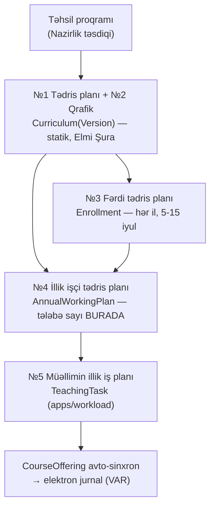

Zəncirin sonu mövcud sistemə lövbərlənir: `CourseOffering` (fənn × semestr × qrup, instructor = jurnal sahibi) **VAR** və işləkdir. Modul zənciri yuxarıdan aşağı bu mövcud nöqtəyə qədər tamamlayır.

> **⚠ Proses tənqidi — 6 mərhələli təsdiq zənciri.** Normativ zəncir (kafedra → metodiki komissiya → fakültə şurası → tədris şöbəsi → Elmi Şura → rektor) hər dəyişiklik üçün tam təkrarlanırsa, bir fənnin şifrindəki hərf səhvi 2 aylıq bürokratik dövrə salınacaq — praktikada bu, insanların sistemi keçib "birbaşa DB-də düzəltməsi" ilə nəticələnir (legacy sistemin çürümə yolu məhz budur). Həll: dəyişikliklər iki sinifə ayrılmalıdır — **texniki düzəliş** (şifr, ad orfoqrafiyası, sıra; məzmuna toxunmur) tədris şöbəsi fast-track-i ilə, protokola istinadla; **mahiyyət dəyişikliyi** (kredit, saat, fənn əvəzlənməsi, semestr köçürməsi) tam zəncirlə yeni versiya kimi (§6). Hər ikisi audit-lidir, amma yalnız ikincisi `version_no` artırır.

### 5.2 Plan sətrinin sahə modeli — rəsmi 13 sütunun superseti

Rəsmi sənədin (QKU nümunəsi) 13 sütunu + NMİ variantındakı fərqlər model üçün **superset** tələb edir; sütun görünürlüyü tenant-konfiqurasiyalıdır (vahid dövlət şablonu yoxdur — bu, qrup sektoru presedenti ilə eyni qərardır).

Mövcud `CurriculumSubject` (VAR): `curriculum, subject, semester_number, is_elective, elective_group, required_choices, order` — yəni rəsmi sənədin yalnız 3 sütununu (ad, semestr, seçmə statusu) örtür. Genişlənmə (TEDRIS_PLANI_SPEC §5.1 əsasında, bu sənədlə uzlaşdırılmış son forma):

| Sahə | Rəsmi sütun | Qeyd | Status |
|---|---|---|---|
| `code` | 2 — Fənnin şifri | plan-daxili şifr (`MİF-B04.01`); `Subject.code` kataloq şifridir, eyni deyil | **YOXDUR** |
| `subject` FK | 3 — Fənnin adı | mövcud; `row_kind≠subject` sətirlərdə null (aşağıda) | **VAR** |
| `credits` | 4 — Kredit | **plan sətrində**, `Subject.ects` yox — eyni fənn ixtisasa görə fərqli kredit daşıyır (real Excel: 421 fənndən 35-i) | **YOXDUR** |
| `total_hours` | 5 — Ümumi saat | avto `= credits × 30`, override edilə bilər | **YOXDUR** |
| `self_study_mrts` + `self_study_own` | 6 — Auditoriyadankənar | **iki sahə**: MRTSİ (≥40%, müəllim yükünə düşür) + tələbənin öz işi | **YOXDUR** |
| `lecture_hours`, `seminar_hours`, `lab_hours` | 7–10 — Auditoriya bölgüsü | semestrlik kontakt saatları; cəmi = auditoriya | **YOXDUR** |
| prerekvizit kənarları | 11 — Prerekvizit şifrləri | ayrıca through-model (§5.6) | **YOXDUR** |
| `semester_number` | 12 — Tədris semestri | mövcud | **VAR** |
| `weekly_hours` | 13 — Həftəlik yük | avto `= auditoriya ÷ effektiv həftə` (default 15, bayram override-ı semestr səviyyəsində) | **YOXDUR** |
| `block` FK | blok başlıqları | `CurriculumBlock` (§5.3) | **YOXDUR** |
| `teaching_chair` FK | — | xidməti tədris marşrutu (§5.4) | **YOXDUR** |
| `subject_kind` | — | məcburi-ardıcıl / məcburi / seçmə (NK 348 b. 3.2.8) | **QİSMƏN VAR** (`is_elective` boolean) |
| `row_kind` | — | subject / practice / thesis / attestation (§5.3) | **YOXDUR** |
| `exam_form` | — | imtahan / hesabat / kurs işi | **YOXDUR** |
| `language` | — | AZ / EN / RU (sektor) | **YOXDUR** |
| `weeks` | III bölmə | practice/attestation sətirləri üçün həftə sayı (kredit = həftə × 1,5 yoxlaması) | **YOXDUR** |

İki qeyri-aşkar, amma məcburi qərar:

1. **`Subject.ects` silinmir, default-a çevrilir.** Kataloq dəyəri yeni plan sətri yaradılanda ilkin təklif kimi kopyalanır; mənbə həqiqəti `CurriculumSubject.credits`-dir. Transkript/GPA hesabı (`transcript.py` `_credit_for`) plan sətrinə keçməlidir — bu, §6-dakı immutability-nin ön şərtidir.
2. **Blok başlıqları aqreqat sətir deyil, ayrıca model-dir.** Rəsmi sənəddə `MHF–B00 | 14 kredit | 420 | …` sətirləri cədvəlin içindədir; modeldə bunlar hesablanan yekunlardır (`CurriculumBlock` üzrə `Σ`), saxlanılan data yox — əks halda blok yekunu ilə sətir cəmi arasında uyğunsuzluq mümkün olur (legacy sistemin klassik xəstəliyi).

### 5.3 Fənn kateqoriyaları — 8 tip, 3 ox

İstənilən kateqoriya siyahısı (məcburi, ixtisas, seçmə, ümumi universitet, ümumi təhsil, praktika, diplom işi, digər) modelə **tək enum kimi salınmamalıdır**.

> **⚠ Proses tənqidi — 8-lik siyahı üç müxtəlif oxu qarışdırır.** "Məcburi" və "seçmə" fənnin **tələb statusudur** (eyni fənn bir planda məcburi, digərində seçmə ola bilər); "ixtisas", "ümumi universitet", "ümumi təhsil" **məzmun blokudur** (NK 117-nin pay qaydaları bunlara baxır); "praktika" və "diplom işi" isə ümumiyyətlə fənn deyil — **sətir növüdür** (kataloqda `Subject` qeydi olmayan, saatı yox həftəsi olan fəaliyyətlər). Bunları tək sahəyə yığan sistem ilk real planda çökür: "İxtisas bloku içindəki seçmə fənn" ifadə edilə bilmir. Üstəlik NK 348-də "ümumi/peşə/ixtisas" adları ümumiyyətlə yoxdur — universitetlər öz blok adlarını işlədir (QKU: "Humanitar fənlər bölməsi / İxtisas fənləri / İxtisaslaşmaya ayrılan / Seçmə fənn / Elmi-tədqiqat işləri"). Enum hardcode = tenant-konfiqurasiya prinsipinin pozulması.

Düzgün dekompozisiya — üç ortoqonal sahə:

| Ox | Sahə | Dəyərlər | Mənbə |
|---|---|---|---|
| **A. Tələb statusu** | `subject_kind` | `mandatory_sequential` / `mandatory` / `elective` | NK 348 b. 3.2.8 — qanuni üçlük, enum ola bilər |
| **B. Məzmun bloku** | `block` FK → `CurriculumBlock` | tenant lüğəti (`kind` + ad + kod) | universitetə görə dəyişir — lüğət |
| **C. Sətir növü** | `row_kind` | `subject` / `practice` / `thesis` / `attestation` | NK 348 III bölmə + DERS_YUKU_SPEC `row_kind` konvensiyası ilə eyni |

`CurriculumBlock` (TEDRIS_PLANI_SPEC §5.2 ilə uzlaşdırılmış):

```python
class CurriculumBlock(UUIDModel, TimeStampedModel, OrderedModel):
    organization, curriculum_version           # FK-lər (§6)
    code   = Char(32)                          # "MHF–B00"
    name   = Char(255)                         # "Humanitar fənlər bölməsi"
    kind   = FK BlockKindDictionary            # org-səviyyə lüğət
    min_credits, max_credits                   # blok-daxili yoxlama (opsional)

class BlockKindDictionary(UUIDModel):          # org-səviyyə, seed ilə doldurulur
    organization, code, name
    normative_class = Char(choices=[           # NK 117 pay validasiyasının açarı
        "humanitarian", "professional", "elective_pool", "other"])
```

`normative_class` həlledici hiylədir: blok adları tenant-sərbəst qalır, amma hər blok normativ sinifə teq olunur — beləcə NK 117 pay yoxlamaları universitetin öz adlandırmasından asılı olmadan işləyir. 8-lik siyahı seed lüğət kimi verilir (universitet dəyişə bilər), "digər" `normative_class="other"` fallback-idir.

**8 kateqoriyanın üç oxa xəritəsi.** Ənənəvi siyahının hər maddəsi modeldə bir sahə deyil, `(subject_kind, block.normative_class, row_kind)` üçlüyüdür:

| # | Ənənəvi kateqoriya | A. `subject_kind` | B. `block.normative_class` | C. `row_kind` |
|---|---|---|---|---|
| 1 | **Məcburi** | `mandatory` / `mandatory_sequential` | sərbəst (hansı blokdadırsa) | `subject` |
| 2 | **İxtisas** | adətən `mandatory` (blok seçmə ola bilər) | `professional` | `subject` |
| 3 | **Seçmə** | `elective` | `elective_pool` | `subject` |
| 4 | **Ümumi universitet** | adətən `mandatory` | `professional` **və ya** `other` — tenant seçimi (seed-də `other`, çünki NK 117 pay hesabına girmir) | `subject` |
| 5 | **Ümumi təhsil / humanitar** | adətən `mandatory` | `humanitarian` (V6 payının açarı) | `subject` |
| 6 | **Praktika** | `mandatory` | `professional` | `practice` — `subject` FK null, `credits = weeks × 1.5` (V7) |
| 7 | **Diplom işi** | `mandatory` | `professional` | `thesis` — `subject` FK null, V7 ilə eyni düstur |
| 8 | **Digər** | sərbəst | `other` (fallback) | `subject` / `attestation` |

Oxunuş qaydası: **A oxu heç vaxt B oxundan çıxarılmır** — "İxtisas bloku içindəki seçmə fənn" = `subject_kind="elective"` + `normative_class="professional"`, və bu sətir V5 (seçmə pay) hesabına düşür, V6-ya düşmür. NK 117 pay validasiyaları yalnız B oxuna baxır, tələb statusu yoxlamaları yalnız A oxuna; C oxu isə saat/kredit düsturunu (V1 vs V7) seçir.

`BlockKindDictionary` seed nümunəsi (org yaradılanda doldurulur; universitet `code`/`name`-i sərbəst dəyişir, `normative_class` isə normativ açardır və dəyişdirilməsi audit-lidir):

| `code` | `name` (default AZ) | `normative_class` |
|---|---|---|
| `HUM` | Humanitar fənlər bölməsi | `humanitarian` |
| `GEN` | Ümumi təhsil fənləri | `humanitarian` |
| `UNI` | Ümumi universitet fənləri | `other` |
| `PROF` | Peşə hazırlığı fənləri | `professional` |
| `SPEC` | İxtisas fənləri | `professional` |
| `SPECZ` | İxtisaslaşmaya ayrılan fənlər | `professional` |
| `ELECT` | Seçmə fənn bölməsi | `elective_pool` |
| `OTHER` | Digər (praktika, ETİ, attestasiya) | `other` |

**Validasiya qaydaları** (canlı balans panelinin məntiqi; redaktədə xəbərdarlıq, `approved`-a keçiddə bloklayıcı):

| # | Qayda | Mənbə | Sərtlik |
|---|---|---|---|
| V1 | `total_hours = credits × 30` | NK 348 b. 3.2.2 | sətir-səviyyə, bloklayıcı |
| V2 | `lecture + seminar + lab = auditoriya`; `auditoriya + self_study_* = total_hours` | daxili ardıcıllıq | bloklayıcı |
| V3 | Semestr cəmi = 30 kredit (əyani) / 24 (qiyabi); max 40 | NK 348 b. 3.2.2/3.2.3/3.2.5 | təsdiqdə bloklayıcı |
| V4 | Proqram cəmi = 240–300 (bakalavr, `degree_years`-a görə) / 120 (magistr) | NK 348 b. 3.2.4 | təsdiqdə bloklayıcı |
| V5 | Seçmə pay 25–30% (tibb 10–15%) — `subject_kind="elective"` kreditləri | NK 117 b. 2.24 | xəbərdarlıq* |
| V6 | Humanitar pay 15–20% (tibb 5–10%) — `normative_class="humanitarian"` | NK 117 b. 2.23 | xəbərdarlıq* |
| V7 | `row_kind ∈ {practice, thesis, attestation}` → `credits = weeks × 1.5` | NK 348 b. 3.2.2 | bloklayıcı |
| V8 | `self_study_mrts ≥ 0.4 × (self_study_mrts + self_study_own)` | NK 348 b. 3.2.21 | xəbərdarlıq |
| V9 | Prerekvizit: əvvəlki semestr + dövrsüzlük (§5.6) | rəsmi sütun 11 | təsdiqdə bloklayıcı |
| V10 | `weekly_hours = auditoriya ÷ effektiv_həftə` (default 15, override) | NK 348 b. 3.2.2 | avto-hesab |

\* V5/V6 xəbərdarlıq qalır, çünki tibb istisnası və keçid halları var — amma kənarlaşma təsdiq paketində açıq görünməli və təsdiq edənin şüurlu qərarı kimi audit-lənməlidir. Auditoriya/sərbəst-iş nisbətinə qayda qoyulmur — köhnə 1:1 qaydası ləğv edilib, nisbət universitetin öz səlahiyyətindədir (org-parametr kimi default əmsal, məs. QKU-da 7,5 saat/kredit, saxlanıla bilər).

### 5.4 Fənn ↔ kafedra: `owner_department` + `teaching_chair` — iki fərqli sual

Hazırda `Subject`-də kafedra bağlantısı **YOXDUR** — fənn kataloqu "sahibsizdir". İki ayrı sahə lazımdır, çünki iki ayrı suala cavab verirlər:

```python
class Subject(...):
    owner_department = FK "organizations.OrgUnit"   # unit_type="chair", PROTECT
    # "Bu fənnin akademik sahibi kimdir?" — sillabus, sual bankı moderasiyası,
    # fənn kartoçkası, akkreditasiya hesabatı bu kafedradan keçir.

class CurriculumSubject(...):
    teaching_chair = FK "organizations.OrgUnit"     # unit_type="chair"
    # "BU planda bu fənni kim tədris edir?" — default = subject.owner_department,
    # xidməti tədrisdə fərqlənir; dərs yükü marşrutunun açarıdır.
```

Ayrımın səbəbi **xidməti tədrisdir**: Proqramlaşdırma kafedrası psixologiya və filologiya qruplarına dərs deyir — fənnin sahibi Proqramlaşdırma kafedrasıdır (sillabus, sual bankı), amma hansı planda kimin tədris etdiyi plan sətrinin qərarıdır və dekanlıq onu illik işçi planda dəyişə bilər (`AnnualWorkingPlanRow.teaching_chair` son override nöqtəsidir). `owner_department` olmadan sual bankının kataloq axını (`subject_ref` göndərişləri) və kafedra-səviyyə fənn hesabatları marşrutlana bilmir; `teaching_chair` olmadan isə dərs yükü generatoru (İ→Y addımı) kafedra tapşırıqlarını qura bilmir. Hər ikisi `PROTECT` — kafedra silinəndə fənn "yetim" qalmamalıdır.

### 5.5 Fənn ↔ ixtisas: niyə M2M yox, plan sətri

Fənn ilə ixtisas arasında birbaşa `ManyToMany` **qurulmamalıdır** — əlaqə yalnız `CurriculumSubject` (plan sətri) üzərindən getməlidir. Səbəb üç qatdır:

1. **Əlaqənin özü atributludur.** Eyni fənn müxtəlif ixtisaslarda fərqli kredit (Excel-də 421 fənndən 35-i), fərqli semestr, fərqli saat bölgüsü, fərqli tələb statusu (bir planda məcburi, digərində seçmə) daşıyır. Çılpaq M2M bu payload-u itirir; "atributlu M2M" isə elə plan sətrinin özüdür.
2. **Əlaqə versiyalıdır.** "Bu ixtisasda bu fənn var" ifadəsi hansısa qəbul ili + plan versiyası kontekstində doğrudur (§6). M2M-də bu kontekst yoxdur — 2024 kohortuna aid fənn 2026 kohortu üçün ləğv ediləndə M2M nə göstərməlidir? Plan sətrində sual yaranmır: hər kohortun öz sətirləri var.
3. **Legacy dərsi.** myedudb məhz "fənn siyahısı ixtisasa mətn sütunu ilə yapışdırılıb" modelidir — nəticədə hansı tələbənin hansı şərtlərlə oxuduğu bərpa olunmur. FK-lı plan sətri bu suala həmişə cavab verir.

Praktik nəticə: "fənnin hansı ixtisaslarda tədris olunduğu" sorğusu `CurriculumSubject.objects.filter(subject=s, curriculum_version__status="approved")` üzərindən **hesablanır**, saxlanılmır.

### 5.6 Prerekvizit modeli

Rəsmi sənədin 11-ci sütunu prerekvizitləri şifrlə sadalayır. Model — **plan sətirləri arasında** (kataloq fənləri arasında yox) self-referential M2M, through-cədvəllə:

```python
class CurriculumPrerequisite(UUIDModel, TimeStampedModel):
    organization  = FK Organization
    row           = FK CurriculumSubject, related_name="prereq_edges"       # asılı sətir
    required_row  = FK CurriculumSubject, related_name="dependent_edges"    # tələb olunan
    kind          = Char(choices=["prerequisite", "corequisite"], default="prerequisite")
    # unikal: (row, required_row); hər iki sətir EYNİ curriculum_version-da olmalıdır
```

Kənarın kataloq (`Subject`) səviyyəsində yox, plan sətri səviyyəsində olması qəsdəndir: prerekvizit qaydası da ixtisasa görə dəyişir (riyaziyyatçı üçün "Analiz I" fizikə prerekvizitdir, iqtisadçı üçün deyil) və plan versiyası ilə birlikdə dondurulur.

**Validasiya (servis qatı, DAG):**

| Yoxlama | Nə vaxt | Davranış |
|---|---|---|
| `required_row.semester_number < row.semester_number` (coreq üçün `≤`) | redaktədə | dərhal xəta — "prerekvizit sonrakı semestrdədir" |
| Dövr aşkarlanması (topological sort, version-daxili qraf) | redaktədə xəbərdarlıq, təsdiqdə blok | `approved`-a keçid dövrlü qrafla mümkün deyil |
| Hər iki sətir eyni versiyada | DB-səviyyə (servis + constraint) | kənar versiya klonlananda birlikdə klonlanır |
| Tələbə qeydiyyatında: prerekvizit fənn üzrə müvəffəq yekun qiymət varmı | FTP pəncərəsində (5–15 iyul) | org-konfiqurasiyalı: blok (default) / xəbərdarlıq |

Açıq sualın qərarı: **redaktə zamanı xəbərdarlıq, təsdiq keçidində sərt blok, tələbə qeydiyyatında org-konfiqurasiyalı (default: blok).** Səbəb: plan tərtibi iterativdir və yarımçıq vəziyyətləri qadağan etmək redaktoru işlənməz edir; amma təsdiqlənmiş plan normativ sənəddir və dövrlü prerekvizit qrafı fiziki mənasızlıqdır.

### 5.7 Tədris qrafiki (sənəd №2) — həftə toru

§5.1 cədvəlinin №2 sənədi — **ixtisasın tədris qrafiki** — plan sətirlərinin *nə* olduğunu deyil, tədris ilinin həftələrinin *nəyə sərf olunduğunu* təsbit edir: nəzəri təlim / imtahan sessiyası / təcrübə / diplom işi / attestasiya / tətil həftələri, kurs (tədris ili) üzrə. Rəsmi sənəddə bu, illər sətir, həftələr sütun olan simvol torudur. Plan sətirləri onsuz da natamamdır: V7 praktikanın **kredit-həftə** ekvivalentini verir, amma həmin həftələrin təqvimdə harada dayandığını yalnız qrafik deyir.

Model — plan versiyasına bağlı, sıralı, yığcam sətir dəsti (hər həftə üçün ayrıca sətir yox, **eyni növ ardıcıl həftələrin bloku**):

```python
class CurriculumScheduleRow(UUIDModel, TimeStampedModel, OrderedModel):
    organization       = FK Organization
    curriculum_version = FK CurriculumVersion, related_name="schedule_rows"   # §6
    course_year        = PositiveSmallInteger        # 1..degree_years (kurs)
    semester_number    = PositiveSmallInteger, null=True   # tətil/YDA üçün null ola bilər
    week_kind          = Char(choices=[
        "theory",        # nəzəri təlim (dərs həftəsi)
        "exam_session",  # imtahan sessiyası
        "practice",      # təcrübə (row_kind="practice" sətirlərinin qarşılığı)
        "thesis",        # diplom işi / buraxılış işi həftələri
        "attestation",   # yekun dövlət attestasiyası
        "holiday"])      # tətil (qış / yay)
    weeks              = PositiveSmallInteger        # ardıcıl həftə sayı
    order              = PositiveSmallInteger        # il daxilində ardıcıllıq (həftə torunun sırası)
    note               = Char(255, blank=True)       # "bayram həftəsi", "səyyar təcrübə" və s.
    # unikal: (curriculum_version, course_year, order)
```

`order` sahəsi torun **ardıcıllığını** saxlayır — yığcam forma (`week_kind × weeks`) həftə-həftə tordan yalnız yazılış qısalığı ilə fərqlənir, məlumat itkisi yoxdur: tor `order` üzrə açılaraq bərpa olunur.

**Validasiya qaydaları** (§5.3-ün V1–V10 dəstinin davamı; redaktədə xəbərdarlıq, `approved`-a keçiddə bloklayıcı):

| # | Qayda | Mənbə | Sərtlik |
|---|---|---|---|
| V11 | Hər semestr üzrə `Σ weeks(week_kind="theory") = CurriculumVersion.weeks_per_term` (default 15, bayram override-ı ilə 14) | NK 348 b. 3.2.2 + V10 ilə eyni "effektiv həftə" mənbəyi | təsdiqdə bloklayıcı |
| V12 | Hər kurs üzrə `Σ weeks(week_kind ∈ {practice, thesis, attestation})` = həmin kursun semestrlərindəki `row_kind ∈ {practice, thesis, attestation}` plan sətirlərinin `weeks` cəmi | V7 ilə **eyni mənbə** — qrafik və plan sətri bir-birini yoxlayır | təsdiqdə bloklayıcı |
| V13 | Hər kurs üzrə bütün növlərin cəmi = normativ tədris ili həftələri (org-parametr, default 52 — tətil daxil) | NK 348 tədris ili quruluşu | təsdiqdə bloklayıcı |

V12 qəsdən **ikitərəflidir**: təcrübənin kredit ölçüsü plan sətrində (V7: `credits = weeks × 1.5`), təqvim ölçüsü qrafikdə saxlanılır və ikisi eyni `weeks` rəqəminə söykənir. Bir tərəf dəyişib digəri dəyişməyəndə təsdiq bloklanır — legacy sistemlərdə "plan bir şey deyir, qrafik başqa şey" uyğunsuzluğunun qarşısı məhz burada alınır.

**Versiyalaşma ilə əlaqə.** Qrafik ayrıca ömür dövrü qazanmır: `curriculum_version` FK-sı sayəsində plan versiyası klonlananda qrafik sətirləri **birlikdə klonlanır**, versiya `approved` olanda eyni PG immutability trigger-i (§6.2 qayda 1) onları da kilidləyir, `effective_from_semester`-dən əvvəlki kurslara aid sətirlər isə dondurulmuş klondur (qayda 2) — yəni "keçmiş kursun qrafikini sonradan dəyişmək" mümkün deyil. Sənəd №1 və №2 bir təsdiq paketində gedir (§6.3 zənciri), çünki normativ olaraq da birlikdə təsdiqlənirlər.

> **Qrafik (norma) ≠ `AcademicCalendar` (konkret ilin təqvimi).** Qrafik ixtisasın *strukturunu* deyir — "3-cü kursun payız semestri: 15 həftə nəzəri təlim + 3 həftə sessiya + 2 həftə təcrübə" — və qəbul ilinə bağlı, illərlə dəyişməyən sənəddir. `AcademicCalendar` / `AcademicPeriod` isə **bu ilin** konkret tarixlərini deyir: 15 sentyabr 2026-da başladı, sessiya 5 yanvar 2027-də açılır, 8 mart bayram günüdür. Yəni qrafik "neçə həftə", təqvim "hansı tarixdən hansına" sualına cavab verir. İkisinin bağlantısı **bir istiqamətlidir**: təqvim generatoru qrafiki oxuyub `AcademicPeriod` pəncərələrini təklif edir; təqvimdəki bayram override-ı isə `weeks_per_term`-i 15-dən 14-ə endirəndə bu, qrafikin özünü dəyişmir — V11 həmin ilin effektiv həftə dəyəri ilə yoxlanır. Qrafiki təqvimlə birləşdirən model hər tədris ilində planı yenidən təsdiq etməyə məcbur olar — bu, §5.1-in №1↔№4 ayırıcı xəttinin eyni səhvidir.

---

## §6. Curriculum versioning: version-per-cohort + düzəliş versiyası

### 6.1 Mövcud təməl: version-per-cohort (VAR)

`Curriculum` artıq `(organization, program, admission_year)` unikallığı ilə qəbul ilinə bağlıdır — bu, **version-per-cohort** modelidir və düzgün təməldir: 2024 kohortu 2024 planı ilə, 2026 kohortu 2026 planı ilə oxuyur; kohortlar arası fərq üçün heç bir əlavə mexanizm lazım deyil. `StudentAcademicRecord.curriculum` (PROTECT) tələbəni öz kohort planına lövbərləyir — bu da **VAR**.

Çatışmayan hal **mid-cohort dəyişiklikdir**: 2024 kohortu 5-ci semestrə çatanda Elmi Şura onların planının qalan hissəsini dəyişir. Hazırkı modeldə bunun yeganə yolu `CurriculumSubject` sətirlərini yerində redaktə etməkdir — bu isə keçmişi pozur: tələbənin 1–4-cü semestrdə *hansı şərtlərlə* oxuduğunun qeydi itir. Plan versiyalaşdırması **YOXDUR** (TEDRIS_PLANI_SPEC boşluq #7).

### 6.2 Model: `CurriculumVersion` + `effective_from_semester`

Qərar: `Curriculum` kohort lövbəri kimi qalır (identity), plan məzmunu versiyaya köçür:

```python
class CurriculumVersion(UUIDModel, TimeStampedModel):
    organization    = FK Organization
    curriculum      = FK Curriculum, related_name="versions"
    version_no      = PositiveSmallInteger              # 1, 2, 3…
    status          = Char  # draft / chair_review / faculty_review / office_review
                            # / approved / superseded / archived
                            # (senate AYRICA STATUS DEYİL — §6.3-ə bax)
    effective_from_semester = PositiveSmallInteger(default=1)
    supersedes      = FK "self", null=True              # əvvəlki approved versiya
    change_note     = Text                              # v2+ üçün MƏCBURİ
    degree_years, education_form, weeks_per_term, credit_hour   # spec §5.3 sahələri
    senate_protocol, senate_date, approved_by, approved_at
    # unikal: (curriculum, version_no)

# CurriculumSubject.curriculum  →  CurriculumSubject.curriculum_version (FK dəyişir)
# CurriculumBlock, CurriculumPrerequisite də versiyaya bağlanır
# Miqrasiya: hər mövcud Curriculum üçün version_no=1, status=approved, effective_from=1
```

**Dörd qayda:**

1. **Immutable-by-default.** `approved` versiyanın sətirləri redaktə olunmur — nöqtə. Dəyişiklik istəyi = son approved versiyadan tam klon → `draft` yeni versiya → təsdiq zənciri → `approved` olanda əvvəlki versiya `superseded`. Jurnal kilidləri presedenti ilə eyni fəlsəfə: tətbiq qatındakı qadağa **PG trigger ilə ikinci xətt** kimi möhkəmləndirilməlidir (`approved` versiyaya aid sətirlərdə UPDATE/DELETE rədd edilir; İKT Rəhbərinin audited-correction rejimi burada da yeganə istisna qapısıdır və sənədli PDF axını tələb edir).
2. **`effective_from_semester` = kəsim xətti.** Yeni versiyada `semester_number < effective_from_semester` sətirlər dondurulmuş klondur — redaktor onları kilidli göstərir, təsdiq validasiyası onların supersede olunan versiya ilə eyniliyini yoxlayır. Səbəb: o semestrlər artıq **yaşanıb** — onları "yeni plana" görə dəyişmək keçmişi saxtalaşdırmaqdır.
3. **Oxunuş tək resolver-dən keçir.**

   ```python
   def resolve_plan_version(curriculum, semester_number):
       return (curriculum.versions
               .filter(status__in=["approved", "superseded"],
                       effective_from_semester__lte=semester_number)
               .order_by("-version_no").first())
   ```

   `enroll_mandatory_subjects`, `get_student_semester_plan`, illik işçi plan generatoru, transkript — hamısı bu funksiyadan keçməlidir. Hazırda bu servislər `CurriculumSubject`-i birbaşa oxuyur — **QİSMƏN VAR**, resolver-ə keçirilməlidir.
4. **Qeydiyyat anında lövbərləmə.** `Enrollment` (və yekun qiymət qeydi) yarananda konkret `CurriculumSubject` sətrinə FK ilə bağlanır (`curriculum_row = FK CurriculumSubject, PROTECT`). Transkript heç vaxt yenidən resolve etmir — tələbənin oxuduğu sətir qeyd anında birdəfəlik sabitlənir. Bu, immutable academic records prinsipinin texniki lövbəridir: versiyalar immutable olduğuna görə snapshot-duplikasiya (ad/kredit köçürmə) lazım deyil — FK kifayətdir.

### 6.3 Versiya ömür dövrü

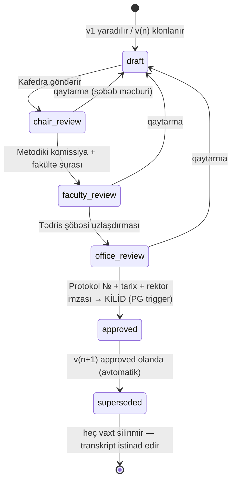

Mərhələlərin adları mövcud `ApprovalStatus` (jurnal təsdiq zənciri: draft → submitted → chair_approved → approved / returned) konvensiyası ilə eyni üslubda saxlanılır — istifadəçi iki modulda eyni mental modeli görür. Elmi Şura mərhələsi üçün qərar: sistemdə **nə status, nə aktor-mərhələ kimi izlənmir** — `senate` diaqramda qovşaq, `status` siyahısında dəyər deyil; o, `office_review → approved` keçidinin **rekvizitidir**: protokol № + tarix (+ rektor imzası) həmin keçiddə məcburi sahələrdir və `senate_protocol` / `senate_date` sütunlarında qeyd olunur (açıq sual #1-in cavabı; Şuranın öz iclas prosesini sistemləşdirmək bu modulun işi deyil).

`superseded` versiya **heç vaxt silinmir və arxivə köçürülmür** — ona `Enrollment.curriculum_row` FK-ları (PROTECT) istinad edir; silinmə cəhdi DB səviyyəsində mümkünsüzdür.

### 6.4 Versiya ↔ sənəd zənciri təsiri

Yeni versiya `approved` olanda aşağı axın avtomatik yox, **nəzarətli** yenilənir: illik işçi plan generatoru (İ1) növbəti generasiyada yeni versiyanı götürür; artıq təsdiqlənmiş cari-il işçi planına təsir **amendment** axını ilə gedir (workload `WorkloadAmendment` presedenti). Yəni versiya dəyişikliyi keçmiş sənədləri yenidən yazmır — yalnız növbəti generasiya nöqtəsindən qüvvəyə minir.

---

## §20. Fənn əvəzlənməsi halı: «Network Security» → «Advanced Network Security»

Bu, versioning modelinin turnusol testidir. Ssenari: 2024 kohortunun planında 6-cı semestrdə "Network Security" (5 kredit) var; 2026-cı ildə kafedra fənni məzmunca yeniləyib "Advanced Network Security" etmək istəyir; 2024 kohortunun bir hissəsi köhnə fənni artıq bitirib, bir hissəsi hələ oxumayıb.

**Qadağan olunan yol — kataloqda ad dəyişmək.** `Subject.name`-i yerində redaktə etmək bütün tarixi qeydləri retroaktiv dəyişir: köhnə tələbənin transkriptində birdən "Advanced Network Security" görünür — halbuki o, başqa məzmunlu fənn oxuyub. Bu, myedudb-nin "hazırkı mətnə bax" xəstəliyinin eynidir və diplom əlavəsinin (Diploma Supplement) hüquqi etibarını pozur. Qayda: **approved plan versiyasının istinad etdiyi `Subject`-də ad/kredit dəyişikliyi qadağandır** (yalnız orfoqrafik düzəliş, audited-correction rejimi ilə). Məzmun dəyişikliyi = **yeni kataloq qeydi** (yeni `code`).

**Düzgün axın (mövcud + təklif olunan modellə):**

1. Kataloqda yeni `Subject("ANS-401", "Advanced Network Security")` yaradılır — köhnəsi `is_active=False` olur (silinmir: PROTECT + tarixi istinadlar).
2. 2024 kohortunun `Curriculum`-unda yeni `CurriculumVersion(v2, effective_from_semester=6)` açılır: 6-cı semestr sətrində köhnə fənn yenisi ilə əvəzlənir; 1–5-ci semestr sətirləri dondurulmuş klondur.
3. Təsdiq zəncirindən keçir → `approved`; v1 → `superseded`.
4. **Fənni bitirmiş tələbə:** onun `Enrollment.curriculum_row`-u v1-in sətrinə lövbərlidir → transkriptində "Network Security, 5 kredit" dəyişməz qalır. Heç bir yenidən hesablama yoxdur — immutable academic records.
5. **Hələ oxumamış tələbə:** 6-cı semestr qeydiyyatında resolver v2-ni qaytarır → "Advanced Network Security"-yə yazılır.
6. **Kəsişmə halı (borclu tələbə):** köhnə fənndən kəsilib, fənn artıq tədris olunmur. Bunun üçün ekvivalentlik qeydi lazımdır:

```python
class SubjectEquivalence(UUIDModel, TimeStampedModel):
    organization = FK Organization
    old_subject  = FK Subject, related_name="superseded_by_links"
    new_subject  = FK Subject, related_name="supersedes_links"
    decided_by, senate_protocol, note      # Elmi Şura qərarı — audit
    # unikal: (organization, old_subject, new_subject)
```

Retake axını borclu tələbəni ekvivalent yeni fənnə yönləndirir; transkriptdə hər iki cəhd öz adı ilə qalır (ilk cəhd köhnə fənn — kəsilib; təkrar cəhd yeni fənn — nəticə orijinal semestrə yazılır, mövcud təkrar-imtahan qaydası ilə). `SubjectEquivalence` həmçinin köçürmə (transfer) kredit tanınmasının gələcək təməlidir. **Status: YOXDUR.**

Yekun prinsip bir cümlədə: **kataloq mutable, plan versiyası immutable, tələbə qeydi lövbərli** — üçünün ayrılması sayəsində fənn təkamülü tarixə toxunmadan mümkün olur.

### İcra üçün yekun status xəritəsi (§5–6+20)

| İş | Status | Asılılıq |
|---|---|---|
| `Curriculum` version-per-cohort + `StudentAcademicRecord` lövbəri | **VAR** | — |
| `CurriculumSubject` bazası (semestr, seçmə blok) + admin UI + auto-enroll servisləri | **VAR** (UI QİSMƏN) | — |
| Plan sətri sahə genişlənməsi (kredit, saatlar, şifr, dil, exam_form, weeks) | **YOXDUR** | T0 |
| `CurriculumBlock` + `BlockKindDictionary` + `normative_class` | **YOXDUR** | T0 |
| `subject_kind` / `row_kind` üç-ox dekompozisiyası | **YOXDUR** (`is_elective` QİSMƏN) | T0 |
| `Subject.owner_department` + `CurriculumSubject.teaching_chair` | **YOXDUR** | T0 |
| `CurriculumPrerequisite` + DAG validasiyası | **YOXDUR** | T0–T1 |
| `CurriculumScheduleRow` (tədris qrafiki, sənəd №2) + V11–V13 | **YOXDUR** | T1 (versiya ilə birlikdə klonlanır) |
| V1–V10 validasiya dəsti + canlı balans paneli | **YOXDUR** | T1 |
| `CurriculumVersion` + resolver + PG immutability trigger | **YOXDUR** | T2 (təsdiq axını ilə birlikdə) |
| `Enrollment.curriculum_row` lövbəri + transkript `_credit_for` keçidi | **YOXDUR** | T2 |
| `SubjectEquivalence` + retake yönləndirməsi | **YOXDUR** | T2+ |


---

# III HİSSƏ — TƏHLÜKƏSİZLİK VƏ SƏLAHİYYƏT

## G. RBAC/ABAC Təhlükəsizlik Modeli

> **Bölmənin əhatəsi:** G (təhlükəsizlik modeli) + §13 (rol × əməliyyat matrisi) + §21 (ABAC qatı
> və dörd müdafiə xətti). Bütün qərarlar mövcud `apps/organizations` (Role / Membership / OrgUnit /
> scoping) və `apps/registrar` (journal_access, page_contexts, corrections) kodunun üstünə qurulur —
> sıfırdan yeni icazə sistemi YAZILMIR.

### G.1 Mövcud təməl — nəyin üstünə qururuq

EMSArena-nın icazə modeli üç ortoqonal oxdan ibarətdir və bu ayrılıq **saxlanılmalıdır**, çünki
hər oxun öz suala cavab verməsi (nəyi edə bilər / kimi idarə edə bilər / hansı datanı görür)
matrisi partlayışdan qoruyur:

| Ox | Sual | Mexanizm | Status |
|---|---|---|---|
| **Permission** | *Nəyi* edə bilər? | `Role.permissions` (JSON siyahı, `grade.*` wildcard, `grant:` delegasiya prefiksi), `core.permissions.has_permission` | **VAR** |
| **Level** | *Kimi* idarə edə bilər? | `Role.level` (0–100), `Membership.can_manage` (yalnız daha aşağı level-i idarə edir) | **VAR** |
| **Scope** | *Hansı* datanı görür? | `Role.scope_type` (ORGANIZATION / UNIT / COURSE) + `Membership.scope_unit` (OrgUnit FK) + `scoping.UnitScope` (materialized-path subtree) | **VAR** |

Üstəgəl iki infrastruktur qatı:

- **PostgreSQL RLS** — 100 cədvəldə `rls_tenant_isolation` siyasəti
  (`current_setting('app.bypass_rls', true) = 'on' OR organization_id::text =
  NULLIF(current_setting('app.current_org_id', true), '')`), `FORCE ROW LEVEL SECURITY`,
  `app.bypass_rls` yalnız migrasiya/worker üçün. İkinci arqument (`true`) və `NULLIF(..., '')`
  funksionaldır: onlarsız GUC təyin olunmayanda `current_setting` **xəta atır**, onlarla isə boş
  dəyər NULL-a çevrilib fail-closed davranış verir (bax §21.2 SQL şablonu). **VAR**
- **Audit** — `core.audit.log_action` + jurnal düzəlişlərində sənədli (PDF + tarixçə) correction
  axını (`apps/registrar/corrections.py`, İKT Rəhbəri presedenti). **VAR**

**Kritik mövcud tələ (kod faktı):** `core/roles.py`-da level ≥ 80 olan hər rol avtomatik
`org_admin` aliası alır; istisna siyahısı `ADMIN_ALIAS_EXEMPT_ROLE_NAMES =
{"exam_center", "exam_center_head", "exam_center_staff", "hr"}`. Aşağıda təklif olunan hər yeni
level ≥ 80 rol (o cümlədən `teaching_office_head`, 85) bu siyahıya **mütləq** əlavə olunmalıdır —
əks halda Tədris Şöbəsinin rəhbəri bütün admin panellərə düşür. Bu, DERS_YUKU_SPEC §3.2-də artıq
qeyd olunub; burada icra qapısına çevrilir: *yeni rol seed-i + exempt-siyahı dəyişikliyi eyni
PR-da gedir, CI-da `checks.py`-a «level≥80 ∧ exempt-siyahıda deyil ∧ təsvirində admin nəzərdə
tutulmayıb» xəbərdarlıq yoxlaması əlavə olunur.* **YOXDUR (yoxlama)**

Legacy anti-pattern kontrastı (myedudb): rollar və tenant ayrımı `kollec_or_uni` **string
sütunu** ilə, əlaqələr `journals.students_id='["9979"]'` kimi CSV/JSON mətnlərdə, 81 cədvəldə
**0 foreign key**, parollar açıq mətndə. Orada «icazə» = PHP səhifəsinin if-i. Bizim modeldə hər
icazə qərarının dörd müstəqil xətti var (bax §21) — məqsəd məhz «tək if» sinif sisteminin
təkrarlanmaması.

### G.2 Kanonik rol reyestri — istifadəçi siyahısının EMSArena-ya xəritəsi

İstifadəçinin 12+1 rolluq siyahısı mövcud 21 rolluq reyestrə belə oturur:

| İstifadəçi rolu | EMSArena slug | Level | Scope | Status | Qeyd |
|---|---|---|---|---|---|
| SUPER_ADMIN | platforma `is_superadmin` / `superuser` | (100) | platforma | **VAR** | Tenant `Role` DEYİL — Django user bayrağı; RLS-i `app.bypass_rls` ilə deyil, org-context seçimi ilə keçir |
| ADMIN | `org_admin` aliası (level≥80) + `Organization.owner` | 80–90 | ORG | **VAR** | Ayrıca «admin» rolu yaratma — alias mexanizmi kanonikdir |
| — (rektor) | `rector` | 100 | ORG | **VAR** | `permissions=["*"]` |
| — (prorektor) | `vice_rector` | 90 | ORG | **VAR** | Yük/plan axınında opsional yekun təsdiq mərhələsi |
| İKT_REHBER | `ikt_rehber` | 88 | ORG | **VAR** | Super-korrektor: kilidləri YALNIZ sənədli correction (PDF+audit) ilə keçir |
| ACADEMIC_AFFAIRS (Tədris Şöbəsi) | `teaching_office_head` / `teaching_office_staff` | 85 / 60 | ORG | **YOXDUR** (spec-də təyin olunub) | DERS_YUKU_SPEC §3.2; head exempt-siyahıya düşməlidir |
| REGISTRAR | `registrar_office` (yeni) | 65 | ORG | **QİSMƏN VAR** | Registrar funksionallığı var, amma ayrıca rol yox — hazırda admin-level idarə edir; `_can_manage_registrar` alias bug-ı (sidebar görünür, view 404) bununla birlikdə bağlanmalıdır |
| STUDENT_CENTER | — | — | — | **YOXDUR** | ⚠ aşağıdakı tənqidə bax — REGISTRAR ilə birləşdirilir |
| STUDENT_OFFICE | — | — | — | **YOXDUR** | ⚠ aşağıdakı tənqidə bax — REGISTRAR ilə birləşdirilir |
| DEAN | `dean` | 80 | UNIT (faculty) | **VAR** | `Membership.scope_unit=faculty` |
| DEAN_OFFICE | `dean_office_staff` (yeni) | 55 | UNIT (faculty) | **YOXDUR** | Hazırlayır/qeyd edir, TƏSDİQLƏMİR (bax tənqid) |
| DEPARTMENT_HEAD | `chair_head` (seed) → kanonik `department_head` | 70 | UNIT (chair) | **VAR** | Kanonik ad **`department_head`**-dir: `ROLE_NAME_NORMALIZATION` (`core/roles.py:76-80`) `chair_head`/`section_head` → `department_head` xəritələyir. `chair_head` yalnız **seed adıdır** (`apps/organizations/default_roles.py:169`, level 70); icazə/alias qatı (o cümlədən `ADMIN_EQUIVALENT_ROLE_NAMES`) normalizə olunmuş `department_head` ilə işləyir. Yeni kod rol adını müqayisə etməzdən əvvəl **mütləq** `normalize_membership_role_name`-dən keçirməlidir |
| — (proqram koordinatoru) | `program_coordinator` | 45 | UNIT (specialty) | **VAR** | Yük təsdiqində viza mərhələsinin sahibi — istifadəçi siyahısında YOX idi, amma prosesin özündə var |
| TEACHER | `teacher` | 50 | COURSE | **VAR** | Jurnal sahibi = `CourseOffering.instructor` |
| STUDENT | `student` | 10 | UNIT (group) | **VAR** | |
| AUDITOR | `auditor` (yeni) | 35 | ORG (read-only) | **YOXDUR** | Aşağıda G.4-də xüsusi scoping qərarı tələb edir |

> **⚠ Proses tənqidi — rol siyahısında üç struktur problemi:**
>
> 1. **STUDENT_CENTER / STUDENT_OFFICE / REGISTRAR — üç ad, bir funksiya.** Azərbaycan
>    universitetində tələbə kontingentinin əmr dövriyyəsi (qəbul, xaric, bərpa, akademik
>    məzuniyyət, qrup köçürmə — KQ-02 axınları) BİR şöbənin işidir; Boloniya terminologiyasında bu
>    elə «registrar»dır. Üç ayrı rol = üç ayrı permission dəsti = sinxron saxlanmalı üçqat matris,
>    real fərq isə göstərilməyib. **Qərar: tək `registrar_office` rolu (65, ORG) yaradılır**;
>    universitet şöbəni başqa cür adlandırırsa `Role.display_name` tenant-səviyyədə dəyişir (model
>    onsuz da per-org-dur). İki rol lazım olan yeganə real hal «əmri hazırlayan vs imzalayan»
>    ayrımıdır — o da rol yox, aşağıdakı matrisdəki S (göndər) / A (təsdiq) əməliyyat ayrımı ilə
>    həll olunur.
> 2. **DEAN_OFFICE-ə təsdiq hüququ vermək authority conflict yaradır.** Normativ axında dilimi
>    **dekan** təsdiqləyir (NK 348 zənciri, DERS_YUKU_SPEC §4.2). Dekanlıq əməkdaşına A hüququ
>    versək, «kim təsdiqlədi» sualının cavabı hüquqi şəxsdən texniki işçiyə sürüşür. **Qərar:**
>    `dean_office_staff` yalnız V/C/U/S edir; A/R yalnız `dean`-dadır. Dekan səlahiyyəti ötürmək
>    istəyirsə, mövcud `grant:` prefiksi ilə açıq delegasiya edir (`grant:workload.approve`) — bu
>    da audit-də «dekan X icazəni Y-ə verdi» kimi görünür, səssiz miras kimi yox.
> 3. **Siyahıda prosesin iki faktiki iştirakçısı yoxdur:** `program_coordinator` (yük/plan
>    vizası — DERS_YUKU_SPEC §4.2 addım 3) və `vice_rector` (opsional yekun təsdiq, rəsmi
>    TAPŞIRIQ sənədindəki «Təsdiq edirəm: İcraçı prorektor»). Hər ikisi sistemdə VAR; matrisə
>    daxil edilib. Rol siyahısı UI-dan yox, prosesdən çıxarılmalıdır.

**Level nərdivanı (kanonik, yekun):**

```
100 rector · 90 vice_rector/owner · 88 ikt_rehber · 85 teaching_office_head, exam_center*
 80 dean · 70 chair_head · 65 registrar_office, hr · 60 teaching_office_staff, exam_center_staff
 55 dean_office_staff · 50 teacher · 45 program_coordinator · 40 tutor/assistant/lab_assistant
 35 auditor · 30 lead_student · 20 member · 10 student
```

**Qərar (level semantikası):** level yalnız iki şeyə cavabdehdir — `can_manage` iyerarxiyası və
`org_admin` alias həddi. **Yeni kodda `level >= X` heç vaxt funksional icazə qapısı kimi
işlənmir** (mövcud `LevelRequiredMixin` istisnaları legacy-dir və yeni workload/curriculum
view-larında istifadə olunmur); funksional qapı həmişə permission + scope cütlüyüdür. Səbəb:
level-əsaslı qapı «auditor 35-dir, deməli heç nə görmür» kimi yanlış nəticələr doğurur — görmə
hüququ level yox, `audit.view`/`analytics.view_all` icazəsidir.

### G.3 Yeni permission ailələri

Mövcud `PERMISSION_CATEGORIES`-ə (organizations/permissions.py) əlavə olunur — DERS_YUKU_SPEC
§3.3-dəki `workload.*` ailəsi olduğu kimi götürülür, üstünə plan və kontingent ailələri gəlir:

| Ailə | İcazələr | Status |
|---|---|---|
| `workload` | `view / manage / submit / review / approve / distribute / report` | **YOXDUR** (spec hazır) |
| `curriculum` | `view / manage / review / approve / lock` | **YOXDUR** (TEDRIS_PLANI_SPEC §6) |
| `annual_plan` | `view / manage / approve` (illik işçi tədris planı) | **YOXDUR** |
| `contingent` | `view / order.draft / order.approve / group.manage / export` (tələbə əmr dövriyyəsi) | **YOXDUR** |
| `admissions` | `view / import / apply / override / provision / export / docs` (ATİS/DİM qəbul pipeline-ı) | **YOXDUR** (m_atis §25.10) |
| `audit` | `view / export` (mövcud) + **`audit.view_all`** (auditor org-wide oxu markeri) | **QİSMƏN VAR** |
| `journal` | `view / correct` | **VAR** |
| `grade`, `exam`, `member`, `unit`, `role`, `analytics` | mövcud dəstlər | **VAR** |

---

## §13. Rol × Əməliyyat Matrisi

**Əməliyyat kodları:** `V` görmək · `C` yaratmaq · `U` dəyişmək · `D` silmək · `A` təsdiqləmək ·
`S` göndərmək · `R` geri qaytarmaq · `L` kilidləmək · `X` export.
**Scope üst-işarələri:** `ᵒ` bütün təşkilat · `ᶠ` öz fakültə alt-ağacı · `ᵏ` öz kafedrası ·
`ⁱ` öz ixtisası · `ᶜ` öz dərsi (offering) · `ᵍ` öz qrupu · `ˢ` yalnız özü.
**Xüsusi işarə:** `U*` = yalnız sənədli audited correction (PDF + tarixçə) ilə; birbaşa redaktə yox.

### §13.1 İcmal matrisi (rol × obyekt qrupu)

| Rol | Qəbul (Admission) | Tələbə datası | Qrup | Tədris planı | Dərs yükü | Jurnal | Qiymət | Hesabat/Export |
|---|---|---|---|---|---|---|---|---|
| **SUPER_ADMIN** | Vᵒ U*ᵒ | Vᵒ U*ᵒ | Vᵒ | Vᵒ | Vᵒ | Vᵒ U*ᵒ | Vᵒ U*ᵒ | Vᵒ Xᵒ |
| **ADMIN** (org_admin/owner) | Vᵒ | V C Uᵒ | V C Uᵒ | Vᵒ A L | Vᵒ | Vᵒ U*ᵒ | Vᵒ U*ᵒ | Vᵒ Xᵒ |
| **rector** | Vᵒ | V C Uᵒ | V C Uᵒ | Vᵒ **A** L | Vᵒ A | Vᵒ U*ᵒ | Vᵒ U*ᵒ | Vᵒ Xᵒ |
| **vice_rector** | Vᵒ | Vᵒ | Vᵒ | Vᵒ A | Vᵒ **A** (opsional yekun) | Vᵒ | Vᵒ | Vᵒ Xᵒ |
| **İKT_REHBER** (88) | Vᵒ **U\***ᵒ | Vᵒ C U | V C Uᵒ | Vᵒ | Vᵒ U*ᵒ (amendment) | Vᵒ **U\***ᵒ | Vᵒ **U\***ᵒ | Vᵒ Xᵒ |
| **ACADEMIC_AFFAIRS head** (85) | **V C U X**ᵒ + `admissions.override` | Vᵒ Xᵒ | Vᵒ U (birləşmə qeydi) | Vᵒ U (uzlaşdırma) S L | **C U S R**ᵒ | Vᵒ | Vᵒ | Vᵒ Xᵒ |
| **ACADEMIC_AFFAIRS staff** (60) | Vᵒ | Vᵒ | Vᵒ | Vᵒ U | C Uᵒ (S konfiq ilə) | Vᵒ | — | Vᵒ Xᵒ |
| **REGISTRAR_OFFICE** (65) | **V C U S A**ᵒ (idxal→apply→provision) | **C U A S**ᵒ (əmrlər) | **V A**ᵒ (əmr rekviziti + fakültələrarası) | Vᵒ | — | Vᵒ | Vᵒ (rəsmi nəticə oxu) | Vᵒ Xᵒ |
| **DEAN** (80) | Vᶠ | Vᶠ S (əmr təqdimatı) | **V C U**ᶠ **S** | **A R**ᶠ | **A R**ᶠ (dilim) | Vᶠ | **A R L**ᶠ (yekun təsdiq) | Vᶠ Xᶠ |
| **DEAN_OFFICE** (55) | Vᶠ | Vᶠ C (təqdimat qaralaması) | Vᶠ C (qaralama) | Vᶠ C U (FTP qəbulu) | Vᶠ | Vᶠ | Vᶠ | Vᶠ Xᶠ |
| **DEPARTMENT_HEAD** (70) | — | Vᵏ | Vᵏ | **C U S**ᵏ (plan layihəsi) | **U A**ᵏ (bölgü) | Vᵏ | **A R**ᵏ (chair mərhələsi) | Vᵏ Xᵏ |
| **PROGRAM_COORDINATOR** (45) | — | Vⁱ | Vⁱ | **R**ⁱ (viza/irad) | **R**ⁱ (viza) | Vⁱ | Vⁱ | Vⁱ |
| **TEACHER** (50) | — | Vᶜ | Vᶜ | Vᶜ (öz fənn sətirləri) | Vᶜ Xᶜ (öz yükü) | **C U D**ᶜ (pəncərə daxili) | **S**ᶜ (təsdiqə göndər) | Vᶜ Xᶜ |
| **STUDENT** (10) | — | Vˢ | Vˢ (öz qrupu) | Vˢ + C Uˢ (FTP, yalnız pəncərələr) | — | Vˢ | Vˢ | Vˢ |
| **AUDITOR** (35) | Vᵒ Xᵒ | Vᵒ Xᵒ | Vᵒ | Vᵒ Xᵒ | Vᵒ Xᵒ | Vᵒ | Vᵒ Xᵒ | Vᵒ Xᵒ |

Oxunuş qaydaları:

- Boş xana (və ya `—`) = heç bir əməliyyat yoxdur (icazə açıq şəkildə verilmir; default-deny).
- **`D` (silmək) yalnız göndərilməmiş draft obyektlərə şamildir** (k_audit §K.4). Akademik nəticə
  daşıyan obyektlərdə (Enrollment, GroupMembership, StudentAcademicRecord, FinalGrade, təsdiqə
  göndərilmiş jurnal sətirləri, `submitted`-dən sonrakı TeachingTask sətirləri) silmə əməliyyatı
  **heç bir rolda yoxdur** — qarşılığı status keçidi (`dropped` / `expelled` / `closed`) və ya
  soft-delete-dir. Ona görə ADMIN və rector sətirlərində «Tələbə datası» və «Qrup» sütunlarında
  `D` yoxdur: org sahibinin belə hard-delete hüququ yoxdur. TEACHER sətrindəki `D`ᶜ məhz draft
  istisnasıdır — yalnız 2 saatlıq pəncərədə, `draft` statuslu jurnalda, öz dərsi üzərində.
- **Qrupun məzmun sahibi dekanlıq, əmr sahibi `registrar_office`-dir.** Dekan öz fakültə
  alt-ağacında qrup yaradır/dəyişir (`V C U`ᶠ) və əmr təqdimatı göndərir (`S`); registrar əmr
  rekvizitini yazır, `draft → active` keçidini icra edir və fakültələrarası köçürmələri həll edir
  (`V A`ᵒ). `draft → active` keçidi əmr rekviziti olmadan mümkün deyil (a_process §A.4.2);
  fakültələrarası köçürmə isə dekan səlahiyyətindən kənardır.
- `U*` daşıyan rollar (SUPER_ADMIN daxil) təsdiqlənmiş/kilidli obyekti **yalnız** correction/
  amendment axını ilə dəyişir — «superadmin-dir, birbaşa düzəltsin» YOXDUR. Səbəb: kilidli
  obyektin dəyişmə tarixi hüquqi sənəddir (NK 348 / KQ-12 icra qeydi), texniki imtiyaz onu ləğv edə bilməz.
- AUDITOR-un heç bir C/U/D/A hüququ yoxdur və **olmamalıdır** — rolun dəyəri məhz yazma
  imkansızlığındadır (akkreditasiya/TKTA yoxlamasına «read-only hesab verin» ssenarisi).
- **Matrisdə göstərilməyən rollar üçün qapalı qayda:** yuxarıdakı 15 sətrə düşməyən hər rol
  Academic OS obyektlərinə **heç bir icazə daşımır** (default-deny), aşağıdakı dar istisnalar
  xaricində. §G.5 bənd 8-dəki parametrik test dəsti bunu **hər** seed rolu üçün ayrıca yoxlayır —
  reyestrə yeni rol əlavə olunanda test onu ya bu cədvələ, ya da istisna siyahısına salmağa məcbur edir.

**§13.1a — nərdivandakı qalan rollar (dar istisnalar):**

| Rol (level) | Academic OS obyektlərinə münasibəti |
|---|---|
| `hr` (65) | `TeacherWorkloadProfile` (ştat/dərəcə/fəaliyyət cəmi) üzrə `V U`ᵒ; tədris planı, jurnal, qiymət, qəbul obyektlərində **heç nə**. Yük bölgüsünü görmür — yalnız ştat parametrini verir |
| `exam_center_head` (85) / `exam_center_staff` (60) | İmtahan obyektləri (otaq/sessiya/bilet/apellyasiya) — öz domenləri; jurnal və qiymətdə yalnız `Vᵒ`; tədris planı/dərs yükü/qəbulda **heç nə**. `ADMIN_ALIAS_EXEMPT_ROLE_NAMES`-dədirlər (bax §G.1) |
| `assistant` / `lab_assistant` (40) | `Vᶜ` + `C Uᶜ` **yalnız** `Lesson.instructor` kimi göründüyü dərslərdə; təsdiqə göndərmə (`S`) hüququ yoxdur — jurnalın sahibi `CourseOffering.instructor` qalır |
| `tutor` (40) | Öz qrupu üzrə oxu (`Vᵍ`: davamiyyət, bal icmalı) + FTP seçimində müşayiət; yazma hüququ **yoxdur** |
| `lead_student` (30) / `member` (20) | Academic OS obyektlərində **heç nə**; `lead_student` üçün STUDENT sətrindəki `Vˢ` dəsti öz tələbə üzvlüyündən gəlir, rolun özündən yox |

### §13.2 Detal matrisi — dərs yükü (ən çox mübahisəli obyekt)

`TeachingTask` state machine-i (draft → submitted → returned/approved → distributing →
distributed → amended) üzrə hər keçidin sahibi:

| Əməliyyat | Obyekt | Kim | Şərt |
|---|---|---|---|
| C yarat / U redaktə | TeachingTask + Row | `teaching_office_head/staff` | status ∈ {draft, returned} |
| S göndər | TeachingTask → submitted | `teaching_office_head` (staff — org konfiqi ilə) | bütün sətirlər valid |
| R viza (reviewed/flagged) | TaskRowReview | `program_coordinator` | sətir öz `scope_unit` ixtisasındadır |
| A dilim təsdiqi | TaskFacultySlice → approved | `dean` | dilim öz `scope_unit` fakültəsinindir |
| R sətir qaytarma | Row → returned | `dean` | səbəb məcburi |
| A yekun (opsional) | Task → approved | `vice_rector` | org konfiqi `pending_final_approval` aktivdirsə |
| U bölgü | TeacherAssignment | `chair_head` | task.chair = öz kafedrası; Σ hours ≤ fəaliyyət cəmi |
| A bölgü təsdiqi | Task → distributed | `chair_head` | 100% bölünüb (vakant xəbərdarlıqla keçir) |
| U* amendment | WorkloadAmendment | `teaching_office_head`, `ikt_rehber` | status = distributed; səbəb + snapshot məcburi |
| L kilid | Task (il bağlanışı) | `teaching_office_head` | akademik təqvim deadline-ı |
| V öz yükü + X | TeacherAssignment | `teacher` | teacher = özü |
| V/X hamısı | bütün obyektlər | `auditor`, ADMIN, İKT | read-only |

**Qərar:** kafedra müdiri sətir datasını (saat/qrup) **dəyişə bilmir**, yalnız tədris şöbəsinə
qaytarır (DERS_YUKU_SPEC §11.4 tövsiyəsi qəbul edilir) — tək mənbə prinsipi: sətrin sahibi
tapşırığı generasiya edən şöbədir, bölgünün sahibi kafedradır; iki sahibli sətir audit zəncirini qırır.

*Rol adı qeydi:* bu və aşağıdakı cədvəllərdə `chair_head` **seed adıdır**; icazə/alias qatı onu
`department_head` kanonik adına normalizə edir (bax §G.2) — kodda müqayisə həmişə normalizə
olunmuş ad üzərindən aparılır.

### §13.3 Detal matrisi — jurnal + qiymət (mövcud davranışın rəsmiləşdirilməsi)

| Əməliyyat | Kim | Mövcud mexanizm | Status |
|---|---|---|---|
| Dərs (Lesson) yarat / bal yaz | `teacher` (offering.instructor) | `is_direct_editor` + 2 saat pəncərəsi + PG trigger; keçmiş tarixə dərs qadağan | **VAR** |
| Jurnalı təsdiqə göndər (S) | `teacher` | `ApprovalStatus: draft → submitted` | **VAR** |
| Chair təsdiqi (A/R) | `chair_head` | `submitted → chair_approved / returned` | **VAR** |
| Dean təsdiqi + rəsmiləşdirmə (A/L) | `dean` | `chair_approved → approved`, `is_published=True` → jurnal kilidi | **VAR** |
| Kilid sonrası düzəliş (U*) | `ikt_rehber` (+ `journal.correct` daşıyan hər rol) | audited correction: PDF + sarı işarə + tarixçə + revert | **VAR** |
| Üzrlü qayıb (excused) | yalnız correction axını | müəllim UI-ında seçim YOXDUR | **VAR** |
| Bütün jurnallara baxış | `journal.correct` daşıyanlar | `page_contexts.journal_list_context` broad-görünüşü | **VAR** |
| Dekan/kafedra subtree baxışı | `dean`/`chair_head` | scoping subtree filtri jurnal siyahısına | **QİSMƏN VAR** (approval səthlərində var, siyahı səthində teacher/korrektor iki rejimlidir — subtree-viewer rejimi əlavə olunmalıdır) |
| Tələbənin öz jurnalı | `student` | tələbə jurnal görünüşü (FAZA A/B/C redizaynı) | **VAR** |

### §13.4 Detal matrisi — qəbul (ATİS/DİM idxalı və provisioning)

`AdmissionImportBatch` axını (received → validated → applied / rejected) və ondan doğan
provisioning addımları üzrə sahiblik (m_atis §25.3–25.10 ilə eyni adlandırma: **`admissions.*`**
qəbul pipeline-ı, **`contingent.*`** əmr dövriyyəsi):

| Əməliyyat | Obyekt | Kim (icazə) | Şərt |
|---|---|---|---|
| C idxal | `AdmissionImportBatch` → received | `registrar_office` (`admissions.import`) | fayl/API çəkilişi + SHA-256 checksum; xam `raw_payload` toxunulmaz saxlanılır |
| U uzlaşdırma | `AdmissionImportRow` → valid / unchanged / duplicate / conflict / invalid | `registrar_office` (`admissions.view` + `import`) | avtomatik merge **qadağandır**; `conflict` sətirləri sahə-sahə həll olunur |
| A tətbiq | Batch → applied | `registrar_office` (`admissions.apply`) | 0 həll olunmamış `conflict`; nəticə = `AdmissionRecord` + `StudentAcademicRecord` |
| U* ATİS-owned sahənin dəyişdirilməsi | `AdmissionRecord` (FİN, qəbul balı, ixtisas, maliyyələşmə) | `teaching_office_head`, `ikt_rehber` (`admissions.override`) | səbəb + əsas sənəd məcburi; köhnə-yeni snapshot audit-ə |
| C provisioning | `User` + `Membership` (+ qrup təyinatı sorğusu) | `registrar_office` (`admissions.provision`) | əmr rekviziti var; ilk girişdə parol dəyişmə məcburi |
| U/X sənəd checklist-i | `AdmissionDocument` | `registrar_office` (`admissions.docs`), `dean_office_staff` (yalnız `V`ᶠ) | 12 sentyabr sənəd paketi son tarixi |
| U qrupa yerləşdirmə | `GroupMembership` | `dean` / `dean_office_staff` (`contingent.group.manage`) | qəbul əməliyyatı **deyil** — kontingent əməliyyatıdır (bax §13.1 «Qrup» sütunu) |
| S/A əmr | kontingent əmri (qəbul əmri) | `dean` göndərir (`S`), `registrar_office` təsdiqləyir (`A`) | `contingent.order.draft` / `contingent.order.approve` |
| V/X hamısı | bütün qəbul obyektləri | `auditor`, ADMIN, İKT | read-only |
| Vᶠ | öz fakültəsinə düşən sətirlər | `dean`, `dean_office_staff` | scope subtree filtri |

**Niyə `apply` və `override` ayrı icazədir.** `apply` = kənar mənbənin **öz** dəyərlərini sistemə
köçürmək (mənbə ilə eyniləşmə); `override` = kənar mənbənin dəyərini **rədd edib** başqasını
yazmaq (mənbədən ayrılma). Birincisi rutin registrar işidir və gündə onlarla dəfə baş verir;
ikincisi ATİS ilə uyğunsuzluq yaradır, ona görə daha yüksək səviyyəyə (`teaching_office_head` /
`ikt_rehber`) bağlanır və **U\*** rejimindədir — sənədli əsas + snapshot olmadan mümkün deyil.
Eyni icazədə birləşdirilsə, «idxalı tətbiq et» düyməsi səssizcə mənbədən ayrılma hüququ verərdi.

**`admissions.provision` ≠ `contingent.group.manage`.** Birincisi **kimlik** yaradır (User hesabı,
Membership, ilk parol axını) və qəbul pipeline-ının son addımıdır; ikincisi **akademik yerləşdirmə**
edir (hansı qrupda oxuyur) və semestrlərlə davam edən kontingent əməliyyatıdır — köçürmə, bərpa,
qrup birləşməsi hamısı ondan keçir. Ayrı saxlanılır ki, registrar qəbul dalğasında hesab aça
bilsin, amma dekanlığın qrup strukturuna toxunmasın; simmetrik olaraq dekanlıq qrup dəyişikliyi
edərkən hesab/kimlik sahələrinə çıxışı olmasın.

---

## §21. ABAC qatı — atribut predikatları və dörd müdafiə xətti

### §21.1 Niyə RBAC təkbaşına kifayət etmir

«Müəllim jurnal redaktə edə bilər» (RBAC) doğru, amma yarımçıq cümlədir. Tam cümlə atributludur:

```
ALLOW journal.write ⟺
      user.has_perm("grade.input")                     # RBAC: rol icazəsi
  AND offering.instructor_id == user.id                 # resurs atributu: sahiblik
  AND offering.organization == request.organization     # tenant atributu
  AND offering.period aktivdir (is_running)             # mühit atributu: dövr
  AND lesson 2 saatlıq redaktə pəncərəsindədir          # mühit atributu: vaxt
  AND scheme.approval_status ∉ {submitted, approved}    # resurs vəziyyəti: təsdiq kilidi
```

ABAC atributlarının tam siyahısı (bütün yeni modullar üçün məcburi lüğət):

| Atribut sinfi | Nümunələr | Mənbə |
|---|---|---|
| Subyekt | rol icazələri, `Role.level`, `Membership.scope_unit`, üzvlük `is_active` | organizations |
| Resurs | `organization_id`, `faculty.path`, `offering.instructor_id`, `approval_status`, `is_published`, `row.review_status` | registrar / workload |
| Mühit | aktiv semestr, 2 saat pəncərəsi, kollokvium pəncərəsi, FTP pəncərələri (5–15 iyul / 10 sent / qış tətili), akademik təqvim deadline-ları | AcademicPeriod + təqvim |
| Əməliyyat | V/C/U/D/A/S/R/L/X (bax §13) | view/servis qatı |

**Yadda saxlanmalı mövcud tələ:** rol atributları YALNIZ **aktiv** Membership-dən həll olunur —
qeyri-aktiv üzvlük səssiz 403/rol-yoxluğu deməkdir. Bu, bug deyil, modelin özüdür; yeni rolların
provisioning sənədlərində açıq yazılmalıdır.

### §21.2 Dörd müdafiə xətti — «frontend filter kifayət deyil» kodda necə ödənir

Prinsip: hər xətt o birilərinin sıradan çıxdığını fərz edir. UI-da düymənin gizlədilməsi
müdafiə xətti **sayılmır** — birinci xətt artıq server-side queryset-dir.

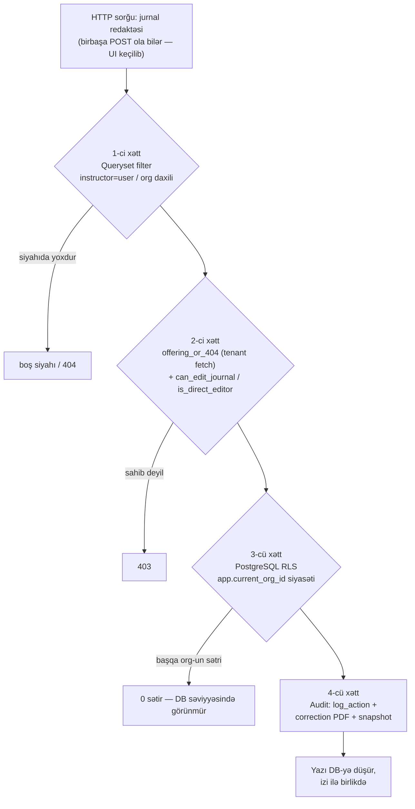

**Xətt 1 — queryset filter (siyahı səviyyəsi).** `apps/registrar/page_contexts.py`,
`journal_list_context` — müəllim yalnız öz offering-lərini, korrektor org daxilini alır;
filtr serverdədir, template-də deyil:

```python
can_correct = bool(request is not None and corrections_service.can_correct_journal(request))
organization = getattr(request, "organization", None) if request is not None else None
base_qs = CourseOffering.objects.filter(is_active=True)
if can_correct and organization is not None:
    base_qs = base_qs.filter(organization=organization)   # korrektor: org daxili hamısı
else:
    base_qs = base_qs.filter(instructor=user)             # müəllim: YALNIZ özününkü
```
**VAR.** Yeni modullarda qarşılığı: workload siyahıları `user_scope_subtree_q(user, org,
path_field="faculty__path", id_field="faculty__id")` ilə daraldılır (dekan dilim siyahısı),
`row__task__chair` filtri ilə (kafedra bölgüsü) — funksiya `organizations.scoping`-də hazırdır.

**Xətt 2 — obyekt yoxlaması (tək obyekt səviyyəsi).** `apps/registrar/journal_access.py`:

```python
def offering_or_404(request, offering_id, *, select_related=True):
    queryset = CourseOffering.objects.all()
    organization = get_request_organization(request)
    if organization is not None:
        queryset = queryset.filter(organization=organization)   # tenant sərhədi tətbiq qatında
    return get_object_or_404(queryset, pk=offering_id)

def can_edit_journal(user, offering) -> bool:
    if getattr(user, "is_superuser", False) or getattr(user, "is_ikt_rehber", False):
        return True
    if offering.instructor_id and offering.instructor_id == user.id:
        return True
    return offering.organization.owner_id == user.id
```

İki ayrı funksiya olması təsadüf deyil: `can_edit_journal` = giriş + korrektor,
`is_direct_editor` = birbaşa (audit-siz) redaktə — İKT ikinciyə **daxil deyil**, normal
görünüşdə read-only-dir, dəyişikliyi yalnız sənədli correction rejimində edir. **VAR.**
Docstring-in öz qeydi kritikdir: bu yoxlama əvvəllər `get_object_or_404(CourseOffering, pk=...)`
idi — tenant sərhədi tamam RLS-ə qalırdı; RLS non-Postgres backend-də no-op, `rolbypassrls`
rolunda keçiddir. Yəni **xətt 2 məhz xətt 3-ün sıradan çıxma ssenarisi üçün** əlavə olunub.

**Xətt 3 — PostgreSQL RLS (DB səviyyəsi).** `apps/organizations/migrations/0004_expand_rls_scope.py`
şablonu (100 cədvəldə tətbiq olunub):

```sql
ALTER TABLE registrar_courseoffering ENABLE ROW LEVEL SECURITY;
ALTER TABLE registrar_courseoffering FORCE ROW LEVEL SECURITY;
CREATE POLICY rls_tenant_isolation ON registrar_courseoffering
    USING (
        current_setting('app.bypass_rls', true) = 'on'
        OR organization_id::text = NULLIF(current_setting('app.current_org_id', true), '')
    )
    WITH CHECK ( /* eyni şərt */ );
```

Tətbiq kodu tamam səhv olsa belə, başqa tenantın sətri bağlantı sessiyasında **mövcud deyil**.
**VAR.** `apps/workload` cədvəlləri eyni `_direct_org_policy` helper-i ilə F0 fazasında RLS
alır (spec §5). **Qərar:** unit-səviyyə (fakültə subtree) dilimləmə RLS-ə **salınmır** — RLS
org-sərhəd xətti olaraq qalır, subtree isə tətbiq qatında (`scoping.py`) qalır. Səbəb: path-əsaslı
subtree şərti hər sorğuda policy subquery-si deməkdir, halbuki `app.current_org_id` sabit
müqayisədir; iki fərqli invariantı bir mexanizmə yükləmək həm performansı, həm auditlənə bilənliyi korlayır.

**Xətt 4 — audit (post-factum xətt).** Hər state-machine keçidi `core.audit.log_action`-a
yazılır; kilid sonrası dəyişikliklər snapshot-lu correction/amendment obyektidir (köhnə-yeni
dəyər JSON, səbəb enum + qeyd, opsional PDF). **VAR** (jurnal), **YOXDUR→spec hazır** (workload
amendment). Əməliyyat qeydi: audit JSONField-lərinə lazy translation proxy yazmaq olmaz —
INSERT xətası swallowed except-də `@transaction.atomic`-i səssiz geri qaytarır (`str()` +
savepoint qaydası artıq layihə təcrübəsindədir); yeni amendment kodu bu qaydaya CI test ilə bağlanmalıdır.

### §21.3 Müəllim predikatının kanonik forması (yeni modullar üçün şablon)

Hər yeni «öz obyektim» səthi bu dördlüyü təkrarlamalıdır:

| Xətt | Jurnal (mövcud) | Dərs yükü «Dərs yüküm» (yeni) |
|---|---|---|
| 1. Queryset | `filter(instructor=user)` | `TeacherAssignment.objects.filter(teacher=user, row__task__organization=org)` |
| 2. Obyekt | `offering_or_404` + `can_edit_journal` | `assignment_or_404(request, id)` (org filter) + `assignment.teacher_id == user.id` |
| 3. RLS | registrar cədvəlləri | workload cədvəlləri (F0 migrasiyası) |
| 4. Audit | corrections | müəllim üçün yazma yoxdur → audit yalnız baxış-export hadisələri (opsional) |

`period == active` predikatı: müəllim keçmiş illərin yükünü/jurnalını **görür** (arxiv,
read-only), amma yazma predikatına `period.is_past == False` + pəncərə şərtləri daxildir —
görmə və yazma predikatları ayrı saxlanılır, «keçmişi gizlət» səhv həll olardı (transkript və
plan-fakt hesabatları keçmişə baxır).

---

### G.4 Vacib qərar: OrgUnit-scoped membership — mövcud modelin genişlənməsi

**Təməl qərar: yeni scope modeli YARADILMIR.** `Membership.scope_unit` (OrgUnit FK) + materialized
path subtree artıq DEAN → fakültə, DEPARTMENT_HEAD → kafedra, PROGRAM_COORDINATOR → ixtisas,
STUDENT → qrup xəritəsini verir; `unique(user, org, role, scope_unit)` sayəsində iki fakültəyə
baxan prorektor-müavin sadəcə iki membership sətridir. **VAR.** Genişlənmə üç nöqtədədir:

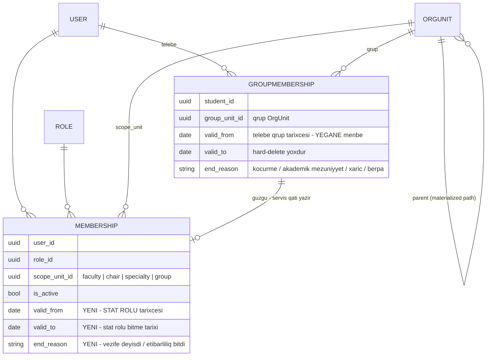

1. **Tarixçəli üzvlük — iki fərqli obyekt, iki fərqli sahib (qarışdırılmır).**

   **(a) Tələbənin qrup üzvlüyünün tarixçəsi `GroupMembership`-dədir** (a_process §A.4.3,
   t_decisions Y.4). Qrup üzvlüyü hard-delete edilmir — akademik məzuniyyətdən qayıdan tələbə
   köhnə qrupu irəli getdiyi üçün bir aşağı ilin qrupuna düşür və köhnə üzvlük tarixi
   transkript/jurnal arxivi üçün lazımdır (TAM_AXIN §12.6). `GroupMembership` bu faktın
   **yeganə yazı mənbəyidir**; `Membership.scope_unit` və `StudentAcademicRecord.group` ondan
   **törəyən güzgülərdir** — birbaşa redaktə qadağandır, güzgü yalnız servis qatından, tək
   tranzaksiyada yenilənir. Yəni tələbənin «hansı qrupdadır» sualına icazə qatı `Membership`-dən
   cavab verə bilər (sürət üçün), amma **həqiqət mənbəyi** `GroupMembership`-dir.

   **(b) `Membership.valid_from` / `valid_to` / `end_reason` — ştat rollarının tarixçəsi.**
   Sual: «2025/2026-da kafedra müdiri kim idi?» (yük sənədinin audit sualı), «dekan səlahiyyəti
   nə vaxt bitdi?». Bu sahələr **tələbə qrup dəyişikliyinin mənbəyi deyil** — tələbə üçün onlar
   yalnız güzgünün etibarlılıq pəncərəsini əks etdirir. `is_active` sürətli filtr kimi qalır,
   tarix cütü isə ştat rolu üçün həqiqət mənbəyidir. **YOXDUR → migrasiya.** Aktiv-üzvlük
   resolyusiyası (middleware) dəyişmir: `is_active=True` sətirlər onsuz da yeganə cari qatdır.

2. **Auditor üçün permission-əsaslı org-wide READ scope.** Mövcud `_resolve_unit_scope`
   ORGANIZATION-scope rolu yalnız `level ≥ ORG_WIDE_MIN_LEVEL (90)` olduqda org-wide edir —
   auditor (35) bu qaydada **boş panel** görərdi. **Qərar:** scoping-ə bir istisna əlavə olunur —
   ORGANIZATION-scope rol `audit.view_all` icazəsi daşıyırsa `UnitScope("org")` alır; yazma
   səthləri onsuz da permission qapılarından keçmir (auditorun heç bir C/U/D icazəsi yoxdur),
   ona görə bu istisna yalnız oxu genişliyi verir. **YOXDUR → kiçik scoping dəyişikliyi + testlər.**
3. **`grant:` delegasiyasının əməliyyata bağlanması.** Dekan → dekanlıq əməkdaşı delegasiyası
   (`grant:workload.approve` və s.) mövcud prefiks mexanizmi ilə işləyir, amma delegasiya aktı
   hazırda audit hadisəsi deyil. **Qərar:** rol-icazə dəyişiklikləri (`role.assign`, grant
   əlavəsi) `log_action`-a məcburi yazılır — icazə sisteminin özü də 4-cü xəttin (audit) obyektidir.
   **QİSMƏN VAR.**

**RLS ilə münasibət (təkrar, çünki ən çox soruşulan qərardır):** scope subtree filtri heç vaxt
RLS siyasətinə köçürülmür; RLS = tenant sərhədi (sabit, ucuz, 100 cədvəldə eyni), scope =
tətbiq-qatı dilimləmə (dəyişkən, rol-asılı, per-request cache-li). Dörd xəttin hərəsi öz işini görür.

### G.5 İcra planı (bu bölmədən çıxan konkret işlər)

| # | İş | Asılılıq | Status |
|---|---|---|---|
| 1 | `registrar_office` (65), `dean_office_staff` (55), `auditor` (35) rolları — DEFAULT_ROLES + seed | — | YOXDUR |
| 2 | `teaching_office_head/staff` rolları + `ADMIN_ALIAS_EXEMPT_ROLE_NAMES`-ə əlavə (bir PR-da) | workload F0 | YOXDUR |
| 3 | `workload.*`, `curriculum.*`, `annual_plan.*`, `contingent.*`, **`admissions.*`** permission ailələri (ad konvensiyası: qəbul pipeline-ı `admissions.*`, əmr dövriyyəsi `contingent.*` — tək halda `admission.*` işlədilmir) | 1–2 | YOXDUR |
| 4 | Scoping: `audit.view_all` → org-wide READ istisnası + testlər | 1 | YOXDUR |
| 5 | `Membership.valid_from/valid_to/end_reason` migrasiyası — **ştat rolu tarixçəsi** (tələbə qrup tarixçəsi `GroupMembership`-də qalır; `Membership.scope_unit` güzgüsünə birbaşa yazma qadağası + servis qatı invariant testi) | — | YOXDUR |
| 6 | `_can_manage_registrar` alias bug-ının düzəlişi (chair_head/vice_dean 404 görür) | 1 | YOXDUR (sənədləşib) |
| 7 | Level≥80 ∧ exempt-siyahıda-deyil CI xəbərdarlığı (`checks.py`) | 2 | YOXDUR |
| 8 | §13 matrisinin icra testi: hər (rol × əməliyyat × obyekt qrupu) xanası üçün parametrik permission-matrix pytest dəsti — matris sənəddə yox, testdə yaşayır | 1–4 | YOXDUR |
| 9 | Jurnal siyahısında dekan/kafedra subtree-viewer rejimi (read-only) | 4 | QİSMƏN VAR |
| 10 | Rol-icazə dəyişikliklərinin məcburi audit-i (`role.assign`, grant) | — | QİSMƏN VAR |

**Uğur meyarı:** §13 matrisindəki hər boş xana üçün test «403/boş nəticə» gözləyir, hər dolu
xana üçün «icazə + düzgün scope dilimi» gözləyir — matris dəyişəndə əvvəlcə test dəyişməlidir.


---

# IV HİSSƏ — AKADEMİK ƏMƏLİYYAT

## H. Akademik yük modeli (Academic Workload Model)

Bu bölmə `docs/workload/DERS_YUKU_SPEC.md` və `docs/workload/TEDRIS_PLANI_SPEC.md` sənədlərinin
konsolidasiyasıdır — yeni model uydurulmur, mövcud dizayn analiz sənədinin dilinə gətirilir və
icra-hazır qərarlara bağlanır. Modulun yeri zəncirdə sabitdir:

**Tədris planı (norma) → İllik işçi tədris planı (tələbə sayı) → Kafedra tapşırığı (saat cəmiləri)
→ Müəllim təyinatı → CourseOffering → Elektron jurnal.**

Legacy referans (myedudb) bu zəncirin **heç bir halqasını** modelləşdirməyib: jurnal sillabus
sətrindən yaranır, əlaqələr `journals.students_id='["9979"]'` kimi mətn sütunlarındadır, 81 cədvəldə
0 foreign key var. EMSArena-nın fərqi məhz budur — hər halqa FK ilə bağlı, hər keçid state machine
və audit ilə qorunan ayrıca entity-dir.

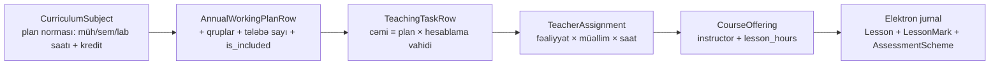

İcra vəziyyəti (yekun xəritə bölmə sonunda, §H.12):

| Halqa | Model | Vəziyyət |
|---|---|---|
| Plan norması | `CurriculumSubject` (saat sahələri ilə) | **QİSMƏN VAR** — model var, saat/kredit/kafedra sahələri YOXDUR (T0 fazası) |
| İllik işçi plan | `AnnualWorkingPlan(Row)` | **YOXDUR** (spec hazır, T3) |
| Kafedra tapşırığı | `TeachingTask(Row)` + `TaskFacultySlice` | **YOXDUR** (spec hazır, F0–F2) |
| Müəllim təyinatı | `TeacherAssignment` + `TeacherWorkloadProfile` | **YOXDUR** (spec hazır, F3) |
| Offering + jurnal | `CourseOffering` + `AssessmentScheme` + `Lesson/LessonMark` | **VAR** — zəncirin son halqası tam işləkdir |

---

### H.1 Modulun əhatəsi və aktyorları

**Əhatə:** zəncirin **orta üç halqası** — illik işçi tədris planı, kafedra tapşırığı (fənn yükü)
və müəllim təyinatı (müəllim yükü) — üstəgəl onların `CourseOffering`-ə avto-sinxronu (§H.12) və
müəllimin fərdi iş planı (§H.13). Əhatədən **kənarda**: tədris planının özünün versiyalaşması
(e_curriculum §5–6), jurnalın daxili qiymətləndirmə modeli (i_journal §J) və cədvəl tərtibi
(`ScheduleSlot` — yükdən **sonrakı** halqa, §H.11.2).

| Aktyor | Rol (səviyyə) | Modulda məsuliyyəti |
|---|---|---|
| Tədris şöbəsi rəisi/əməkdaşı | `teaching_office_head` / `teaching_office_staff` | illik işçi plan + tapşırıq generasiyası, göndərmə, «marşrutlanmamış sətirlər» növbəsi |
| Dekan / dekanlıq | `dean` (80) | fakültə diliminin təsdiqi və ya sətir-səviyyə qaytarması |
| Proqram koordinatoru | level 45, ixtisas scope | öz ixtisasının sətirlərinə viza (`reviewed` / `flagged`) |
| Kafedra müdiri | `chair_head` | təsdiqlənmiş tapşırığın müəllimlərə bölgüsü, bölgü təsdiqi, fərdi iş planlarının təsdiqi |
| Prorektor | `vice_rector` | opsional yekun təsdiq mərhələsi (`pending_final_approval`) |
| Müəllim | `teacher` / `assistant` | öz yükünün görünüşü, fərdi iş planı (§H.13), jurnal icrası |
| İKT Rəhbəri | `ikt_rehber` (88) | yalnız **audited correction** yolu — birbaşa redaktə hüququ yoxdur |

### H.2 Giriş datası və mənbələr

| Giriş | Mənbə | Vəziyyət |
|---|---|---|
| Fənn norması (müh/sem/lab saatı, kredit) | `CurriculumSubject` (təsdiqlənmiş plan versiyası) | **QİSMƏN VAR** — saat/kredit sahələri YOXDUR (T0) |
| Qrup tərkibi və tələbə sayı | `OrgUnit(unit_type=group)` + kontingent | **VAR** |
| Dövr (semestr) | `AcademicPeriod` | **VAR** |
| Kafedra/fakültə iyerarxiyası və scope | `OrgUnit.path` + `Membership.scope_unit` | **VAR** |
| Müəllim ştatı və illik norma | `TeacherWorkloadProfile` | **YOXDUR** (F0/F3) |
| Norma cədvəlləri (KQ-12, NK 215, TN 59) | seed data | **YOXDUR** (F2) |

Bölmənin empirik dayağı iki real sənəddir: 2026/2027 kafedra tapşırığı Excel-inin **855 sətri**
(düstur yoxlaması — §H.7.2) və **421 fənlik** plan faylı (kredit dəyişkənliyi — §H.7.1).

### H.3 Termin lüğəti

| Termin | Mənası | Model qarşılığı |
|---|---|---|
| **Plan (norma)** | ixtisas üzrə fənnin saat/kredit norması | `CurriculumSubject` |
| **İllik işçi tədris planı** | normanın konkret ilə, qruplara və tələbə sayına proyeksiyası | `AnnualWorkingPlan(Row)` |
| **Tapşırıq (fənn yükü)** | kafedraya düşən saat öhdəliyi — müəllimsiz | `TeachingTask(Row)` |
| **Bölgü (müəllim yükü)** | öhdəliyin konkret insanlara bölünməsi | `TeacherAssignment` |
| **Hesablama vahidi** | saatın vurulduğu vahid: axın / qrup / yarımqrup / fərdi | `union_count`, `subgroup_count` |
| **Dilim** | tapşırığın bir fakültəyə aid hissəsi — təsdiq vahidi | `TaskFacultySlice` |
| **Düzəliş (amendment)** | təsdiqdən sonrakı sənədli dəyişiklik | `WorkloadAmendment` |

### H.4 Mövcud vəziyyət (bir abzasda)

EMSArena-da zəncirin **yalnız son halqası** işləkdir: `CourseOffering` → `AssessmentScheme` →
`Lesson/LessonMark` (2 saatlıq redaktə pəncərəsi, PG trigger kilidləri, İKT audited correction)
— **VAR**. Ondan əvvəlki hər şey (illik işçi plan, tapşırıq, dilim, təyinat, norma validatorları)
**YOXDUR**; `Curriculum`/`CurriculumSubject` isə **QİSMƏN VAR** — saat, kredit və kafedra sahələri
çatmır. Praktikada offering-lər əl ilə və ya `get_or_create_offering` ilə yaranır; bu da
`lesson_hours = 0` bug-ının mənbəyidir (§H.12.1). Tam icra xəritəsi §H.12.3-dədir.

### H.5 Normativ baza

| Sənəd | Modulda nəyi bağlayır |
|---|---|
| **NK 348** (b. 3.2.2 / 3.2.4 / 3.2.12–13) | kredit–saat ekvivalenti, kredit yekunları, illik işçi plan ↔ tapşırıq marşrutu |
| **NK 75** (§8.8) | qrup sıxlığı (15–30), birləşmə şərtləri, laboratoriyanın yarımqrupa bölünməsi |
| **KQ-12 (2024)** | hesablama vahidi, auditoriyadankənar norma cədvəli, maks. 1,5 ştat + ≤250 saat, fərdi iş planı |
| **NK 215** | 1 ştat ≥500 saat, auditoriya payı ≥60% |
| **TN 59** | inzibati heyət və kənar mütəxəssis limitləri |

### H.6 Zəncirdəki yer

Modul **yuxarıdan** tədris planından (e_curriculum §5–6) qidalanır, **aşağıda** elektron jurnalı
(i_journal §I–J) doğurur, **yanda** RBAC (g_rbac §G) və audit (k_audit §L) qatlarına söykənir.
Zəncirin tarixi qırılma nöqtəsi illik işçi plan halqasının olmamasıdır — məhz bu itmiş həlqə
üzündən tapşırıq Excel-də qurulur və jurnalla heç bir FK əlaqəsi qalmır.

---

### H.7 İxtisas yükünün düsturu — hesablama vahidi modeli

#### H.7.1 Normativ sabitlər (dəyişməz baza)

| Göstərici | Dəyər | Mənbə |
|---|---|---|
| 1 AKTS krediti | **30 saat** (auditoriya + sərbəst iş) | NK 348 b. 3.2.2 |
| Nəzəri təlim (dərs) həftəsi | **15 həftə/semestr** (əyani; bayramla 14-ə enə bilər) | NK 348 + real planlar |
| Semestrlik auditoriya saatı | həftəlik yük × 15 | törəmə |
| Qrup sıxlığı | **15–30 tələbə**; <30 olduqda qrup bölünmür | NK 75 §8.8 |
| Bakalavriat kredit yekunu | **240–300** (4–5 il), magistratura 120 | NK 348 b. 3.2.4 |

İki qayda hardcode edilmir, çünki normativdə sabit deyil: **(a)** auditoriya/sərbəst iş nisbəti
(köhnə 1:1 qaydası ləğv edilib; universitet özü təyin edir — QKU 25%, AzTU 31%, NMİ ~38%) və
**(b)** effektiv həftə sayı (15→14 bayram override-ı). Hər ikisi tenant-parametr olmalıdır —
mövcud «akademik struktura universitetdən-universitetə dəyişir» prinsipinin davamı.
**Kredit `Subject.ects`-də deyil, `CurriculumSubject.credits`-də saxlanmalıdır** — eyni fənn
ixtisasa görə fərqli kredit daşıyır (real Excel-də 421 fənndən 35-i belədir); `Subject.ects`
yalnız kataloq default-u kimi qalır. *(Mövcud EMSArena-da: `Subject.ects` VAR, plan-sətri
krediti YOXDUR — T0 miqrasiyası.)*

#### H.7.2 Modulun riyazi özəyi: hesablama vahidi (KQ-12)

Yük sətri «fənn × qrup» üzərində qurulmamalıdır — **«fənn × dərs növü × hesablama vahidi»**
üzərində qurulmalıdır, burada vahid = `axın (qrup birləşməsi) | qrup | yarımqrup | fərdi`.
Səbəb: KQ-12 (2024) norma cədvəlinin 1-ci sətri saatı məhz vahidə bağlayır — «1 akademik saat
üçün 1 qrupa (qrup birləşməsinə) 1 saat». Praktik nəticələri:

- **Axın = 1 vahid** → 4 qrupu bir mühazirəyə yığmaq müəllim yükünü 4 dəfə azaldır.
- **Yarımqrup = ayrıca vahid** → laboratoriyanı 2 yarımqrupa bölmək yükü 2 dəfə artırır.

Düstur (real 2026/2027 tapşırıq Excel-inin 855 sətri üzərində yoxlanılıb):

| Fəaliyyət | Düstur | Excel uyğunluğu | Normativ dayaq |
|---|---|---|---|
| Mühazirə cəmi | plan × **birləşmə sayı** | 770/770 = **100%** | KQ-12: birləşmə = 1 vahid |
| Seminar cəmi | plan × **qrup/yarımqrup sayı** | 724/730 = 99,2% | KQ-12: yarımqrup = ayrı vahid |
| Laboratoriya cəmi | plan × **yarımqrup sayı** | 74/75 = 98,7% | NK 75: lab yarımqrupa bölünə bilər |
| Sətir CƏMİ | cəmi sütunlarının cəmi | 855/855 = **100%** | — |

İki müstəqil mənbə (qanun + real sənəd) eyni düsturu verir — model bu düsturla qurulmalıdır.
`TeachingTaskRow` sahələri bunu 1:1 daşıyır: `lecture_plan/lecture_total`, `seminar_plan/seminar_total`,
`lab_plan/lab_total`, `union_count`, `subgroup_count`, `total_hours`. *(YOXDUR — F0.)*

#### H.7.3 Törətmə alqoritmi: plan → illik işçi plan → tapşırıq sətri

```
üçün hər AnnualWorkingPlanRow (is_included=True):
    # 1) Mühazirə axını — İNSAN QƏRARI, sistem təklif edir
    axınlar = birləşdir(qruplar)              # default: eyni ixtisas + eyni dil sektoru → 1 axın
    # 2) Yarımqrup — İNSAN QƏRARI, sistem təklif edir
    yarımqruplar = Σ ceil(qrup.tələbə_sayı / 40)

    mühazirə_cəmi = cs.lecture_hours × len(axınlar)
    seminar_cəmi  = cs.seminar_hours × yarımqruplar
    lab_cəmi      = cs.lab_hours × yarımqruplar
    məsləhət      = norma(cs)                  # org-konfiqurasiyalı (KQ-12 seed)
    imtahan       = norma(cs, tələbə_sayı)
    cəmi          = Σ bütün cəmi sütunları
```

Konkret qərarlar:

1. **Yarımqrup həddi = 40 (təklif, override edilə bilər).** Ali təhsildə mərkəzi rəqəm yoxdur;
   real Excel-in statistik sübutu (G=1 sətirlərdə 2–46 tələbə, G=2-də 39–105, örtüşmə zonası
   39–46) praktik həddi ~40 göstərir. Sistem `ceil(tələbə/40)` **təklif etməlidir**, qərar
   insanındır — eyni 40 nəfərlik qrup bir fənndə bölünüb, digərində bölünməyib.
2. **Birləşmənin iki məcburi şərti avtomatik yoxlanmalıdır** (NK 75 §8.8 + KQ-12 qeyd 1):
   fənn üzrə kredit miqdarı eyni + proqram məzmunu eyni. Kredit fərqli qrupları bir axına
   yığmaq təklifi sistem tərəfindən verilməməlidir.
3. **Birləşmə/bölünmə qərarı auditlənməlidir** — KQ-12 qeyd 1-ə görə bu, ali idarəetmə orqanının
   (Elmi Şura) qərarıdır; kim/nə vaxt/hansı əsasla dəyişdirdiyi saxlanmalıdır. Mövcud
   `core.audit.log_action` infrastrukturu bunu birbaşa daşıyır. *(Audit infrastrukturu VAR,
   workload hadisələri YOXDUR.)*
4. **Auditoriyadankənar yük (məsləhət, imtahan qəbulu, buraxılış işi/dissertasiya rəhbərliyi,
   təcrübə) tələbə sayından asılıdır, cədvəldən yox** — ayrıca sütunlar + KQ-12 norma cədvəli
   hazır seed data kimi (doktorant 80 saat/il, buraxılış işi 20–30 saat/tələbə və s.).

⚠ **Proses tənqidi — «tələbə sayı × fənn × qrup × saat» düsturu natamamdır.** İstifadəçi
təsvirindəki bu forma birləşmə/yarımqrup effektini görmür: tələbə sayı yükə **birbaşa vurulmur**,
yalnız **vahid sayını** (yarımqrup ədədini, axın tərkibini) müəyyən edir. 120 tələbəlik 4 qrupun
mühazirəsi 1 axında = 1× plan saatı; eyni 4 qrupun laboratoriyası 6 yarımqrupda = 6× plan saatı.
Düstur «plan saatı × hesablama vahidi sayı»dır; tələbə sayı yalnız vahid sayının girişidir.
Bu fərqi modeldə itirmək legacy sistemin əsas səhvlərindən biridir.

---

### H.8 Təsdiq dövriyyəsi — TeachingTask state machine + fakültə dilimləri

#### H.8.1 İstifadəçi statuslarının kanonik maşına xəritələnməsi

⚠ **Proses tənqidi — iki düzəliş.** (a) İstifadəçi prompt-undakı «Dekanlıq→Tədris Şöbəsi approval
workflow» istiqaməti kafedra tapşırığı üçün **tərsinədir**: normativ axında (NK 348 b. 3.2.12/13)
dekanlıq tədris şöbəsinə **illik işçi tədris planını** göndərir; **kafedra tapşırığını** isə tədris
şöbəsi generasiya edib **dekanlıqlara təsdiqə göndərir**. İki fərqli sənəd, iki əks istiqamət —
qarışdırılsa, authority conflict yaranır (dekan öz göndərdiyi sənədi özü təsdiqləmiş olur).
(b) Təklif olunan `UNDER_REVIEW` ayrıca sənəd-statusu **lazımsızdır** — baxış sənəd səviyyəsində
yox, dilim səviyyəsində gedir (`TaskFacultySlice.status=pending` elə «under review» deməkdir);
sənədə paralel status əlavə etmək iki mənbəli həqiqət yaradır. `LOCKED` isə ayrıca status yox,
`distributed` vəziyyətinin rejimidir: birbaşa redaktə bağlıdır, dəyişiklik yalnız `WorkloadAmendment`
(sənədli düzəliş — səbəb + snapshot + **PDF məcburi**) ilə mümkündür — mövcud jurnal-kilidi +
audited correction presedentinin eynisi.

Xəritə:

| İstifadəçi statusu | Kanonik qarşılıq | Qeyd |
|---|---|---|
| DRAFT | `draft` | tədris şöbəsi yaradır / rollover-dən klonlayır |
| SUBMITTED | `submitted` | validasiya keçib, dilimlər yaradıldı |
| UNDER_REVIEW | `TaskFacultySlice.status=pending` | sənəd statusu deyil, dilim statusu |
| RETURNED | `returned` (+ sətir-səviyyə işarə) | bütöv sənəd yox, konkret sətirlər qaytarılır |
| APPROVED | `approved` (opsional `pending_final_approval` aralığı ilə) | bütün dilimlər təsdiqlənəndə avtomatik |
| **REJECTED** | **`cancelled` (terminal)** | sənədin ləğvi — `returned`-dan fərqli, yeni revision yaranmır |
| LOCKED | `distributed` + amendment-only rejim (**PDF məcburi**) | ayrıca status deyil |

**`returned` ≠ `cancelled` — dörd bənd.**

1. **`returned` = düzəliş dövrü.** Sənəd yaşayır, `revision++` olur, yalnız qaytarılan sətirlər
   düzəldilib yenidən göndərilir; dilimlər yeni revision üçün təzələnir.
2. **`cancelled` = sənədin ləğvi (terminal).** Yeni revision yaradıla bilmir, rollover klonuna
   düşmür, hesabatlarda «ləğv edilmiş» kimi ayrıca sayılır — davamı yoxdur.
3. **Kim ləğv edir:** `teaching_office_head` (öz göndərdiyi sənədi geri çəkir) və ya
   `dean` / `vice_rector` — dilim səviyyəsində deyil, **bütöv sənəd** üçün; hansı rolun bu
   hüququ daşıdığı org-konfiqurasiyalıdır.
4. **Şərtlər:** ləğv yalnız `draft` / `submitted` / `returned` statuslarından mümkündür; səbəb +
   əsas sənəd (protokol/əmr) məcburidir; artıq `distributed` olan tapşırıq **ləğv edilmir** —
   orada yeganə yol `WorkloadAmendment`-dir (§H.12.1).

#### H.8.2 Fakültə dilimləri (`TaskFacultySlice`) — əsas dizayn qərarı

Bir kafedranın tapşırığında başqa fakültələrin ixtisasları olur (**xidməti tədris**: Proqramlaşdırma
kafedrası psixologiya/filologiya qruplarına dərs deyir). Ona görə təsdiq **sənəd-səviyyə yox,
dilim-səviyyədə olmalıdır**:

1. Hər `TeachingTaskRow` bir ixtisasa → ixtisas `OrgUnit.path` ilə bir fakültəyə aiddir
   (`faculty` sahəsi denormalizə olunur — dilim marşrutu üçün).
2. `submitted` anında sistem toxunulan hər fakültə üçün bir `TaskFacultySlice(pending)` yaradır;
   unikal açar `(task, faculty, task.revision)` — hər qaytarma-göndərmə dövründə təzələnir.
3. **Proqram koordinatoru** (level 45, ixtisas scope) öz ixtisasının sətirlərinə viza verir
   (`reviewed`/`flagged` + şərh) — məcburiliyi org-konfiqurasiyalıdır.
4. **Dekan** (level 80, fakültə scope) dilimi bütöv təsdiqləyir və ya **sətir seçib qaytarır**
   (səbəb məcburi) — tədris şöbəsi yalnız qaytarılan sətirləri düzəldib yenidən göndərir
   (`revision++`).
5. Bütün dilimlər `approved` → sənəd avtomatik `approved` (prorektor mərhələsi aktivdirsə arada
   `pending_final_approval`) → kafedra müdirinə düşür.

Scope enforcement mövcud infrastrukturladır: `Membership.scope_unit` + `organizations.scoping`
(`user_scope_subtree_q`) + RLS — dekan yalnız öz fakültəsinin dilimini görür. *(Scoping/RLS
mexanizmi VAR; slice modeli və workload RLS siyasəti YOXDUR — F0/F2.)*

#### H.8.3 Göndərmə-qabağı və təsdiq-qabağı yoxlama çeklisti

Validasiya davranışı qəti qaydadır: **normativ limitlər bloklamır, xəbərdarlıq edir** (sarı/qırmızı
nişan + kənarlaşma hesabatı) — real həyatda istisnalar rəhbər qərarı ilə olur, sistemin işi izi
saxlamaqdır. Bloklayan yalnız struktur xətalarıdır (mənfi saat, sətirsiz sənəd, fakültəsi
tapılmayan ixtisas).

| # | Yoxlama | Kim görür | Davranış |
|---|---|---|---|
| 1 | `cəmi = plan × vahid sayı` düstur uyğunluğu | tədris şöbəsi (göndərmədən əvvəl) | xəbərdarlıq (real fayllarda kənarlaşmalar var) |
| 2 | `total_hours` = sətir cəmilərinin cəmi | tədris şöbəsi | xəbərdarlıq |
| 3 | **Plan ↔ tapşırıq müqayisəsi** (`CurriculumSubject` saatları vs sətir; fərq sütunu) | koordinator/dekan | uyğunsuz sətir sarı; irad avtomatik fərqə bağlanır |
| 4 | Kredit balansı (təkrarsız fənn üzrə; birləşmədə kredit eyniliyi) | tədris şöbəsi + dekan | xəbərdarlıq |
| 5 | Qrup sayı/tərkibi (qrup 15–30; qrup–ixtisas uyğunluğu; dil sektoru) | tədris şöbəsi | xəbərdarlıq |
| 6 | Müəllim ehtiyacı proyeksiyası (kafedra PMH tutumu vs tapşırıq cəmi; vakant fond proqnozu) | dekan + kafedra müdiri | informativ stat-kart |
| 7 | Education form / degree_level doluluğu | tədris şöbəsi | xəbərdarlıq |
| 8 | Fakültəyə marşrutlana bilməyən sətir (specialty boş və text-fallback) | tədris şöbəsi | **bloklayır** (dilim yaradıla bilməz) |

3-cü sətir kritikdir: plan↔tapşırıq müqayisə paneli olmadan koordinator/dekan ekranı formallıqdan
ibarətdir — müqayisə bazası olmayan təsdiq «gözüyumulu imza»dır. Buna görə tədris planı fazaları
(T0–T2) workload F1-dən **əvvəl** gəlməlidir. *(Müqayisə paneli YOXDUR — T4.)*

---

### H.9 Kafedra marşrutu — fənn → tədris edən kafedra

⚠ **Proses tənqidi — marşrut açarı fənn kataloqunda deyil, plan sətrindədir.** Marşrutlaşdırma
açarını **yalnız** fənn kataloquna (Subject) qoymaq xidməti tədrisdə sınır: eyni
«Proqramlaşdırmanın əsasları» fənni bir ixtisasda İKT kafedrası, digərində riyaziyyat kafedrası
tərəfindən tədris oluna bilər, üstəlik dekanlıq konkret ildə kafedranı dəyişə bilər. Ona görə
kanonik açar **plan sətri səviyyəsindədir**: `CurriculumSubject.teaching_chair`
(FK OrgUnit, unit_type=chair), illik icra proyeksiyasında isə `AnnualWorkingPlanRow.teaching_chair`
(plandan kopyalanır, dekanlıq override edə bilər).

`Subject.owner_department` **mövcud olmalıdır** — fənnin *akademik sahibi* kimi (sillabus, sual
bankı moderasiyası, akkreditasiya hesabatı marşrutu — e_curriculum §5.4), **lakin o marşrut açarı
deyil**: marşrut açarı `CurriculumSubject.teaching_chair`, illik override isə
`AnnualWorkingPlanRow.teaching_chair`-dir. `owner_department` marşrutda yalnız plan sətri boş
olanda avtodoldurma mənbəyi kimi çıxış edir.

Marşrut alqoritmi (tapşırıq generasiyasında hər sətir üçün):

```
teaching_chair = AnnualWorkingPlanRow.teaching_chair      # 1) illik plan override-ı
             or CurriculumSubject.teaching_chair          # 2) tədris planı norması
             or Subject.owner_department                 # 3) kataloq default-u (marşrut qərarı deyil)
             or specialty.parent_chair                    # 4) OrgUnit iyerarxiyasından (ixtisasın kafedrası)
```

**Fallback tapılmayanda proses:** sətir heç bir kafedraya marşrutlana bilmirsə, o, tapşırığa
düşmür — tədris şöbəsinin **«Marşrutlanmamış sətirlər» növbəsinə** düşür (balans panelində
«Tədris kafedrası boş — N sətir ⚠»). Tədris şöbəsi əl ilə kafedra təyin edir; təyinat plana geri
yazılır ki, gələn il təkrarlanmasın. Bu, T3 balans panelinin normativ tələbidir, rahatlıq deyil —
kafedrasız sətir heç kimin yükü deyil və itir (legacy sistemdə bu, «sillabusda var, jurnalda yox»
sinifli itkilərin mənbəyi idi).

*(Mövcud EMSArena-da: OrgUnit iyerarxiyası faculty→chair→specialty→group VAR;
`teaching_chair` sahəsi YOXDUR — T0.)*

---

### H.10 Müəllim təyinatı — «fənn ≠ müəllim yükü» ayrımı

#### H.10.1 Niyə `TeacherAssignment` ayrıca entity-dir

Zəncir belədir: **Teacher ↔ Chair (Membership) · Subject → CurriculumSubject → TeachingTaskRow
(fənn yükü) · TeacherAssignment (müəllim yükü) → CourseOffering → Group × AcademicPeriod →
Jurnal.** Burada iki fərqli anlayış qəsdən ayrılır:

- **Fənn yükü** (`TeachingTaskRow`) — kafedraya düşən saat öhdəliyi: fənn × semestr × qruplar ×
  fəaliyyət cəmiləri. Sahibi kafedradır, müəllimi yoxdur.
- **Müəllim yükü** (`TeacherAssignment`) — həmin öhdəliyin bir hissəsinin bir insana bölünməsi:
  `row × activity × teacher × hours`.

Bir sətir bir müəllimə bərabər deyil, ona görə 1:1 sahə (`row.teacher`) qurulmamalıdır:

1. **Fəaliyyət növü üzrə ayrı bölgü** — mühazirəni professor, seminarları iki müəllim, lab-ı
   yarımqrup-yarımqrup assistentlər aparır (`activity` = lecture/seminar/lab/consult/exam/thesis/
   postgrad/practice_*).
2. **Bir fənnin qrupları fərqli müəllimlərə** — `groups_note` + qrup-səviyyə offering sinxronu
   bunu daşıyır; hər qrupun offering-i öz instructor-unu alır.
3. **Vakant saat** — `teacher=NULL` bölgüsü leqal vəziyyətdir: işə qəbul planının və saathesabı
   büdcəsinin mənbəyi hesabatlarda görünməlidir.
4. **Saathesabı işarəsi** — `is_hourly_paid` maliyyə körpüsünün (gələcək faza) girişidir.

Balans qaydası sərtdir (servis + DB check constraint): eyni `row + activity` üzrə
`Σ hours ≤ sətrin həmin fəaliyyət cəmisi`; qalıq hər fəaliyyət üzrə real vaxtda göstərilir;
bütün sətirlər 100% bölünəndə (vakantlar xəbərdarlıqla buraxıla bilər) müdir bölgünü təsdiqləyir →
`distributed`. Bölgü kafedra iclasında təsdiqlənən kollegial qərardır — sistemdə müdir təsdiqi +
audit izi bunu əvəz edir. *(Hamısı YOXDUR — F3.)*

#### H.10.2 Təyinat qaydaları və vəzifə matrisi

| Qayda | Mexanizm | Davranış |
|---|---|---|
| Müəllim kafedra üzvü olmalıdır | aktiv `Membership(teacher/assistant, scope=chair)` yoxlanışı | **bloklayır** (rol həlli aktiv membership tələb edir — mövcud prinsip) |
| Vəzifə → dərs növü matrisi (assistent mühazirə oxumur) | tenant-konfiqurasiyalı validator (`TeacherWorkloadProfile.position` × activity) | xəbərdarlıq (rəsmi qadağa yoxdur, vəzifə funksiyasından çıxır) |
| Kənar müəllim | `is_external=True` + membership | xəbərdarlıq limitləri ilə (§H.11) |
| Eyni sətrə eyni müəllim + eyni activity təkrar | unikal yoxlama | bloklayır (saatı artır, yeni sətir yaratmır) |

#### H.10.3 `TeacherWorkloadProfile` — norma müqayisəsinin bünövrəsi

`(organization, teacher, academic_year)` unikal üçlüyü: `position`, `staff_fraction`
(0.25…1.5 ştat), `annual_norm_hours` (org norması × fraction), `is_external`. Bunsuz doluluq
faizi, norma aşımı və saathesabı fondu hesablana bilməz — profil F3-ün ön şərtidir, HR moduluna
gələcək bağlantı nöqtəsidir. *(YOXDUR — F0/F3.)*

---

### H.11 Norma limitləri və konflikt yoxlamaları

#### H.11.1 Sərt normalar (validator kimi kodlaşdırılır, seed data ilə)

| Norma | Dəyər | Mənbə | Davranış |
|---|---|---|---|
| 1 ştat illik yük | **≥500 saat** (real univ. 500–600 → tenant-parametr) | NK 215 | xəbərdarlıq |
| Auditoriya payı | illik yükün **≥60%-i** | NK 215 | xəbərdarlıq |
| Maksimum ştat | **1,5** | KQ-12 b. 2.4 | xəbərdarlıq (qırmızı) |
| Könüllü saathesabı əlavə | **≤250 saat** | KQ-12 b. 2.4 | xəbərdarlıq |
| Elmi fəaliyyətə görə azaltma | 40%-dək, PMH-nin ≤5%-i | KQ-12 b. 2.5 | informativ |
| İnzibati heyət (rektor/prorektor) | ≤240 saat + 240 saathesabı | TN 59 | xəbərdarlıq |
| Kənar mütəxəssis | ≤480 saat/il; kənarların payı ≤20% (istisna 30%) | TN 59 | xəbərdarlıq |
| Elmi rəhbərlik | ≤5 doktorant, ≤5 buraxılış işi/dissertasiya | KQ-12 | xəbərdarlıq |

Bu «bloklamır, izi saxlayır» xətti satış arqumentinin özüdür: AzTU akkreditasiyasında aşkarlanan
«3 müəllimə 900+ saat» halı bu sistemdə **yazılma anında** qırmızı nişan + kənarlaşma hesabatına
düşərdi. Heç bir mövcud AZ sistemində (EDUMAN, Unibook, Banner-AZ) bu nəzarət yoxdur.

#### H.11.2 Konflikt yoxlamaları

1. **Yük limiti aşımı** — təyinat anında müəllimin cari cəmi + yeni saat > `annual_norm_hours ×
   1.5 + 250` → qırmızı xəbərdarlıq; bölgü ekranında hər müəllim kartında norma progress bar.
2. **Cədvəl toqquşması** — `ScheduleSlot` modeli və konflikt yoxlaması (eyni qrup/müəllim/otaq ×
   gün+vaxt) **VAR** (servis qatında). Amma cədvəl yükdən **sonrakı** halqadır: workload modulunda
   toqquşma yoxlaması təyinat anında yox, cədvəl tərtibi anında işləyir. Workload tərəfində
   qalan iş — **əks-yoxlama hesabatı**: bölgüsü olmayan fənnə slot qoyulanda / bölgüsü olub
   slotu olmayanda xəbərdarlıq. *(Körpü YOXDUR — F5+ / gələcək faza.)*
3. **Dublikat offering** — sinxron mövcud unikal açara `(org, subject, period, group)` söykənir,
   ikinci instructor yazılışı toqquşma hesabatına düşür (§H.12).
4. **Plan-fakt kənarlaşması (gələcək)** — jurnal `Lesson.hours` yazıldıqca faktiki saat bölgü ilə
   tutuşdurulur; il sonu icra qeydi KQ-12-nin icbari sənədidir.

⚠ **Proses tənqidi — cədvəl toqluşmasını yük təyinatının bloklayıcısı etməyin.** Yük bölgüsü
10 sentyabra qədər bağlanır, cədvəl isə ondan sonra tərtib olunur — təyinat anında cədvəl hələ
yoxdur, blok qurmaq axını dalana salır. Düzgün sıra: yük → cədvəl → cədvəl qatında konflikt
bloku (mövcud servis) → workload-a yalnız uzlaşma hesabatı qayıdır.

---

### H.12 Yük → CourseOffering avto-sinxronu və tam state machine

#### H.12.1 Sinxron qaydası (modulun ən böyük dəyəri)

Bölgü `distributed` olanda (org-konfiqurasiyası ilə) hər uyğun `TeacherAssignment` üçün
`registrar.CourseOffering` yaradılır/yenilənir:

- **Şərtlər:** `row.subject` FK dolu + `row.period` (AcademicPeriod) dolu + qrup seçilib +
  müəllim vakant deyil. Xüsusi sətirlər (Təcrübə, Buraxılış işi, subject-siz mətn sətirləri)
  sinxrona düşmür.
- **Xəritə:** `subject=row.subject, period=row.period, group=qrup, instructor=teacher,
  lesson_hours=müvafiq kontakt saatı`. Mövcud unikal açar `(org, subject, period, group)` qorunur.
- **Jurnal sahibi qərarı:** mühazirə və seminar ayrı müəllimlərdə olanda `offering.instructor`
  **mühazirəçidir** (default, org-konfiqurasiyalı); seminar/lab müəllimləri üçün köməkçi-instruktor
  dəstəyi sonrakı fazadır. Səbəb: instructor jurnal sahibidir və jurnalda tək məsul lazımdır.
- **Nəticə:** yaradılan offering mövcud `ensure_offering_course` + `ensure_assessment_scheme`
  zənciri ilə avtomatik jurnal açır — **«bölgü təsdiqləndi → elektron jurnal hazır»**. Zəncirin
  bu ucu (offering → AssessmentScheme draft→…→approved → Lesson/LessonMark, 2 saatlıq redaktə
  pəncərəsi, PG trigger kilidləri, İKT Rəhbəri audited-correction keçidi) tam işləkdir. **(VAR.)**
- **`lesson_hours` körpüsü mövcud bug-ı bağlayır:** bu gün `get_or_create_offering`
  `lesson_hours` vermir → avto-yaranan offering-lərdə qayıb limiti səssizcə sönülüdür
  (`lesson_hours == 0` → heç vaxt `barred`). Sinxron kontakt saatını plandan yazır — 25% qayıb
  qaydası ilk dəfə etibarlı işləyir. *(Bug mövcuddur; **F0-da müstəqil hotfix** —
  `get_or_create_offering` `lesson_hours`-u `CurriculumSubject` saat sahələrindən və ya offering-in
  cədvəl saatından yazır; workload sinxronu (F4–F5) sonradan **kanonik mənbə** kimi üzərinə yazır.
  Hotfix workload modulunu gözləmir — i_journal §J.5-də P0.)*
- **Əks-yoxlama hesabatı:** offering var, bölgüdə yoxdur / bölgü var, offering yoxdur —
  uyğunsuzluq siyahısı tədris şöbəsi panelində.
- Təsdiqdən sonrakı hər dəyişiklik `WorkloadAmendment` ilə: səbəb + qeyd məcburi, köhnə dəyərlər
  snapshot, **PDF məcburi** (org-konfiqurasiya bu tələbi yalnız **artıra** bilər, yumşalda bilməz —
  k_audit §L.4) — jurnal corrections + İKT Rəhbəri presedentinin eynisi; amendment
  tətbiq olunanda sinxron təsirlənən offering-ləri yenidən hesablayır. *(Correction infrastrukturu
  VAR, workload amendment YOXDUR — F5.)*

Anti-pattern kontrastı: legacy sistemdə jurnal **sillabus sətrindən** yaranırdı və müəllim-fənn
bağı heç bir cədvəldə FK deyildi — nəticədə «kimin hansı jurnala yazı hüququ var» sualının cavabı
mətn sütunlarının parse-ına söykənirdi. Burada isə jurnalın varlığı və sahibi təsdiqlənmiş yük
bölgüsünün **deterministik nəticəsidir**: icazə zənciri (offering_or_404 + can_edit_journal +
RLS) hazır datanı yalnız qoruyur, yaratmır.

#### H.12.2 Tam yük state machine (kanonik)

Kanonik icra nümunəsi exams final-center maşınıdır: `status` + keçid cədvəli + şərti UPDATE
(compare-and-swap) — paralel təsdiq/qaytarma yarışlarında itki olmur.

```mermaid
stateDiagram-v2
    state "submitted — dilim baxışı" as submitted

    [*] --> draft : Tədris şöbəsi yaradır / rollover klonu
    draft --> submitted : Göndər — validasiya keçib,<br/>TaskFacultySlice-lər (pending) yaradılır
    draft --> cancelled : Ləğv (səbəb + əsas sənəd)
    submitted --> cancelled : Ləğv (səbəb + əsas sənəd)
    returned --> cancelled : Ləğv (səbəb + əsas sənəd)

    note right of submitted
        Hər fakültə dilimi: pending → approved / returned
        Koordinator vizası: reviewed / flagged (sətir-səviyyə)
    end note

    submitted --> returned : Hər hansı dilim sətir qaytardı (səbəb məcburi)
    returned --> submitted : Yalnız qaytarılan sətirlər düzəldilir, revision++
    submitted --> pending_final_approval : Bütün dilimlər approved<br/>(prorektor mərhələsi aktivdirsə)
    pending_final_approval --> approved : Prorektor təsdiqi
    submitted --> approved : Bütün dilimlər approved<br/>(prorektor mərhələsi sönülü — default)

    approved --> distributing : Kafedra müdiri bölgüyə başladı
    distributing --> distributed : 100% bölgü (vakant xəbərdarlıqla)<br/>+ müdir təsdiqi → offering sinxronu → jurnal
    distributed --> amended : WorkloadAmendment — səbəb + snapshot + PDF (məcburi)
    amended --> distributed : Yenidən təsdiq → sinxron yenilənir
    distributed --> [*]
    cancelled --> [*]
```

`cancelled` **terminaldır** (§H.8.1): oradan `draft`-a qayıdış yoxdur, yeni sənəd sıfırdan
yaradılır. `distributed`-dən ləğv keçidi qəsdən çəkilməyib — orada yeganə yol `amended`-dir.

#### H.12.3 İcra vəziyyəti xəritəsi (bölmənin xülasəsi)

| Komponent | Vəziyyət | Faza |
|---|---|---|
| `CourseOffering` + jurnal zənciri (AssessmentScheme, Lesson/LessonMark, kilidlər, İKT correction) | **VAR** | — |
| OrgUnit iyerarxiyası, Membership scoping, RLS, rollar (dean/chair_head/coordinator/teacher/vice_rector) | **VAR** | — |
| `ScheduleSlot` + konflikt yoxlaması | **VAR** (yük körpüsü YOXDUR) | F5+ |
| `Curriculum`/`CurriculumSubject` | **QİSMƏN VAR** (saat/kredit/kafedra/prerekvizit sahələri yoxdur) | T0 |
| `AnnualWorkingPlan(Row)` — itmiş normativ həlqə | **YOXDUR** | T3 |
| `TeachingTask(Row)`, `TaskFacultySlice`, `TaskRowReview` | **YOXDUR** | F0–F2 |
| `TeacherAssignment`, `TeacherWorkloadProfile`, vakant fond | **YOXDUR** | F0, F3 |
| `WorkloadAmendment` (səbəb + snapshot + **PDF məcburi**) + offering avto-sinxron | **YOXDUR** (correction pattern-i hazır) | F5 |
| `lesson_hours` körpüsü (`get_or_create_offering` hotfix-i) | **YOXDUR** — bug | **F0** (hotfix), F5 (kanonik mənbə) |
| `TeacherIndividualPlan(Row)` + il-sonu icra snapshot-u (KQ-12) | **YOXDUR** | F4 |
| `teaching_office_head/staff` rolları + `workload.*` permission ailəsi (+ `ADMIN_ALIAS_EXEMPT` istisnası) | **YOXDUR** | F0 |
| Norma validatorları + KQ-12 seed, plan↔yük müqayisə paneli | **YOXDUR** | T4, F2–F3 |

---

### H.13 Müəllimin fərdi iş planı və il-sonu icra qeydi

NK 348-in beş sənədindən sonuncusu — **«Müəllimin illik işçi tədris planı / fərdi iş planı»**
(KQ-12-nin icbari sənədi) — zəncirin bağlayıcı halqasıdır: kafedra bölgüsü (`TeacherAssignment`)
təsdiqləndikdən sonra hər müəllimin öz illik sənədi formalaşır, il sonunda isə faktla tutuşdurulur.
Bu sənəd olmadan r_report §R.5-dəki «Müəllim yük icra faizi» hesabatının mənbəyi yoxdur və
n_edge EC-18 plan-fakt kənarlaşmasının rəsmi qeyd yeri qalmır — indiyədək zəncirdə boş halqa idi.

**Model:**

- `TeacherIndividualPlan(organization, profile → TeacherWorkloadProfile, academic_year,
  status = draft | submitted | approved, approved_by, approved_at, revision)` —
  unikal açar `(organization, profile, academic_year)`.
- `TeacherIndividualPlanRow(plan, section, activity, source_assignment → TeacherAssignment (NULL),
  planned_hours, actual_hours, note)`, burada
  `section = teaching | methodical | scientific | organizational` (KQ-12 bölmələri).

**Qaydalar:**

| # | Qayda | Mexanizm | Davranış |
|---|---|---|---|
| 1 | Tədris bölməsi avto-doldurulur | `TeacherAssignment` cəmilərindən (fəaliyyət × saat) | əl ilə yazılan `teaching` sətri sarı nişan alır — mənbəsiz saat norma hesabına girmir |
| 2 | Metodiki/elmi/təşkilati bölmələr | müəllim özü doldurur, KQ-12 norma seed-i ilə müqayisə | xəbərdarlıq (bloklamır) |
| 3 | Təsdiq axını | müəllim `draft → submitted` → **kafedra müdiri** `approved` | k_audit §L.2 keçid kontraktı: guard (icazə + scope + biznes şərti) + şərti UPDATE + audit yazısı |
| 4 | Dekanlıq / tədris şöbəsi | yalnız oxu + aqreqat hesabat | sənəd kafedra səviyyəsində bağlanır |
| 5 | Dəyişiklik pəncərəsi | təsdiqdən sonra yalnız **qış tətilində** və **işçinin razılığı qeydi** ilə (KQ-12) | pəncərədən kənar dəyişiklik yalnız `WorkloadAmendment` — səbəb + snapshot + **PDF məcburi** |

**İl-sonu icra snapshot-u.** Tədris ili bağlananda sistem faktiki keçilmiş dərsi (`Σ Lesson.hours`,
təsdiqlənmiş jurnallardan) `planned_hours` ilə tutuşdurur, `actual_hours`-u doldurur və planı
**dəyişməz snapshot** kimi möhürləyir (generasiya damğası + hash — r_report §R.5 export qaydası).
Snapshot KQ-12-nin icbari il-sonu sənədidir və icra faizi hesabatının **yeganə** mənbəyidir:
hesabat canlı cədvəldən yenidən hesablanmır. `actual ≠ planned` **bloklamır** — sarı/qırmızı nişan
+ kənarlaşma hesabatı (§H.11 ilə eyni xətt).

*(Model, təsdiq axını və snapshot — hamısı **YOXDUR**, faza **F4**. Mənbə datası — `TeacherAssignment`
F3-də, `Σ Lesson.hours` isə artıq **VAR**.)*

---

İcra sırası qəti: **T0–T2 (tədris planı) → F0–F2 (tapşırıq + təsdiq) → T3 (illik işçi plan
generasiyası) → F3 (bölgü) → F4–F5 (müəllim görünüşü + sinxron + hesabat)**. T0–T2-ni atlayıb
F1-ə başlamaq tədris şöbəsini yenidən əl ilə Excel köçürməyə, koordinatoru isə müqayisəsiz
imzaya qaytarır — modulun iki əsas dəyəri itirilir.

## I. Elektron jurnal arxitekturası (§12)

### I.1 Əsas arxitektur qərar — «jurnal» ayrıca entity DEYİL

**Qərar:** Elektron jurnalın kimliyi ayrıca `Journal` cədvəli ilə yox, **`CourseOffering`** ilə təyin olunur: *jurnal = fənn × semestr(`AcademicPeriod`) × qrup(`OrgUnit`)*. Bu üçlük artıq DB səviyyəsində unikaldır (`uniq_offering_subject_period_group`: `(organization, subject, period, group)`), sahiblik isə `CourseOffering.instructor` FK-dədir. **Mövcud EMSArena-da VAR** (`apps/registrar/models/academic.py`).

Səbəb bir cümlə ilə: jurnal real dünyada müstəqil sənəd deyil, üç akademik ölçünün kəsişməsində yaranan **törəmə görünüşdür** — ayrıca cədvəl saxlamaq həmin üç ölçü ilə sinxron problemi (roster drift, sahib drift, semestr drift) yaradır və legacy sistemin bütün xəstəliklərini geri qaytarır (bax I.3).

Bu qərarın nəticələri:

| Nəticə | İzah | Status |
|---|---|---|
| Jurnalın «yaranması» = offering-in yaranması | Ayrıca «jurnal yarat» əməliyyatı yoxdur (bax §16) | **VAR** |
| Jurnalın sahibi = `instructor` FK | Mühazirə/seminar bölünübsə `Lesson.instructor` per-dərs sahibi saxlayır | **VAR** |
| Jurnalın konfiqurasiyası = `AssessmentScheme` (OneToOne) | 50/51/17 + təsdiq zənciri offering-ə bağlı | **VAR** |
| Jurnalın roster-i = `Enrollment` sətirləri | Tələbə siyahısı heç vaxt dondurulmur — canlı FK-lardır | **VAR** |
| Jurnalın hüceyrəsi = `LessonMark` / `ComponentScore` | Sütun = `Lesson` / `AssessmentComponent` | **VAR** |

### I.2 «Qrupun jurnalı» = proyeksiya, sənəd deyil

İstifadəçi tələbi: *«CS-101 jurnalında qrupun bütün fənləri görünür, amma müəllim yalnız özününkünü görür.»* Bu tələb «qrup jurnalı» adlı yeni entity yaratmadan, **eyni data üzərində rola görə fərqli proyeksiya** ilə təbii həll olunur:

```
"CS-101-in jurnalı"  =  CourseOffering.objects.filter(group=CS101, period=cari)
                        → qrupun BÜTÜN fənləri (dekanlıq/tələbə görünüşü)

"Mənim jurnalım"     =  CourseOffering.objects.filter(instructor=mən, period=cari)
                        → müəllimin YALNIZ öz fənləri

"Mənim qiymətlərim"  =  Enrollment.objects.filter(student=mən)
                        → tələbənin yalnız öz sətri
```

Üç sorğu — bir cədvəl. Heç bir görünüş digərinin datasını dublikat etmir; icazə fərqi sorğu filtrindədir, saxlama modelində deyil.

```mermaid
flowchart LR
    DATA[("CourseOffering<br/>(org, subject, period, group)<br/>+ Enrollment + LessonMark")]
    T["Müəllim görünüşü<br/>filter(instructor=mən)"] -- "yaza bilir (öz offering-i, pəncərə içi)" --> DATA
    D["Dekanlıq görünüşü<br/>filter(group ∈ fakültə alt-ağacı)"] -- "oxu + təsdiq/qaytarma" --> DATA
    S["Tələbə görünüşü<br/>filter(enrollment.student=mən)"] -- "yalnız öz sətri, read-only" --> DATA
    I["İKT / Tədris şöbəsi<br/>org-səviyyə (audit + analitika)"] -- "İKT: sənədli düzəliş · TŞ: oxu" --> DATA
```

| Rol | Proyeksiya filtri | Yazma hüququ | Mövcudluq |
|---|---|---|---|
| Müəllim | `instructor=user` (+ `Lesson.instructor`) | öz offering-i, kilid pəncərələri daxilində | **VAR** (`can_edit_journal`, `is_direct_editor`) |
| Dekanlıq / kafedra | qrup `OrgUnit` fakültə/kafedra alt-ağacında (`scoping.user_scope_subtree_q`) | yox — oxu + təsdiq zənciri | **VAR** (iyerarxik «Akademik qeydlər» drill-down + təsdiq axını) |
| Tələbə | öz `Enrollment`-i | yox | **VAR** («Fənlərim / Qiymətlərim») |
| İKT Rəhbəri (88) | org-səviyyə | yalnız sənədli correction rejimi | **VAR** |
| Tədris şöbəsi | org-səviyyə | yox — analitika + audit | **QİSMƏN VAR** (analitika səthləri var; `teaching_office_*` rolları hələ seed olunmayıb — workload F0) |

Qeyd: müəllim siyahısının iki mənbəyi (view-as rol-əsaslı «Müəllimlər» vs jurnal səthlərinin offering-instructor-əsaslı siyahısı) **qəsdən fərqlidir** — bug deyil; jurnal proyeksiyası həmişə offering-instructor üzərindən getməlidir.

### I.3 Qarşı-nümunə: legacy myedudb «jurnal = ayrıca sənəd» modeli

Köhnə MyEdu bazası (81 cədvəl, **0 foreign key**) jurnal problemini tam əks yolla həll edirdi və nəticələri arxitektur qərarımızın ən yaxşı müdafiəsidir:

| Legacy yanaşma | Nəticəsi | EMSArena qarşılığı |
|---|---|---|
| Jurnal ayrıca sətir kimi **sillabus sətrindən yaranır** | Jurnal-fənn-qrup əlaqəsi yaranış anında «bişir»; plan dəyişəndə jurnal köhnəlmiş qalır | Jurnal = offering, plan→offering zənciri canlı FK |
| `journals.students_id='["9979"]'` — roster **dondurulmuş JSON mətn** | Qrupa gələn/gedən tələbə jurnalda görünmür / silinmiş id mətn içində yaşayır; referensial bütövlük sıfır | `Enrollment` FK sətirləri; qrupa əlavə olunan tələbə avtomatik enroll olunur |
| `owner_id` = **inzibatçı** | Müəllim/inzibatçı ayrımı yoxdur — rol-əsaslı proyeksiya mümkün deyil, hamı hər şeyi eyni cür görür | `instructor` FK + rol-əsaslı proyeksiya (I.2) |
| Tenant ayrımı `kollec_or_uni` **string sütunu** | Bir səhv WHERE = cross-tenant sızma | `organization` FK + PostgreSQL RLS (100 cədvəl) |
| Parollar açıq mətndə | — | Django hashing + OTP axınları |

> **⚠ Proses tənqidi.** Legacy modelin kökündəki proses səhvi texniki yox, **səlahiyyət səhvidir**: jurnalı inzibatçı «yaradır» və «sahibidir». Jurnalın akademik sahibi müəllimdir; inzibatçının işi prosesi qurmaqdır, sənədə sahib olmaq deyil. Ona görə EMSArena-da (a) jurnal heç kim tərəfindən «yaradılmır» — hadisələrdən törəyir (§16), (b) sahiblik `instructor` FK-dədir, (c) inzibati müdaxilə yalnız auditli İKT correction kanalından keçir (§15). «Jurnal yarat» düyməsi olan hər dizayn təklifi bu səhvin geri qayıtmasıdır — **rədd edilməlidir**.

### I.4 Müdafiə xətləri (defence-in-depth)

Jurnal datasına giriş sənədin kanonik **dörd müdafiə xətti** formulası ilə qorunur (g_rbac §21.2 taksonomiyası — hər yeni modul dördünü də alır); hər xətt digərinin çatışmazlığını örtür:

| Xətt | Mexanizm | Nəyi tutur | Status |
|---|---|---|---|
| 1. Queryset filtri (siyahı səviyyəsi) | `journal_list_context`: müəllim üçün `instructor=user`, korrektor/dekanlıq üçün `organization=org` + scope alt-ağacı | başqasının jurnalının siyahıda ümumiyyətlə görünməsi — obyekt istifadəçiyə heç vaxt təklif olunmur | **VAR** |
| 2. Tenant-scoped fetch + sahiblik | `offering_or_404` (aktiv org kontekstinə filter) → `can_edit_journal` / `is_direct_editor` (giriş + rejim ayrımı, bax §J.2) | öz org-una girmiş istifadəçinin başqa org-un pk-sını təxmin etməsi (RLS bypass rolu / sqlite halında da); eyni org daxilində başqasının jurnalına yazma (IDOR) | **VAR** |
| 3. DB — RLS + kilid trigger-ləri | RLS org-scoped siyasət (100 cədvəl) + 2 saat pəncərəsinin PG trigger-i (`0024_journal_mark_immutability_trigger`) | ORM-dən yan keçən hər şey; 2 saat pəncərəsinin DB səviyyəsində pozulması | **VAR** |
| 4. Audit | `grade_audit.log_grade_changes` (köhnə→yeni), correction zənciri (səbəb + PDF + snapshot + revert), `core.audit.log_action` | ilk üç xətti leqal olaraq keçən dəyişikliyin izsiz qalması — nəzarət sonradan sübut edilə bilir | **VAR** (boşluqlar: IP + session — §J.2) |

Diqqət: 2 saat pəncərəsi, correction rejimi və `_APPROVAL_LOCK_STATUSES` donması ayrıca xətt deyil — onlar **ikinci xəttin daxili mexanizmləridir** (səlahiyyət + biznes şərti), DB güzgüsü isə üçüncü xəttdədir.

---

## J. Qiymət və qiymətləndirmə modeli

### J.1 (§14) Data modeli — zəncir və ER diaqram

Tam zəncir (soldan sağa — «kim, harada, nəyi, necə qiymətləndirilir»):

```
AcademicPeriod → OrgUnit(group) → CourseOffering → [TeacherAssignment] → Enrollment
      → AssessmentScheme → AssessmentComponent → LessonMark / ComponentScore → FinalGrade → ResitRecord
```

```mermaid
erDiagram
    ACADEMIC_PERIOD ||--o{ COURSE_OFFERING : "semestr"
    ORG_UNIT_GROUP ||--o{ COURSE_OFFERING : "qrup"
    SUBJECT ||--o{ COURSE_OFFERING : "fenn"
    TEACHING_TASK_ROW ||--o{ TEACHER_ASSIGNMENT : "bolgu (workload, plan)"
    TEACHER_ASSIGNMENT }o--|| COURSE_OFFERING : "sinxron → instructor"
    COURSE_OFFERING ||--o| ASSESSMENT_SCHEME : "jurnal konfiqu (1:1, lazy)"
    COURSE_OFFERING ||--o{ ASSESSMENT_COMPONENT : "giris-bal komponentleri"
    COURSE_OFFERING ||--o{ LESSON : "ders sutunlari"
    COURSE_OFFERING ||--o{ ENROLLMENT : "roster"
    ENROLLMENT ||--o{ LESSON_MARK : "huceyre: ie/qb + bal"
    LESSON ||--o{ LESSON_MARK : ""
    ASSESSMENT_COMPONENT ||--o{ COMPONENT_SCORE : "komponent bali"
    ENROLLMENT ||--o{ COMPONENT_SCORE : ""
    ENROLLMENT ||--o| COURSE_WORK : "kurs isi (0-100, girisden kenar)"
    ENROLLMENT ||--o| FINAL_GRADE : "yekun imtahan (~50)"
    ENROLLMENT ||--o| RESIT_RECORD : "tekrar imtahan huququ"
    STUDENT ||--o{ ENROLLMENT : ""

    COURSE_OFFERING {
        uuid organization FK
        uuid subject FK
        uuid period FK
        uuid group FK
        uuid instructor FK "jurnal sahibi"
        int lesson_hours "qayib limiti bazasi"
    }
    ASSESSMENT_SCHEME {
        int entry_score_max "50"
        int pass_threshold "51"
        int min_final_exam_score "17"
        enum approval_status "draft..approved"
        bool is_published
    }
    ASSESSMENT_COMPONENT {
        enum kind "generic|kollokvium|self_work"
        int max_score "girise toehfe tavani"
        date held_on
    }
    LESSON_MARK {
        enum status "present|absent|excused"
        decimal score "seminar/lab"
    }
    FINAL_GRADE {
        decimal exam_score
        decimal bonus
        bool is_published
    }
```

**Entity-lərin mövcudluq xəritəsi:**

| Entity | Rolü zəncirdə | Status |
|---|---|---|
| `AcademicPeriod` | tədris ili «2025/2026» + Payız/Yaz/Yay semestri; qeydiyyat + imtahan sessiyası pəncərələri | **VAR** |
| `OrgUnit(group)` | qrup (15-30 tələbə, AZ/EN dil sektoru ayrı OrgUnit) | **VAR** |
| `CourseOffering` | jurnalın kimliyi (I.1) | **VAR** |
| `TeacherAssignment` | yük bölgüsü sətri — fəaliyyət növü (mühazirə/seminar/lab) üzrə müəllim təyini; offering-ə sinxron mənbəyi | **YOXDUR** (`apps/workload` F0/F5 planı — `DERS_YUKU_SPEC.md` §5.5; bu günə qədər instructor əl ilə təyin olunur) |
| `Enrollment` | roster sətri (mandatory/elective/retake + `absence_hours`) | **VAR** |
| `AssessmentScheme` | jurnal konfiqurasiyası + təsdiq zənciri (1:1 offering) | **VAR** |
| `AssessmentComponent` + `ComponentScore` | strukturlu giriş balı (Σ `max_score` ≈ 50) | **VAR** (geriyə-uyğun: GENERIC komponent yoxdursa offering «dərs-cəm» rejimində işləyir — düstur J.1.1-də) |
| `Lesson` + `LessonMark` | dərs sütunu + hüceyrə (iə/qb/üzrlü + seminar/lab balı) | **VAR** |
| `SelfWorkTopic/Mark`, `CourseWork`, `Rubric/CriterionScore` | sərbəst iş çeklisti, kurs işi, rubrikli qiymətləndirmə | **VAR** |
| `FinalGrade` + `ResitRecord` | yekun imtahan yarısı + təkrar imtahan hüququ | **VAR** (imtahan modulundan A-F avto-yazma körpüsü + buraxılış qapısı ilə) |
| Org-səviyyə komponent şablonu | tenant-standart komponent dəsti + çəkilər | **YOXDUR** (aşağıda qərar) |

**Konfiqurasiyalı qiymətləndirmə — mövcud 50/51/17 çərçivəsi ilə uzlaşma.** İstifadəçinin istədiyi komponent lüğəti (davamiyyət / seminar / lab / quiz / midterm / kollokvium / final / layihə) mövcud modelə belə oturur — **yeni paralel model qurulmur**:

| Tələb olunan komponent | Modeldə yeri | Qərar / səbəb | Status |
|---|---|---|---|
| Seminar, lab, quiz, midterm, layihə | `AssessmentComponent(kind=GENERIC, name=…)` | Ad sərbəstdir; `kind` yalnız **davranış fərqi** olanda ayrılır (kollokviumun tarixi/pəncərəsi, sərbəst işin avto-cəmi) — enum şişirdilmir | **VAR** |
| Kollokvium (K1-K3) | `kind=KOLLOKVIUM` + `held_on` + **org-səviyyə kollokvium bal-yazma pəncərəsi** (İmtahan Mərkəzi idarəli, 2 saat kilidi tətbiq olunmur) | Pəncərə modeli komponentin *nə vaxt* yazıla biləcəyini idarə edir, *çəkisini* yox | **VAR** (F1 model+servis; jurnal/kabinet/statistika fazaları qalıb) |
| Sərbəst iş | `kind=SELF_WORK` — mövzu-çeklist cəmi avtomatik | | **VAR** |
| Davamiyyət | **Komponent DEYİL** — davamiyyət qapıdır (`absence_limit_percent`, default 25%): həddi keçən imtahana buraxılmır (`barred`). Bal kimi də saymaq ikiqat cəza olardı | Davamiyyəti bal edən universitet üçün gələcəkdə `kind=ATTENDANCE` (avto-hesablanan) tenant opt-in kimi əlavə oluna bilər — default OFF | **VAR** (qapı kimi); komponent kimi **YOXDUR** (qəsdən) |
| Final | **Komponent DEYİL** — `FinalGrade` ayrıca yarımdır (≈50) və öz minimumu (17) var; imtahan modulu buraxılış qapısından keçərək avto-yazır | Finalı komponent etmək 50/50 bölgüsünü, min-17 qaydasını və imtahan-körpüsünü dağıdardı | **VAR** |
| Çəkilərin tenant-səviyyə konfiqurasiyası | **`ComponentTemplate`** (yeni, org-səviyyə): ad + kind + max_score dəsti; `ensure_assessment_scheme` ilk açılışda şablonu offering-ə kopyalayır; validator: Σ max_score = `entry_score_max` | Hazırda komponentlər hər offering-də əl ilə qurulur → universitet standartı təmin olunmur | **YOXDUR** — əlavə olunmalıdır |

Qiymətlər **tam ədəddir** (whole-number grades — tenant konvensiyası); hərf/GPA xəritəsi `grading_scale` + `finals.compute_final_result`-dədir (**VAR**) — düsturların özü aşağıda J.1.1-də açılır.

#### J.1.1 Hesablama kontraktı — giriş balından hərfə qədər

Qiymətləndirmə modelinin **normativ mətni** budur; kod (`gradebook_components.entry_score_for`, `finals.compute_final_result`, `services.get_exam_eligibility`, `grading_scale`) bu kontraktın icrasıdır və analitika güzgüsü (`analytics._evaluate`) eyni qaydanı təkrarlamalıdır.

**1) Giriş balı (`entry_score`, tavan `entry_score_max` = 50).** Komponentli və komponentsiz iki rejim var və fərq **GENERIC komponentin varlığındadır**:

```
generic  = komponentlər[kind=GENERIC]
kollok   = komponentlər[kind=KOLLOKVIUM]
selfwork = komponentlər[kind=SELF_WORK]

baza  = Σ min(ComponentScore.score, komponent.max_score)   , əgər generic ≠ ∅   ← komponentli rejim
      = Σ LessonMark.score (score IS NOT NULL olan hüceyrələr)  , əks halda      ← komponentsiz «dərs-cəm» rejimi

entry_score = min( entry_score_max ,
                   baza
                 + Σ min(ComponentScore.score, k.max_score)  ∀k ∈ kollok        ← HƏMİŞƏ üstəgəl
                 + Σ min(təhvil_verilmiş_mövzu_sayı, sw.max_score) ∀sw ∈ selfwork )  ← HƏMİŞƏ üstəgəl
```

Üç qayda buradan çıxır və sənəd boyu sabitdir:
- **GENERIC komponentlər dərs-cəmini əvəz edir, ona əlavə olunmur.** Yəni seminar/lab balı ya `LessonMark.score` sütunlarından, ya da GENERIC komponentlərdən gəlir — ikiqat sayılma mümkün deyil.
- **Kollokvium və sərbəst iş həmişə additivdir** — rejimdən asılı deyil. Sərbəst işin balı çeklistin **təhvil sayıdır** (mövzu sayı, `SelfWorkMark.done`), komponentin `max_score`-u ilə clamp olunur.
- **Normallaşdırma yoxdur** — heç bir çəki-əmsalı vurulmur; yığılan cəm sadəcə `entry_score_max`-a **clamp** olunur. Ona görə `ComponentTemplate` validatoru (Σ `max_score` = `entry_score_max`) tavana dəyməyi istisna deyil, **dizayn şərtidir**: cəm tavanı keçirsə tələbələr səssizcə 50-də kəsilir və komponent çəkiləri mənasını itirir.

**2) Yekun bal (`total`).** Yekun imtahan balı ayrıca yarımdır (`exam_score_max = 100 − entry_score_max` = 50):

```
effective_exam = resit.resit_score   , əgər təkrar imtahan balı yazılıbsa (əvəz edir)
               = FinalGrade.exam_score , əks halda

total = clamp( entry_score + effective_exam + FinalGrade.bonus , 0 , 100 )
```

`bonus` müsbət və ya mənfi ola bilər (mükafat/cərimə) — clamp məhz onun üçündür. `effective_exam` hələ yoxdursa nəticə «qiymətləndirilməyib» (`graded=False`) statusundadır: nə keçib, nə kəsilib sayılır və ÜOMG-yə girmir.

**3) Qərar cədvəli — keçdi / kəsildi / buraxılmadı.** Üç qapı ardıcıl yoxlanılır; birincisi ödənməzsə qalanları hesablanmır:

| # | Qapı | Şərt | Nəticə | Mənbə |
|---|---|---|---|---|
| 1 | Davamiyyət | `absence_hours > lesson_hours × absence_limit_percent / 100` **və** `lesson_hours > 0` | `barred` — imtahana buraxılmır; `ResitRecord(reason=ABSENCE)` | `Program.absence_limit_percent` (default **25%**); məxrəc `CourseOffering.lesson_hours` |
| 2 | İmtahan minimumu | `effective_exam < min_final_exam_score` (**17**) | kəsilib; `ResitRecord(reason=EXAM)` | `AssessmentScheme.min_final_exam_score` |
| 3 | Keçid həddi | `total < pass_threshold` (**51**) | kəsilib; `ResitRecord(reason=TOTAL)` | `AssessmentScheme.pass_threshold` |
| ✔ | Keçdi | `graded ∧ ¬barred ∧ total ≥ 51 ∧ effective_exam ≥ 17` | `passed` | `finals.compute_final_result` |

`ResitRecord.reason` seçimi bu ardıcıllıqla təyin olunur (`ABSENCE` → `EXAM` → `TOTAL`), yəni səbəb həmişə **ən erkən pozulan qapıdır**. Tamamlanmış təkrar imtahan (`resit_score` yazılıb) **davamiyyət blokunu da qaldırır** — qayıb cəzası semestrin özünə aiddir, təkrar imtahan hüququ verildikdən sonra nəticəni bir daha kəsmir.

⚠ 1-ci qapının məxrəci **plan/kontakt saatıdır** (`CourseOffering.lesson_hours`), fakt saat cəmi (`Σ Lesson.hours`) **deyil** — fakt cəmi yalnız plan-fakt hesabatının göstəricisidir. `lesson_hours = 0` olanda qapı **səssizcə sönür**; §J.3(a) hotfix-i məhz bu sahəni doldurur.

**4) Hərf və GPA.** 0–100 yekun bal tenant-konfiqurasiyalı bantlarla hərfə çevrilir (`Organization.settings["letter_bands"]`; tənzimləmə yoxdursa/pozulubsa AZ Boloniya default-u işləyir — pozuq konfiqurasiya heç vaxt qiymətləri «itmiş şkala» ilə qoymur):

| Yekun bal (min hədd) | Hərf | GPA nöqtəsi | Status |
|---|---|---|---|
| 91–100 | A | 4.00 | keçdi |
| 81–90 | B | 3.50 | keçdi |
| 71–80 | C | 3.00 | keçdi |
| 61–70 | D | 2.50 | keçdi |
| 51–60 | E | 2.00 | keçdi (minimum) |
| 0–50 | F | 0.00 | kəsildi |

Bantlar tenant tərəfindən dəyişdirilə bilər (2–12 bant, hədlər ciddi azalan, sonuncu hədd məcburi 0, GPA 0–10) — yəni hərf adları da (`S/M/P` kimi) org-konfiqurasiyalıdır; **sabit olan yalnız 51 keçid həddidir**, çünki o `AssessmentScheme`-dən gəlir, şkaladan yox.

**Kumulyativ göstərici (ÜOMG).** EMSArena-da kumulyativ orta **100 bal üzərindən kredit-çəkilidir**, 4 ballıq GPA üzərindən yox:

```
ÜOMG = Σ(total × Subject.credits) / Σ(Subject.credits)   — yalnız qəti nəticəsi olan fənlər üzrə (passed ∨ failed)
```

«Qiymətləndirilməyib» (`graded=False`) sətirləri məxrəcə girmir; **qazanılmış kredit** yalnız `passed` fənlərin kreditidir. Per-fənn 4 ballıq GPA nöqtəsi (yuxarıdakı sütun) transkriptdə sətir göstəricisi kimi qalır, kumulyativ hesaba girmir — bu ayrım qəsdəndir və transkript (`transcript.py`) ilə analitika (`analytics.py`) arasında güzgü saxlanılır. Təkrar imtahandan sonra fənnin **son** nəticəsi sayılır (retake-in köhnə cəhdi əvəz etməsi tenant qaydasıdır).

### J.2 (§15) Qiymət təhlükəsizliyi — kim nəyi dəyişə bilər

| Aktor | Nəyi dəyişə bilər | Şərt / pəncərə | Mexanizm | Status |
|---|---|---|---|---|
| **Müəllim** (offering/lesson instructor) | iə/qb + seminar-lab balı; dərs sətri (tarix/növ/saat/mövzu); komponent balları; sərbəst iş; kurs işi; yekun imtahan balı (imtahan-körpüsü yoxdursa) | Yalnız öz offering-i; dərs sətri + hüceyrə **yazılışdan 2 saat** (`LESSON/MARK_EDIT_WINDOW`, servis **+ PG trigger**); keçmiş tarixə dərs qadağan; kollokvium balı yalnız açıq pəncərədə; `submitted/chair_approved/approved` və `is_published` → tam donma | `is_direct_editor` + `gradebook.py` kilidləri | **VAR** |
| **Kafedra müdiri** | qiymət yazmır | `submitted → chair_approved` / `returned` (səbəb məcburi) | `ApprovalStatus` zənciri | **VAR** |
| **Dekanlıq** | qiymət yazmır | oxu (fakültə alt-ağacı) + `chair_approved → approved` / `returned` | təsdiq zənciri + scoping | **VAR** |
| **Tədris şöbəsi** | heç nə yazmır | org-səviyyə analitika + audit tarixçəsinə baxış | analitika səthləri; `teaching_office_*` rolları | **QİSMƏN VAR** (rollar workload F0-da seed olunacaq) |
| **İKT Rəhbəri (88)** | kilidli HƏR ŞEY — qiymət, iə/qb→üzrlü, dərs sətri, sərbəst iş, kurs işi, komponent (kollokvium) balı; **2 saat / təsdiq zənciri / `is_published` / kollokvium pəncərəsi** kilidlərini keçir | YALNIZ **sənədli audited correction**: səbəb enum + qeyd + **PDF sənəd** + köhnə/yeni snapshot + sarı işarə + tarixçə + geri-alma (revert); normal görünüşdə read-only (`is_direct_editor`-a daxil deyil) | `corrections.py` + `item_corrections.py` (**5 hədəf**: grade / lesson / selfwork / coursework / **component-score** — kollokvium K1-K3 balları daxil; `item_corrections.py:257` `apply_component_correction`) | **VAR** |
| **Tələbə** | heç nə | öz sətri read-only; apellyasiya ayrıca axındır | | **VAR** |
| **Superuser/admin** | texniki cəhətdən hər şey — **audit-siz birbaşa yazı** (`is_direct_editor` → True, `journal_access.py:69-80`; org sahibi də daxil) | — | | **QİSMƏN VAR** — aşağıdakı tənqidə bax |

> **⚠ Proses tənqidi.** İstifadəçi tələbindəki *«admin texniki səbəblə akademik dəyişiklik edə bilər, sadəcə ayrıca audit yazılsın»* modeli zəif nəzarətdir: auditli icazə yenə icazədir və myedudb-nin `owner_id=inzibatçı` modelinin yumşaldılmış formasıdır. **Belə olmalıdır:** adminin akademik yazı hüququ YOXDUR — hər akademik dəyişiklik (superuser daxil) İKT correction kanalından (səbəb + sənəd + snapshot) keçir; superuser-in birbaşa yazması yalnız texniki fövqəladə hal üçün saxlanılır və ayrıca `superuser_direct_write` audit bayrağı ilə damğalanır. Hazırda **`is_direct_editor`** superuser-ə və org sahibinə audit-siz birbaşa yazı verir (`apps/registrar/journal_access.py:69-80`). Düzəliş: `UNIVERSITY_MODE`-da bu iki aktor `is_direct_editor`-dan çıxarılır və İKT ilə eyni audited-correction kanalına salınır; **`can_edit_journal` dəyişmir** (sətir 51-67) — o, giriş + korrektor qapısıdır və correction rejiminə giriş məhz ondan keçir, superuser-i ondan çıxarmaq düzəliş kanalının özünü sındırardı.

**Hər qiymət dəyişikliyində saxlanmalı sahələr** və mövcud infrastruktura xəritəsi:

| Sahə | Harada saxlanır | Status |
|---|---|---|
| Kim | `AuditLog.user`; correction-larda `made_by` | **VAR** |
| Nə vaxt | `created_at` (hər iki qatda) | **VAR** |
| Köhnə → yeni | `AuditLog.changes` (`{"student","item","old","new"}` siyahısı — `grade_audit.log_grade_changes`); correction-larda tipli `old_*`/`new_*` sahələri | **VAR** |
| Səbəb | correction: `reason` enum (medical/official/technical/appeal/other) + `note` + **PDF `document`**; adi dəyişiklikdə avto-səbəb sətri | **VAR** |
| IP | `AuditLog.ip_address` sahəsi var, amma `log_grade_changes` request ötürmür → qiymət qeydlərində **boş qalır** | **QİSMƏN VAR** — düzəliş: `log_grade_changes(request=…)` ötürülsün (`core.audit.log_action` nümunəsi ilə `get_client_ip`) |
| Session | heç yerdə yazılmır | **YOXDUR** — `AuditLog.session_key` (hash-lənmiş) əlavə olunmalıdır |
| Təsdiqləyən | təsdiq zəncirində `submitted_by / chair_approved_by / dean_approved_by` **VAR**; correction-da ayrıca approver **yoxdur** | **QİSMƏN VAR** — qərar: correction **dual-control**-dur: `made_by` (İKT daxil edir → status `pending`) + `approved_by` (fərqli şəxs — dekan və ya tədris şöbəsi rəhbəri, org-konfiqurasiyalı → status `applied`); 72 saat təsdiqsiz qalan correction eskalasiya bildirişi doğurur. PDF sənəd **əsasdır, təsdiq deyil**; əlavə olaraq `document_number` sahəsi kağız sənədə istinad üçün saxlanılır |

Audit **heç vaxt yazmanı bloklamamalıdır** (mövcud `log_grade_changes` best-effort davranışı doğrudur), amma JSONField-ə lazy translation proxy salmaq olmaz — məlum tələ: swallowed except daxilində `@transaction.atomic`-i səssizcə geri qaytarır; `str()` + savepoint qaydası qorunmalıdır.

### J.3 (§16) Jurnalın avtomatik yaranması

**Prinsip:** heç kim «yeni jurnal yarat» düyməsi basmır. Jurnal akademik hadisələrin **törəməsidir**; yaradılış zənciri idempotentdir:

```
get_or_create_offering(org, subject, period, group)
  → ensure_offering_course(offering)          # LMS «fənn içi» körpüsü
  → sync_offering_course_members(offering)    # roster sinxronu
  → ensure_assessment_scheme(offering)        # ilk jurnal açılışında 50/51/17 defaults
```

```mermaid
flowchart TD
    A["Tədris planı təsdiqi<br/>(Curriculum approved)"] --> B["İllik işçi plan sətirləri<br/>(AnnualWorkingPlanRow) — plan"]
    B --> C["Yük bölgüsü distributed<br/>(TeacherAssignment) — plan"]
    C -->|"avto-sinxron"| O["get_or_create_offering<br/>+ instructor + lesson_hours"]
    E1["enroll_mandatory_subjects<br/>(semestr açılışı)"] --> O
    E2["choose_group_elective<br/>(qrupun seçmə qərarı)"] --> O
    E3["Qrupa yeni tələbə /<br/>borclu tələbə (retake)"] --> N["Enrollment yaradılır<br/>(mövcud offering-ə)"]
    O --> S["ensure_assessment_scheme<br/>(ilk açılışda)"]
    O --> N
    S --> J[["Jurnal HAZIRDIR —<br/>heç kim düymə basmayıb"]]
    N --> J
```

**Hansı hadisə nəyi triggerləyir:**

| # | Hadisə | Yaranan obyekt(lər) | Status |
|---|---|---|---|
| 1 | Semestr açılışı — məcburi fənlərə avto-yazılma (`enroll_mandatory_subjects`) | offering (yoxdursa) + hər tələbəyə `Enrollment(mandatory)` | **VAR** |
| 2 | Qrupun seçmə blok qərarı (`choose_group_elective` / `GroupElectiveChoice`) | offering + bütün qrupa bulk `Enrollment(elective)` | **VAR** |
| 3 | Qrupa sonradan əlavə olunan tələbə | mövcud **məcburi** offering-lərə `Enrollment` (**VAR** — `enroll_mandatory_subjects` yalnız `is_elective=False` sətirlərini enroll edir); qrupun mövcud **seçmə** qərarlarının yeni üzvə tətbiqi (**YOXDUR** — ayrıca `apply_group_electives(record, period)` servisi lazımdır) | **QİSMƏN VAR** |
| 4 | Borclu tələbə — aşağı ilin fənn qrupuna əlavə üzv (NK 348: qrupu dəyişmir, `Enrollment` səviyyəsində) | `Enrollment(retake)` + resit axını | **QİSMƏN VAR** (`ResitRecord` var; aşağı-il offering-inə retake yazılışının tam UI axını yoxdur) |
| 5 | İlk jurnal açılışı | `AssessmentScheme` (50/51/17 defaults, `draft`) | **VAR** (`ensure_assessment_scheme`) |
| 6 | Yük bölgüsü `distributed` (workload F5) | `TeacherAssignment` → offering `instructor` + `lesson_hours` sinxronu; «bölgü təsdiqləndi → jurnal hazır» | **YOXDUR** (planlanıb — `DERS_YUKU_SPEC.md` §7.1) |
| 7 | Registrar əl ilə (fallback / istisna hallar) | offering + enrollment | **VAR** |

> **⚠ Proses tənqidi — 2 bənd.**
> **(a) Məlum bug icra planına:** `get_or_create_offering` `lesson_hours` vermir → 1-3 hadisələri ilə yaranan hər offering-də `lesson_hours=0` qalır və **qayıb limiti səssizcə sönür** (`get_exam_eligibility`: `lesson_hours == 0` → heç vaxt `barred`). Düzgün mənbə `CurriculumSubject`-in saat sahələridir (T0 genişlənməsi) və sonra workload sinxronu; amma bu, workload modulunu gözləməməli — müstəqil hotfix kimi indi düzəldilməlidir.
> **(b) İki instructor mənbəyi konflikti:** bu gün instructor əl ilə təyin olunur; TeacherAssignment sinxronu gələndə iki mənbə yaşayacaq. Keçid qaydası **belə olmalıdır:** sinxron `instructor` və `lesson_hours` üçün **yeganə yazı mənbəyidir** və mövcud dəyəri **üzərinə yazır** (upsert) — enrollment yolu bu iki sahəyə toxunmur. Əl ilə təyin olunmuş instructor-la bölgü fərqlənirsə, sinxron **bölgünün** dəyərini yazır və fərq əks-yoxlama hesabatına («bölgüdə A, jurnalda B») düşür — insan qərarı **bölgüdə** verilir, jurnalda deyil. Miqrasiya dövründə (workload F4-dən əvvəl) əl ilə təyinat qalır; F4 buraxılışında bir dəfəlik uzlaşdırma hesabatı çıxarılır. Mühazirə/seminar ayrı müəllimlərdə olanda jurnal sahibi default mühazirəçidir (org-konfiqurasiyalı), seminar müəllimi `Lesson.instructor` ilə per-dərs qeyd olunur — bu bölgü artıq modeldə var.

### J.4 (§17) Jurnal lifecycle — iki paralel ox, bir törəmə faza

Təklif olunan xətti zəncir (`CREATED→OPEN→ACTIVE→SUBMISSION_PENDING→CLOSED→LOCKED→ARCHIVED`) mövcud sistemlə birləşdirilərkən əsas həqiqət budur: **jurnalda iki müstəqil vəziyyət oxu var** və onları bir enum-a yığmaq drift mənbəyidir:

1. **Təsdiq oxu (sənəd səviyyəsi):** `ApprovalStatus: draft → submitted → chair_approved → approved / returned` + `is_published`. Bu, jurnal-sənədin rəsmiləşmə axınıdır.
2. **Kilid oxu (hüceyrə səviyyəsi):** 2 saat redaktə pəncərələri (servis + PG trigger), keçmiş tarixə dərs qadağası, kollokvium pəncərəsi, `submitted+` statuslarında tam donma (`_APPROVAL_LOCK_STATUSES`), `is_published` donması. Bu, konkret hüceyrənin *bu an* yazıla bilib-bilmədiyidir. **Bitmiş semestr kilidi hazırda YOXDUR** — rol təsvirlərində adı keçsə də (`default_roles.py`, `permissions.py`) faktiki kilid dəsti `gradebook.py`-dakı dörd oxdan ibarətdir; semestr-bitmə kilidi aşağıdakı `ARCHIVED` işi ilə **birlikdə** gəlməlidir (period `closed_at` + arxiv rejimi).

`CLOSED` və `LOCKED`-i iki ayrı keçid kimi saxlamaq təsdiq oxundakı `approved + is_published`-in dublikatıdır; `SUBMISSION_PENDING` isə `submitted/chair_approved`-in adıdır. **Qərar:** yeni persistent lifecycle sahəsi ƏLAVƏ EDİLMİR — faza **törəmə dəyərdir**: `phase = f(period tarixi, dərs sayı, approval_status, is_published, archived_at)`. Yeganə yeni persistent element **ARCHIVED**-dir: tədris ili bağlananda qoyulan arxiv işarəsi (period-səviyyə `closed_at` + scheme-səviyyə oxu) — bu gün **YOXDUR** və əlavə olunmalıdır, çünki gələcək «bitmiş semestr» kilidi (hazırda **YOXDUR**) arxiv demək deyil — o, yalnız adi redaktəni bağlayır, İKT hələ də sənədli düzəliş edə bilir; arxiv isə düzəlişin özünü də xüsusi rejimə salır. İkisi eyni miqrasiyada, period `closed_at` sahəsi üzərində qurulmalıdır.

```mermaid
stateDiagram-v2
    direction LR
    [*] --> CREATED: offering yarandı (§16)
    CREATED --> OPEN: semestr başladı (period.start)
    OPEN --> ACTIVE: ilk dərs yazıldı
    ACTIVE --> SUBMISSION_PENDING: müəllim «Təsdiqə göndər»<br/>(approval=submitted)
    SUBMISSION_PENDING --> ACTIVE: returned (səbəb məcburi)
    SUBMISSION_PENDING --> SUBMISSION_PENDING: chair_approved (dekan gözlənilir)
    SUBMISSION_PENDING --> CLOSED_LOCKED: dekan approved →<br/>is_published=True
    CLOSED_LOCKED --> CLOSED_LOCKED: İKT sənədli correction<br/>(PDF + snapshot + tarixçə)
    CLOSED_LOCKED --> ARCHIVED: tədris ili bağlandı<br/>(archived_at — YENİ)
    ARCHIVED --> [*]
    note right of CLOSED_LOCKED
        CLOSED və LOCKED bir fazadır:
        approved+is_published faktının
        hüceyrə-səviyyə nəticəsi kilidin özüdür.
        Ayrıca "kilidlə" düyməsi YOXDUR.
    end note
    note right of ACTIVE
        Paralel kilid oxu hər fazada işləyir:
        2 saat pəncərəsi, PG trigger,
        keçmiş tarix qadağası, kollokvium pəncərəsi
    end note
```

**Faza → mövcud qarşılıq xəritəsi:**

| Təklif faza | Törəmə şərti | Status |
|---|---|---|
| CREATED | offering var, period başlamayıb / dərs yoxdur | **VAR** (implicit) |
| OPEN | period başlayıb, `approval=draft`, dərs yoxdur | **VAR** (implicit) |
| ACTIVE | dərslər yazılır (`draft` / `returned`) | **VAR** |
| SUBMISSION_PENDING | `submitted` və ya `chair_approved` — jurnal donub | **VAR** |
| CLOSED + LOCKED | `approved` + `is_published` — rəsmi, transkript-hazır | **VAR** (bir faza kimi) |
| ARCHIVED | tədris ili bağlanıb (`archived_at`) — İKT correction-u da xüsusi rejimdə | **YOXDUR** — əlavə olunmalı |

**Hər fazada kim nə edə bilər:**

| Faza | Müəllim | Kafedra/Dekanlıq | Tələbə | İKT (88) | Tədris şöbəsi |
|---|---|---|---|---|---|
| CREATED/OPEN | komponent qurur, dərs açır (pəncərə qaydaları ilə) | oxu | fənni görür | correction (nadir) | oxu/analitika |
| ACTIVE | iə/qb + bal (2 saat pəncərə), kollokvium (pəncərədə), «Təsdiqə göndər» | oxu; qaytarılıbsa səbəbi görür | öz balları, canlı | kilidli hüceyrələrə sənədli düzəliş | oxu/analitika |
| SUBMISSION_PENDING | **heç nə** (donub); qaytarılanda davam edir | müdir → dekan təsdiq/qaytarma (səbəb məcburi) | öz balları | sənədli düzəliş | oxu |
| CLOSED/LOCKED | heç nə | oxu; təsdiqi geri almaq YOX — yalnız İKT kanalı | rəsmi nəticə + transkript | **yeganə yazı kanalı** — PDF-li correction + revert | oxu/hesabat |
| ARCHIVED | heç nə | oxu | transkript | correction yalnız rektorluq-səviyyə sənədlə (org siyasəti) | oxu/hesabat |

> **⚠ Proses tənqidi.** Xətti zəncirin başqa bir boşluğu: `CLOSED→LOCKED` keçidini kiminsə əl ilə etməsi (ayrıca «kilidlə» düyməsi) lazımsız insan addımıdır və unudulanda «təsdiqli, amma hələ redaktə oluna bilən» təhlükəli ara vəziyyət yaradır. Bizim modeldə bu vəziyyət mövcud deyil: `submitted` anından jurnal onsuz da donur, `approved` isə `is_published`-i atomik qoyur — kilid statusun *nəticəsidir*, ayrıca *keçid* deyil. Eyni səbəbdən geri-açma («unlock») əməliyyatı da yoxdur: rəsmiləşmiş jurnala yeganə yol İKT-nin sənədli correction kanalıdır — bu, «dekan zəng etdi, jurnalı açın» praktikasını texniki olaraq mümkünsüz edir.

### J.5 İcra planına çıxarılan konkret boşluqlar (I+J üzrə)

| # | İş | Mənbə bölmə | Prioritet |
|---|---|---|---|
| 1 | `get_or_create_offering`-ə `lesson_hours` mənbəyi (qayıb-limit bug hotfix) | §16(a) | **P0** |
| 2 | `log_grade_changes`-ə `request` → `ip_address` doldurulsun | §15 | P1 |
| 3 | `AuditLog.session_key` sahəsi | §15 | P1 |
| 4 | `is_direct_editor`-dan superuser + org sahibinin çıxarılması (`UNIVERSITY_MODE`) → audited-correction kanalına salınması; texniki fövqəladə hal üçün `superuser_direct_write` audit bayrağı. `can_edit_journal` **toxunulmur** | §15 | P1 |
| 5 | Correction **dual-control**: `pending`/`applied` statusları + `approved_by` (fərqli şəxs) + 72 saat eskalasiyası | §15 | P1 |
| 6 | `ComponentTemplate` (org-səviyyə komponent şablonu) + Σ=`entry_score_max` validatoru | §14 | P2 |
| 7 | Correction-a `document_number` sahəsi | §15 | P2 |
| 8 | ARCHIVED: period `closed_at` + arxiv rejimi (İKT üçün sərtləşdirilmiş correction siyasəti). **Asılılıq:** «bitmiş semestr» kilidi bu gün ümumiyyətlə yoxdur — o da eyni `closed_at` sahəsi üzərində, bu işlə birlikdə gəlir | §17 | P2 |
| 9 | `TeacherAssignment` → offering sinxronu + instructor-konflikt hesabatı | §14/§16(b) | P2 (workload F0/F5 ilə) |
| 10 | `apply_group_electives(record, period)` — qrupa gec qoşulan tələbəyə qrupun mövcud seçmə qərarlarının tətbiqi | §16 | P2 |
| 11 | Borclu tələbənin aşağı-il offering-inə retake yazılış UI axını | §16 | P3 |

## K. Audit Modeli — «heç nə izsiz dəyişmir» qatı

Akademik OS-in etibarlılığı bir cümləyə sığır: **hər akademik yazının «kim, nə vaxt, nəyi, hansı əsasla» cavabı sistemin özündən çıxmalıdır** — insan yaddaşından, Excel-in `yekun_old` sütunundan yox. EMSArena-da bu qat artıq dörd fərqli, bir-birini tamamlayan mexanizm üzərində qurulub və bu bölmə onları tək kontrakta bağlayır.

### K.1 Dörd qorunma mexanizmi — vahid terminologiya

| Mexanizm | Nə verir | Kanonik nümunə (kodda) | Vəziyyət |
|---|---|---|---|
| **Audit log** | Generic append-only hərəkət jurnalı: kim/nə vaxt/nəyi/köhnə→yeni | `apps/audit/models.py::AuditLog`, yazma fasadı `core.audit.log_action` | **VAR** |
| **Audited correction** | Domen-spesifik, *sənədli* düzəliş qeydi: səbəb (enum) + qeyd + **PDF** + snapshot + geri-alma | `apps/registrar/models/corrections.py` — 5 model | **VAR** |
| **Soft delete + arxiv** | «Silinən» yazı DB-dən getmir; default manager gizlədir; Trash-dan bərpa | `core.models.SoftDeleteModel` (`is_deleted` + `deleted_at`), `Exam` (miqrasiya `0043`), `tenant_scoped_exams(include_deleted)` | **VAR** (exams); digər domenlərə yayılmalı |
| **Status/versiya tarixçəsi** | Sənədin həyat dövrü keçidləri sorğulana bilən formada | `AssessmentScheme.approval_status` + `AuditLog` yazısı; plan versiyası = `CurriculumVersion` (`version_no` + `effective_from_semester` + `supersedes`) | **QİSMƏN VAR** (bax K.5, K.6) |

Bunların altında beşinci, **DB-səviyyə zəmanət** qatı dayanır: `registrar_lessonmark` / `registrar_componentscore` üçün 2 saatlıq toxunulmazlıq PG trigger-i (miqrasiya `0024`), rəsmi düzəliş yolunda `SET app.journal_unlock='on'` GUC açarı ilə keçilir, üstəgəl ~100 cədvəldə org-scoped RLS. Tətbiq qatı aldadılsa belə, DB «yox» deyir — defence-in-depth burada real işləyir.

### K.2 `AuditLog` — mövcud sahə xəritəsi (VAR)

`apps/audit/models.py` faktiki sxemi:

| Qrup | Sahələr | Qeyd |
|---|---|---|
| Kimlik | `id` (UUID PK), `user` (SET_NULL), `organization` (SET_NULL) | Aktor silinsə belə yazı qalır |
| Hərəkət | `action` — `AuditAction`: `create / update / delete / login / logout / view / export / verify / deny / challenge` | `core/constants.py` |
| Hədəf (denormalizə) | `resource_type`, `resource_id`, `resource_repr` | Sürətli filtr üçün legacy-uyğun sütunlar |
| Hədəf (generic) | `content_type` + `object_id` → `GenericForeignKey` | İstənilən modelə bağlana bilir |
| Dəyişiklik | `old_values`, `new_values`, `changes` (JSON), `reason` (Text) | Diff `changes`-də `{"sahə": {"old":…, "new":…}}` |
| Sorğu konteksti | `ip_address`, `user_agent`, `request_id` (UUID) | `request_id` bir istəyin bütün yazılarını bağlayır |
| Sessiya | `session_key` — **hash-lənmiş** sessiya identifikatoru | **YOXDUR** — i_journal §J.5 bənd 3 ilə **eyni miqrasiyada** gəlir; «bir seansda kim nə etdi» zəncirini bağlayır (`request_id` tək istəyi, `session_key` bütün seansı) |
| Vaxt | `created_at` (auto, indexed) | `updated_at` YOXDUR — **append-only, düzgündür** |

İndekslər: `(user, -created_at)`, `(organization, -created_at)`, `(action, -created_at)`, `(resource_type, resource_id)`, `(content_type, object_id)`, `(request_id)` — istismar sorğularının hamısını örtür. Yazma tərəfi shared kernel-dədir (`core.audit.log_action`, `log_superadmin_cross_org_action`), oxu tərəfi `apps/audit/public.build_audit_log_context` fasadındadır — boundary intizamına uyğundur və belə qalmalıdır.

İki mövcud incəlik qorunmalıdır:
1. **Sxem-drift manager-i** — `AuditLogManager` rolling deploy pəncərəsində əskik sütunları defer/omit edir; audit yazısı deploy-a görə heç vaxt sınmır.
2. **JSONField lazy-proxy tələsi** — `old_values`/`new_values`-a lazy translation proxy düşəndə INSERT xətası udulub `@transaction.atomic`-i səssiz geri qaytarır; qayda: JSON-a yalnız `str()`-lənmiş dəyər + savepoint. Bu qayda audit yazan hər yeni servisin code-review meyarıdır.

⚠ **Proses tənqidi — «best-effort audit» səssiz udulur.** `apps/registrar/approval.py::_audit` və `apps/registrar/transfer.py::_audit` audit yazısını `try/except Exception: pass` ilə qoruyur. Prinsip düzgündür (audit domen əməliyyatını bloklamamalıdır), amma hazırda uğursuz audit yazısı **heç yerdə görünmür** — yəni «audit tam» fərziyyəsi yoxlanılmır. Belə olmalıdır: except budağı `logger.error` + monitoring counter (`apps.monitoring` Prometheus metrikası, məs. `audit_write_failures_total`) atır; Alertmanager-də sıfırdan fərqli dəyər insident sayılır. Dəyişiklik bir günlük işdir, itən audit isə bərpaolunmazdır.

**Baxış auditi (`action=view`) — nə loglanır, nə yox.** `AuditAction`-da `view` və `export` dəyərləri **VAR**, amma hazırda praktikada yalnız export axınları yazılır; «kim hansı tələbənin balına, FİN-inə, maliyyələşmə mənbəyinə baxdı» sualı cavabsızdır. Hər `GET` sorğusunu loglamaq həm cədvəli şişirdir, həm mənasızdır (jurnal siyahısına baxış hadisə deyil). **Qayda — iki dar meyar:**

| Səth | Loglanır? | Yazılan |
|---|---|---|
| **PII səthləri**: Admission siyahısı (bal / maliyyələşmə sütunları ilə), tələbə kartı, transkript baxışı/çapı, apellyasiya dosyesi | **Bəli** — `log_action(action=view)` | aktor, `resource_type/id` (hansı tələbə), `request_id` + `session_key`, filtr parametrləri |
| **Hər export** (Excel/PDF/CSV, hesabat və ya jurnal) | **Bəli** — `log_action(action=export)` | aktor, əhatə (dövr/unit/sətir sayı), fayl hash-i (bax K.3 «Hesabat/export snapshot-u» sətri) |
| Adi siyahı/naviqasiya, öz datasına baxış (tələbə öz jurnalı, müəllim öz offering-i) | **Xeyr** | — (audit dəyəri yoxdur, həcm zərərlidir) |
| Superadmin cross-org baxışı | **Bəli** — mövcud `log_superadmin_cross_org_action` | **VAR** |

Səbəb: akkreditasiya və şəxsi məlumat yoxlamaları məhz «kim gördü» sualını verir; baxış auditi olmayan sistemdə sızma araşdırması aparıla bilmir. **QİSMƏN VAR** — `view`/`export` action-ları və superadmin yolu var, PII səthlərinin sistematik örtülməsi yoxdur.

### K.3 Hansı obyekt hansı üsulla qorunur — kontrakt cədvəli

Bu cədvəl icra planına birbaşa çevrilir: hər sətir bir «qorunma müqaviləsidir».

| Obyekt / hadisə | Qorunma üsulu | Mexanizm | Vəziyyət |
|---|---|---|---|
| Jurnal balı / davamiyyət xanası | Audited correction: səbəb + qeyd + **PDF**, köhnə/yeni snapshot, sarı işarə, tarixçə modalı, geri-alma | `JournalCorrection` (+2h PG trigger + `journal_unlock`) | **VAR** |
| Dərs sətri (tarix/tip/saat/mövzu/müəllim), o cümlədən silinmə | Audited correction; `lesson` FK **SET_NULL** + `lesson_label` snapshot — dərs silinsə də iz qalır; `is_deletion` bayrağı | `LessonCorrection` | **VAR** |
| Sərbəst iş / kurs işi xanası | Eyni müqavilə (PDF + snapshot + geri-alma) | `SelfWorkCorrection`, `CourseWorkCorrection` | **VAR** |
| Komponent balı (Kollokvium K1/K2/K3) | Eyni müqavilə | `ComponentScoreCorrection` | **VAR** |
| Jurnal təsdiq keçidi (draft→submitted→chair→dean) | Aktor sahələri (`submitted_by`, `chair_approved_by`, `dean_approved_by`, `returned_reason`) + `AuditLog` yazısı | `AssessmentScheme` + `approval.py::_audit` | **QİSMƏN VAR** — keçid tarixçəsi yalnız sərbəst-mətn audit yazısındadır (bax L.4) |
| Qrup dəyişikliyi (tələbə köçürmə) | `AuditLog(resource_type="registrar.group_transfer")` + səbəb | `transfer.py::transfer_student_group` | **QİSMƏN VAR** — bax K.4 tənqidi |
| Qrup üzvlüyünün tarixçəsi (from/to + səbəb) | Tarixçəli membership — akademik məzuniyyətdən qayıdan aşağı ilin qrupuna düşür | spec: `TEDRIS_PROSESI_TAM_AXIN.md` §12.6 | **YOXDUR** |
| Müəllim dəyişikliyi / yük düzəlişi (təsdiqdən sonra) | Amendment: hədəf + köhnə/yeni JSON snapshot + səbəb enum + qeyd + PDF (org siyasəti) + `log_action` | spec: `WorkloadAmendment` (`DERS_YUKU_SPEC.md` §5.7) | **YOXDUR** (apps/workload hələ yaradılmayıb) |
| Dərs yükü sənədinin dövriyyəsi | Status + `revision` sayğacı + dilim təsdiq qeydləri (`TaskFacultySlice.approved_by/at/comment`) | spec: `TeachingTask` state machine | **YOXDUR** |
| Tədris planı | Versiya = `CurriculumVersion` sətri (`version_no` + `effective_from_semester` + `supersedes`); `Curriculum(program, admission_year)` kohort lövbəridir; `approved` versiya immutable, dəyişiklik → klon + yeni versiya, əvvəlki `superseded` (silinmir) | `Curriculum` mövcud; `CurriculumVersion` + `status`/senate rekvizitləri `TEDRIS_PLANI_SPEC.md` §5.3 | **QİSMƏN VAR** |
| Birləşmə/bölünmə qərarı (axın/yarımqrup) | Elmi Şura qərarıdır (KQ-12 qeyd 1) → qərar obyekti + audit məcburidir | spec | **YOXDUR** |
| İmtahan | Soft delete (`is_deleted`/`deleted_at`), nəticələr qorunur, Trash UI restore/purge | `Exam` + `tenant_scoped_exams` | **VAR** |
| İmtahan cavabı | Sual snapshot-u — sual sonradan redaktə olunsa cavabın konteksti dəyişmir | `ExamAnswer.question_snapshot` (miqrasiya `0044`) | **VAR** |
| Apellyasiya | Status keçid cədvəli + `reviewed_by/at` + `reviewer_note` | `apps/appeals` (`APPEAL_STATUS_TRANSITIONS`) | **VAR** |
| Kollokvium bal pəncərəsi | Pəncərə + əlavə-gün qrantları ayrıca obyektlərdir (kim açdı/kimə verdi) | `KollokviumWindow`, `KollokviumExtraGrant` | **VAR** |
| ATİS-owned sahənin lokal override-ı | Audited correction rejimi: səbəb + istinad sənədi (PDF) + `overridden_fields` reyestri (`{field: {value, by, at, reason, doc}}`); sonrakı sync o sahəni yeniləmir, fərq konflikt hesabatında görünməyə davam edir | spec: `Admission.overridden_fields` (`m_atis` §25.7) + `admissions.override` permission | **QİSMƏN VAR** — `corrections.py` pattern-i var, admissions-a tətbiq olunmayıb |
| `AcademicPeriod` tarix dəyişikliyi | Nəticə-analizli əməliyyat: köhnə/yeni tarixlər + rektor əmri № + **təsirlənən obyekt sayları** (kənarda qalan `Lesson`-lar, kilid vəziyyəti dəyişən jurnallar) tək audit qeydində | `AcademicPeriod` + `log_action` (n_edge EC-20) | **QİSMƏN VAR** — validasiya var, nəticə-analizi və qərar axını yoxdur |
| Rol/icazə təyinatı və `grant:` delegasiyası | `role.assign`, grant əlavəsi/geri alınması `log_action`-a **məcburi** yazılır (kim, kimə, hansı permission, hansı scope, müddət) — icazə sisteminin özü də 4-cü xəttin obyektidir | `Membership` / `Role.permissions` + `core.audit.log_action` (g_rbac §G.4 bənd 3) | **QİSMƏN VAR** |
| Hesabat / export snapshot-u | Fayl + **SHA-256** + dövr + kim/nə vaxt registry sətri; rəsmi hesabat yalnız təsdiqlənmiş datadan, generasiya damğası fayla yazılır | spec: reporting export registry (m_atis §25.9, r_report §R.5) | **YOXDUR** — exams export registry presedent, reporting öz registry-sini qurmalıdır |
| Aktor adının qorunması | `corrected_by_name` snapshot — istifadəçi silinsə tarixçə dəyişmir | corrections modelləri | **VAR** — bütün yeni audit obyektlərində məcburi pattern |

**Qərar:** yeni modul (workload, tədris planı) bu cədvələ öz sətrini əlavə etmədən merge olunmur — «qorunma müqaviləsi» PR şablonunun sualıdır. Səbəb: audit boşluğu sonradan retroaktiv doldurula bilmir.

### K.4 «Silinmə qadağandır» qaydası

**Qayda:** akademik nəticə daşıyan heç bir yazı üçün hard delete yoxdur — yalnız arxivləşdirmə (soft delete / status keçidi / tarixçəli bağlanma). Səbəb: transkript, apellyasiya və akkreditasiya yoxlaması illər sonra həmin yazıya istinad edir.

| Kateqoriya | Silinmə siyasəti |
|---|---|
| Qiymət, davamiyyət, yekun bal, transkript yazısı | **Hard delete HEÇ VAXT.** Dəyişiklik yalnız audited correction ilə |
| İmtahan, imtahan cəhdi, cavablar | Soft delete (`Exam` nümunəsi); purge yalnız Trash-dan, ayrıca icazə ilə |
| Enrollment, GroupMembership, StudentAcademicRecord | **Status keçidi** (`dropped` / `expelled` / tarixçəli bağlanma), sətir qalır; qrup köçürməsi isə status deyil, **re-point**-dir (`offering` UPDATE — aşağıdakı tənqidə bax) |
| Təsdiqlənmiş sənədlər (tədris planı, dərs yükü, jurnal) | Silinmir; `archived`/`cancelled` statusu + amendment axını |
| Draft-lar (heç kimə göndərilməmiş) | Adi delete icazəlidir — audit dəyəri yoxdur |
| Struktur obyektləri (OrgUnit, Role, AcademicPeriod) | `is_active=False` (mövcud konvensiya), FK-lər PROTECT/SET_NULL |

⚠ **Proses tənqidi — qrup köçürməsi bu qaydanı pozur.** `transfer_student_group` köhnə qrupun enrollment-lərini **silir** və jurnal işarələri CASCADE ilə gedir (docstring bunu açıq deyir: *«their journal marks cascade»*); 2h trigger-in qəsdən yalnız UPDATE-i tutması bu yolu açıq saxlayır. AuditLog-da yalnız sərbəst-mətn `reason` qalır — köhnə ballar bərpaolunmaz itir. Semestr ortası köçürülən tələbənin köhnə qrupdakı davamiyyəti/balları akademik yazıdır (25% qayıb qaydası ona da işləyir). **Belə olmalıdır:** köhnə `Enrollment` **silinmir və `DROPPED` edilmir** — onun `offering` sahəsi yeni qrupun offering-inə **UPDATE olunur** (re-point; `uniq_student_offering` constraint-i buna imkan verir, çünki tələbə-offering cütü unikaldır və biri dəyişir). `LessonMark`-lar enrollment-də qalır, köhnə `Lesson`-lara bağlılığı ilə tarixi kontekstini saxlayır; giriş balı aqreqasiyası enrollment üzərindən getdiyi üçün köhnə qrupda toplanmış ballar **semestr yekununda sayılmağa davam edir** — semestr ortası köçürülən tələbə balı sıfırdan yığmır (NK 348 üzrə giriş balı semestr boyu toplanır). Köçürmə metadata kimi `transferred_from_offering` + `transferred_at` yazılır, UI köhnə qrupda yazılmış sətirləri «köçürülüb» nişanı ilə göstərir. `DROPPED` statusu bu ssenaridə **işlədilmir** — o, yalnız fənnin **ləğvi** / tələbənin fənndən çıxarılması halına aiddir (n_edge EC-02 yol 3). Bu, həm §12.6 «GroupMembership tarixçəli» tələbi, həm akademik borc modeli (borclu tələbə aşağı ilin fənn qrupuna *əlavə* enrollment-dir) ilə eyni xəttə düşür.

**Legacy anti-pattern (myedudb) — niyə bu qayda sərtdir.** Köhnə MyEdu bazasında «arxiv» belə görünür: `journals` cədvəlində `yekun` sütununun yanında `yekun_old` və `yekun_24_02_2023` — hansısa gündə kiminsə əl ilə kopyaladığı sütunlar. Kim kopyalayıb, niyə, hansı sətirlər üçün — məlum deyil; 81 cədvəldə 0 foreign key, əlaqələr `students_id='["9979"]'` kimi mətn sütunlarında. Bu, «versioning yoxdursa, istifadəçi onu sütun adında icad edəcək» qanunudur. EMSArena-nın cavabı yuxarıdakı dörd mexanizmdir: dəyişiklik **sətir** kimi (correction/amendment), silinmə **bayraq** kimi (soft delete), tarixçə **sorğulana bilən cədvəl** kimi.

### K.5 Versiyalaşdırma strategiyası

**Qərar:** ümumi «hər modelə avtomatik tarixçə» kitabxanası (django-simple-history və s.) **tətbiq edilmir**; versiyalaşdırma domen-domen, açıq modellə qurulur. Səbəb: RLS + multi-tenant + PG trigger mühitində shadow-cədvəl kitabxanaları siyasət örtüyündən kənarda qalır və auditin özü auditsiz qalır; EMSArena-nın mövcud korreksiya modelləri onsuz da daha zəngin semantika (PDF, səbəb enum, geri-alma) daşıyır.

Domen üzrə:

1. **Tədris planı** — burada **iki ayrı qat** var və onları qarışdırmaq versiyalaşdırmanın əsas səhvidir: `Curriculum(program, admission_year)` **kohort lövbəridir** (identity — 2025 qəbulu hansı plana bağlıdır; VAR), versiya açarı isə **`CurriculumVersion.version_no`**-dur (`version_no` + `effective_from_semester` + `supersedes` — YOXDUR, T2/F2). Səbəb: mid-cohort dəyişiklik (2024 kohortunun planı 5-ci semestrdən dəyişir) yeni qəbul ili sətri ilə **ifadə oluna bilmir** — kohort artıq mövcuddur. Üstünə `status` (`draft → chair_review → faculty_review → office_review → approved → superseded`) + `senate_protocol/senate_date/approved_by/at` rekvizitləri gəlir (`TEDRIS_PLANI_SPEC.md` §5.3). `approved` versiya **PG trigger ilə immutable-dır**; dəyişiklik axını: klon → yeni versiya (`version_no+1`, `effective_from_semester=k`, `supersedes=v_n`) → təsdiq → əvvəlki versiya `superseded`. `superseded` versiya **heç vaxt silinmir və arxivə köçürülmür** — `Enrollment.curriculum_row` FK-ları ona PROTECT ilə istinad edir, yəni tələbənin hansı redaksiya ilə oxuduğu illər sonra da sübut olunur. «Keçən ildən klonla» əməliyyatı versiyalaşmanın istifadəçi üzüdür.
2. **Dərs yükü (`TeachingTask`)** — versiya = `revision` sayğacı (hər qaytarma-göndərmə dövrü +1); `TaskFacultySlice` unikallığı `(task, faculty, revision)` olduğu üçün hər dövrün təsdiq izi ayrıca qalır (YOXDUR, spec).
3. **Snapshot prinsipi** — keçmişə baxan hər yazı öz kontekstini **kopyalayır**, FK-yə güvənmir: `corrected_by_name`, `LessonCorrection.lesson_label`, `ExamAnswer.question_snapshot`, `WorkloadAmendment`-in köhnə/yeni JSON-u. Qayda: tarixçə yazısında FK yalnız naviqasiya üçündür, məzmun snapshot-dadır.
4. **Saxlama müddəti** — `AuditLog` böyüyən cədvəldir; `created_at` üzrə aylıq partisiya + org-səviyyə saxlama siyasəti (default 7 il — akkreditasiya dövrü) planlaşdırılmalıdır (**YOXDUR**, aşağı prioritet, amma miqyas sənədinə düşməlidir).

### K.6 Yeni tələb: strukturlaşdırılmış keçid jurnalı

Hazırda təsdiq keçidləri iki yerdə yaşayır: sənədin üstündəki aktor sahələri (yalnız **son** vəziyyət) və `AuditLog`-un sərbəst-mətn `reason`-u. «Bu jurnal neçə dəfə qaytarılıb, orta təsdiq müddəti nə qədərdir» kimi suallar cavabsızdır. **Belə olmalıdır:** hər workflow sənədi üçün yüngül keçid cədvəli:

```
StatusTransition (domen başına konkret model, generic deyil):
  document FK · from_status · to_status · by_user (+ ad snapshot-u)
  · comment/reason · created_at · revision (varsa)
```

Bu, L bölməsindəki keçid servisinin son addımı kimi avtomatik yazılır (aşağıda). `AuditLog` qalır (ümumi lent), keçid cədvəli isə domen analitikasının mənbəyidir. **QİSMƏN VAR** (appeals-də `reviewed_by/at` var, jurnalda aktor sahələri var) → tam forma workload modulu ilə birlikdə gəlməlidir.

---

## L. Workflow & Approval Modeli — engine sualı və vahid kontrakt

### L.1 Sual: konfiqurasiya olunan workflow engine, yoxsa kodda explicit state machine?

Universitet OS-də ən azı dörd təsdiq zənciri var (jurnal, tədris planı, illik işçi plan, dərs yükü) və klassik cavab «workflow engine qoyaq, universitetlər özləri qursun» olur. Müqayisə:

| Meyar | Konfiqurasiya olunan workflow engine (viewflow/river/BPMN tipli) | Explicit state machine (status + keçid cədvəli + guard servis) |
|---|---|---|
| Çeviklik | Yüksək — zəncir data-dadır, kodsuz dəyişir | Orta — zəncir dəyişikliyi kod dəyişikliyidir |
| Bu çevikliyə real ehtiyac | **Aşağı** — zəncirlər normativdən gəlir (NK 348 / KQ-12), universitet onları icad etmir, ən çoxu mərhələ söndürür | Mərhələ on/off org-konfiqurasiya bayrağı ilə həll olunur (prorektor mərhələsi, koordinator vizası) |
| Audit / izah edilə bilənlik | Keçid semantikası engine-in daxili cədvəllərindədir; «niyə bu keçid mümkündür» sualı konfiqurasiya arxeologiyasıdır | Keçid cədvəli modulun başında oxunur (`ROOM_SESSION_TRANSITIONS` 8 sətirdir); guard-lar adi Python-dur |
| Test | Engine-in özü + konfiqurasiya birlikdə test olunmalı; fixture ağırdır | Hər keçid adi unit test; mövcud CI (sqlite smoke + PG RLS) dəyişməz işləyir |
| Domen guard-ları (scope, RLS, kilid) | Engine hook-larına sıxışdırılır; `offering_in_actor_scope` kimi yoxlamalar engine-dən kənarda təkrarlanır | Guard servisin özüdür — icazə + scope + biznes şərti bir yerdə |
| Concurrency | Engine-in tranzaksiya modelinə bağlısan | Şərti-UPDATE (compare-and-swap) — final-center-də sınaqdan çıxıb |
| Mürəkkəblik / asılılıq | +1 böyük asılılıq, upgrade yükü, boundary-gate pozulması riski | Sıfır yeni asılılıq; modular monolith intizamına uyğun |
| EMSArena miqyası (tək-universitet tenant-lar, 3–4 sabit zəncir) | **Artıq mühəndislikdir** | **Tam yetərlidir** |

### L.2 QƏRAR

**Bu miqyasda tam workflow engine ARTIQdır.** Düzgün yol — hər sənəd tipi üçün **explicit, kodda saxlanan state machine**: DB-də `status` sahəsi + modul-səviyyə keçid cədvəli (transition table) + keçid guard servisləri. Səbəb: zəncirlər normativlə sabitlənib, dəyişkənlik «mərhələ aktivdir/deyil» səviyyəsindədir və bunun üçün engine yox, org-konfiqurasiya bayrağı lazımdır; engine isə auditi, testi və boundary intizamını bahalaşdırır. Kodbazada bu pattern-in üç işlək sübutu var: `ApprovalStatus` (jurnal), `ROOM_SESSION_TRANSITIONS`/`TICKET_TRANSITIONS` (final mərkəzi, şərti-UPDATE ilə), `APPEAL_STATUS_TRANSITIONS` (apellyasiya, `dict` source→targets).

**Gələcək çıxış yolu qapalı deyil:** keçid cədvəli onsuz da `dict[str, set[str]]` formasındadır — hansısa tenant həqiqətən fərqli zəncir istəsə, həmin cədvəl org-səviyyə data-ya (bir JSON konfiqurasiya) çıxarılır, guard servislər dəyişmir. Yəni «engine-ə keçid» heç vaxt yenidənqurma deyil, bir oxuma-mənbəyi dəyişikliyidir. Bu qərar bu sənədlə **bağlanır**; yenidən açılma şərti: ≥3 tenant-ın normativdən kənar, bir-birindən fərqli zəncir tələbi.

Hər keçid **vahid servis kontraktından** keçir (mövcud nümunələrin ümumiləşdirilməsi):

```mermaid
flowchart LR
    A["Keçid çağırışı<br/>transition_service"] --> B{"Guard: icazə + scope<br/>+ biznes şərti"}
    B -- "rədd" --> R["PermissionDenied /<br/>ValidationError səbəblə"]
    B -- "keçir" --> C["Şərti UPDATE<br/>WHERE status=köhnə<br/>compare-and-swap"]
    C -- "0 sətir" --> R2["Konflikt: paralel keçid<br/>409 / yenidən oxu"]
    C -- "1 sətir" --> D["StatusTransition<br/>sətri yaz (K.6)"]
    D --> E["AuditLog<br/>core.audit.log_action"]
    E --> F["Bildiriş / kilid<br/>yan effektləri"]
```

Kontraktın altı bəndi: **(1)** status `TextChoices`; **(2)** keçid cədvəli modul sabitidir; **(3)** guard = icazə + unit-scope (`offering_in_actor_scope` presedenti — 2026-07-31 auditində scope-suz təsdiqin nəyə səbəb olduğu görülüb: yad kafedranın jurnalını əbədi kilidləmək olurdu) + biznes şərti; **(4)** keçid şərti-UPDATE ilə atomikdir; **(5)** keçid jurnalı + audit yazılır; **(6)** geri qaytarma (`returned`) **səbəbsiz mümkün deyil** — `returned_reason`/`comment` məcburidir.

Kanonik nümunə — jurnalın mövcud zənciri (VAR):

```mermaid
stateDiagram-v2
    [*] --> draft
    draft --> submitted: müəllim təqdim edir
    submitted --> chair_approved: kafedra müdiri (scope daxilində)
    submitted --> returned: qaytarma (səbəb məcburi)
    chair_approved --> approved: dekan → is_published, əbədi kilid
    chair_approved --> returned: qaytarma (səbəb məcburi)
    returned --> submitted: düzəliş + yenidən təqdim
    approved --> [*]
    note right of approved
        Yeganə çıxış yolu:
        İKT Rəhbəri (level 88)
        audited correction (PDF + tarixçə)
    end note
```

### L.3 Bütün approval axınlarının vahid cədvəli

| Sənəd tipi | Zəncir | Geri qaytarma | Kilid semantikası | Vəziyyət |
|---|---|---|---|---|
| **Jurnal** (`AssessmentScheme.approval_status`) | müəllim → kafedra müdiri → dekan | `returned` → düzəliş → yenidən submit; səbəb məcburi | `submitted`-dən etibarən bal redaktəsi bağlı; `approved` → `is_published`, əbədi; ayrıca 2h xana kilidi + PG trigger həmişə işləyir | **VAR** |
| **Tədris planı** (`Curriculum.status`) | kafedra → fakültə (metodiki+şura) → tədris şöbəsi → Elmi Şura + rektor | hər mərhələdən əvvəlkinə, səbəblə | `approved` **versiya** PG trigger ilə immutable; dəyişiklik = klon → `version_no+1` (`effective_from_semester`) → təsdiq → əvvəlki `superseded` | **YOXDUR** (T2) |
| **İllik işçi tədris planı** (`AnnualWorkingPlan`) | tədris şöbəsi (avto-generasiya) → dekanlıq təsdiqi → tədris şöbəsinə qayıdış | dekanlıq sətir-səviyyə düzəliş edir (qərar nöqtələri), sənədi qaytara bilər | təsdiqdən sonra yük generasiyasının mənbəyi kimi dondurulur | **YOXDUR** (T3) |
| **Dərs yükü** (`TeachingTask`) | tədris şöbəsi → **fakültə dilimləri** (koordinator vizası + dekan) → [prorektor, org-konfiq] → kafedra bölgüsü → `distributed` | `returned` sətir-səviyyədir (yalnız qaytarılan sətirlər düzəldilir), `revision`++; **rədd (REJECTED) = `cancelled`** — sənədin ləğvi, terminal: yeni revision yaradılmır, rollover klonuna düşmür; yalnız `draft`/`submitted`/`returned`-dan, səbəb + əsas sənəd məcburi | Sətir datası **`submitted` anından** kilidlidir (redaktə yalnız `draft`/`returned` statusunda); `approved → distributing → distributed` aralığında kafedra yalnız `TeacherAssignment` yaradır, **sətrə toxunmur**; **`distributed`-dən sonra** hər sətir dəyişikliyi `WorkloadAmendment` (PDF məcburi) ilədir və sinxronu yenidən işə salır; bölgü 100% olmadan `distributed` olmur | **YOXDUR** (F1–F3) |
| **Fərdi iş planı** (müəllim, KQ-12) | müəllim → kafedra müdiri təsdiqi | — | dəyişiklik yalnız **qış tətilində**, işçinin razılığı ilə; il sonu icra qeydi | **YOXDUR** (F4+) |
| **Apellyasiya** (`Appeal.status`) | pending → under_review → accepted / rejected / partially_accepted | `accepted → under_review` (yenidən baxılma) — keçid cədvəlində açıq | yekun statuslar `APPEAL_STATUS_FINAL`; `reviewed_by/at` + qeyd | **VAR** |
| **Final imtahan sessiyası/bileti** | prepared → entry_open → active → ended (+cancelled); ticket 7-status | ticket `removed → assigned` yalnız mərkəz qərarı ilə (re-admit) | şərti-UPDATE; sessiya versiyası (PIN claim) köhnə sessiyanı 4403 ilə kəsir | **VAR** |
| **Kollokvium pəncərəsi** | İmtahan Mərkəzi açır/bağlayır; əlavə gün org/fakültə/kafedra qrantı | — | pəncərədən kənarda komponent balı yazıla bilməz (2h kilid yox) | **VAR** (F1) |
| **Birləşmə/bölünmə qərarı** (axın/yarımqrup) | təklif (sistem: `ceil(n/40)`) → təsdiq (Elmi Şura səlahiyyəti — KQ-12 qeyd 1) | override sərbəst, amma qeydli | qərar auditli obyektdir; yük hesablanması ona istinad edir | **YOXDUR** |

Ümumi invariantlar (hamısına şamil): keçidlər yalnız L.2 kontraktından; hər `returned` səbəblidir; terminal vəziyyətdən çıxışın yeganə yolu audited correction/amendment-dir (İKT Rəhbəri, level 88 — PDF + tarixçə məcburi); cross-fakültə sənədlərdə təsdiq **dilim-səviyyədir** (hər dekan yalnız öz ixtisaslarının sətirlərini təsdiqləyir); deadline-lar akademik təqvimdən qidalanır (10 sentyabr yekun bölgü, 5–15 iyul FTP və s.).

### L.4 Proses tənqidləri və qərarlar

⚠ **Proses tənqidi — Elmi Şura sistemin aktoru edilməməlidir.** Normativ zəncirdə Elmi Şura «əsl təsdiq orqanıdır», amma onu sistemdə ayrıca login-lu təsdiq mərhələsi kimi qurmaq süni əl əməliyyatı yaradır: şura üzvləri sistemə girib «approve» basmayacaq, protokol kağızda gedir. **Qərar:** Elmi Şura/rektor mərhələsi sistemdə **rekvizit qeydi** kimi modellənir — tədris şöbəsi `senate_protocol` № + tarix + skan daxil edir və sənəd `approved` olur; aktor-mərhələ kimi yox. (Bu, `TEDRIS_PLANI_SPEC.md` §10.1 açıq sualının bağlanmasıdır.) Eyni prinsip birləşmə/bölünmə qərarına: protokol istinadı + daxil edən şəxs, ayrıca «şura workflow-u» yox.

⚠ **Proses tənqidi — jurnal zəncirində keçid tarixçəsi itir.** `AssessmentScheme` yalnız son aktorları saxlayır: jurnal iki dəfə qaytarılıb üçüncü dəfə təsdiqlənibsə, birinci qaytarmanın səbəbi `returned_reason`-un üstündən yazılıb (submit onu boşaldır). K.6 keçid cədvəli bunu bağlayır — jurnal zənciri ilk miqrasiya hədəfidir, çünki ən yüksək trafikli workflow odur.

⚠ **Proses tənqidi — iki paralel «düzəliş» dili yaranmaqdadır.** Registrar-da *correction* (PDF məcburi), workload spec-ində *amendment* (PDF «org siyasəti ilə opsional»). Eyni universitetdə «qiymət düzəlişinə sənəd lazımdır, yük düzəlişinə yox» izah edilə bilməz asimmetriyadır və yoxlamada (akkreditasiya) zəif görünəcək. **Qərar:** amendment-də də default **PDF məcburidir**; org-konfiqurasiya onu yalnız *yumşalda bilməz*, yalnız əlavə tələb qoya bilər — hər iki mexanizm «sənədli düzəliş» adı altında eyni UI müqaviləsini (sarı işarə + tarixçə modalı + geri-alma) daşıyır.

⚠ **Proses tənqidi — `AuditLogMixin` istifadəyə tövsiyə edilmir.** `apps/audit/utils.py`-dakı mixin hər save-də bütün sahələri `str()`-ləyib iki tam snapshot yazır — yüksək-trafikli modellərdə (LessonMark) bu, hər xana redaktəsinə ağır JSON yazısı deməkdir və `changes` diff-i onsuz da servis qatında daha dəqiq qurulur. **Qayda:** audit yazısı servis qatında, əməliyyatın semantikası ilə (`log_action(action, obj, changes, reason)`) atılır; mixin yalnız aşağı-trafikli inzibati modellər üçün saxlanılır.

### L.5 İcra ardıcıllığı (bu bölmədən çıxan işlər)

| # | İş | Asılılıq |
|---|---|---|
| 1 | Audit-yazı uğursuzluğu üçün monitoring counter + alert (K.2) | yoxdur — dərhal |
| 2 | Qrup köçürməsində CASCADE silinmənin **re-point**-ə keçirilməsi (`Enrollment.offering` UPDATE + `transferred_from_offering`/`transferred_at`) (K.4) | yoxdur — müstəqil düzəliş |
| 3 | `StatusTransition` keçid cədvəli — əvvəl jurnal zənciri, sonra yeni modullar (K.6, L.4) | yoxdur |
| 4 | `Curriculum.status` + senate rekvizitləri + kilid (L.3 sətir 2) | Tədris planı T2 |
| 5 | `TeachingTask`/`TaskFacultySlice`/`WorkloadAmendment` — L.2 kontraktı ilə (PDF default məcburi) | workload F1–F3 |
| 6 | Birləşmə/bölünmə qərar obyekti (protokol istinadlı, auditli) | workload F2–F3 |
| 7 | `GroupMembership` tarixçəsi (from/to + səbəb) | registrar, orta prioritet |
| 8 | `AuditLog` partisiya + saxlama siyasəti | aşağı prioritet, miqyas sənədi |


---

# V HİSSƏ — İNTEQRASİYA VƏ DAYANIQLIQ

## M (§25). ATİS inteqrasiyası — qəbul məlumatlarının dövlət sistemi ilə mübadiləsi

### 25.1 Kontekst və dizayn prinsipi: «üç qapı, bir dəhliz»

ATİS (Ali Təhsilin İdarəetmə Sistemi) — Elm və Təhsil Nazirliyinin dövlət sistemidir; DİM
qəbul nəticələri (yerləşdirmə siyahıları: FİN, ad, ixtisas, qəbul balı, təhsil forması,
maliyyələşmə növü) universitetlərə oradan çatır. **Real vəziyyət:** ATİS-in universitetlərə
açıq, sənədləşmiş inteqrasiya API-si yoxdur və ya məhduddur — məlumat praktikada Excel/CSV
siyahılar şəklində gəlir, çox universitetdə isə əl ilə yenidən yığılır.

Buna görə inteqrasiya qatı **üç giriş rejimini** dəstəkləməlidir və üçü də **eyni
normalizasiya pipeline-ından** keçməlidir — çünki keyfiyyət qapısı bir olmalıdır, rejim yox:

1. **API / webhook** — ideal, ATİS rəsmi interfeys açanda;
2. **Fayl importu (Excel/CSV)** — bu günün realistik əsas yolu;
3. **Manual daxiletmə** — fallback (tək tələbə: köçürmə, gecikmiş yerləşdirmə, xüsusi qərar).

```mermaid
flowchart LR
    A1["1 · ATİS API / webhook<br/>(gələcək — ideal)"] --> N
    A2["2 · Fayl importu<br/>Excel / CSV — bu günün yolu"] --> N
    A3["3 · Manual daxiletmə<br/>(fallback form)"] --> N
    N["Vahid ingest qatı<br/>raw payload → staging"] --> S["AdmissionImportBatch<br/>+ AdmissionImportRow"]
    S --> V["Normalizasiya + validasiya<br/>(eyni qaydalar, eyni kod)"]
    V --> C["Admission<br/>(kanonik qəbul entity-si)"]
    C --> P["Provisioning<br/>auth_user + Profile + Membership<br/>+ StudentAcademicRecord"]
    P --> E["Qrup təyini + enroll_mandatory_subjects<br/>(mövcud registrar zənciri — VAR)"]
```

> **⚠ Proses tənqidi.** İki tipik səhvdən qaçırıq. **(a) Webhook-first fantaziyası:**
> mövcud olmayan API üçün push-infrastruktur qurmaq resurs israfıdır — nəqliyyat qatı
> plug-in olmalı, nüvə (staging → normalizasiya → Admission) nəqliyyatdan asılı olmamalıdır.
> **(b) Manual daxiletmənin «yan qapıya» çevrilməsi:** əgər manual forma birbaşa `Admission`
> yaradırsa, sistemdə iki keyfiyyət sinfi yaranır (yoxlanmış import vs yoxlanmamış əl
> yazısı). Ona görə **manual forma da 1 sətirlik staging batch yazır** və eyni
> validasiyadan keçir — `Admission`-a staging-dən başqa yazı yolu **yoxdur**.

**Anti-pattern referansı (legacy myedudb):** köhnə MyEdu-da qəbul/tələbə əlaqələri CSV/JSON
mətn sütunlarında (`journals.students_id='["9979"]'`), 81 cədvəldə 0 foreign key, tenant
ayrımı `kollec_or_uni` string-i ilə idi. Bu, məhz «normalizasiya pipeline-ı və natural key
olmadan import» nəticəsidir — hər Excel dalğası verilənlər bazasına yeni mətn-variant kimi
düşür, dublikatlar heç vaxt aşkarlanmır. Bizim dizayn bunun tərsidir: **bir natural key
(`person_key` = FİN ∨ passport), bir staging dəhlizi, FK-lı kanonik model.**

### 25.2 Memarlıq qatları və modul yerləşimi

**Qərar:** yeni `apps/admissions` app-i yaradılmalıdır (adı «integrations» yox) — çünki
domen qəbuldur, ATİS yalnız bir nəqliyyatdır; sabah DİM-in ayrıca kanalı və ya nazirliyin
yeni sistemi əlavə olunsa, app adı köhnəlmir. Modular-monolith qaydaları eynilə tətbiq
olunur: modul ≤600 sətir, boundary gate (`admissions → registrar/organizations` yalnız
`public.py` fasadları və ya string-FK ilə), bütün cədvəllər `organization` FK + RLS
siyasəti, Celery task-ları `rls_worker_atomic` ilə, yeni setting-lər `production.py`
explicit import siyahısına.

| Qat | Məsuliyyət | Mövcud EMSArena-da |
|---|---|---|
| **Ingest** | API client / fayl parser (openpyxl, csv) / manual form — hamısı raw payload-u staging-ə yazır | **QİSMƏN VAR** — `FileUploadValidator` + `randomize_uploaded_filename` + openpyxl oxuma nümunələri (`import_users_from_excel`) var; admission-aware parser YOXDUR |
| **Staging** | `AdmissionImportBatch` + `AdmissionImportRow` (raw JSON + status) | **YOXDUR** |
| **Normalizasiya + validasiya** | FİN, enum-lar, ixtisas-map, bal aralığı, dublikat/konflikt aşkarlanması | **YOXDUR** |
| **Kanonik** | `Admission` entity + field-ownership siyasəti + `DocumentItem` sənəd checklist-i (25.3.4) | **YOXDUR** |
| **Provisioning** | auth_user + Profile + Membership + `StudentAcademicRecord` | **QİSMƏN VAR** — ilk-giriş axını (`FirstLoginPasswordMiddleware`, `set_initial_password`), CLI toplu yaratma (`import_users_from_excel`, `provision_student_credentials`) var; Admission-dan idempotent servis YOXDUR |
| **Enrollment zənciri** | qrup → curriculum → `enroll_mandatory_subjects` → offering/jurnal | **VAR** (registrar U2/U3 — toxunulmur, sadəcə çağırılır) |
| **Geri ötürmə** | Nazirlik/ATİS hesabat exportları | **YOXDUR** — openpyxl builder pattern-i (`journal_export.py`) VAR |

### 25.3 Data modeli — staging + kanonik

#### 25.3.1 `AdmissionImportBatch`

| Sahə | Tip / qeyd |
|---|---|
| `organization` | FK (CASCADE), RLS |
| `academic_year` | Char(20) — `"2026/2027"` (`AcademicPeriod.format_year` konvensiyası) |
| `source_kind` | `api` / `webhook` / `file` / `manual` |
| `file` | FileField (null) — orijinal Excel/CSV **dəyişdirilmədən** saxlanır (sübut) |
| `file_checksum` | Char(64) — SHA-256; **partial unique** `(organization, file_checksum)` |
| `external_ref` | Char (null) — ATİS-in öz batch/sorğu identifikatoru (API rejimi üçün) |
| `status` | `received → validating → validated → applying → applied / applied_partial / failed / cancelled` |
| `total_rows`, `valid_rows`, `invalid_rows`, `applied_rows` | int sayğaclar |
| `created_by`, `started_at`, `finished_at`, `note` | audit |

#### 25.3.2 `AdmissionImportRow`

| Sahə | Tip / qeyd |
|---|---|
| `batch` | FK |
| `row_no` | int — mənbə sətir nömrəsi; unikal `(batch, row_no)` |
| `raw_payload` | **JSONField — necə gəlibsə elə** (Excel header→value dict / API obyekti / manual form dict). Heç vaxt redaktə olunmur — normalizasiya nəticəni `normalized`-ə yazır |
| `fin_code` | Char(7, null) — normalizasiyadan sonra (uppercase, trim); index |
| `person_key` | Char(32) — `fin_code ∨ passport_no` (25.12 qərar 3); uzlaşdırma açarı, index |
| `normalized` | JSONField — kanonik açarlarla təmizlənmiş dəyərlər |
| `row_hash` | Char(64) — SHA-256(`normalized`) — dəyişməzlik/no-op yoxlaması |
| `status` | `pending / valid / invalid / duplicate / conflict / applied / unchanged / skipped` |
| `errors` | JSONField — maşın-oxunan xəta siyahısı `[{field, code, msg}]` |
| `admission` | FK Admission (null) — tətbiqdən sonra bağlanır |
| `applied_at` | DateTime (null) |

Partial unique index: `(batch, person_key) WHERE status IN ('valid','applied')` — bir batch
daxilində bir şəxs yalnız bir **effektiv** sətir daşıya bilər (ikinci sətir `duplicate`).

```mermaid
stateDiagram-v2
    [*] --> pending: staging-ə yazıldı (raw JSON)
    pending --> valid: normalizasiya + validasiya keçdi
    pending --> invalid: format/sxem xətası (errors JSON)
    pending --> duplicate: batch daxilində təkrar person_key
    valid --> conflict: mövcud Admission ilə ziddiyyət (yerli override var)
    valid --> applied: UPSERT + provisioning uğurlu
    valid --> unchanged: row_hash artıq tətbiq olunub (no-op)
    conflict --> applied: field-level qərar (səlahiyyətli + audit)
    invalid --> pending: operator düzəlişi → yenidən validasiya
```

#### 25.3.3 `Admission` — kanonik qəbul entity-si

| Sahə | Tip / qeyd | Sahibi (bax 25.7) |
|---|---|---|
| `organization`, `academic_year` | FK + Char(20) | — |
| `fin_code` | Char(7, null) — FİN (uppercase + trim, `[A-Z0-9]{7}`); **nullable-unique**, çünki əcnəbi tələbədə FİN olmur (a_process §A.1.4) | ATİS |
| `passport_no` | Char(32, null) — FİN-i olmayan əcnəbi tələbənin şəxsiyyət sənədi № | ATİS |
| `person_key` | Char(32) — **natural key**: `fin_code ∨ passport_no` (25.12 qərar 3); unikal `(organization, academic_year, person_key, degree_level)`. FİN olan halda `person_key = fin_code` — f_erd §E.6-dakı `(org, academic_year, fin_code, degree_level)` constraint-i bu qaydanın xüsusi halıdır | törəmə |
| `admission_kind` | `dim` / `transfer` / `restore` — ATİS sətirləri avtomatik `dim`, manual rejim köçürmə/bərpanı daşıyır (25.12 qərar 2) | Lokal |
| `last_name`, `first_name`, `middle_name` | Char | ATİS |
| `dim_score` | Decimal(5,1) — qəbul balı | ATİS |
| `funding` | `state_funded` / `paid` (dövlət sifarişi / ödənişli) | ATİS |
| `specialty_code` | Char — DİM/ATİS ixtisas kodu (məs. `060632` — **nümunə**; real kod dəsti universitetin ATİS uzlaşdırma cədvəlindən gəlir və `Program.dim_code`-a yazılır) | ATİS |
| `program` | FK `"registrar.Program"` (null, PROTECT) — map olunandan sonra | map: ATİS→lokal |
| `language_sector` | `az` / `en` / `ru` | ATİS |
| `education_form` | `eyani` / `qiyabi` (DERS_YUKU_SPEC §8.1 dəyərləri ilə eyni lüğət) | ATİS |
| `degree_level` | `bachelor` / `master` / `phd` (registrar.DegreeLevel) | ATİS |
| `order_no`, `order_date` | rektorun qəbul əmri (12 sentyabr əmrlər paketi) | **Lokal** |
| `status` | `imported → confirmed → provisioned → enrolled → cancelled` | Lokal |
| `docs_status` | `received / in_review / verified / deficient / rejected` — fiziki sənəd yoxlamasının **alt-maşını** (25.3.4); `status`-un üstündə yox, yanında yaşayır — a_process §A.1.2 ilə eyni lüğət | Lokal |
| `student` | FK user (null) — provisioning-dən sonra | Lokal |
| `student_record` | FK `"registrar.StudentAcademicRecord"` (null) | Lokal |
| `source_kind`, `source_batch` | mənşə izi | — |
| `overridden_fields` | JSONField — `{field: {value, by, at, reason, doc}}` — yerli audited düzəlişlər reyestri | Lokal |

**İxtisas map-i üçün qərar:** `registrar.Program`-a `dim_code = Char(16, blank)` sahəsi
əlavə olunmalıdır — mapping tənliyi bir yerdə yaşamalıdır ki, hər batch-də təkrar
uyğunlaşdırma olmasın; kod tapılmayanda import sehrbazı workload Excel-sehrbazındakı
«kataloqla uyğunlaşdırma addımı» pattern-i ilə (DERS_YUKU_SPEC §6.1.3 — **QİSMƏN VAR**,
pattern kimi) operatordan bir dəfə seçim istəyir və nəticəni `Program.dim_code`-a yazır.

**FİN niyə şifrələnmir:** FİN (və onunla eyni rolda `person_key`) axtarış/uniqueness açarıdır — deterministic index tələb edir;
qorunma xətti RLS (org-scoped) + `admissions.*` permission ailəsi + hər baxışın audit
loqudur. `raw_payload` üçün isə tenant-konfiqurasiyalı saxlama müddəti (default 24 ay,
sonra arxiv/purge) qoyulmalıdır — staging sübut qatıdır, əbədi PII anbarı deyil.

#### 25.3.4 `DocumentItem` — fiziki sənəd checklist-i

ATİS yerləşdirmə **faktını** verir; fiziki sənədləri isə tələbə özü universitetə təhvil
verir — ona görə qəbul pipeline-ı sənəd yoxlaması mərhələsi olmadan tamamlanmış sayılmır və
provisioning ondan **əvvəl** gələ bilməz. «Çatışmazlıq var» heç vaxt bütöv qeydə aid deyil,
**konkret sənədə** aiddir; model buna görə iki qatlıdır: qeyd səviyyəsində
`Admission.docs_status`, sənəd səviyyəsində `DocumentItem` sətirləri.

| Sahə | Tip / qeyd |
|---|---|
| `admission` | FK Admission (CASCADE), org-scoped RLS |
| `kind` | Char — **tenant lüğəti**: attestat/diplom əsli · şəxsiyyət vəsiqəsinin surəti · foto · tibbi arayış (086/U) · hərbi qeydiyyat vərəqəsi · DİM çıxarışı |
| `status` | `pending / ok / missing / invalid` |
| `note` | Text (blank) — çatışmazlığın konkret səbəbi (bildirişə düşən mətn) |
| `file` | FileField (null) — skan surəti (opsional; hüquqi əsl sənəd fizikidir) |
| `checked_by`, `checked_at` | FK user (null) + DateTime (null) — kim/nə vaxt yoxladı (audit) |

Unikal: `(admission, kind)` — bir qeyddə eyni sənəd növü bir dəfə. Checklist `Admission`
`imported` olan anda tenant lüğətindən avtomatik açılır (hamısı `pending`).

`Admission.docs_status` alt-maşını (a_process §A.1.2 ilə **eyni adlar**):

```mermaid
stateDiagram-v2
    [*] --> received: Admission yarandı (imported) — checklist açıldı
    received --> in_review: Sənədlər təhvil alındı, yoxlamaya götürüldü
    in_review --> verified: Bütün DocumentItem = ok
    in_review --> deficient: Ən azı bir DocumentItem = missing / invalid
    deficient --> in_review: Çatışan sənəd təqdim edildi — yenidən yoxlama
    in_review --> rejected: İmtina (səbəb məcburi)
    deficient --> rejected: Son tarixədək gətirilmədi (əmrlər paketi — 12 sentyabr)
    verified --> [*]
    rejected --> [*]
```

**İki statusun bağı — bir qayda:** `docs_status = verified` **və** qəbul əmri rekviziti
(`order_no` + `order_date`) daxil olub → `Admission.status = confirmed`;
`docs_status = rejected` → `Admission.status = cancelled`. Provisioning (25.8) yalnız
`confirmed` qeydlər üçün işə düşür — sənədi natamam olan tələbəyə hesab açılmır.

Uyğunluq cədvəli (iki bölmənin eyni şeyi eyni adla çağırdığını göstərmək üçün):

| a_process §A.1.2 (sənəd maşını) | m_atis (bu bölmə) | `Admission.status`-a təsiri |
|---|---|---|
| `received` | `docs_status = received` | `imported` (dəyişmir) |
| `in_review` | `docs_status = in_review` | `imported` |
| `verified` | `docs_status = verified` | + əmr rekviziti → `confirmed` |
| `deficient` | `docs_status = deficient` | `imported` + «çatışan sənəd» bildirişi |
| `rejected` | `docs_status = rejected` | `cancelled` |
| `registered` (a_process termini) | — | işlədilmir: `confirmed`-in dublikatıdır |

**Çatışan sənəd bildirişi:** `deficient` keçidində tələbəyə (kabinet + mövcud
`notifications` kanalı — **VAR**) çatışan sənədlərin siyahısı və son tarix göndərilir;
Tələbə Şöbəsinin (`registrar_office`) iş siyahısında «çatışmazlıqlar» filtri açılır
(**YOXDUR** — A2 fazasında yeni ekran, 25.11).

### 25.4 Nəqliyyat rejimi: REST pull vs webhook vs scheduled sync vs event-driven

| Meyar | REST pull (on-demand) | Webhook (push) | Scheduled sync (cron pull) | Event-driven (broker/queue) |
|---|---|---|---|---|
| ATİS tərəfdən tələb | Sənədli sorğu API-si | ATİS bizə push endpoint-i çağırmalıdır | Sənədli sorğu API-si | İki tərəfdə broker müqaviləsi |
| Bu gün mümkünlüyü | ❌ API yoxdur/sənədsiz | ❌❌ üstəlik public endpoint istəyir | ❌ API açılanda dərhal mümkün | ❌❌ dövlət sistemləri ilə real deyil |
| **EMSArena prod konteksti (LAN-only)** | ✅ çıxış sorğusu mümkündür | ❌ **prod LAN-onlydır, gələn HTTP qəbul edə bilmir** — edge açılmalı olardı | ✅ çıxış sorğusu mümkündür | ❌ əlavə infrastruktur |
| Nəzarət / retry | Bizdə | ATİS-də (itən çağırış = itən data) | Bizdə + dövri özü-düzəldən | Broker-də |
| Qəbul mövsümü dalğaları (avqust-sentyabr) | Operator düyməsi ilə | Real-time, amma etibarsız | Mövsümdə sıx (saatlıq), qalan vaxt seyrək | — |
| Mürəkkəblik | Aşağı | Orta + təhlükəsizlik (imza, replay) | Aşağı (Celery beat **VAR**) | Yüksək |

**QƏRAR:** nəqliyyat qatı **fayl importu (bu günün əsas yolu) + scheduled REST pull
(ATİS API açılan kimi, Celery beat ilə)** olmalıdır; webhook yalnız üçüncü, opsional
adapter kimi saxlanılır və yalnız ATİS rəsmi push + imza mexanizmi verərsə və prod-un
qarşısında public edge açılarsa aktivləşir — çünki LAN-only prod inbound çağırış qəbul
etmir və push-un çatdırılma zəmanəti bizim nəzarətimizdə deyil. **Daxili emal isə
event-driven üslubludur amma broker-siz:** batch state machine-i + Celery task-ları +
mövcud `notifications` bildirişləri — hər üç nəqliyyat eyni `ingest → validate → apply`
addımlarını işə salır, ona görə adapter əlavə etmək nüvəyə toxunmur.

### 25.5 Normalizasiya + validasiya pipeline-ı

Addımlar (üç rejim üçün **eyni kod yolu** — `apps/admissions/pipeline.py`):

1. **Parse** — mənbəyə görə adapter: Excel sütun-xəritəsi (önizləmə ilə), CSV dialekt
   aşkarlanması, API obyektinin JSON sxem yoxlaması, manual formanın cleaned_data-sı.
   Nəticə: hər tələbə üçün bir `raw_payload`.
2. **Normalizasiya** — FİN uppercase+trim və `[A-Z0-9]{7}` regex (FİN yoxdursa
   `passport_no` normalizasiyası), nəticə `person_key`-ə yazılır; ad sahələrinin
   boşluq/reyestr təmizliyi; `specialty_code → Program(dim_code)` map; sektor/forma/pillə
   enum-lara çevirmə; bal Decimal-a. Nəticə `normalized` + `row_hash`.
3. **Sətir validasiyası** — məcburi sahələr, bal aralığı (0–700 DİM şkalası,
   tenant-konfiqurasiyalı), map olunmamış ixtisas → `invalid` (səbəbli), batch-daxili FİN
   təkrarı (`person_key` üzrə) → `duplicate`.
4. **Kontekst validasiyası** — mövcud `Admission(org, il, person_key, pillə)` ilə tutuşdurma:
   yoxdursa `valid(new)`; varsa və `row_hash` tətbiq olunmuş hash-a bərabərdirsə
   `unchanged`; varsa və ATİS-owned sahə dəyişibsə, `overridden_fields`-də yerli düzəliş
   **yoxdursa** `valid(update)`, **varsa** `conflict`. Əlavə xəbərdarlıq:
   `Curriculum(program, admission_year)` mövcud deyilsə — «akademik qeyd yaradıla
   bilməyəcək» siyahısı (bax 25.8).
5. **Apply** — yalnız operator təsdiqi ilə (`admissions.apply` permission); hər sətir **öz
   savepoint-ində** (JSONField lazy-proxy/tx zəhərlənməsi dərsi: bir sətrin xətası batch
   transaksiyasını səssiz geri qaytarmamalıdır — sətir xətası tutulur, `errors`-a yazılır,
   qalan sətirlər davam edir).
6. **Sənəd checklist-i (apply-dan sonrakı qapı)** — tətbiq olunmuş hər `Admission` üçün
   tenant lüğətindən `DocumentItem` sətirləri açılır (`pending`, `docs_status=received`);
   operator sənədləri təhvil aldıqca yoxlayır, çatışmazlıq bildirişi gedir (25.3.4). Batch
   hesabatı «neçə qeyd sənəd gözləyir» sətrini də verir. **Provisioning bu qapıdan
   sonradır:** `docs_status=verified` + əmr rekviziti → `confirmed` → 25.8.

```mermaid
sequenceDiagram
    autonumber
    actor Op as Qəbul əməkdaşı<br/>(registrar_office)
    participant UI as İmport sehrbazı (UI)
    participant ING as Ingest adapteri<br/>(API client / fayl parser / manual form)
    participant STG as Staging<br/>(Batch + Row)
    participant VAL as Normalizasiya + validasiya<br/>(Celery worker)
    participant ADM as Admission (kanonik)
    participant PRV as Provisioning servisi
    participant REG as registrar / organizations<br/>(public.py fasadları)

    Op->>UI: ATİS Excel faylını yükləyir (və ya «Sinxronlaşdır»)
    UI->>ING: fayl / API sorğusu
    ING->>STG: Batch(received, SHA-256) + Row-lar (raw JSON)
    Note over STG: eyni checksum mövcuddursa →<br/>mövcud batch qaytarılır (no-op)
    STG->>VAL: validate_batch (async, rls_worker_atomic)
    VAL->>VAL: FİN normalizasiya · ixtisas → Program map ·<br/>enum-lar · bal aralığı · dublikat/konflikt
    VAL-->>STG: sətir statusları (valid / invalid / duplicate / conflict / unchanged)
    VAL-->>Op: önizləmə hesabatı (X yeni, Y yenilənəcək, Z xəta, K konflikt)
    Op->>UI: «Tətbiq et» (yalnız valid sətirlər)
    UI->>ADM: apply_batch — hər sətir öz savepoint-ində
    ADM->>ADM: UPSERT (org, il, person_key, pillə) —<br/>yalnız ATİS-owned sahələr, overridden_fields toxunulmaz
    Note over ADM: status=imported · docs_status=received<br/>DocumentItem checklist-i açılır (25.3.4)
    ADM->>PRV: provision_admission (idempotent) —<br/>yalnız confirmed qeydlər üçün
    PRV->>REG: get_or_create: auth_user + Profile +<br/>Membership(student) + StudentAcademicRecord
    PRV-->>ADM: status=provisioned, student FK
    ADM-->>Op: batch nəticəsi (applied / applied_partial) + bildiriş
```

> **⚠ Proses tənqidi — ikiqat yığma.** Bu gün bir çox universitetdə DİM siyahısı əvvəl
> kağız/PDF-dən lokal Excel-ə əl ilə köçürülür, sonra sistemə yığılır — iki əl əməliyyatı,
> iki xəta mənbəyi. Qayda belə olmalıdır: **mənbə sənəd = ATİS/DİM-dən gələn orijinal fayl,
> olduğu kimi yüklənir**; sütun-xəritə addımı fərqli formatları həzm edir, əl ilə
> «təmizlənmiş» ara-fayl qadağandır — çünki staging onsuz da raw-u saxlayır və
> normalizasiya maşın işidir. Orijinal faylın batch-də dəyişməz saxlanması həm audit
> sübutu, həm mübahisə həllidir.

### 25.6 Data problemləri və konkret həllər

| Problem | Simptom | Həll (konkret mexanizm) |
|---|---|---|
| **Duplicate** | Eyni tələbə iki siyahıda / iki dəfə import | `person_key` (FİN ∨ passport) **natural key**: DB-də `UniqueConstraint(org, academic_year, person_key, degree_level)`; apply `INSERT … ON CONFLICT DO UPDATE` (upsert) ilə; batch daxilində partial unique index (25.3.2) ikinci sətri `duplicate` edir |
| **Conflict** | ATİS sahəsi dəyişib (məs. ixtisas dəqiqləşməsi), bizdə həmin sahəyə əl düzəlişi var | **Field-level source-of-truth** (25.7): upsert yalnız `overridden_fields`-də olmayan ATİS-owned sahələri yeniləyir; toqquşan sətir `conflict` statusu alır və **konflikt ekranında** sahə-sahə qərar (ATİS dəyərini götür / yerli qalsın) + audit tələb edir — səssiz üstünə yazma yoxdur |
| **Retry** | Sync/apply yarıda qırıldı (şəbəkə, deploy, worker restart) | **Idempotency key = (batch, person_key)**: hər sətir öz savepoint-ində terminal statusa çatır; təkrar `apply_batch` yalnız terminal-olmayan (`pending/valid/conflict`) sətirləri götürür — **batch resume**, sıfırdan yox |
| **Failed / partial sync** | 500 sətirdən 20-si xətalı | **Row-level status** + batch `applied_partial`; xətalı sətirlər hesabatda konkret səbəblə (sahə + kod) görünür, operator düzəldir → yalnız onlar yenidən validasiya/apply olunur; 480 tələbə 20 xətanı gözləmir |
| **Idempotency** | Eyni fayl ehtiyatsızlıqdan iki dəfə yükləndi / eyni API cavabı iki dəfə emal olundu | Fayl səviyyəsi: `file_checksum` unique → ikinci yükləmə mövcud batch-i qaytarır (no-op); sətir səviyyəsi: `row_hash` == tətbiq olunmuş hash → `unchanged` (no-op); provisioning: bütün addımlar `get_or_create` natural açarlarla — təkrar çağırış yeni user/record yaratmır |

### 25.7 Source of truth bölgüsü — sahə-sahə sahiblik

Sahiblik **sənəd səviyyəsində yox, sahə səviyyəsində** təyin olunmalıdır — çünki eyni
Admission sətrinin bir yarısı dövlət faktı, o biri yarısı universitetin daxili qərarıdır:

| Sahə qrupu | Source of truth | Davranış |
|---|---|---|
| Qəbul faktı (qəbul olub/olmayıb), FİN, ad/soyad/ata adı | **ATİS** | Sync hər dəfə yeniləyə bilər; lokal redaktə default **kilidli** |
| İxtisas (DİM kodu), qəbul balı, maliyyələşmə (dövlət sifarişi/ödənişli), sektor, təhsil forması, pillə | **ATİS** | Eyni qayda; düzəliş yalnız audited override ilə |
| Qəbul əmri (№, tarix), qrup təyini, curriculum bağlanışı | **Akademik sistem** | Sync heç vaxt toxunmur |
| Enrollment, jurnal/qiymət, davamiyyət, GPA, transkript | **Akademik sistem** | ATİS-ə yalnız hesabat kimi gedir (25.9) |
| Status dəyişiklikləri (akademik məzuniyyət, xaric, bərpa, məzun) | **Akademik sistem** | KQ-02 axını bizdə; nazirliyə hesabatla ötürülür |
| Əlaqə (email, telefon), parol/hesab | **Akademik sistem** | ATİS-dən heç vaxt gəlmir |

**ATİS-owned sahənin yerli düzəlişi:** adi əməkdaş üçün qapalıdır; yalnız
`admissions.override` permission-lu rol (**`registrar_office`** + **`ikt_rehber`** — 25.10)
**audited correction rejimi** ilə dəyişə bilər — səbəb + istinad sənədi (PDF) + tarixçə, mövcud
jurnal-düzəliş infrastrukturunun pattern-i ilə (**QİSMƏN VAR** — `corrections.py`
infrastrukturu jurnal üçün var, admissions-a eyni üslub tətbiq olunmalıdır). Düzəliş
`overridden_fields`-ə düşür → sonrakı sync o sahəni yeniləmir, fərqi isə **konflikt
hesabatında** göstərməyə davam edir — beləcə «bizdə düzəldilib, ATİS-də köhnədir» halı heç
vaxt görünməz olmur.

> **⚠ Proses tənqidi — səlahiyyət konflikti.** «ATİS səhv yazıb, biz düzəldək» tələbi
> qaçılmazdır (ad transliterasiyası, bal düzəlişi). Amma dövlət sisteminin sahəsini lokal
> sistemdə səssiz dəyişmək auditdə universiteti müdafiəsiz qoyur: rəsmi mənbə ilə lokal
> baza fərqlənir və fərqin izi yoxdur. Ona görə qayda sərtdir: ATİS-owned sahə ya sync ilə,
> ya sənədli override ilə dəyişir — üçüncü yol (adi redaktə formu) mövcud deyil.

### 25.8 Tələbə provisioning — Admission-dan işlək hesaba

`provision_admission(admission)` servisi, hər addım idempotent (`get_or_create` natural
açarlarla), bütövlükdə təkrar çağırıla bilən:

1. **auth_user** — istifadəçi `person_key` (FİN ∨ passport) üzrə axtarılır (əvvəlki
   qəbul/köçürmə halı); yoxdursa
   yaradılır. Username siyahısı tenant-konfiqurasiyalı pattern-dir, **default FİN-dir** —
   sabit, unikal, tələbəyə onsuz da məlumdur. İlkin parol generasiya olunur (mövcud
   `_PASSWORD_ALPHABET` üslubu) və `--csv`/çap siyahısı ilə paylanır (**VAR** — pattern
   `provision_student_credentials`-da).
2. **Profile** — `password_change_required=True` → `FirstLoginPasswordMiddleware` ilk
   girişdə məcburi setup-a yönləndirir (**VAR**). **OTP-siz aktivasiya qolu:** mövcud setup
   axını «email yaz → OTP → yeni parol» ardıcıllığıdır, halbuki qəbul anında tələbənin
   email-i sistemə məlum deyil və OTP çatdırıla bilməz. Ona görə setup axınına
   tenant-konfiqurasiyalı `skip_email_step` qolu əlavə olunmalıdır: tələbə ilk girişdə
   **yalnız yeni parol qoyur**, email + OTP bağlanması sonraya (kabinetdən, könüllü→məcburi
   deadline ilə) qalır — **QİSMƏN VAR** (axın var, OTP-siz qolu yalnız seed alətlərində
   `password_change_required=False + email_verified=True` hiyləsi kimi mövcuddur; bu hiylə
   parol dəyişməni də ötürdüyü üçün istehsalda istifadə olunmamalıdır).
3. **Membership** — `Membership(role=student, organization, scope_unit=NULL)` yaradılır;
   qrup təyin olunanda `scope_unit=group` yenilənir. Rol-rezolyusiya yalnız aktiv
   membership-dən işlədiyi üçün bu addım atlanarsa tələbə «rolsuz 403» görür — servis bunu
   məcburi addım kimi yoxlayır (**VAR** — Membership modeli və aktiv-membership qaydası).
4. **StudentAcademicRecord** — `program` Admission-dan, `curriculum =
   Curriculum(program, admission_year)`, `admission_year`, `group=NULL`. Curriculum hələ
   yaradılmayıbsa, Admission `provisioned`-da dayanır və batch hesabatı «çatışmayan
   curriculum-lar» siyahısı verir — sync curriculum yaratmır, çünki tədris planı Elmi Şura
   sənədidir, import artefaktı deyil (**VAR** — model; servis bağlantısı YOXDUR).
5. **Qrup təyini (lokal qərar)** — dekanlıq/tədris şöbəsi qrupları formalaşdırır (NK 75:
   15–30 nəfər, dil sektoru ayrı OrgUnit); qrup yazılan anda mövcud zəncir işə düşür:
   `enroll_mandatory_subjects` → offering-lər → jurnal (**VAR** — registrar U2/U3).
   ATİS qrup bilmir və bilməməlidir — qrup akademik sistemin sahəsidir (25.7).

> **⚠ Proses tənqidi — dalğalar vs 12 sentyabr dedlaynı.** Yerləşdirmə nəticələri bir dəfə
> gəlmir: əsas yerləşdirmə, əlavə yerləşdirmə, sənəd təqdimatından imtinalar — avqust-
> sentyabr boyu dalğalarla. Qrupların sistemə yüklənməsinin son tarixi isə 12 sentyabrdır
> (akademik təqvim). «Yekun siyahını gözləyib bir dəfə import etmək» prosesi bütün
> provisioning-i son həftəyə sıxır. Ona görə pipeline **partial apply üçün qurulub**: hər
> dalğa ayrıca batch kimi tətbiq olunur, provisioning qrup təyinindən ayrılıb (hesab
> əvvəl, qrup sonra), `cancelled` statusu isə imtina edən tələbənin hesabını deaktiv edir
> (membership `is_active=False`) — silmir, çünki qəbul faktı tarixçədir.

### 25.9 Geri ötürmə — hesabatlar ATİS-ə / Nazirliyə

İstiqamət tək tərəfli deyil: universitet dövlətə kontingent və hərəkət hesabatları verir.
Source-of-truth bölgüsünə görə bu axında **mənbə bizik** — ATİS-owned sahələr olduğu kimi,
lokal sahələr (qrup, status, nəticələr) bizim bazadan gedir.

| Hesabat | Məzmun | Format | Mövcud EMSArena-da |
|---|---|---|---|
| Kontingent hesabatı (illik/semestr) | Aktiv tələbə sayları — ixtisas × kurs × forma × sektor × maliyyələşmə | Nazirlik şablonlu **XLSX** (openpyxl builder) + CSV | **YOXDUR** — builder pattern-i (`journal_export.py`) VAR |
| Tələbə hərəkəti | Xaric / bərpa / akademik məzuniyyət / qrup dəyişmə əmrləri (KQ-02 əsasları ilə) | XLSX + imzalı PDF əmr çıxarışı (PyMuPDF — pattern VAR) | **YOXDUR** |
| Məzun / diplom məlumatı | YDA nəticəsi, diplom rekvizitləri | XLSX / CSV; ATİS API push (açılanda) | **YOXDUR** |
| Maşın-oxunan ixrac | Gələcək ATİS/DİM API-si üçün JSON payload | JSON (API adapteri) | **YOXDUR** |

**Qərar:** hər export **snapshot kimi saxlanmalıdır** — fayl + SHA-256 + dövr + kim/nə vaxt
yaratdı (`AdmissionExportSnapshot` və ya ümumi export-registry) — çünki «nazirliyə nə
göndərilmişdi» sualı aylar sonra gəlir və cavab canlı bazadan yox, göndərilən sənədin
özündən verilməlidir. Böyük ixraclar üçün mövcud async export-job registry pattern-i
(`apps/exams/export_registry.py` üslubu, workload-dakı kimi ayrıca mini-registry —
boundary gate qorunmaqla) təkrar istifadə olunur.

### 25.10 Təhlükəsizlik, RLS və icazələr

- **RLS:** `admissions` cədvəllərinin hamısı org-scoped siyasətə düşür (mövcud
  `_direct_org_policy` helper-ləri ilə yeni `organizations/migrations/00NN_rls_admissions.py`);
  tətbiq qatında permission yoxlaması ikinci xətt — defence-in-depth (**VAR** — konvensiya).
- **Permission ailəsi:** `admissions.view / import / apply / provision / override / export`.
  **Rollar (g_rbac §13.1-dəki sahibliklə eyni):** `admissions.view / import / apply /
  provision / export` → **`registrar_office` (65)** — tələbə datasının `C U A S`ᵒ sahibi
  odur (əmrlər onun domenidir); `admissions.override` → `registrar_office` +
  **`ikt_rehber` (88)**, yalnız **audited correction** rejimində (səbəb + istinad sənədi
  PDF + tarixçə). `teaching_office_head/staff` bu ailədən yalnız **`admissions.view` +
  `admissions.export`** alır və əvəzində **`Program.dim_code` uyğunlaşdırmasının**
  sahibidir — ixtisas kataloqu tədris şöbəsinin domenidir (a_process §A.3). Level ≥ 80
  rolun `org_admin` alias tələsi (ADMIN_ALIAS_EXEMPT) orada həll olunduğu üçün burada
  təkrar problem yaratmır.
- **PII rejimi:** FİN + ad + bal fərdi məlumatdır. Qaydalar: `raw_payload` saxlama müddəti
  tenant-konfiqurasiyalı (25.3.3); Admission siyahı ekranlarında bal/maliyyələşmə sütunları
  permission-a bağlı; hər `admissions.view` sorğusu deyil, amma hər **export** və hər
  **override** `core.audit.log_action`-a yazılır (**VAR** — audit infrastrukturu).
- **API rejimi açılanda:** ATİS kredensialları `.env` + settings zənciri ilə (production
  explicit import siyahısı tələsi nəzərə alınmaqla), sorğular yalnız çıxış istiqamətli,
  cavabların sxem versiyası batch-də saxlanır (`external_ref` + sxem versiyası) ki, ATİS
  formatı dəyişəndə köhnə batch-lər oxunaqlı qalsın.

### 25.11 İcra xəritəsi — fazalar

| Faza | Əhatə | Asılılıq |
|---|---|---|
| **A0** | `apps/admissions` skeleti: Batch/Row/Admission/**DocumentItem** modelləri (+ `admission_kind`, `person_key`) + migrasiyalar + RLS + permission-lar + admin | — |
| **A1** | Fayl importu sehrbazı (Excel/CSV): sütun-xəritə, önizləmə, validasiya hesabatı, apply; `Program.dim_code` sahəsi | A0 |
| **A2** | Provisioning servisi + ilk-giriş axınının `skip_email_step` qolu + qrup təyini ekranı ilə bağlantı; **sənəd checklist-i ekranı** (`DocumentItem` + `docs_status` + çatışmazlıq bildirişi + «çatışmazlıqlar» filtri — 25.3.4) | A0, mövcud registrar zənciri |
| **A3** | Manual daxiletmə formu (staging-üzərindən) + konflikt-həll ekranı + audited override + magistratura üçün əlavə sahə dəsti (bakalavr diplomu, ixtisaslaşma — 25.12 qərar 1) | A1 |
| **A4** | Geri ötürmə: kontingent + hərəkət hesabatları, export snapshot registry | A2 |
| **A5** | ATİS API adapteri (scheduled pull) — API rəsmi açılanda; webhook adapteri yalnız tələb + edge şərti ödənəndə | A1 (eyni pipeline) |

Sadə ardıcıllıq səbəbi: A1 (fayl) bu günün real dəyəridir və pipeline-ın hamısını sınayır;
A5 yalnız nəqliyyat adapteridir — nüvə hazır olduğu üçün API açılan gün qoşulması ucuzdur.

### 25.12 Qərarlar (default) və yenidən-açılma şərtləri

Sənədin qalan hissəsi qərar üslubundadır — bu bölmə də açıq sual siyahısı deyil: hər bənd
**default qərar** + **hansı halda yenidən açılır** cütüdür. Beləcə F5 fazası (t_decisions
Y.5, `apps/admissions`) qərar gözləmədən icraya çıxa bilir.

| № | Mövzu | QƏRAR (default) | Yenidən-açılma şərti |
|---|---|---|---|
| 1 | **Magistratura qəbulu** | **Eyni pipeline** — model onsuz da hazırdır (`degree_level` natural açarın tərkibindədir). Əlavə sahə dəsti (bakalavr diplomu seriya/№, ixtisaslaşma) **A1-də yox, A3-də** əlavə olunur — A1 bakalavr dalğasını sentyabr dedlaynına çatdırmalıdır | DİM magistr siyahısının strukturu bakalavrdan prinsipial fərqlənərsə → ayrıca **adapter** (nüvə yox, yalnız parse qatı) |
| 2 | **`admission_kind`** | `dim` / `transfer` / `restore` sahəsi **ilk fazada** (A0 modeli, A1 UI) — manual rejimin əsas istehlakçısı məhz köçürmə və bərpa halıdır; ATİS-dən gələn sətirlər avtomatik `dim` alır (25.3.3) | Köçürmə/bərpa öz sənəd axını ilə ayrıca modula çıxarılarsa |
| 3 | **Natural key** | **`person_key = FİN ∨ passport_no`** — a_process §A.1.4 ilə eyni qayda: `fin_code` nullable-unique, FİN olmayan əcnəbidə açarı `passport_no` daşıyır; unikal constraint `(organization, academic_year, person_key, degree_level)` sahəsi üzərindədir (25.3.3). Açıq sual bağlandı: FİN «natural key»dir, amma **məcburi deyil** | Dövlət əcnəbi tələbələr üçün vahid identifikator (miqrasiya №, təhsil ID-si) tətbiq edərsə → o, `person_key` mənbəsinə üçüncü variant kimi əlavə olunur |
| 4 | **`username` sxemi** | Tenant-konfiqurasiyalı pattern, **default FİN** (25.8 bənd 1). Mövcud tələbə bazası olan tenant üçün köçürmə **xəritəsi məcburidir** (`köhnə username → yeni`), tətbiqi audit-loqa yazılır; təsdiq sahibi **`registrar_office` + İKT Rəhbəri (birgə)** — kimlik sahəsi registrar-ın, texniki köçürmə İKT-nindir | Tenant identifikasiyanı xarici SSO/IdP-yə verərsə (username artıq bizim qərarımız olmur) |
| 5 | **`raw_payload` saxlama** | **24 ay**, sonra arxiv/purge; tenant parametri (`ADMISSIONS_RAW_PAYLOAD_RETENTION_MONTHS` — `production.py` explicit import siyahısına daxil edilməli, «settings sızmaması» tələsi). Staging sübut qatıdır, əbədi PII anbarı deyil | Fərdi məlumatların qorunması üzrə hüquqi rəy fərqli müddət göstərərsə → **parametr dəyişir, kod yox** |

> **Qeyd.** 3-cü bənd sənəd daxilində əvvəl ziddiyyət yaradırdı: §25.3.3 FİN-i şərtsiz
> natural key kimi verirdi, a_process §A.1.4 isə onu nullable-unique elan edirdi. Kanonik
> variant `person_key`-dir; §25.3.2, §25.3.3, §25.5 və §25.6 bu qərara uyğunlaşdırılıb.

## N. Edge Case-lər — sistemin sınandığı yerlər (§18–19)

Akademik OS-in keyfiyyəti «xoşbəxt yol»da yox, kənar hallarda ölçülür: semestr ortası köçürmələr, gec gələn əmrlər, ölən müəllim, dəyişən plan. Bu bölmə 27 real edge case-i beş kateqoriyada formalizə edir. Hər case üçün üç şey verilir: **təsvir**, **sistemdə baş verməli olan** (konkret model/status səviyyəsində) və **audit izi**. Hər case-in sonunda icra-plan işarəsi durur:

- **VAR** — mövcud EMSArena-da davranış artıq düzgün qurulub;
- **QİSMƏN VAR** — infrastruktur mövcuddur, amma bu case üçün boşluq/səhv var;
- **YOXDUR** — model və ya axın hələ yoxdur (çox halda `docs/workload` spesifikasiyalarında dizayn hazırdır).

Nömrələmə haqqında: EC-25–EC-27 sonradan əlavə olunub və nömrə sırası ilə yox, **aid olduqları kateqoriyanın sonunda** yerləşdirilib (EC-25 → A, EC-27 → C, EC-26 → D); §N.7 yekun matrisi isə nömrə sırası ilə oxunur.

Ümumi prinsip (bütün case-lərə şamil): **akademik tarix heç vaxt silinmir** — status dəyişir, əlaqə köçürülür, snapshot alınır; DELETE yalnız draft-səviyyə obyektlərə şamildir. Legacy myedudb bunun anti-nümunəsidir: 81 cədvəl, 0 foreign key, `journals.students_id='["9979"]'` kimi CSV-mətn əlaqələr — orada «tarix» anlayışı ümumiyyətlə mövcud deyil, çünki heç bir keçid modelləşməyib. Bizim bütün edge-case dizaynımız bunun tərsidir: hər keçid bir sətir, hər sətir bir FK, hər FK bir audit qeydi.

---

### N.1 Kateqoriya A — Tələbə hərəkətliliyi

#### EC-01. Qrupdan-qrupa köçürmə semestr ortası (CS-101 → CS-102) — §18

**Təsvir.** Tələbə 8-ci həftədə dekanlıq əmri ilə CS-101-dən CS-102-yə köçürülür. CS-101-də 7 həftəlik jurnal tarixi var: LessonMark-lar (iə/qb + seminar balları), ComponentScore-lar, sərbəst iş işarələri.

**Mövcud davranış (`apps/registrar/transfer.py` — dəqiq oxunuş).** `transfer_student_group(record, new_group, period)`:
1. Cari dövrdə köhnə qrupun offering-lərinə bağlı enrollment-ləri toplayır (`offering__group=old_group`); `group=None` (bütün-ixtisas) offering-lərinə toxunmur.
2. `(subject, kind)` cütlərini yadda saxlayır və **köhnə enrollment-ləri SİLİR** — docstring özü deyir: *«The old group-specific enrollments are dropped (their journal marks cascade)»*. `LessonMark.enrollment` FK-i `on_delete=CASCADE` olduğu üçün 7 həftəlik iştirak/bal tarixi **fiziki silinir**; eyni kaskad `ComponentScore`, `CriterionScore`, `SelfWorkMark`, `CourseWork`, `FinalGrade`, `ResitRecord`-u da aparır.
3. `record.group`-u yeniləyir və `enroll_student_in_subject` ilə yeni qrupun offering-lərinə yenidən yazır.
4. Audit best-effort yazılır (`resource_type="registrar.group_transfer"`).

> **⚠ Proses tənqidi (1) — sənəd fərziyyəsi kodla ziddiyyətdədir.** Bu analizin giriş fərziyyəsi «enrollment-lər yeni offering-ə re-point olunur, köhnə ballar LessonMark-da qalır» idi. Kod bunu **etmir** — köhnə ballar itirilir. Semestr ortası köçürmədə 7 həftəlik qiymət tarixinin silinməsi akademik cəhətdən qəbuledilməzdir (NK 348 giriş balı semestr boyu toplanır; tələbə balını sıfırdan yığa bilməz) və layihənin öz «soft-delete, nəticələr qorunur» prinsipi (imtahan soft-delete presedenti) ilə ziddir. **Bu, P1 defektdir.**

> **⚠ Proses tənqidi (2) — köçürmə `Membership`-ə toxunmur.** `transfer.py` və onu çağıran `console_views.student_transfer_view` yalnız `StudentAcademicRecord.group`-u dəyişir; tələbənin `Membership(role=student, scope_unit=köhnə qrup)` sətri yerində qalır. Qrup üzrə görünüş (`scoping.user_scope_subtree_q`), cədvəl və seçmə fənn məntiqi Membership-dən oxuduqda tələbə «iki qrupda» görünür. İki mənbə bir tranzaksiyada sinxron dəyişməlidir.

**Sistemdə baş verməli olan (hədəf davranış).**
1. `Enrollment.offering` **UPDATE olunur** (delete+create yox) — `uniq_student_offering` constraint-i buna imkan verir. Köhnə `LessonMark`-lar enrollment-də qalır və köhnə offering-in `Lesson`-larına bağlı qaldığı üçün tarixi kontekstini (tarix, mövzu, köhnə müəllim) itirmir.
2. Giriş balı aqreqasiyası **enrollment üzərindən** hesablanır (`LessonMark.objects.filter(enrollment=e)`), offering-in dərs siyahısı üzərindən yox — beləcə köhnə qrupda toplanmış ballar yekunda sayılır; yeni jurnal grid-i isə yalnız yeni offering-in dərslərini göstərir, tələbənin sətri «köçürülüb: <tarix>» nişanı daşıyır.
3. Qrup üzvlüyünün **tək yazı mənbəyi `GroupMembership`-dir** (a_process §A.4.3); `Membership.scope_unit` və `StudentAcademicRecord.group` ondan törəyən güzgülərdir və eyni `transaction.atomic` daxilində, yalnız servis qatından yenilənir (birbaşa redaktə qadağandır).
4. Enrollment-ə köçürmə metadata-sı yazılır: `transferred_from_offering` FK + `transferred_at` (və ya ayrıca `EnrollmentTransfer` tarix sətri) — «GroupMembership tarixçəli olmalıdır» normativ tələbinin (TEDRIS_PROSESI §8.4) enrollment-səviyyə qarşılığı.
5. Yeni qrupun `GroupElectiveChoice`-ları tətbiq olunur (roadmap §2.5: sonradan qrupa qoşulan tələbəyə qrupun seçmə qərarları avtomatik şamildir). **Diqqət:** bu, hədəf davranışdır — hazırda belə servis **YOXDUR**; `enroll_mandatory_subjects` yalnız `is_elective=False` sətirlərini enroll edir, qrupun seçmə qərarlarını yeni üzvə tətbiq edən `apply_group_electives` servisi yazılmalıdır.

**Audit izi.** `AuditLog(resource_type="registrar.group_transfer")` + hər re-point olunan enrollment üçün köhnə/yeni offering snapshot-u; audit `except Exception: pass` ilə yox, tranzaksiya daxilində məcburi yazılmalıdır (JSONField lazy-proxy zəhərlənməsi presedentinə görə `str()` + savepoint qaydası ilə).

```mermaid
sequenceDiagram
    participant D as Dekanlıq (əmr)
    participant S as transfer servisi
    participant E as Enrollment
    participant M as Membership
    participant A as AuditLog
    D->>S: köçür(record, CS-102, period, əmr №)
    S->>E: offering ← CS-102 offering-i (UPDATE, ballar qalır)
    S->>E: transferred_from_offering / transferred_at yaz
    S->>M: scope_unit ← CS-102 (eyni tranzaksiya)
    S->>S: yeni qrupun GroupElectiveChoice-larını tətbiq et
    S->>A: group_transfer + enrollment snapshot-ları (məcburi)
```

**Status: QİSMƏN VAR** — axın, view, forma və audit mövcuddur; nüvə semantikası (silmə → re-point) və Membership sinxronu düzəldilməlidir.

---

#### EC-02. Köçürmədə fənn uyğunsuzluğu — yeni qrupda o fənn yoxdur

**Təsvir.** CS-101 seçmə blokdan «Data Mining» seçib, CS-102 «Komputer Qrafikası» seçib; və ya köhnə qrup xidməti tədrislə oxuduğu fənni yeni qrup ümumiyyətlə oxumur. Köçürmədə `(subject, kind)` cütünün yeni qrupda qarşılığı yoxdur.

**Mövcud davranış.** `enroll_student_in_subject` → `get_or_create_offering(group=record.group)` — yeni qrup üçün offering yoxdursa **səssizcə yaradır**: `instructor=None`, `lesson_hours=0`. Nəticə: müəllimsiz, jurnalsız «fantom» offering; `lesson_hours=0` isə qayıb-limit mühafizəsini söndürür (TEDRIS_PLANI_SPEC-də qeyd olunan müstəqil bug ilə eyni mexanizm).

**Sistemdə baş verməli olan.** Köçürmə servisi hər subject üçün yeni qrupda **mövcud aktiv offering** axtarmalıdır; tapılmayanlar üçün üç yol, hamısı açıq qərarla:
1. **Uyğun fənn var, seçmə fərqlidir** → tələbə yeni qrupun seçiminə keçirilir (`kind=elective`, köhnə fənn üzrə toplanmış ballar EC-07-dəki «tanınmış kredit» mexanizminə düşmür — semestr yarımçıqdır, ballar köhnə enrollment-də `status=dropped` ilə dondurulur).
2. **Fənn yeni qrupda yoxdur, tələbə davam etməlidir** → enrollment köhnə offering-də qalır (tələbə həmin fənni köhnə qrupla oxuyur — «akademik borc» mexanizmi ilə eyni nümunə: qrupu dəyişmir, fənn qrupu fərqlidir, TEDRIS_PROSESI §8.3).
3. **Fənn ləğv olunur** → `Enrollment.status=dropped`, ballar qalır, transkriptə düşmür.
Fantom offering yaratmaq **qadağandır** — `get_or_create_offering` köçürmə kontekstində yalnız `get` rejimində çağırılmalıdır.

**Audit izi.** Hər uyğunsuz fənn üçün qərar sətri (kim hansı yolu seçdi) audit-ə; ekranda köçürmə önizləməsi «3 fənn keçir, 1 fənn köhnə qrupda qalır, 1 fənn dayandırılır» xülasəsi göstərməlidir.

**Status: YOXDUR** (uyğunsuzluq aşkarlanmır, səssiz fantom offering yaranır).

---

#### EC-03. Akademik məzuniyyət (freeze) və qayıdış — fərqli curriculum versiyası

**Təsvir.** 2-ci kurs tələbəsi payızın 5-ci həftəsində hərbi xidmətə çağırılır (KQ-02 §5: 2 ilədək). 2 il sonra qayıdır — onun köhnə qrupu artıq 4-cü kursdadır, öz kohortunun planı (`Curriculum(admission_year=2024)`) ilə yeni düşəcəyi kohortun planı (`admission_year=2026`) fərqlidir.

**Sistemdə baş verməli olan.**
1. Getmə: `StudentAcademicRecord.status = ACADEMIC_LEAVE` (**VAR** — `AcademicStatus` enum-u mövcuddur); yarımçıq semestrin enrollment-ləri `status=dropped`-a keçir, ballar qalır (silinmir). Yarımçıq semestr transkriptə düşmür.
2. Qayıdış **yalnız növbəti semestrin əvvəlindən** (KQ-02 — semestr ortasında buraxılmır): sistem qayıdış tarixini `AcademicPeriod.start_date`-lərə bağlamalı, aralıq tarixi bloklamalıdır.
3. Qayıdanda tələbə bir aşağı ilin qrupuna düşür (TEDRIS_PROSESI §8.4) → EC-01 köçürmə mexanizmi işləyir + **curriculum re-mapping**: `record.curriculum` yeni kohortun planına keçirilir, köhnə plan üzrə tamamlanmış fənlər yeni planla üzləşdirilir (subject eynidirsə avto-tanınır; kredit fərqlidirsə — EC-21 qaydası — registrar qərar verir). Bunun üçün `CurriculumVersion` versiyalaşması və fənn-uzlaşdırma ekranı lazımdır (TEDRIS_PLANI_SPEC boşluq #7).
4. Status keçidləri üçün ayrıca `StatusTransition` tarix modeli (from_status, to_status, effective_date, order_no, document): roadmap-da U5+ kimi planlaşıb, hələ yazılmayıb.

**Audit izi.** Hər status keçidi əmr nömrəsi + PDF sənədlə (`document` FileField — corrections modellərindəki nümunə) `StatusTransition`-a; curriculum re-mapping qərarları sətir-sətir audit-ə.

**Status: QİSMƏN VAR** (status enum-u var; keçid tarixçəsi, semestr-əvvəli qaydası və curriculum re-mapping YOXDUR).

---

#### EC-04. Xaric edilmə + bərpa

**Təsvir.** Tələbə intizam pozuntusuna görə (3 ay davamlı qayıb — KQ-02 §3.1) xaric edilir; 3 il sonra bərpa üçün müraciət edir.

**Sistemdə baş verməli olan.**
1. Xaric: `status=EXPELLED`, aktiv enrollment-lər `dropped`, `Membership.is_active=False` (rol həlli aktiv membership tələb etdiyi üçün tələbə avtomatik girişini itirir — mövcud davranışla üst-üstə düşür). Qeydlərin heç biri silinmir.
2. Bərpa KQ-02 §4 qaydaları **validator kimi** kodlaşdırılır: 15 il pəncərəsi; ⭐ **semestr paritetliyi** — payızda xaric olunan yalnız payızda bərpa olunur (sistem qeyri-paritetli bərpa tarixini bloklamalı, override yalnız sənədli əsasla); bərpa yalnız tətil dövründə icra olunur (akademik təqvimin tətil həftələri ilə yoxlanır — EC-20-dəki təqvim obyektinə istinad).
3. Bərpa `status=ENROLLED` + EC-03-dəki curriculum re-mapping + qrup təyini.

**Audit izi.** `StatusTransition(expelled→enrolled)` + bərpa əmri PDF-i; paritet/pəncərə override-ları ayrıca `override_reason` ilə.

**Status: QİSMƏN VAR** (statuslar var; bərpa qaydaları validator kimi YOXDUR).

---

#### EC-05. Akademik borc — eyni fənn ikinci dəfə (təkrar fənn / kəsir)

**Təsvir.** Tələbə «Riyazi analiz 1»-dən kəsilib; növbəti il eyni fənni aşağı kursun qrupu ilə təkrar oxuyur. Öz təşkilati qrupunda qalır (NK 348: qrupu dəyişmir, fənn qrupunu böyüdür).

**Sistemdə baş verməli olan.**
1. Yeni `Enrollment(kind=RETAKE)` **başqa period-un offering-inə** açılır — `uniq_student_offering` (org, student, offering) buna mane olmur, çünki offering fərqlidir. `EnrollmentKind.RETAKE` **VAR**.
2. Köhnə enrollment `status=completed` (kəsilmiş nəticə ilə) qalır — transkriptdə hər iki cəhd görünür, GPA qaydası tenant-konfiqurasiyalıdır (son cəhd sayılır / hər ikisi).
3. NK 348 §3.2.14 məhdudiyyətləri validator: dinləmədən təkrar imtahan semestrdə **≤2 fənn**, hər fəndən 1 dəfə; FTP-yə növbəti il **ilk növbədə borclu fənlər** daxil edilir.
4. Borclu tələbə aşağı kursun fənn qrupunun **tələbə sayına əlavə olunur** — bu, dərs yükü hesabına təsir edir (`AnnualWorkingPlanRow.student_count` borcluları da saymalıdır; DERS_YUKU_SPEC bunun üçün enrollment-səviyyə mənbəni nəzərdə tutub).

**Audit izi.** Retake enrollment yaranışı səbəb-kodu ilə (`resit` nəticəsindən avtomatik / registrar əl ilə); yük tərəfində borclu sayının snapshot-u.

**Status: QİSMƏN VAR** (RETAKE kind + ResitRecord VAR; ≤2 fənn validatoru və yük-say inteqrasiyası YOXDUR).

---

#### EC-06. Tələbə iki proqramda (dual degree / ikinci ixtisas)

**Təsvir.** Tələbə əsas ixtisasla paralel ikinci proqramda oxuyur.

**Sistemdə baş verməli olan.** `StudentAcademicRecord` unikallığı `(org, student, program)` olduğu üçün iki record **mümkündür** — model bunu artıq dəstəkləyir. Tələb olunan dəqiqləşmələr:
1. Hər record öz qrupuna, öz curriculum-una, öz transkriptinə malikdir; kabinet UI-ı record-selector göstərməlidir (hazırda kabinet tək record fərz edir — «ilk record» götürən servislər ikinci proqramı gizlədir).
2. Ortaq fənn iki planda varsa — kredit tanınması EC-07 mexanizmi ilə record-lar arası aparılır, fənn iki dəfə oxunmur.
3. Cədvəl konflikti: iki proqramın slotları üst-üstə düşəndə `ScheduleSlot` konflikt yoxlaması tələbə səviyyəsində xəbərdarlıq verməlidir (hazırda konflikt qrup/müəllim/otaq üzrədir, tələbə üzrə deyil).

**Audit izi.** İkinci record yaranışı rektor əmri sənədi ilə.

**Status: QİSMƏN VAR** (data modeli dəstəkləyir; kabinet/servis qatı tək-record fərziyyəlidir).

---

#### EC-07. Başqa universitetdən köçürülən tələbə (transfer credits)

**Təsvir.** Tələbə 2-ci kursa başqa universitetdən köçür; 60 krediti oradan tanınmalıdır.

**Sistemdə baş verməli olan.** Kənar kreditin bizim `Enrollment`/`FinalGrade` zəncirində yeri yoxdur — offering, lesson, jurnal mövcud deyil və **uydurulmamalıdır** (fantom offering anti-pattern-i, EC-02). Ayrıca model lazımdır: `ExternalCreditRecognition(record, subject|subject_text, credits, grade_letter, source_institution, decision_document, recognized_by)`. Transkript servisi (`transcript.build_student_transcript`) bu sətirləri «tanınmış kredit» bölməsi kimi birləşdirir; GPA-ya daxil olub-olmaması tenant-konfiqurasiyadır (AZ praktikasında adətən daxil olmur, yalnız kredit sayılır). Curriculum-un tanınan sətirləri «ödənilmiş» sayılır ki, avto-enroll onları təkrar açmasın.

**Audit izi.** Hər tanınma sətri ekvivalentlik komissiyası protokolu (PDF) + qərar verən şəxslə.

**Status: YOXDUR.**

---

#### EC-08. ATİS-dən (dövlət reyestri) təkrar və ya ziddiyyətli qeyd

**Təsvir.** Dövlət tələbə reyestrindən gələn məlumat bizim qeydlə ziddiyyət təşkil edir: FİN eyni, ad fərqli; və ya eyni tələbə iki dəfə, fərqli ixtisasla görünür.

**Sistemdə baş verməli olan.** Kənar mənbə **heç vaxt birbaşa yazmır** — idxal iki fazalıdır: (1) staging — `AdmissionImportBatch` (fayl + SHA-256 checksum) + `AdmissionImportRow` (`raw_payload`, `normalized`, `row_hash`, `fin_code`); (2) uzlaşdırma — sətir statusları `valid(new) / unchanged / duplicate / conflict / invalid`; `conflict` sətirləri sahə-sahə həll olunur (m_atis §25.5–25.6): bizim qeyd qalır / kənar qeyd qəbul olunur / hər ikisi saxlanır-ayrılır. Avtomatik merge qadağandır. Legacy dərs: myedudb-də tenant ayrımı `kollec_or_uni` string sütunu ilə idi və dublikatlar sistemli idi — uzlaşdırma açarı sərbəst mətn yox, sabit identifikator (FİN) olmalıdır.

**Audit izi.** Hər staging qərarı (kim, hansı sətri, hansı qərarla) + xam payload-un dəyişməz snapshot-u.

**Status: YOXDUR** (ATİS inteqrasiyası ümumiyyətlə qurulmayıb; nümunə kimi `import_users_from_excel` staging-siz işləyir).

---

#### EC-25. Tələbənin kimlik məlumatının dəyişməsi (soyad, FİN düzəlişi)

**Təsvir.** Tələbə evlənir və soyadını dəyişir; və ya ATİS-dən gələn FİN-də texniki səhv aşkarlanıb düzəldilir. Sistemdə `username = FİN` konvensiyası (m_atis §25.8) var, köhnə transkript və arayışlar isə köhnə adla artıq çap olunub.

**Sistemdə baş verməli olan.**
1. Ad dəyişikliyi ilə FİN düzəlişi **ayrı əməliyyatlardır** və qarışdırılmır: birincisi profil sahəsinə, ikincisi uzlaşdırma açarına toxunur.
2. Ad/soyad dəyişikliyi adi profil redaktəsi deyil — **audited correction** rejimindən keçir (EC-23 kanonik nümunəsi): köhnə/yeni dəyər snapshot-u + səbəb + əsas sənəd (kəbin şəhadətnaməsi, ad dəyişikliyi haqqında qeydiyyat sənədi) PDF kimi məcburi.
3. `User.username` (FİN) **sabit qalır** — o, akademik tarixin və giriş identifikatorunun lövbəridir; ad dəyişikliyi ona toxunmur.
4. Artıq çap olunmuş sənədlərdəki ad **snapshot-dur və toxunulmazdır** — transkript/diplom əlavəsi çap anındakı adı saxlayır. Yeni adla təkrar çap köhnə çapı ləğv etmir: ayrıca `document_number` alır və köhnə sənədə istinad edir («ad dəyişikliyinə görə təkrar çap»).
5. FİN düzəlişi dual-control tələb edir (`registrar_office` daxil edir, İKT Rəhbəri və ya dekan təsdiqləyir), çünki FİN ATİS uzlaşdırma açarıdır: dəyişikliyin ardınca `AdmissionImportRow.fin_code` uyğunlaşdırması yenidən hesablanır, köhnə dəyər `previous_fin` sahəsində qalır.
6. Lokal dəyər ATİS-owned sahə ilə fərqlənirsə, avtomatik üzərinə yazma yoxdur — fərq `overridden_fields` mexanizmi (m_atis §25.7) ilə işarələnir və konflikt hesabatında görünür.

**Audit izi.** Kimlik correction sətri + PDF + `core.audit.log_action`; hər təkrar çap sənəd nömrəsi ilə; FİN dəyişikliyi ayrıca yüksək-səviyyəli audit hadisəsidir (kim, nə vaxt, hansı əsasla, köhnə → yeni).

**Status: YOXDUR** (ad və FİN hazırda adi profil sahələridir — sənəd tələbi, çap snapshot-u, dual-control və ATİS re-uzlaşdırması yoxdur).

---

### N.2 Kateqoriya B — Qrup və sektor strukturu

#### EC-09. Qrup birləşməsi (iki qrup → bir qrup)

**Təsvir.** CS-103 (9 tələbə) və CS-104 (11 tələbə) semestr sonunda birləşdirilir — NK 75 §8.8: 30-dan az olduqda bölünmə aparılmır, azlıq qruplar birləşdirilir.

**Sistemdə baş verməli olan.**
1. Birləşmə **semestr sərhədində** icra olunur (semestr ortası birləşmə iki jurnalın ortada calanması deməkdir — bloklanmalı, yalnız İKT-səviyyə istisna ilə).
2. Hər tələbə üçün EC-01 köçürmə mexanizmi (re-point, ballar qorunur) toplu işə salınır; mənbə qrupun `OrgUnit.is_active=False` (silinmir — köhnə offering-lər, jurnallar ona istinad edir).
3. Köhnə offering-lər bağlanır (`is_active=False`), yeni birləşmiş qrup üçün offering-lər növbəti period-da açılır.
4. Qərar səlahiyyəti: KQ-12 qeyd 1 — bölünmə/birləşmə **ali idarəetmə orqanının (Elmi Şura) qərarıdır** → sistemdə protokol № + tarix məcburi sahədir, sadə düymə deyil.

**Audit izi.** `group_merge` audit qeydi: mənbə/hədəf qruplar, protokol №, tələbə-tələbə köçürmə sətirləri.

**Status: YOXDUR** (tək-tələbə köçürmə var, toplu birləşmə əməliyyatı və protokol tələbi yoxdur).

#### EC-10. Qrup bölünməsi (bir qrup → iki qrup)

**Təsvir.** Qəbul artımı ilə qrup 34 nəfərə çatır — NK 75: qrup 15–30; bölünmə tələb olunur.

**Sistemdə baş verməli olan.** EC-09-un tərsi: yeni OrgUnit(group) yaradılır, tələbələrin bir hissəsi toplu köçürülür (re-point), Elmi Şura protokolu məcburidir. Sistem 30+ qrupda **proaktiv xəbərdarlıq** verir (bloklamır — «yazılma anında bloklanan» yalnız normativ-sərt hədlərdir; qrup sıxlığı MTB-dən asılıdır). Dil sektoru bölünmə xətti default təklifdir (AZ/EN qarışıq qrup bölünəndə sektor üzrə ayrılır).

**Audit izi.** EC-09 ilə eyni struktur (`group_split`).

**Status: YOXDUR.**

#### EC-11. Seçmə fənn qrupda azlıq qalanda

**Təsvir.** Qrup «Data Mining» seçib, amma köçürmə/xaric nəticəsində fənnə 4 tələbə qalıb — NK 348 b.3.3.3: yetərli tələbə yığılmayan fənn illik işçi tədris planına **daxil edilmir**.

**Sistemdə baş verməli olan.**
1. Semestr başlamazdan əvvəl: `AnnualWorkingPlanRow.is_included=False` + `exclude_reason` (TEDRIS_PLANI_SPEC modeli — normativ tələbdir, UI rahatlığı deyil); tələbələr bildiriş alır və fərdi planlarına düzəliş pəncərəsində (10 sentyabra qədər) başqa seçim edirlər; `GroupElectiveChoice` yenidən yazılır.
2. Semestr başlayandan sonra azalma: fənn **ləğv edilmir** — açılmış offering öz enrollment-ləri ilə semestri bitirir (4 nəfərlə də); yalnız növbəti semestrin plan generasiyasında hədd yoxlanır. Semestr ortası ləğv müəllim yükünə və toplanmış ballara toxunduğu üçün yalnız amendment axını ilə mümkündür.
3. Hədd dəyəri tenant-konfiqurasiyadır (mərkəzi rəqəm normativdə yoxdur).

**Audit izi.** `is_included` dəyişikliyi səbəblə; tələbə yenidən-seçimləri `GroupElectiveChoice.decided_by` ilə.

**Status: YOXDUR** (`AnnualWorkingPlan` modeli hələ yazılmayıb; `GroupElectiveChoice` VAR).

#### EC-12. Qrupun dil sektorunun dəyişməsi (AZ → EN)

**Təsvir.** Universitet qrupu ingilis sektoruna keçirir, və ya sektor-qarışıq qrup rəsmiləşdirilir.

**Sistemdə baş verməli olan.** Sektor qrupun atributudur (mövcud konvensiya: sektorlar ayrı OrgUnit qruplarıdır). Sektor dəyişməsi semestr sərhədində icra olunur; tədris planı sətirlərinin `language` sahəsi (TEDRIS_PLANI_SPEC §5.1) ilə uzlaşma yoxlanır — EN qrupu AZ-dilli plan sətrinə bağlanmamalıdır. KQ-12 birləşmə qaydasının iki məcburi şərtinə üçüncü praktik şərt əlavə olunur: **fərqli sektor qrupları bir axına yığılmır** (dil fərqli) — yük generatoru bunu avtomatik yoxlayır. Mövcud tələbələrin köçürülməsi EC-01 toplu mexanizmi ilə.

**Audit izi.** Sektor dəyişikliyi əmr sənədi ilə; təsirlənən offering/yük sətirlərinin siyahısı audit qeydinə əlavə.

**Status: QİSMƏN VAR** (sektor OrgUnit kimi VAR — tenant-konfiqurasiyalı saxlanmalıdır; dəyişmə əməliyyatı və dil-uzlaşma validatoru YOXDUR).

#### EC-13. Yarımqrup lab bölgüsü

**Təsvir.** 30 nəfərlik qrupun lab dərsi 2 yarımqrupa bölünür; hər yarımqrupu ayrı müəllim (və ya eyni müəllim ayrı saatlarda) aparır. KQ-12: yarımqrup **ayrıca hesablama vahididir** — yük 2× artır.

**Sistemdə baş verməli olan.**
1. Yük qatında: `TeachingTaskRow.subgroup_count` + `TeacherAssignment(activity=lab, groups_note="2-ci yarımqrup")` (DERS_YUKU_SPEC modeli) — hesablama düsturu `lab_cəmi = lab_plan × yarımqrup sayı`.
2. Jurnal qatında **bir offering qalır** (fənn × period × qrup unikallığı pozulmur): lab `Lesson`-ları yarımqrup işarəsi daşıyır (`Lesson`-a `subgroup` sahəsi — yeni, PositiveSmallInteger null) və `Lesson.instructor` yarımqrup müəlliminə yazılır (**VAR** — sahə mövcuddur). `LessonMark` yalnız həmin yarımqrupun tələbələrinə açılır → tələbə-yarımqrup üzvlüyü üçün yüngül model (`SubgroupMembership(enrollment, subgroup_no)`) lazımdır; əks halda müəllim 30 tələbənin hamısına xana görür.
3. Yarımqrup tərkibinin dəyişməsi (tələbə 1→2 yarımqrupa keçir) mark-lara toxunmur — mark dərs anının faktıdır.

**Audit izi.** Yarımqrup bölgü qərarı yük amendment-i kimi; tərkib dəyişiklikləri membership sətirləri ilə.

**Status: QİSMƏN VAR** (`Lesson.instructor` VAR, yük spesifikasiyası hazır; yarımqrup üzvlüyü və jurnal filtri YOXDUR).

---

### N.3 Kateqoriya C — Müəllim və dərs yükü

#### EC-14. Müəllim dəyişməsi semestr ortası — §19

**Təsvir.** «Verilənlər bazası» fənninin müəllimi 9-cu həftədə işdən çıxır; fənn başqa müəllimə verilir. 8 həftəlik jurnal tarixi köhnə müəllimin adı ilə qalmalı, yeni müəllim jurnalın tamamını görməlidir.

**Sistemdə baş verməli olan.**
1. **Əvvəl backfill, sonra dəyişmə:** mövcud `Lesson` sətirlərində `instructor` sahəsi NULL-dursa (fallback offering müəlliminə gedir), dəyişmədən **əvvəl** köhnə müəllimin ID-si ilə doldurulur — əks halda köhnə dərslər retroaktiv yeni müəllimin adını «görsədəcək». Bu, mövcud fallback dizaynının bilinən tələsidir və keçid servisinin birinci addımı olmalıdır.
2. `CourseOffering.instructor` yeni müəllimə keçirilir. Offering-ə təyinat = tam görünüş: yeni müəllim bütün jurnalı (köhnə dərslər daxil) görür və davam etdirir — ayrıca köçürmə lazım deyil, dizayn bunu artıq verir (**VAR**).
3. Köhnə mark-lar toxunulmaz qalır: `LessonMark.entered_by` köhnə müəllimdir, `Lesson.instructor` köhnə müəllimdir — «köhnə qiymətlər köhnə müəllimin adı ilə» tələbi model səviyyəsində ödənilir (**VAR**).
4. Yük qatında: `TeacherAssignment` köhnə müəllimdə **qapanır** (`hours` fakt üzrə düzəldilir və ya sətir iki assignment-ə bölünür: köhnə 8 həftə / yeni 7 həftə), dəyişiklik `WorkloadAmendment` ilə sənədləşir (səbəb + snapshot + **PDF məcburi** — org-konfiqurasiya yalnız əlavə tələb qoya bilər, yumşalda bilməz; k_audit §L.4). Saathesabı/tabel uzlaşması üçün bölünmə tarixi məcburidir.
5. Köhnə müəllimin `Membership`-i deaktiv olursa, onun digər offering-ləri «sahibsiz» siyahısına düşür (EC-15).

**Audit izi.** `offering_instructor_change` audit qeydi (köhnə→yeni, effective_date, əmr №) + WorkloadAmendment snapshot-u + backfill-in özü audit sətri kimi (neçə lesson dolduruldu).

**Status: QİSMƏN VAR** (offering.instructor + Lesson.instructor + audit infrastrukturu VAR; keçid servisi backfill-lə, WorkloadAmendment isə spec-də — YOXDUR).

#### EC-15. Müəllimin ölümü / uzunmüddətli xəstəliyi

**Təsvir.** Müəllim semestr ortasında uzunmüddətli itir; 4 fənni açıqda qalır. Əvəzetmə dərhal tapılmaya bilər.

**Sistemdə baş verməli olan.**
1. Yük qatında saatlar **Vakant** bölgüsünə keçir (`TeacherAssignment.teacher=NULL` — DERS_YUKU_SPEC bunu nəzərdə tutub): «sahibsiz saat» hesabatı kafedra müdirinin təcili siyahısıdır.
2. Hər fənn üçün əvəzedici təyin olunduqca EC-14 axını işləyir; əvəzetmə ayrıca obyekt kimi sənədləşir (səbəb + əsas sənəd + əvəzedici + saat + tabel uzlaşması — TEDRIS_PROSESI §12.11: mərkəzi qayda yoxdur, ona görə audit-log məcburidir).
3. Hesabın deaktivasiyası (`is_active=False`) **silinmə deyil**: `Lesson.instructor`, `LessonMark.entered_by` FK-ləri `SET_NULL`-a düşməməlidir — istifadəçi silinmir, deaktiv edilir; UI «(deaktiv)» nişanı göstərir.
4. Jurnal fasiləsi: sahibsiz dövrdə dərs yazıla bilmirsə, buraxılan həftələr sonradan retroaktiv yazıla bilməz (keçmiş tarixə dərs qadağandır) → bərpa yalnız İKT Rəhbərinin audited correction axını ilə (`LessonCorrection`, PDF əsaslı) — mövcud mexanizm bunun üçün kifayətdir (**VAR**).

**Audit izi.** Vakant keçidi + hər əvəzetmə sənədli amendment; retroaktiv dərslər İKT correction tarixçəsi ilə.

**Status: QİSMƏN VAR** (İKT correction axını VAR; Vakant/əvəzetmə obyekti workload spec-də — YOXDUR).

#### EC-16. Saat həddini aşan təyinat

**Təsvir.** Kafedra müdiri müəllimə il üzrə 1 320 saat bölür — 1,5 ştat (≈750–900 saat) + 250 saathesabı tavanının üstündə. AzTU-nun akkreditasiya hesabatında məhz bu nöqsan (3 müəllimə 900+ saat) rəsmən aşkarlanıb.

**Sistemdə baş verməli olan.** `TeacherWorkloadProfile.annual_norm_hours` (norma × `staff_fraction`) üzərindən validator: KQ-12 limitləri (1,5 ştat; ≤250 saathesabı; kənar müəllim ≤480; kənarların payı ≤20%) **bloklamır, qırmızı xəbərdarlıq edir** — real həyatda istisnalar rəhbər qərarı ilə olur, sistem isə izi saxlayır (DERS_YUKU_SPEC §8 qərarı). Aşımla təsdiq yalnız `override_reason` doldurulanda mümkündür; kənarlaşmalar «norma kənarlaşma hesabatı»na düşür. Normalar tenant-konfiqurasiyalıdır (real universitetlərdə 500–600 arası dəyişir).

**Audit izi.** Hər override: kim, hansı limit, hansı əsasla — akkreditasiya yoxlamasına birbaşa təqdim edilə bilən hesabat.

**Status: YOXDUR** (workload modulu icra olunmayıb; spec hazırdır).

#### EC-17. Müəllimin öz övladı qrupda (conflict of interest)

**Təsvir.** Müəllimin övladı (və ya yaxın qohumu) onun jurnal apardığı qrupdadır.

**Sistemdə baş verməli olan.** Normativ qadağa yoxdur → sistem **bloklamır, şəffaflaşdırır**:
1. `ConflictOfInterestDeclaration(teacher, student, relation, declared_by)` — bəyan müəllimin özündən və ya dekanlıqdan gələ bilər.
2. Bəyan olunan cütlük üçün jurnal yazıları normal gedir, amma həmin tələbənin bütün bal/düzəliş əməliyyatları **gücləndirilmiş audit** rejiminə düşür (hər dəyişiklik ayrıca işarələnir) və kafedra müdirinin təsdiq ekranında «COI» nişanı ilə görünür; yekun qiymətin təsdiqi (chair_approved addımı) bu sətirlər üçün mütləq baxış tələb edir.
3. Alternativ (tenant-konfiqurasiyalı): imtahan qiymətləndirməsi başqa müəllimə yönləndirilir (final imtahan mərkəzi vasitəsilə onsuz da mərkəzləşib — mövcud final-center arxitekturası bu riski əsasən bağlayır).

**Audit izi.** Bəyanın özü + COI-işarəli bütün bal əməliyyatlarının ayrıca filtrlənə bilən jurnalı.

**Status: YOXDUR** (imtahan mərkəzinin mərkəzləşmiş finalı riski qismən yumşaldır, amma semestr giriş balı üçün mexanizm yoxdur).

#### EC-18. Sillabus/fakt saatı ≠ plan saatı

**Təsvir.** Planda fənn 30 saat mühazirə + 15 saat seminar; müəllim jurnalda 34 saat dərs yazıb (əlavə məşğələ) və ya 22 saatda dayanıb (bayramlar, xəstəlik).

**Sistemdə baş verməli olan.**
1. Üç rəqəm ayrı-ayrı yaşayır və heç biri digərini əvəz etmir: **plan** (`CurriculumSubject.*_hours` — genişlənmə spec-də), **tapşırıq** (`TeachingTaskRow.*_total`), **fakt** (`Σ Lesson.hours` jurnaldan). Plan↔tapşırıq fərqi koordinator müqayisə panelində (TEDRIS_PLANI_SPEC §8.3), tapşırıq↔fakt fərqi plan-fakt hesabatında (KQ-12 il-sonu icra qeydinin mənbəyi) göstərilir.
2. Fakt > plan **bloklanmır** (əlavə dərs realdır), amma qayıb limitinin məxrəci **`CourseOffering.lesson_hours`** (plandan/yük sinxronundan gələn semestrlik kontakt saatı) olaraq qalır — `get_exam_eligibility` (`apps/registrar/services.py:196-211`) bunun üzərində qurulub və i_journal §J.5 P0 hotfix-i məhz bu sahəni doldurur. Fakt saat cəmi (`Σ Lesson.hours`) **yalnız plan-fakt hesabatının** göstəricisidir, qayıb düsturuna girmir; `Σ Lesson.hours > lesson_hours` halı kənarlaşma kimi işarələnir.
3. Effektiv həftə override-ı (15→14, bayram) plan səviyyəsində saxlanır ki, «fakt < plan» süni kənarlaşma sayılmasın.

**Audit izi.** İl sonu icra qeydi (plan/tapşırıq/fakt üçlüyü) hesabat kimi generasiya olunur və dəyişməz snapshot kimi saxlanır.

**Status: QİSMƏN VAR** (`Lesson.hours` + `lesson_hours` VAR; plan saat sahələri və müqayisə panelləri YOXDUR).

---

#### EC-27. Semestr başında offering müəllimsiz (Vakant) qalır

**Təsvir.** 15 sentyabr dərslər başlayır, amma «Diskret riyaziyyat» offering-inin `instructor` sahəsi boşdur: kafedra bölgünü bitirməyib və ya təyin olunan müəllim işə başlamayıb. EC-15 semestr **ortasında** itən müəllimi işləyir; burada jurnalın heç vaxt sahibi olmayıb.

**Sistemdə baş verməli olan.**
1. Jurnal (offering) **açılır və enrollment-lər yazılır** — tələbə siyahısı plan sətrindən gəlir və müəllim təyinatından asılı deyil; fənn tələbə kabinetində görünür, «müəllim təyin olunmayıb» nişanı ilə.
2. `instructor=NULL` olduqda **dərs yazıla bilmir**: `Lesson` yaratma yolu açıq mesajla bloklanır («jurnal sahibsizdir — kafedra təyinatı gözlənilir»), çünki `LessonMark.entered_by` üçün məsul şəxs yoxdur və buraxılan həftələr sonradan keçmiş-tarix qadağasına dəyəcək.
3. Məsuliyyət və görünürlük: sahibsiz offering-lər **kafedra müdirinin «vakant jurnallar» təcili siyahısında** və tədris şöbəsinin 15 sentyabr hazırlıq panelində göstərilir; siyahı yük qatındakı `TeacherAssignment.teacher=NULL` sətirləri ilə eyni mənbədən qidalanır (EC-15 bənd 1) — iki ayrı hesabat yaradılmır.
4. Təyinatdan sonra yük sinxronu **yalnız həmin offering-i** doldurur (nöqtəvi upsert, toplu yenidən-yazma yox); buraxılmış həftələrin bərpası İKT Rəhbərinin audited correction axını ilə olur (EC-15 bənd 4 ilə eyni mexanizm).
5. Semestrin ilk iki həftəsindən sonra qalan vakant jurnal avtomatik eskalasiya bildirişi doğurur (kafedra → dekanlıq → tədris şöbəsi).

**Audit izi.** Vakant vəziyyətin başlanğıc/bitmə tarixləri (jurnal neçə gün sahibsiz qaldı) + təyinat qeydi (kim, nə vaxt, hansı bölgü sətri/əmr ilə) — «neçə jurnal semestrə müəllimsiz başladı» göstəricisi idarəetmə hesabatına düşür.

**Status: YOXDUR** (offering `instructor=None` ilə səssizcə yaranır — EC-02-dəki fantom offering ilə eyni mexanizm; nə `Lesson` bloku, nə vakant siyahısı, nə eskalasiya var).

---

### N.4 Kateqoriya D — Plan, təqvim və retroaktiv sənədlər

#### EC-19. Tədris planı dəyişikliyi mid-cohort

**Təsvir.** 2024 qəbulu 2-ci kursdadır; Elmi Şura 3-cü kursdan etibarən plana yeni fənn salır, birini çıxarır.

**Sistemdə baş verməli olan.**
1. `approved` curriculum **kilidlidir** — sətirlərin yerində redaktəsi qadağandır (keçmiş semestrlər üzrə enrollment-lər ona istinad edir). Dəyişiklik `CurriculumVersion(version_no=n+1, effective_from_semester=k, supersedes=v_n)` klonu yaradır; təsdiqdən sonra əvvəlki versiya **`superseded`** olur (arxivə köçürülmür — `Enrollment.curriculum_row` FK-ları ona PROTECT ilə istinad edir). Keçmiş semestr sətirləri (`semester_number < effective_from_semester`) dondurulmuş klondur və redaktoru kilidli göstərir (e_curriculum §6.2 qayda 2).
2. Versiya keçidi yalnız **gələcək semestrlərə** şamildir: keçilmiş semestrin fənni çıxarıla bilməz (oxunub, balı var); cari semestrin sətri yalnız semestr başlamayıbsa dəyişir.
3. Yeni versiya Elmi Şura protokolu ilə təsdiqlənəndə avto-enroll gələcək semestrlərdə yeni sətirlərdən oxuyur; `AnnualWorkingPlan` generasiyası da versiya-aware olur.

**Audit izi.** Versiya diff-i (əlavə/çıxarılan/dəyişən sətirlər) + protokol № — «hansı kohort hansı versiya ilə oxuyub» sualına birbaşa cavab.

**Status: YOXDUR** (`Curriculum(org, program, admission_year)` kohort lövbəridir və versiyasızdır; `CurriculumVersion` modeli, `resolve_plan_version()` resolver-i və status/kilid sahələri spec-dədir).

#### EC-20. Semestr tarixləri dəyişəndə mövcud dərslər

**Təsvir.** Fövqəladə vəziyyət (pandemiya, matəm günləri) semestrin sonunu 2 həftə uzadır; və ya inzibati səhv düzəldilir və `AcademicPeriod.end_date` geri çəkilir.

**Sistemdə baş verməli olan.**
1. Tarix dəyişikliyi adi form-edit deyil, **nəticə-analizli əməliyyatdır**: sistem dəyişiklikdən əvvəl toxunan obyektləri sayır — yeni aralıqdan kənarda qalan `Lesson`-lar, təsirlənən registration/exam-session pəncərələri, imtahan cədvəli və resit tarixləri (**diqqət:** hazırda semestr-bitmə kilidi mövcud deyil — `AcademicPeriod`-da `is_closed` sahəsi yoxdur; `end_date` dəyişikliyi yalnız `registration_state`/`exam_session_state` pəncərələrinə və gələcək arxiv rejiminə təsir edir).
2. `end_date` qısaldılanda kənarda qalan dərslər **silinmir** — xəbərdarlıq siyahısına düşür və qərar tələb edir (dərs başqa tarixə köçürülür / ləğv correction-la sənədləşir). Uzadılanda kilidlənmiş jurnalların (`approved` / `is_published`) yenidən açılması avtomatik olmur — kilidin açılması yalnız İKT audited correction axını ilə.
3. Dəyişiklik `is_current` semestrdə xüsusi təsdiqlə (tədris şöbəsi + rektor əmri №) icra olunur; keçmiş (bağlı) semestrin tarixləri ümumiyyətlə dəyişməzdir.

**Audit izi.** Tarix dəyişikliyi köhnə/yeni dəyər + əmr № + təsirlənən obyekt sayları ilə tək audit qeydində.

**Status: QİSMƏN VAR** — `AcademicPeriod.clean()` overlap/sıra validasiyası **VAR** (`apps/organizations/models.py:429-448`); `is_closed` sahəsi, semestr-bitmə kilidi, nəticə-analizi və qərar axını **YOXDUR** (hazırda tarixlər sadə form-redaktə ilə dəyişə bilir).

#### EC-21. Eyni fənn iki fakültədə (xidməti tədris, fərqli kredit)

**Təsvir.** «Proqramlaşdırmanın əsasları» İT fakültəsində 6 kredit, Psixologiyada 4 kreditdir; dərsi hər ikisinə Proqramlaşdırma kafedrası deyir. Excel təhlili: 421 fənndən 35-i məhz belədir.

**Sistemdə baş verməli olan.**
1. `Subject` **tək qalır** (kataloq vahidliyi — dublikat fənn yaratmaq legacy anti-pattern-idir); kredit plan sətrinə düşür: `CurriculumSubject.credits` `Subject.ects`-i override edir (spec qərarı; transkript/GPA `_credit_for` plan sətrinə keçməlidir).
2. Marşrut açarı `CurriculumSubject.teaching_chair` — dərsi deyən kafedra fənnin «sahibi» fakültədən fərqli ola bilər; yük tapşırığı buna görə fakültə **dilimləri** ilə təsdiqlənir (`TaskFacultySlice`).
3. KQ-12 birləşmə şərti validator kimi: kredit fərqli qruplar (6 vs 4) **bir axına yığıla bilməz** — yük generatoru bu təklifi ümumiyyətlə verməməlidir.
4. Jurnal tərəfdə problem yoxdur: offering onsuz da qrup-bağlıdır, hər fakültənin qrupu öz offering-ini alır.

**Audit izi.** Kredit override-ları plan təsdiqi ilə birlikdə Elmi Şura protokoluna bağlanır.

**Status: QİSMƏN VAR** (offering/qrup ayrımı VAR; per-plan kredit, teaching_chair və dilim təsdiqi spec-də — YOXDUR).

#### EC-22. Retroaktiv əmr — sənəd gec gəlir

**Təsvir.** Tələbənin akademik məzuniyyət ərizəsi 1 oktyabrda imzalanıb, sistemə 25 oktyabrda çatır. Aradakı 3 həftədə tələbəyə «qb» yazılıb, 2 seminar balı var; qayıb-limit hesabı işləyib.

**Sistemdə baş verməli olan.**
1. Status keçidində iki tarix ayrılır: `effective_date` (əmrin qüvvə tarixi — 1 oktyabr) və `recorded_at` (sistemə daxil edilmə — 25 oktyabr). Keçid `effective_date`-dən qüvvədədir.
2. Aralıq dövrün jurnal yazıları **avtomatik silinmir** — sistem «effective_date-dən sonra N mark var» siyahısını çıxarır; qayıblar sənədə əsasən **üzrlü qayıba** (`AttendanceStatus.EXCUSED`) çevrilir — bu, yalnız mövcud sənədli correction axını ilə mümkündür və EXCUSED qayıb-limit hesabına daxil deyil (**VAR** — excused + documented fix mexanizmi məhz bunun üçün qurulub).
3. 2 saatlıq redaktə pəncərəsi və PG trigger kilidi retroaktiv düzəlişə mane olur — düzəlişlər İKT Rəhbərinin audited correction rejimindən keçir; adi əməkdaş retroaktiv dəyişiklik edə bilməz (bu, bug deyil, dizayndır).
4. Eyni nümunə bütün gec-gələn əmrlərə şamildir (köçürmə, xaric, bərpa): keçid həmişə `effective_date` daşıyır, sistem «gecikmə pəncərəsində nə yazılıb» hesabatını avtomatik qurur.

**Audit izi.** `StatusTransition(effective_date≠recorded_at)` fərqi özü audit siqnalıdır; aralıq düzəlişlərin hamısı correction PDF-lərinə bağlıdır.

**Status: QİSMƏN VAR** (excused-correction axını və kilidlər VAR; `effective_date`-li status keçidi və gecikmə hesabatı YOXDUR).

---

#### EC-26. Qəbul ili üçün tədris planı təsdiqlənməyib

**Təsvir.** 15 sentyabr yaxınlaşır, 2026 qəbulu üçün `Curriculum(program, admission_year=2026)` hələ `draft`/`office_review` statusundadır. Provisioning tələbə hesablarını açıb, amma avto-enroll üçün təsdiqlənmiş plan sətri yoxdur.

**Sistemdə baş verməli olan.**
1. Provisioning `provisioned` mərhələsində **dayanır** (m_atis §25.8 bənd 4): `User` + `StudentAcademicRecord` yaranır, `Enrollment` yaranmır. Təsdiqsiz plandan enrollment açmaq fantom offering anti-pattern-inin (EC-02) qəbul tərəfdəki qarşılığıdır — açıq boşluq yarımçıq datadan yaxşıdır.
2. Eskalasiya: «plan təsdiqi» `CalendarDeadline`-ı pozulan kimi kafedra → dekanlıq → tədris şöbəsi → rektorluq sırası ilə gecikmə günlərinə görə bildiriş gedir; eskalasiya sətri deadline obyektinin özündən oxunur, hardcode tarixdən yox.
3. Tələbə kabinetində **izahlı vəziyyət** göstərilir: «tədris planı təsdiq gözlənilir» nişanı + gözlənilən tarix. Səssiz boş semestr siyahısı ən pis variantdır (tələbə sistemin sındığını düşünür).
4. Plan `approved` olan kimi `enroll_mandatory_subjects` **idempotent** işə düşür (təsdiq siqnalı və ya növbəti planlı task): `uniq_student_offering` sayəsində mövcud enrollment-lər dublikat vermir, yalnız çatışmayanlar açılır; icra tək toplu sətir kimi qeyd olunur.
5. Gecikmə faktı ölçülür: hansı kohort neçə gün plansız qaldı — bu, akkreditasiya və idarəetmə hesabatına düşən göstəricidir, təkrarlanan gecikmə struktur problemin siqnalıdır.

**Audit izi.** Deadline pozuntusu + hər eskalasiya bildirişi + gecikmiş avto-enroll-un toplu icra qeydi (neçə tələbə, neçə offering, hansı tarixdə, hansı plan versiyası ilə).

**Status: YOXDUR** (avto-enroll planın mövcudluğunu fərz edir; dayanma vəziyyəti, deadline eskalasiyası, kabinet nişanı və təsdiqdən sonra idempotent yenidən-icra yoxdur).

---

### N.5 Kateqoriya E — Qiymət, jurnal və appeal

#### EC-23. Jurnal bağlandıqdan sonra qiymət düzəlişi (İKT audited axını)

**Təsvir.** Semestr bağlanıb, `AssessmentScheme.approval_status=approved`, `is_published=True`; dekanlığa əsaslı şikayət gəlir — bir tələbənin seminar balı səhv yazılıb.

**Sistemdə baş verməli olan.** Bu axın sistemdə artıq tam qurulub və digər edge-case-lərin istinad etdiyi kanonik nümunədir:
1. Adi müəllim üçün yol bağlıdır (2 saat pəncərəsi + təsdiq zənciri kilidi `_APPROVAL_LOCK_STATUSES` + `is_published` donması + PG trigger — tətbiq qatı keçilsə belə DB səviyyəsində dayanır). **Qeyd:** ayrıca «bitmiş semestr» kilidi hazırda mövcud deyil (EC-20) — bu dörd ox kifayət edir.
2. İKT Rəhbəri (level 88, `journal.correct` kanonik permission) sənədli düzəliş yaradır: hədəf-tipli correction modelləri (`JournalCorrection` / `LessonCorrection` / `SelfWorkCorrection` / `CourseWorkCorrection` / `ComponentScoreCorrection`) — köhnə/yeni dəyər snapshot-u + səbəb + **PDF sənəd məcburi**.
3. Düzəlişli xanalar UI-da sarı işarələnir, tam tarixçə göstərilir; düzəlişin özü də geri alına bilir («düzəlişi sil» — o da tarixçəyə düşür).
4. Düzəliş yekun balı dəyişirsə, `FinalGrade` yenidən hesablanır və dərəcə zənciri (giriş balı → yekun → hərf) yenidən işləyir; nəticə dərc olunmuşdusa, yenidən-dərc ayrıca audit qeydi ilə.

**Audit izi.** Correction sətri + PDF + `core.audit.log_action`; heç bir dəyər yerində üzərinə yazılmır.

**Status: VAR** — bu, sistemin ən yetkin edge-case mexanizmidir; qalan case-lər (EC-15, EC-20, EC-22) məhz bu infrastrukturu təkrar istifadə etməlidir.

#### EC-24. İmtahandan sonra appeal nəticəsinin jurnala təsiri

**Təsvir.** Tələbə yekun imtahandan 16 alıb (min 17-dən aşağı — kəsilib), appeal verir; komissiya 2 sual üzrə balı artırır → 19. Kəsilmə statusu, yekun bal, hərf qiyməti və jurnal-körpü yazısı dəyişməlidir.

**Sistemdə baş verməli olan.**
1. Appeal qərarı imtahan balını **yerində dəyişmir** — appeal sətri (apps/appeals) köhnə/yeni balı və komissiya qərarını saxlayır; yekun bal yeni dəyərlə yenidən hesablanır.
2. Zəncirvari yenidən-hesablama atomikdir: `FinalGrade.exam_score` yenilənir → `min_final_exam_score` yoxlaması yenidən işləyir → mövcud `ResitRecord(reason=EXAM)` **ləğv olunmur, «superseded» statusu alır** (tələbə artıq resit-ə girmişdisə, hansı nəticənin sayılacağı qayda tələb edir: appeal qərarı resit balından üstündür, çünki orijinal cəhdin qiymətidir — tenant-konfiqurasiyalı).
3. Exam↔journal körpüsü (A-F avto-yazma) yeni hərfi jurnala yenidən yazır; jurnal artıq `approved`-dursa, bu yazı EC-23 correction mexanizmindən keçir — appeal qərarının PDF-i correction sənədi rolunu oynayır (əl işi yox, avtomatik bağlantı).
4. Müddət qaydası: appeal pəncərəsi bağlanmamış yekunlar «şərti dərc» sayılır — transkript göstərir, amma «appeal gözləyir» nişanı ilə.

**Audit izi.** Appeal qərarı + avto-yaranan correction + FinalGrade yenidən-hesablama qeydi bir zəncirdə (hamısı eyni appeal ID-yə istinadla).

**Status: QİSMƏN VAR** (appeal axını + statistika + exam↔journal körpüsü VAR; appeal→bağlı-jurnal avto-correction bağlantısı və resit-superseded qaydası YOXDUR).

---

### N.6 Akademik status maşını (EC-03/04/22-nin birləşmiş görünüşü)

```mermaid
stateDiagram-v2
    [*] --> enrolled: Qəbul əmri
    enrolled --> academic_leave: Məzuniyyət əmri (effective_date)
    academic_leave --> enrolled: Qayıdış — yalnız semestr əvvəli + curriculum re-mapping
    enrolled --> expelled: Xaric əmri (KQ-02 §3.1 əsasları)
    expelled --> enrolled: Bərpa — 15 il + semestr paritetliyi + tətil pəncərəsi
    enrolled --> graduated: YDA + kredit yekunu
    graduated --> [*]
    note right of academic_leave
        Enrollment-lər dropped,
        ballar qorunur (silinmə yoxdur)
    end note
    note right of expelled
        Membership.is_active=False,
        qeydlər toxunulmaz
    end note
```

Hər keçid `StatusTransition(from, to, effective_date, recorded_at, order_no, document_pdf, made_by)` sətri ilə müşayiət olunmalıdır — enum **VAR**, keçid tarixçəsi modeli **YOXDUR** və bu, N kateqoriyasının ən çox təkrarlanan asılılığıdır (EC-03, EC-04, EC-08, EC-22 hamısı ona söykənir).

### N.7 Yekun matris — icra planına çevirmə

| # | Edge case | Status | Açar model/mexanizm | Prioritet |
|---|---|---|---|---|
| EC-01 | Qrup köçürməsi semestr ortası | QİSMƏN VAR | transfer.py re-point + Membership sinxronu | **P1 — data itkisi** |
| EC-02 | Köçürmədə fənn uyğunsuzluğu | YOXDUR | uyğunsuzluq önizləməsi, fantom offering qadağası | P1 |
| EC-03 | Akademik məzuniyyət + qayıdış | QİSMƏN VAR | StatusTransition + curriculum re-mapping | P2 |
| EC-04 | Xaric + bərpa | QİSMƏN VAR | KQ-02 validatorları (paritet, 15 il) | P2 |
| EC-05 | Təkrar fənn (kəsir) | QİSMƏN VAR | RETAKE + ≤2 fənn validatoru + yük sayı | P2 |
| EC-06 | Dual degree | QİSMƏN VAR | kabinet record-selector | P3 |
| EC-07 | Transfer credits | YOXDUR | ExternalCreditRecognition | P3 |
| EC-08 | ATİS ziddiyyətli qeyd | YOXDUR | `AdmissionImportBatch/Row` + konflikt-həll ekranı (m_atis A1/A3) | P3 |
| EC-09 | Qrup birləşməsi | YOXDUR | toplu köçürmə + Elmi Şura protokolu | P2 |
| EC-10 | Qrup bölünməsi | YOXDUR | eyni mexanizm + 30+ xəbərdarlıq | P2 |
| EC-11 | Seçmə fənndə azlıq | YOXDUR | AnnualWorkingPlanRow.is_included (b.3.3.3) | P2 |
| EC-12 | Dil sektoru dəyişməsi | QİSMƏN VAR | sektor-dil uzlaşma validatoru | P3 |
| EC-13 | Yarımqrup lab | QİSMƏN VAR | SubgroupMembership + Lesson.subgroup | P2 |
| EC-14 | Müəllim dəyişməsi | QİSMƏN VAR | backfill + keçid servisi + WorkloadAmendment | **P1** |
| EC-15 | Müəllim ölümü/xəstəlik | QİSMƏN VAR | Vakant bölgü + əvəzetmə obyekti | P2 |
| EC-16 | Saat həddi aşımı | YOXDUR | norma validatorları (xəbərdarlıq + override izi) | P2 |
| EC-17 | Conflict of interest | YOXDUR | COI bəyanı + gücləndirilmiş audit | P3 |
| EC-18 | Plan ≠ fakt saatı | QİSMƏN VAR | plan/tapşırıq/fakt üçlüyü hesabatı | P2 |
| EC-19 | Plan dəyişikliyi mid-cohort | YOXDUR | `CurriculumVersion` + `resolve_plan_version()` | P2 |
| EC-20 | Semestr tarixləri dəyişəndə | QİSMƏN VAR | nəticə-analizli tarix dəyişikliyi | **P1 — kilid təsiri** |
| EC-21 | İki fakültədə eyni fənn | QİSMƏN VAR | CurriculumSubject.credits + teaching_chair | P2 |
| EC-22 | Retroaktiv əmr | QİSMƏN VAR | effective_date/recorded_at ayrımı | P2 |
| EC-23 | Bağlı jurnalda düzəliş | **VAR** | İKT audited correction (kanonik nümunə) | — |
| EC-24 | Appeal → jurnal | QİSMƏN VAR | appeal→correction avto-bağlantı | P2 |
| EC-25 | Kimlik dəyişikliyi (ad / FİN) | YOXDUR | kimlik correction + çap snapshot-u + FİN re-uzlaşdırma | P2 |
| EC-26 | Kohort planı təsdiqlənməyib | YOXDUR | provisioning dayanması + deadline eskalasiyası + idempotent avto-enroll | P2 |
| EC-27 | Semestr başında vakant offering | YOXDUR | vakant jurnal siyahısı + `Lesson` bloku + nöqtəvi sinxron | P2 |

Üç P1-in ortaq xüsusiyyəti: hamısı **mövcud işlək funksiyanın gizli dağıdıcı yan təsiridir** (köçürmədə bal itkisi, müəllim dəyişməsində tarix saxtalaşması riski, tarix redaktəsində kilid sürüşməsi) — yəni yeni funksiya yox, mövcudun bərkidilməsidir və N bölməsindən icraya birinci onlar keçməlidir.

## O. Security Threat Model — akademik qeydlərin bütövlüyü

### O.1 Nəyi qoruyuruq və kimdən

Akademik OS-in ən qiymətli aktivi **qiymət qeydinin bütövlüyüdür** — `LessonMark`, `ComponentScore`, `FinalGrade`, `StudentAcademicRecord`. Bu qeydlər diplomun hüquqi əsasıdır; bir dənə səssiz dəyişdirilmiş bal bütün transkript zəncirini zəhərləyir. İkinci aktiv **tenant sərhədidir**: bir universitetin məlumatı digərinə görünməməlidir. Legacy referans (myedudb) hər ikisində anti-pattern nümunəsidir: parollar açıq mətndə, tenant ayrımı `kollec_or_uni` string sütunu ilə, əlaqələr `journals.students_id='["9979"]'` kimi CSV/JSON mətnlərdə — yəni nə FK bütövlüyü, nə DB-səviyyə izolyasiya, nə audit izi. EMSArena-nın threat model-i məhz bu üç boşluğun heç vaxt geri qayıtmamasını təmin etməlidir.

**Aktyorlar:** tələbə (ən çoxsaylı, ən motivasiyalı — qiymət/qayıb), müəllim (öz offering-indən kənara çıxma), dekanlıq/kafedra əməkdaşı (geniş oxu scope-u), İKT Rəhbəri (level 88 super-korrektor), org sahibi/superadmin (insider), kənar hücumçu (LAN-only prod-da məhdud, amma sıfır deyil), və avtomatlaşdırılmış müştəri (script/replay).

**Müdafiə arxitekturası — dörd müdafiə xətti (defence-in-depth), nömrələmə g_rbac §21.2 ilə eynidir:**

```mermaid
flowchart LR
    A[HTTP sorğu] --> B["1-ci xətt: queryset filtri<br/>journal_list_context — instructor=user / org daxili<br/>siyahı server-side süzülür (UI gizlətmək sayılmır)"]
    B --> C["2-ci xətt: tenant-scoped fetch + sahiblik<br/>offering_or_404 — aktiv org filtri<br/>can_edit_journal / is_direct_editor<br/>daxili mexanizmlər: 2 saatlıq redaktə pəncərəsi ·<br/>audited correction rejimi · şərti-UPDATE state machine"]
    C --> D["3-cü xətt: PostgreSQL<br/>RLS — 100 cədvəldə org siyasəti<br/>PG trigger — kilid pəncərəsi<br/>UNIQUE/CHECK constraint-lər"]
    D --> E["4-cü xətt: audit<br/>core.audit.log_action<br/>correction PDF + tarixçə + snapshot"]
    E --> F[(Məlumat)]
```

Xətlərin hər üçü (1-3) **MÖVCUD**-dur; 4-cü xətt mexanizm kimi **VAR**, əhatəsi **QİSMƏN VAR** (§O.2 №8 — superuser/owner yazıları izsiz keçir). Sənəd boyu vahid formula **dörd müdafiə xəttidir** (g_rbac §21.2, t_decisions §19). Servis-qat kilidləri (2 saatlıq pəncərə, correction rejimi, şərti-UPDATE) ayrıca xətt **sayılmır** — onlar ikinci xəttin daxili mexanizmləridir: müstəqil sorğu-marşrutu deyil, sahiblik yoxlamasından sonra işə düşən şərtlərdir. UI-da düymənin gizlədilməsi isə heç bir xətt sayılmır.

`apps/registrar/journal_access.py` bu qatlaşmanı açıq sənədləşdirir: `offering_or_404` aktiv təşkilat kontekstinə bağlı yükləyir (RLS non-Postgres backend-də no-op olduğu və `rolbypassrls` halında keçildiyi üçün tətbiq qatı RLS-i **əvəz etmir, üstünə əlavə olunur**), `can_edit_journal` giriş+korrektor səlahiyyətini, `is_direct_editor` isə audit-siz birbaşa redaktəni ayırır — İKT Rəhbəri ikinciyə **daxil deyil**, yalnız sənədli (PDF + tarixçə) düzəliş rejimi ilə yazır. Bu qatlaşmada `offering_or_404`/`can_edit_journal` **ikinci** xəttdir — birincisi ondan əvvəl gələn queryset filtridir (`journal_list_context`: müəllim yalnız öz offering-lərini, korrektor org daxilini alır), dördüncüsü isə yazıdan sonra düşən audit izidir.

### O.2 STRIDE-vari risk cədvəli

| # | Risk | STRIDE | Hücum ssenarisi (konkret) | Mövcud müdafiə | Status | Qalıq risk + tövsiyə |
|---|---|---|---|---|---|---|
| 1 | **IDOR** (obyekt-səviyyə giriş) | Elevation / Info Disclosure | Müəllim öz jurnalının URL-indəki `offering_id`-ni başqa offering-in pk-sı ilə əvəz edib POST edir; və ya B universitetinin offering pk-sını sınayır | `offering_or_404` (aktiv org filtri) + `can_edit_journal` sahiblik yoxlaması + RLS 3-cü xətt | **VAR** | Aşağı. Tövsiyə: yeni yaranan hər list/detail səthində «çılpaq `get_object_or_404(Model, pk=)`» üçün CI grep-guard — exam soft-delete-də olduğu kimi, yeni səthlər filtri unudur |
| 2 | **Privilege escalation** | Elevation | (a) Level ≥80 rol yaradılır və avtomatik `org_admin` alias qazanır (`ADMIN_ALIAS_EXEMPT_ROLE_NAMES` tələsi — `teaching_office_head` üçün artıq sənədləşib); (b) qeyri-aktiv Membership-li istifadəçi rol propertisini keşdən alır | Rol propertiləri yalnız AKTİV org kontekstindəki AKTİV Membership-dən həll olunur (qeyri-aktiv = səssiz 403); alias istisna siyahısı mövcuddur | **VAR** | Orta — insan faktoru: hər yeni ≥80 rol istisna siyahısına əl ilə salınmalıdır. Tövsiyə: `default_roles.py`-a system check — istisna siyahısında olmayan ≥80 rol deploy-u CI-da xəbərdarlıqla dayandırsın |
| 3 | **Unauthorized grade modification** | Tampering | Müəllim 2 saatlıq pəncərə bitəndən sonra köhnə dərsin balını dəyişməyə çalışır; ya da bitmiş semestrin jurnalına yazır | 2h kilid **həm servis, həm PG trigger** səviyyəsində; keçmiş tarixə dərs qadağası; kilidi yalnız İKT Rəhbəri audited correction (PDF + sarı işarə + tarixçə + düzəlişi-sil) ilə keçir | **VAR** | Aşağı. Qalıq: `LessonMark.entered_by` var, amma «kim nə vaxt hansı dəyərdən hansı dəyərə» yalnız correction rejimində saxlanır — normal pəncərə daxilindəki dəyişikliklər üçün də yüngül change-log (köhnə dəyər snapshot) əlavə edilməlidir |
| 4 | **Broken access control** (funksiya-səviyyə) | Elevation | `vice_dean` sidebar-da linki görür, view-a birbaşa URL ilə girir (TEDRIS_PLANI_SPEC yan tapıntısı: `_can_manage_registrar` alias qatını keçmir — link görünür, view 404 verir; tərsi daha təhlükəlidir) | `OrganizationRequiredMixin` + `PermissionRequiredMixin`/`LevelRequiredMixin` + `organizations.scoping` subtree yoxlamaları | **VAR** (UI/permission uyğunsuzluğu QİSMƏN) | Orta. Tövsiyə: permission → URL matrisi üzrə avtomat test (hər adlandırılmış URL üçün «icazəsiz rol 403/404 alır» parametrik testi); UI görünürlüyü ilə view qərarı EYNİ funksiyadan gəlsin |
| 5 | **Session abuse** | Spoofing | Tələbə final otağında PIN-lə girib sessiya cookie-ni evdəki cihaza kopyalayır; ya köhnə sessiya ilə davam etmək istəyir | Final girişində sessiya versiyalaşması (`pin_issued_at`/`entry_validated_at`), PIN birdəfəlik claim, köhnə sessiya 4403/logout, otaq girişi kompüter IP/MAC-ə bağlı (arp-agent) | **VAR** (final üçün) | Adi (qeyri-imtahan) sessiyalar üçün QİSMƏN: paralel sessiya limiti / cihaz siyahısı yoxdur. Tövsiyə: qiymət-yazan rollarda aktiv sessiya siyahısı + «hamısından çıx», IP dəyişəndə yenidən auth (org-konfiqurasiyalı) |
| 6 | **API manipulation** | Tampering | Tələbə/müəllim brauzer devtools-dan fetch endpoint-lərini birbaşa çağırır: bal-yazma JSON-una icazə verilməyən sahə əlavə edir, `enrollment_id`-ni başqasının qeydinə dəyişir | Bütün yazı endpoint-ləri CSRF (`EMSCore.fetchJSON`) + eyni `offering_or_404`/`can_edit_journal` zənciri + servis-qat validasiya; `enrollment`-in offering-ə aidliyi yoxlanır | **VAR** | Aşağı. Tövsiyə: hər JSON yazı endpoint-i üçün açıq allow-list schema (aşağıda mass assignment) və sorğu-cavab audit sampling |
| 7 | **Data leakage** (tenant/scope sızması) | Info Disclosure | (a) Yeni tenant-scoped cədvəl RLS siyasətsiz yaradılır → bütün tenant-lara səssiz oxunur (RLS_POLICY_OWNERSHIP.md-in açıq xəbərdarlığı); (b) dekanlıq əməkdaşı scope-dan kənar fakültənin siyahısını export edir | RLS 100 cədvəldə; siyahı səthləri `user_scope_subtree_q` ilə; export-lar mövcud scope filtrindən keçir | **VAR**, guard **YOXDUR** | **Yüksək prioritet:** RLS siyasətləri model faylı ilə ko-lokasiya olunmayıb (SQL migrasiyalardadır) və boundary gate onları görmür. Tövsiyə: RLS_POLICY_OWNERSHIP-in özünün təklif etdiyi CI guard — `FORCE ROW LEVEL SECURITY`-siz yeni tenant cədvəli build-i sındırsın. Bu, sənədin «gələcək» qeydindən icra maddəsinə çevrilməlidir |
| 8 | **Audit bypass** | Repudiation | İmtiyazlı istifadəçi (org sahibi/superuser) `is_direct_editor` yolu ilə audit-siz bal dəyişir; ya audit qeydi tranzaksiya ilə birlikdə geri qayıdır (JSONField lazy-proxy hadisəsi real presedentdir: swallowed INSERT xətası `@transaction.atomic`-i səssiz rollback edirdi) | İKT üçün məcburi audited correction; `core.audit.log_action`; lazy-proxy üçün `str()` + savepoint düzəlişi tətbiq olunub | **QİSMƏN VAR** | **Boşluq:** org sahibi və superuser istənilən jurnalda audit-siz birbaşa redaktordur (`is_direct_editor` son sətri). Tövsiyə: (1) superuser/owner yazıları da məcburi change-log-a düşsün (bloklamadan, amma izsiz qalmadan); (2) audit cədvəli append-only olsun — UPDATE/DELETE-i PG trigger ilə qadağan et + günlük hash-chain (hər gecə əvvəlki günün digest-i növbəti qeydə yazılır) ki, DB-yə birbaşa girişi olan insayder belə izi silsə, zəncir qırılsın |
| 9 | **Mass assignment** | Tampering | Client `{"score": 45, "status": "present", "entered_by": "<rektor-uuid>", "organization": "<başqa-org>"}` göndərir; generic form/serializer bütün sahələri qəbul edir | Django form-larda sahələr açıqdır; `organization`/`entered_by` server tərəfdə təyin olunur (view qatı) | **QİSMƏN VAR** (konvensiya ilə, mexanizmlə yox) | Tövsiyə: yazı endpoint-lərində **açıq allow-list** prinsipini test-lə sabitlə: hər POST handler üçün «icazəsiz açar gələndə ignore + log» testi. `fields = "__all__"` üçün CI grep-qadağa |
| 10 | **CSV / import injection** | Tampering | (a) Excel export: tələbə adı `=HYPERLINK(...)` və ya `+cmd` ilə başlayır → dekan faylı açanda formula icra olunur; (b) workload Excel import sehrbazı: hücumlu fayl fənn/qrup adlarında makro-formula və ya 10⁶ sətirlik zip-bomb daşıyır | Import-da `FileUploadValidator` + `randomize_uploaded_filename`; export openpyxl builder-lərlə (mətn hüceyrəsi kimi yazılır, amma sistematik sanitizasiya yoxdur) | **QİSMƏN VAR** | Tövsiyə: (1) bütün export builder-lərdə mərkəzi `sanitize_cell()` — `= + - @ \t` prefikslərinə `'` əlavə et; (2) import-da sətir sayı + hüceyrə uzunluğu tavanı, `*_text` fallback dəyərlərinin HTML-escape ilə göstərilməsi (stored XSS qarşısı — CSP ikinci xətt kimi onsuz da inline script-i bloklayır) |
| 11 | **Insider threat** (inzibatçı qiymət satışı) | Tampering / Repudiation | Kafedra əməkdaşı və ya İKT Rəhbəri pul müqabilində bal artırır; sənədli correction rejimi istifadə olunur, amma saxta «əsas» PDF qoşulur | Hər correction: PDF sənəd + səbəb + tarixçə + sarı işarə + geri-alma; `log_action` izi; İKT-nin normal görünüşü read-only | **VAR** (iz), **YOXDUR** (aşkarlama) | Tövsiyə: **anomaliya hesabatı** — semestr üzrə correction sıxlığı (müəllim/İKT başına), imtahan-sonrası bal artımları, eyni tələbəyə təkrar düzəlişlər üzrə monitoring dashboard-una (apps.monitoring mövcuddur) superadmin-only panel. İkinci: correction-un öz təsdiqçisi olsun (aşağıda ⚠ blok) |
| 12 | **Replay** | Tampering | (a) Bal-yazma POST-u şəbəkədə tutulub təkrar göndərilir — köhnə dəyər yenini əzir; (b) final PIN-i ikinci cihazda təkrar istifadə olunur; (c) status keçidi köhnəlmiş vəziyyət üzərində icra olunur | Final: PIN birdəfəlik claim + sessiya versiyası (**VAR**); state machine keçidləri şərti-UPDATE / compare-and-swap (**VAR**); sayğaclar `F()` ilə (**VAR**); jurnal hüceyrə yazısı «last-write-wins» (**YOXDUR**) | **QİSMƏN VAR** | Tövsiyə: jurnal/komponent bal yazılarında optimistic concurrency — client oxuduğu `updated_at`-ı (və ya sətir versiyasını) göndərir, uyğunsuzluqda 409 + təzə dəyər qaytarılır. İki müəllim-pəncərəsi eyni hüceyrəni redaktə edəndə də bunu həll edir |
| 13 | **Credential stuffing / zəif parol** | Spoofing | (a) Tələbənin başqa saytdan sızmış e-mail+parol cütü login formasında kütləvi sınanır; (b) ilkin parol şablonludur (FIN kodu / doğum tarixi) və bir qrupun bütün hesabları eyni məntiqlə açılır; (c) müəllim hesabına lüğət hücumu — bir uğur bütün jurnalın yazma hüququdur | Django parol hasher-i (PBKDF2/Argon2, plaintext YOX — legacy myedudb-nin əksi); ilk girişdə məcburi dəyişmə (`password_change_required` + FirstLoginPasswordMiddleware); imtahan PIN-ində **per-username throttle presedenti** VAR | **QİSMƏN VAR** | **Yüksək:** login endpoint-ində nə brute-force limiti, nə hesab kilidlənməsi var — nginx-in 200 r/s limiti yük qorunmasıdır, hücum qorunması deyil (və tək-IP-yə bağlıdır). Tövsiyə: (1) parol siyasəti — min 10 simvol + Django validator dəsti + FIN/ad/e-mail oxşarlığı qadağası; (2) PIN throttle mexanizminin login-ə genişləndirilməsi (per-username **və** per-IP eksponensial gecikmə); (3) 10 uğursuz cəhddən sonra 15 dəq soft-lock + sahibə bildiriş; (4) qiymət-yazan rollarda (müəllim, İKT, dekanlıq, tədris şöbəsi) məcburi OTP/MFA |
| 14 | **İlkin parolların paylanması** | Info Disclosure | ATİS idxalından sonra minlərlə tələbənin ilkin parolu `--csv` çıxışı və ya çap siyahısı kimi dekanlıqda əl-əl gəzir (m_atis §25.8); tək bir fayl sızması bütün kontingentin hesabını açır — üstəlik bu parollar hələ dəyişdirilməmiş olur | `password_change_required=True` + `email_verified` zənciri ilk girişdə parolu dəyişməyə məcbur edir; fayl adı randomizasiyası (`randomize_uploaded_filename`) yalnız yüklənən fayllara aiddir | **QİSMƏN VAR** | **Yüksək:** faylın özünün ömrü, saxlanma yeri və kimin yüklədiyi idarə olunmur. Tövsiyə: (1) CSV **ümumiyyətlə parol daşımasın** — əvəzinə birdəfəlik aktivasiya linki/PIN (TTL 72 saat, bir dəfə claim — final PIN claim presedenti); (2) parol çıxarılırsa: şifrələnmiş fayl, saxlanma ≤7 gün, generasiya və endirmə faktı `log_action`-a düşür; (3) 14 gün ərzində aktivləşməyən hesab passivə keçir və yalnız aktivasiya axını ilə açılır |
| 15 | **Sessiya idarəetməsi (adi səthlər)** | Spoofing / Elevation | (a) Dekanlıq kompüteri kilidlənmədən qalır, kənar şəxs açıq sessiyada bal yazır; (b) müəllimin cookie-si oğurlanır və aylarla etibarlı qalır; (c) işdən çıxmış əməkdaşın Membership-i deaktiv edilir, **amma açıq sessiyası işləməyə davam edir** | Final imtahanında sessiya versiyalaşması **VAR** (`pin_issued_at`/`entry_validated_at`, №5); adi səthlərdə Django sessiya defaultları | **QİSMƏN VAR** | Orta-yüksək. Tövsiyə: (1) qiymət-yazan rollarda absolute TTL ≤8 saat + idle timeout 30 dəq; (2) `SESSION_COOKIE_SECURE`/`HttpOnly`/`SameSite=Lax` settings-də açıq təsbit — **`production.py`-ın explicit import siyahısına da əlavə olunmalıdır**, əks halda prod-da səssizcə tətbiq olunmur; (3) Membership deaktiv olanda həmin istifadəçinin bütün sessiyaları invalidasiya olunsun (user-səviyyə sessiya versiyası — final `entry_validated_at` presedentinin ümumiləşdirilməsi); (4) profil səhifəsində «aktiv sessiyalar + hamısından çıx» (№5 ilə eyni iş) |

### O.3 Ssenari dərinliyi — üç ən kritik yol

**IDOR + tenant (1+7):** hücum yolu real olaraq «öz org-una girmiş istifadəçi başqa org-un pk-sını sınayır»dır. `offering_or_404` bunu fetch mərhələsində 404 ilə bağlayır; org konteksti olmayan hal (üzvlüksüz, amma instructor olan müəllim) şüurlu şəkildə `can_edit_journal` sahiblik yoxlamasına ötürülür. Bu dizayn düzgündür — amma **yalnız jurnal səthlərində tətbiq olunub**. Akademik OS genişləndikcə (workload, tədris planı, illik işçi plan) hər yeni modul eyni «tenant-scoped fetch helper» pattern-ini almalıdır: `TeachingTask`/`AnnualWorkingPlan` üçün `task_or_404` ekvivalenti F0 fazasının qəbul meyarı olmalıdır, çünki bu modullarda pk-lar e-mail/export vasitəsilə daha çox əl-əl gəzəcək.

**Audit bütövlüyü (8+11):** sistemin fəlsəfəsi «bloklamır, izi saxlayır»dır (workload normativ validasiyası da belədir). Bu doğru fəlsəfədir — akademik idarəetmədə istisna həmişə olur — amma o zaman **izin özü hücum səthinə çevrilir**. İz üç şərtlə etibarlıdır: (1) heç bir yazı yolu ondan yan keçmir (superuser daxil), (2) iz dəyişdirilə bilmir (append-only + hash-chain), (3) kimsə ona baxır (anomaliya hesabatı). Hazırda yalnız birinci şərt qismən ödənir.

**Replay/race (12):** exam tərəfi artıq düzgün nümunə verir — şərti-UPDATE state machine, `F()` sayğac, birdəfəlik PIN claim. Jurnal tərəfi isə hüceyrə səviyyəsində last-write-wins-dir. WebSocket canlı yeniləmə (Q bölməsi) gələndə bu, görünən problemə çevriləcək: iki pəncərə eyni hüceyrəni göstərir, biri yazır, digəri köhnə dəyərlə üstünə yazır. Versiya-şərtli yazı Q-dakı canlı jurnal işi ilə **eyni PR dəstində** getməlidir.

> **⚠ Proses tənqidi — İKT Rəhbəri tək nöqtədir.** Mövcud dizaynda kilidləri keçə bilən yeganə fiqur İKT Rəhbəridir və onun düzəlişi *özündən başqa heç kimin təsdiqini* tələb etmir — PDF sənəd formallıqdır, məzmununu sistem yoxlaya bilmir. Bu, «inzibatçı qiymət satışı» ssenarisinin məhz üstünə düşür: bütün korreksiya səlahiyyəti auditli, amma **tək-nəfərli**dir. Alternativ: correction iki addımlı olsun — İKT daxil edir (`pending`), fərqli şəxs (dekan və ya tədris şöbəsi rəhbəri, org-konfiqurasiyalı) təsdiqləyir (`applied`); təsdiqsiz düzəliş 72 saatdan sonra avtomatik eskalasiya bildirişi doğursun. Bu, KQ-12-nin «kollegial təsdiq» ruhuna da uyğundur — normativ bazada fərdi super-səlahiyyət anlayışı yoxdur, kafedra iclası / Elmi Şura kollegiallığı var.

> **⚠ Proses tənqidi — org sahibi «görünməz» redaktordur.** `is_direct_editor` org sahibinə istənilən jurnalda müəllimlə eyni hüquq verir. Kiçik təşkilat (kurs mərkəzi) üçün bu praktikdir, universitet tenant-ında isə rektorun texniki hesabının audit-siz bal dəyişməsi akkreditasiya baxışında birbaşa nöqsandır. Universitet rejimində (`UNIVERSITY_MODE`) org sahibi də İKT kimi yalnız audited-correction yoluna salınmalıdır.

### O.4 İcra prioriteti (təhlükəsizlik backlog-u)

| Prioritet | İş | Bağlandığı risk |
|---|---|---|
| P0 | RLS-siz tenant cədvəli üçün CI guard | 7 |
| P0 | Superuser/owner yazılarının məcburi change-log-u + universitet rejimində owner-in audited yola keçirilməsi | 8, 11 |
| P0 | Login brute-force throttle (per-username + per-IP) + parol siyasəti | 13 |
| P0 | İlkin parolların birdəfəlik aktivasiya linkinə keçirilməsi (CSV-də parol YOX) | 14 |
| P1 | Jurnal yazılarında optimistic concurrency (versiya-şərtli UPDATE) | 12 |
| P1 | Audit cədvəlinin append-only trigger-i + hash-chain | 8 |
| P1 | Correction dual-control (ikinci təsdiqçi) | 11 |
| P1 | Qiymət-yazan rollarda məcburi OTP/MFA | 13 |
| P1 | Sessiya absolute TTL + idle timeout + cookie bayraqlarının prod-da təsbiti | 15 |
| P1 | Membership deaktivində sessiyanın invalidasiyası + «aktiv sessiyalar / hamısından çıx» | 15, 5 |
| P2 | Export `sanitize_cell()` + import tavanları | 10 |
| P2 | Correction-anomaliya paneli (apps.monitoring) | 11 |
| P2 | Permission→URL parametrik test matrisi; ≥80 rol alias system-check | 2, 4 |

### O.5 Autentifikasiya nəzarətləri — mexanizm xəritəsi

Yuxarıdakı üç sətir (№13-15) risk dilindədir; aşağıdakı cədvəl eyni sahəni **nəzarət dilində** verir — hansı mexanizm var, hansı yoxdur, nə tövsiyə olunur. Bu, akkreditasiya/audit sorğularına birbaşa cavab verən siyahıdır.

| Mexanizm | Mövcud | Tövsiyə (hədəf vəziyyət) |
|---|---|---|
| Parol hash-i (Django hasher, plaintext YOX) | **VAR** | Argon2 parametrləri 50k login pikinə görə tüninq olunur (§P.3, addım 3) — təhlükəsizlik/CPU balansı ölçü ilə seçilir |
| Parol mürəkkəbliyi siyasəti | **QİSMƏN VAR** (Django default validator-ları) | Min 10 simvol + ümumi-parol lüğəti (AZ əlavəsi) + FIN/ad/e-mail oxşarlığı qadağası |
| İlk girişdə məcburi parol dəyişmə | **VAR** (`password_change_required` + FirstLoginPasswordMiddleware — **tək tetikleyici**) | Olduğu kimi qalır; bypass (stress-seed rejimi) yalnız test mühitində, prod settings-də bloklanır |
| E-mail təsdiqi | **VAR** (`email_verified`) | Aktivasiya linki axını ilə birləşdirilir (№14) |
| OTP (e-mail) | **QİSMƏN VAR** — şifrə dəyişmə axınında VAR, login-də YOX | Qiymət-yazan rollarda login-də də tələb olunur (org-konfiqurasiyalı) |
| MFA / TOTP | **YOXDUR** | Level ≥80 rollar + İKT Rəhbəri (88) üçün **məcburi**; digərləri üçün opsional |
| Login brute-force throttle | **YOXDUR** (per-username PIN throttle presedenti VAR) | Per-username + per-IP eksponensial gecikmə; ölçü kanalı: uğursuz login sayğacı Prometheus-a |
| Hesab kilidlənməsi + bildiriş | **YOXDUR** | 10 uğursuz cəhd → 15 dəq soft-lock (hard-lock YOX — DoS səthi); «yeni cihazdan giriş» e-mail bildirişi |
| Sessiya absolute TTL | **QİSMƏN VAR** (Django defaultu) | Qiymət-yazan rollarda ≤8 saat, tələbə üçün ≤7 gün (kabinet oxu səthidir) |
| Sessiya idle timeout | **YOXDUR** | 30 dəq (dekanlıq/kafedra kompüterləri paylaşılan cihazlardır) |
| Sessiya cookie bayraqları (`Secure`/`HttpOnly`/`SameSite`) | **QİSMƏN VAR** (prod HTTPS-dədir, açıq təsbit olunmayıb) | Settings-də açıq; `production.py` explicit import siyahısına salınır (tələ sənədləşib) |
| Paralel sessiya siyahısı + «hamısından çıx» | **YOXDUR** | Profil bölməsində; qiymət-yazan rollarda görünür |
| Membership deaktivində sessiya invalidasiyası | **YOXDUR** | User-səviyyə sessiya versiyası; deaktivləşdirmə servisi versiyanı artırır |
| İmtahan sessiya versiyalaşması | **VAR** (final: PIN claim + `entry_validated_at`, köhnə sessiya 4403/logout) | Model ümumi sessiya idarəetməsinə genişləndirilir |
| Rol keşinin aktiv Membership-dən həlli | **VAR** | Olduğu kimi (§O.2 №2) |

Prioritetlər §O.4-də №13-15 sətirləri ilə bağlanıb: brute-force throttle və ilkin parol paylanması **P0**, MFA/sessiya işləri **P1**-dir.

---

## P. Scalability — 10.000 / 50.000 / 100.000 tələbə

### P.1 Mövqe: modular monolith scale-out, mikroservis YOX

`docs/architecture/SCALING_AND_MICROSERVICES.md`-in verdiyi qərar bu sənədin sabit fərziyyəsidir və dəyişmir: tranzaksional nüvə (auth/org/exams/registrar/appeals) **bölünmür**, çünki (1) RLS tək-Postgres-sessiya mexanizmidir — bölünmə təhlükəsizlik nəzarətini qırır; (2) cross-app yazılar bu gün bir `@transaction.atomic` içində commit olur (imtahan→jurnal bal körpüsü) — bölünmə onları distributed transaction-a çevirir; (3) 1-2 nəfərlik komanda ~10 servisi əməliyyat edə bilməz. Çıxarılan yalnız async/stateless yarpaqlardır — OCR, AI qiymətləndirmə, Excel export, Piston sandbox, email — və onlar artıq ayrıca Celery worker/konteynerlərdədir (`celery_worker_heavy`).

**Ölçülmüş baza (real k6, on-server):** login ~200 uğurlu/s sustained; 12.000 VU-da çökmə yox (graceful degradation); imtahan tam-axını başlanğıc-stampede düzəlişindən sonra 503-dalğa ilə boşalır; jurnal oxunuşu per-subject N+1-dən təmizlənib (sorğu sayı artıq fənn sayı ilə miqyaslanmır); transaction pooling aktivdir (DB tavanı ~300 → minlər); app replikaları env bir-sətirliyi ilə 20-24-ə qalxa bilir. İki tarixi çökmə səbəbinin ikisi də arxitektura deyildi: Docker CPU cap (80 nüvəli serverdə app 6 nüvəyə həbs idi — götürülüb) və imtahan-start thread-pin (düzəldilib).

**Legacy əks-nümunə:** myedudb-nin 4,9 milyon ballıq cədvəli **sıfır FK, sıfır kompozit indekslə** yaşayır və əlaqələr mətn sütunlarında olduğu üçün hər «bu tələbənin balları» sualı ya full scan, ya tətbiq-qat join-dir. Bu, «böyük cədvəl problemi» deyil — **modelsizlik problemidir**: 4,9M sətir düzgün indekslə Postgres üçün kiçik rəqəmdir. EMSArena-nın FK + `(organization, enrollment)` indeks intizamı elə bu dərsin əksidir.

### P.2 Həcm riyaziyyatı — jurnal balı sətri əsas artım vahididir

Fərziyyə (NK 348 + mövcud model): tələbə semestrdə ~6 fənn oxuyur; fənn 15 tədris həftəsində orta 2 dərs/həftə = **30 dərs/semestr**; hər dərs hər tələbəyə 1 `LessonMark` (davamiyyət + opsional bal) yazır.

**Tələbə başına:** 6 fənn × 30 dərs × 2 semestr = **360 LessonMark/il**. Üstünə komponent qatı (ComponentScore/SelfWorkMark/CriterionScore/kollokvium) ~×1,5 əmsalı gətirir → **~550 qiymətləndirmə sətri/tələbə/il**.

| Pillə | LessonMark/il | Bütün qiymət sətirləri/il | 5 illik toplanma | Jurnal-domen DB proqnozu (indekslərlə) | Rejim |
|---|---|---|---|---|---|
| **10.000** | 3,6M | ~5,5M | ~27M | ~15–25 GB | Mövcud konfiqurasiya kifayətdir |
| **50.000** | 18M | ~27M | ~135M | ~80–120 GB | Partisiya + read replica MƏCBURİ |
| **100.000** | 36M | ~55M | ~270M | ~160–250 GB | + arxivləşdirmə siyasəti MƏCBURİ |

(Sətir qiyməti: UUID PK + 4-5 UUID FK + timestamp-lar ≈ 200–250B tuple + indeks overhead ≈ ×1,8–2. UUID PK seçimi tenant-təhlükəsizlik üçün düzgündür — pk təxmini IDOR-u çətinləşdirir — amma indeks həcmini bigint-ə görə ~2× böyüdür; bu, qəbul edilmiş qiymətdir, dəyişdirilmir.)

Kritik müşahidə: **oxu pattern-i həmişə dar dilimlidir** — bir jurnal açılışı bir offering-in ~900 hüceyrəsini istəyir (Q.4), bir transkript bir tələbənin qeydlərini. Heç bir istifadəçi-üzü sorğu 270M sətri gəzmir. Ona görə miqyas problemi «sorğu sürəti» yox, üç ikinci-dərəcəli effektdir: indeks böyüməsi (RAM-a sığmama), vacuum/backup pəncərələri və analitik sorğuların OLTP-yə təzyiqi. Üç alət də məhz bunlara ünvanlanır.


#### P.2.1 Tutum ölçüləri — hər pillə üçün sizing

Həcm cədvəli yalnız **disk** sualına cavab verir; pillə qərarı isə eyni-anda-aktiv istifadəçi və yazı/oxu tempi olmadan verilə bilməz. Aşağıdakı sizing ölçülmüş bazadan (login ~200/s sustained, 8 app replika, txn pooling aktiv) **xətti olmayan** şəkildə çıxarılıb: istifadəçi sayı 5× artanda login tempi ~5×, DB working set isə yalnız ~2-3× artır, çünki isti dilim həmişə **cari semestrdir** (§P.2 «dar dilim» müşahidəsi + 100k-da snapshot qatı).

| Pillə | Qeydiyyatlı istifadəçi (tələbə + işçi) | Peak concurrent (səhər pik ≈ 25% kontingent) | Hədəf login/s | App replika × vCPU/RAM | DB vCPU/RAM (working set ≈ isti indeks) | pgbouncer pool (default/max_client) | Redis RAM | Celery worker | Read replica |
|---|---|---|---|---|---|---|---|---|---|
| **10.000** | ~10.000 + ~800 | ~2.500 | **50/s** (ölçülmüş 200/s → 4× ehtiyat) | 8 × 2 vCPU / 2 GB (mövcud; CPU cap götürülüb) | 16 vCPU / 64 GB (isti ~8 GB) | 25 / 2.000 | 4 GB (sessiya + Channels + ~2.400 offering keşi ≈ 240 MB) | 4 (default 2 + heavy 2) | 0 |
| **50.000** | ~50.000 + ~3.500 | ~12.500 | **250/s** (mövcud tavanı **keçir** → Argon2 tüninq + login keşi məcburi) | 16-20 × 2 vCPU / 2 GB (env bir-sətirliyi) | 32 vCPU / 128 GB (isti ~25-35 GB — cari semestr partisiyası) | 40 / 5.000 (+ replica üçün ayrı pool) | 8 GB (~12.000 offering ≈ 1,2 GB matris keşi) | 8 (export/OCR/AI ayrı növbələr) | 1 (analitika + transkript) |
| **100.000** | ~100.000 + ~7.000 | ~25.000 | **500/s** | 24-32 × 2 vCPU / 2 GB, 2 host arasında (HA) | 48-64 vCPU / 256 GB (isti ~50-70 GB — snapshot qatı sayəsində tarixi kütlə isti dilimə düşmür) | 60 / 10.000 (master + replica ayrı pool) | 16 GB (~24.000 offering ≈ 2,4 GB) | 12-16, ayrıca host | 2 (analitika + hesabat/export) |

Oxunuş qaydaları:

- **Peak concurrent ≠ login/s.** Səhər 25%-lik giriş dalğası ~30 dəqiqəyə yayılır (orta ~1,5-7 login/s), amma zəng anında və qeydiyyat/nəticə elanı anında 10-20× sıxılma olur — cədvəldəki «hədəf login/s» məhz bu sıxılmaya görə seçilib, orta tempə görə yox.
- **DB vCPU-nun məhdudlaşdırıcısı yazıdır, oxu deyil.** Yazı pik-i imtahan/jurnal saatlarındadır; oxu 50k-dan sonra replica-ya çıxır, ona görə master ölçüsü 50k→100k keçidində 2× yox, ~1,5-2× artır.
- **Redis ölçüsü jurnal matris keşindən (Q.3) gəlir:** offering sayı ≈ tələbə/25 × 6 fənn; hər matris ~100 KB. Sessiya və Channels payı bunun yanında kiçikdir, amma ehtiyat 2× saxlanılır.
- **Rəqəmlər aşağı sərhəddir (konservativdir)** — mənbə ölçmədə iki məlum təhrif var (aşağıdakı ⚠ blok: tək-IP nginx limiti və prod-app-direct hədəfinin 8 replikadan yalnız birini vurması). Pillə keçidi qərarı yeni, çox-mənbəli, replika-balanslı k6 ölçüsündən sonra verilir; bu cədvəl **ölçmə planının hədəfidir**, ölçmənin nəticəsi deyil.

### P.3 Pillə-pillə plan

```mermaid
flowchart TD
    A["10k: bugünkü konfiqurasiya<br/>replika sayı env ilə artır · pooling aktiv<br/>BRIN/kompozit indeks auditi"] --> B["50k: LessonMark + bal cədvəlləri<br/>AcademicPeriod üzrə PARTISIYA<br/>+ Postgres READ REPLICA<br/>(analitika/dashboard/transkript oxuları)"]
    B --> C["100k: soyuq semestrlərin<br/>ARXİV siyasəti + snapshot cədvəlləri<br/>+ ikinci server yalnız HA üçün (k3s)"]
```

**10.000 (İNDİ — VAR):** heç bir struktur dəyişikliyi lazım deyil. Görüləsi tək iş profilaktikadır: `(organization, offering, date)` / `(organization, enrollment)` indekslərinin yeni modullarda da (workload, annual plan) eyni intizamla davam etməsi və RLS org-filtri hər sorğuya əlavə olunduğu üçün `organization_id`-nin **hər** tenant cədvəlində indeksli qalması (RLS_POLICY_OWNERSHIP qaydası; `::uuid` cast dərsi artıq alınıb).

**50.000 (QİSMƏN — replica YOXDUR, partisiya YOXDUR):**

1. **Partisiya strategiyası — `LessonMark`-ı (və ComponentScore/SelfWorkMark-ı) `AcademicPeriod` üzrə partisiyala.** Semestr təbii partisiya açarıdır: yazı yalnız cari semestrə gedir (2h kilid + bitmiş-semestr kilidi bunu *təhlükəsizlik qaydası kimi artıq təmin edir* — nadir istisna yalnız audited correction-dır), oxu ~90% cari semestrdəndir, köhnə semestrlər praktiki read-only-dir. LessonMark-da `period` FK yoxdur — açar `lesson.offering.period`-dən denormalizə olunmuş `period_id` sütunu kimi əlavə edilməlidir (offering-in period-u dəyişmir, drift riski yoxdur). Miqrasiya tələsi: Postgres-də partisiyalı cədvəlin UNIQUE constraint-i partisiya açarını ehtiva etməlidir → `uniq_lesson_enrollment_mark` → `(period_id, lesson, enrollment)`-ə genişlənir (semantika dəyişmir, `lesson` onsuz da tək period-a aiddir). Bu, «böyük cədvəl» əməliyyatlarını (vacuum, reindex, backup) semestr-ölçülü hissələrə bölür və köhnə semestr partisiyalarını ucuz saxlamağa imkan verir.
2. **Read replica** — SCALING sənədinin «ən böyük 10k+ qazancı» adlandırdığı addım. Marşrut bölgüsü aydındır: dashboard/analitika/statistika, transkript baxışı, tələbə kabineti oxuları, hesabat export-ları → replica; jurnal yazı səthləri, imtahan, auth → master. Django db-router + `.using("replica")` intizamı; replication lag jurnalın «yaz→dərhal oxu» axınına dəyməsin deyə jurnal redaktə görünüşü master-də qalır. RLS replica-da eyni işləyir (siyasətlər DDL-lə replikasiya olunur) — «read service» effekti mikroservissiz alınır.
3. Login tavanı: 50k tələbə səhər pik-ində ~200 login/s-i doldura bilər → Argon2 parametr tüninqi / login keşi (SCALING pilləkəninin 5-ci addımı).

**100.000 (YOXDUR — dizayn indi verilir):**

1. **Arxivləşdirmə siyasəti (belə olmalıdır):** semestr bağlanandan **2 il sonra** onun LessonMark/ComponentScore partisiyaları «soyuq» sayılır — detach edilib arxiv tablespace-ə (ucuz disk) köçürülür; istifadəçi-üzü sorğular onlara düşmür, çünki 2-ci addımdakı snapshot onları əvəz edir. **Heç nə silinmir** — akademik qeydin saxlanma müddəti diplom ömrüdür (15 illik bərpa hüququ + akkreditasiya audit-i bunu tələb edir); «arxiv» = başqa storage səviyyəsi, başqa backup ritmi.
2. **Snapshot qatı:** semestr `approved`/bağlı olan anda hər enrollment üçün yekun aqreqat (`giriş balı`, davamiyyət cəmi, komponent yekunları, FinalGrade) onsuz da hesablanır — bu aqreqat **immutable snapshot cədvəlinə** yazılmalıdır (exam answer-snapshot miqrasiyası presedenti). Transkript/GPA/analitika yalnız snapshot-dan oxuyur; xam LessonMark-a yalnız jurnal görünüşü və audit gedir. Bu, 270M sətirlik tarixi kütləni istifadəçi-üzü yoldan tamamilə çıxarır.
3. **İkinci server yalnız HA üçün** (SCALING pilləkəninin 6-cı addımı) — tutum üçün deyil. 100k-da da nüvə tək güclü Postgres üzərində qalır; ehtiyac artımı əvvəl vertical (RAM/NVMe), sonra replica sayı ilə ödənir.

> **⚠ Proses tənqidi — yük testi rəqəmlərini pillələrə köçürərkən iki məlum təhrif var:** tək-IP testi nginx-in 200 r/s limitinə dəyir və prod-app-direct hədəfi 8+ replikadan yalnız birini vurur — yəni «çökmə rəqəmi» prod tutumu deyil (hər ikisi yaddaş qeydlərində sənədləşib). 50k pilləsinə keçid qərarı yeni, çox-mənbəli, replika-balanslı k6 ölçüsündən sonra verilməlidir; mövcud rəqəmlər aşağı sərhəd (konservativ) kimi oxunmalıdır.

---

## Q. Performance — jurnal açılışı < 300ms p95

### Q.1 Hesab: jurnal nə qədər məlumatdır

Bir offering jurnalı = 1 qrup × 1 fənn × 1 semestr: **30 tələbə × 30 dərs = 900 hüceyrə** (LessonMark) + komponent sütunları (~30×5=150) + başlıq metadatası. Tələbənin semestri: 6 fənn × 30 dərs = 180 hüceyrə. Bunlar **kiçik rəqəmlərdir** — 900 sətir JSON-da ~100KB-dır. Deməli performans problemi həcm deyil, **sorğu sayı və forma** problemidir; hədəf bir jurnal açılışını sabit, az sayda sorğuya salmaqdır — sorğu sayı nə tələbə, nə dərs, nə fənn sayı ilə artmamalıdır (per-subject N+1 düzəlişi bu prinsipin artıq alınmış dərsidir).

**Qərar — pagination vs tam matris:** qrup NK 75 ilə 15-30 tələbədir, semestr 15 həftədir → jurnal matrisi üst sərhəddə ~30×~35 sütundur. **Tam matris bir sorğu-dəstində yüklənməlidir, pagination YOXDUR** — müəllimin əməliyyat vahidi bütöv jurnaldır (üfüqi skroll UI məsələsidir, data məsələsi deyil). Pagination yalnız mühazirə axını görünüşü kimi >100 nəfərlik birləşmə səthlərində (gələcək) tətbiq oluna bilər — orada da sütun (həftə) üzrə lazy-load, sətir üzrə yox.

### Q.2 Sorğu planı — N+1 qarşısı + bir-sorğu pivot (VAR / QİSMƏN VAR)

Mövcud kodda `select_related`/`prefetch_related` intizamı var (`offering_or_404` özü `select_related("subject","period","group","organization")` edir; jurnal oxu batching-i shipped). Matris yüklənməsi bu formada sabitlənməlidir — **sabit 4-5 sorğu, sonra in-memory pivot:**

```python
lessons = list(Lesson.objects.filter(offering=offering).order_by("date", "created_at")
               .values("id", "date", "kind", "hours", "topic"))
enrollments = list(
    Enrollment.objects.filter(offering=offering, status=Enrollment.Status.ENROLLED)
    .select_related("student")
    .order_by("student__last_name")
)
marks = LessonMark.objects.filter(lesson__offering=offering).values(
    "lesson_id", "enrollment_id", "status", "score")          # 900 sətir, tək sorğu
cell = {(m["lesson_id"], m["enrollment_id"]): m for m in marks}  # O(1) pivot lookup
```

Roster filtri `Enrollment.status`-dur — `Enrollment` modelində `is_active` sahəsi **yoxdur** (`apps/registrar/models/academic.py`: `organization`, `student`, `offering`, `kind`, `status`, `absence_hours`); köçürülmüş/atılmış tələbə silinmir, `status=DROPPED` ilə sətirdə qalır (k_audit §K.4 qərarı) və bu filtrlə cari roster-dən kənarda qalır.

`values()` burada prinsipialdır: 900 model instansiyasının hidration-u (deferred fields, signals, `__init__`) sorğunun özündən baha çıxır; matris üçün dict kifayətdir. Komponent balları və self-work eyni pattern-lə hər biri öz tək sorğusunda gəlir. Aqreqatlar (giriş balı, davamiyyət %-i) DB-yə qayıtmadan həmin pivot üzərində Python-da hesablanır — 900 element üçün bu, mikrosaniyələr məsələsidir.

### Q.3 Keş qatı — hash-əsaslı invalidasiya (YOXDUR — qurulmalıdır)

«AI caching rule» yaddaş qaydasının eyni prinsipi jurnal snapshot-una tətbiq olunmalıdır: **açar məzmun hash-idir, TTL yox.**

- Keş açarı: `journal:{offering_id}:{data_version}`, harada `data_version` = offering-in jurnal-toxunan yazılarının monotonic versiyası. Ən ucuz implementasiya: `Lesson`/`LessonMark`/`ComponentScore` yazı servisləri hər commit-də Redis-də `INCR journal_ver:{offering_id}` edir (PG trigger-ə bağlamaq olar, amma servis qatı kifayətdir — bütün yazılar onsuz da servis qatından keçir, O bölməsinin superuser change-log işi bunu tam edir).
- Oxu: `GET ver` → `GET journal:{id}:{ver}` → hit-də render, miss-də Q.2 sorğu dəsti + `SETEX` (TTL 24h yalnız yaddaş gigiyenası üçün — düzgünlük versiyadan gəlir).
- Nəticə: semestr boyu jurnalın ~95% açılışı (dəyişməyən günlər, tələbə baxışları, dekan baxışları) DB-yə düşmür; yazıdan sonrakı ilk açılış təbii cache-miss-dir. İnvalidasiya «unutma» sinfi xəta mümkün deyil, çünki heç nə silinmir — versiya artır, köhnə açar sadəcə oxunmaz olur.
- Eyni versiya sayğacı **WebSocket kanalının da mənbəyidir** (Q.5) və 2 saatlıq kilid pəncərəsinin UI sayğacına toxunmur (kilid server qərarıdır, keşlənmiş matris yalnız data daşıyır).

### Q.4 Ölçmə hədəfləri (belə olmalıdır)

| Metrik | Hədəf | Qeyd |
|---|---|---|
| Jurnal tam açılışı (soyuq, cache-miss) | **< 300ms p95** | Q.2 sorğu dəsti + render; RLS org-filtri daxil |
| Jurnal açılışı (keş hit) | < 80ms p95 | Redis + render |
| Tək hüceyrə yazısı (bal/davamiyyət POST) | < 150ms p95 | yazı + versiya INCR + WS publish daxil |
| WS fan-out (yazı → digər baxanların ekranı) | < 500ms | Channels + Redis, mövcud live-proctor infrastrukturunun sinfi |
| Transkript/kabinet semestr görünüşü | < 300ms p95 | 100k pilləsində snapshot cədvəlindən |

Bu hədəflər CI-yə yox, **monitoring-ə** bağlanır: apps.monitoring (Prometheus mövcuddur) jurnal endpoint-lərinin p95-ini ayrıca histogram-la izləməli, 300ms büdcə pozulanda superadmin panelində görünməlidir. Sorğu-sayı reqressiyası üçün isə test var: jurnal açılış view-una `assertNumQueries`-vari sabit-sorğu testi — «sorğu sayı tələbə/dərs sayından asılı deyil» iddiası testlə kilidlənir (VAR olan batching düzəlişinin geri qayıtmaması üçün).

### Q.5 Canlı yeniləmə — WebSocket (QİSMƏN VAR — infrastruktur hazır, jurnal kanalı yoxdur)

Channels + Redis fan-out artıq prod-dadır (live exam, shared live-proctor snapshot). Jurnal üçün eyni pattern: `journal_{offering_id}` qrupu; hər uğurlu hüceyrə yazısı `{lesson_id, enrollment_id, status, score, ver}` publish edir; client yalnız bir hüceyrəni yeniləyir və öz `ver`-ini qaldırır. İki qayda: (1) WS authz — qrupa qoşulma eyni `can_edit_journal`/tələbə-öz-sətri yoxlamasından keçir (exam WS authz düzəlişi presedent); (2) `ver` sıçrayışı görən client (mesaj ötürülüb) tam matrisi keşdən yenidən çəkir — WS delta mexanizmi, keş isə həqiqət mənbəyi qalır. Bu, O.2 №12-dəki optimistic-concurrency ilə birlikdə gedir: 409 alan pəncərə onsuz da təzə dəyəri WS-dən almış olur.

Yekun: performans işinin heç bir bəndi yeni infrastruktur tələb etmir — Redis, Channels, Prometheus, batching nümunələri hamısı mövcuddur; iş bunların jurnal səthinə sistemli tətbiqi və hədəflərin monitoringlə kilidlənməsidir.

## R. Reporting — hesabat modeli və dashboard arxitekturası

### R.1 Prinsiplər

1. **Hesabat ayrıca sistem deyil, mövcud domen modelinin oxu proyeksiyasıdır.** Bütün göstəricilər `CourseOffering / Enrollment / Lesson / LessonMark / AssessmentScheme / FinalGrade` (registrar) və `TeachingTask*/TeacherAssignment` (workload, layihələnib) modellərindən hesablanmalıdır — ayrıca "hesabat DB-si"nə əl ilə yazma olmamalıdır. Legacy myedudb anti-nümunəsi bunun əksidir: jurnal sillabus sətrindən, əlaqələr CSV mətnindən "yığılır" — nəticə heç vaxt mənbə ilə üst-üstə düşmür.
2. **İki oxu rejimi olmalıdır:** (a) *tranzaksional real-time* — kiçik scope (bir offering, bir tələbə) üçün canlı ORM sorğusu; (b) *rollup (aqreqat) cədvəllər* — geniş scope (fakültə/universitet) üçün Celery ilə dövri doldurulan adi cədvəllər. Səbəb: 5000–10000 istifadəçidə fakültə-səviyyə aqreqatları hər açılışda canlı COUNT/AVG ilə hesablamaq DB-ni imtahan dövründə boğur (prod CPU təcrübəsi bunu artıq göstərib).
3. ⭐ **PG materialized view YOX, RLS-li rollup cədvəl HƏ.** PostgreSQL materialized view-lara RLS siyasəti qoşmağa **icazə vermir** — MV refresher-in səlahiyyəti ilə dolur və bütün tenant-ların datasını daşıyır. EMSArena-nın təhlükəsizlik modeli 100 cədvəldə org-scoped RLS-dir; hesabat qatı bu modeli sındırmamalıdır. Ona görə aqreqatlar **adi cədvəllərdə** saxlanmalıdır (`organization` FK + standart `_direct_org_policy`), doldurulması Celery beat job-u ilə. Bu qərar müzakirə olunmur — əks halda hesabat qatı RLS-in yan keçidi olur (defence-in-depth pozulur).
4. **Hər dashboard göstəricisi drill-down yolu ilə birlikdə təyin olunur.** Rəqəm klik olunmayan dashboard istifadə olunmur — mövcud «Akademik qeydlər» bölməsi (box + cascade + drill-down) bu pattern-in işlək sübutudur və bütün yeni dashboard-lar üçün UI kanonudur.

### R.2 Mövcud səthlərin xəritəsi

| Səth | Mövcud EMSArena | Qeyd |
|---|---|---|
| Müəllim jurnal paneli (`/jurnal/`, sgx/sjx grid, hibrid ballama güzgüsü) | **VAR** | Offering-səviyyə real-time; gradebook↔analytics güzgüsü işləkdir |
| Tələbə kabineti («Fənlərim», «Qiymətlərim», Transkript + GPA, qayıb badge) | **VAR** | `get_student_cabinet_data`, `build_student_transcript` |
| Exam-center statistika + apellyasiya statistika dashboardu | **VAR** | İmtahan nəticələri, canlı proctor snapshot (`live_score`) |
| «Akademik qeydlər» iyerarxik görünüş (fakültə→kafedra→ixtisas→qrup→tələbə) | **VAR** | Staff üçün cascade + drill-down; dashboard UI kanonu |
| Jurnal Excel export (openpyxl) + transkript PDF (PyMuPDF) | **VAR** | Export builder pattern-i hazırdır |
| Sistem monitorinqi (apps.monitoring, Prometheus/Loki) | **VAR** | İnfra-monitorinqdir, akademik hesabat deyil — qarışdırılmamalıdır |
| Dekanlıq/kafedra **yük** dashboard-ları | **YOXDUR** (DERS_YUKU_SPEC §6-da layihələnib) | F1–F4 fazaları ilə gəlir |
| Tədris şöbəsi mərkəzi paneli («Dərs yükü mərkəzi», il paneli) | **YOXDUR** (layihələnib) | |
| Rollup/aqreqat cədvəl qatı + Celery refresh | **YOXDUR** | Bu bölmənin əsas yeniliyi |
| ETN export paketi | **YOXDUR** | R.5 |

### R.3 Beş dashboard (§27)

Ümumi qayda: **yenilənmə tezliyi scope-un ölçüsü ilə müəyyən olunur**, rolun "vacibliyi" ilə yox. Bir offering real-time-dır; bir fakültə gecəlik rollup-dır; «bu gün dəyişən» sayğaclar (təsdiq gözləyən jurnal, gecikən deadline) rollup-a girmir, canlı sorğudur, çünki köhnəlmiş "gözləyir: 3" rəqəmi istifadəçini yanlış işə göndərir.

#### R.3.1 Dekanlıq dashboardu — *rol: `dean` (80) — təsdiq/qaytarma; `dean_office_staff` (55) — read-only + qaralama; scope: fakültə alt-ağacı*

| Göstərici | Data mənbəyi | Tezlik | Drill-down |
|---|---|---|---|
| Jurnal təsdiq növbəsi (submitted/chair_approved sayı) | `AssessmentScheme.approval_status` (canlı COUNT) | real-time | siyahı → offering jurnalı |
| Fakültə akademik mənzərəsi: orta bal, keçid %-i, kəsilən sayı (semestr) | rollup `AcademicResultRollup(unit, period)` ← `FinalGrade` + `finals.compute_final_result` | günlük (gecə) + «sessiya rejimi»ndə 1 saatlıq | fakültə → kafedra → ixtisas → qrup → tələbə (mövcud «Akademik qeydlər» cascade-i genişlənir) |
| Davamiyyət xəritəsi: qayıb %-i, limit-riskli tələbə sayı | rollup ← `Enrollment.absence_hours / CourseOffering.lesson_hours`; üzrlü qayıb (EXCUSED) hesaba **daxil edilmir** (mövcud qayda) | günlük | qrup → tələbə → fənn üzrə qayıb cədvəli |
| Yük təsdiq dilimləri (fakültəyə düşən `TaskFacultySlice` statusları) | workload modelləri (F2) | real-time | dilim → sətir → koordinator vizası |
| Təqaüd/borc/status hərəkətləri (xaric, akademik məzuniyyət) | `StudentAcademicRecord.status` keçidləri | günlük | tələbə kartı |

Mövcud vəziyyət: təsdiq növbəsi və «Akademik qeydlər» — **VAR**; aqreqat kartlar — **QİSMƏN VAR** (drill-down qatında saylar var, rollup yox); yük dilimi — **YOXDUR** (F2).

#### R.3.2 Tədris Şöbəsi dashboardu — *rol: teaching_office_head/staff, scope: ORG*

| Göstərici | Data mənbəyi | Tezlik | Drill-down |
|---|---|---|---|
| İllik dövr yoxlama siyahısı: təqvim təsdiqi, plan statusları, yük bölgüsü, cədvəl, «sistemə yüklənmə» (12 sentyabr tipli deadline-lar) | `AcademicCalendar` (layihələnib) + `Curriculum.status` + `TeachingTask.status` | real-time | hər sətir → müvafiq modul ekranı |
| Kafedra kartları: tapşırıq statusu, yekun saat, Payız/Yaz bölgüsü | `TeachingTask` + `TeachingTaskRow` cəmi | real-time (status), saatlar sətir-cəm | kafedra → tapşırıq redaktoru (DERS_YUKU_SPEC §6.1) |
| Universitet üzrə yük icra faizi (plan-fakt): bölünmüş saat / tapşırıq saatı; fakt: `Σ Lesson.hours` / `TeacherAssignment.hours` | workload + registrar körpüsü | həftəlik rollup | kafedra → müəllim → fənn |
| Norma kənarlaşmaları (500 saat, 60% auditoriya, 1.5 ştat, kənar 20%) | `TeacherWorkloadProfile` + assignment cəmləri | günlük | müəllim kartı |
| Vakant saat fondu | `TeacherAssignment(teacher=NULL)` | real-time | kafedra → vakant sətirlər |
| Jurnal sağlamlığı: X gündür dərs yazılmayan offering-lər, boş jurnal | `Lesson.date` max / offering | günlük | offering jurnalı |

Mövcud vəziyyət: hamısı **YOXDUR** (workload F1–F5 + bu bölmənin rollup qatı); jurnal sağlamlığı sorğusu üçün data **VAR**, səth yoxdur.

#### R.3.3 Kafedra dashboardu — *rol: chair_head, scope: kafedra*

| Göstərici | Data mənbəyi | Tezlik | Drill-down |
|---|---|---|---|
| Bölgü tərəqqisi: sətir-sətir qalıq çubuqları, 100% bölünmə | `TeachingTaskRow` − `Σ TeacherAssignment.hours` (fəaliyyət üzrə) | real-time | sətir → bölgü modalı |
| Müəllim yük panelі: cəmi/norma progress, min/max/median, ştat-ekvivalent | `TeacherAssignment` + `TeacherWorkloadProfile` | real-time (kafedra kiçik scope-dur) | müəllim → tam bölgü cədvəli |
| Kafedra fənlərinin jurnal vəziyyəti: keçirilmiş dərs sayı, giriş balı orta, təsdiqə göndərilməmiş jurnallar | `Lesson`, `AssessmentScheme.approval_status` | günlük | offering jurnalı |
| Plan-fakt (KQ-12 il sonu icra qeydinin əsası): assignment saatı vs `Σ Lesson.hours` | workload + registrar | həftəlik | müəllim → fənn → dərs siyahısı |
| Sual bankı / imtahan hazırlığı (**org-səviyyə deadline** — `AcademicCalendar`-dan oxunur; mərkəzi normativ tarix yoxdur) | question bank + exams | real-time | fənn → sual dəsti |

Mövcud vəziyyət: jurnal təsdiqi zəncirində kafedra addımı **VAR** (chair_approved); yük paneli **YOXDUR** (F3); plan-fakt **YOXDUR** (F5).

#### R.3.4 Müəllim dashboardu — *rol: teacher, scope: öz offering-ləri*

| Göstərici | Data mənbəyi | Tezlik | Drill-down |
|---|---|---|---|
| Bugünkü dərslər + jurnal 2 saatlıq redaktə pəncərəsi statusu | `ScheduleSlot` + `Lesson` + kilid qaydası | real-time | jurnal grid |
| Fənn kartları: qeydiyyatlı tələbə, orta giriş balı, limit-riskli tələbə | `Enrollment`, `LessonMark`, komponentlər | real-time | jurnal / tələbə sətri |
| «Dərs yüküm»: illik cəmi, norma, doluluq %, saathesabı hissə, Payız/Yaz | `TeacherAssignment` + profile | real-time | fənn → qrup → fəaliyyət |
| Təsdiq statusu: hansı jurnal harada dayanıb (returned səbəbi ilə) | `AssessmentScheme.approval_status` | real-time | jurnal |
| İmtahan nəticələri + apellyasiyalar | exams statistika (mövcud) | real-time | exam-center |

Mövcud vəziyyət: jurnal paneli, təsdiq statusu, imtahan statistikası — **VAR**; «Dərs yüküm» — **YOXDUR** (F4); vahid "müəllim ana səhifəsi" kimi yığılması — **QİSMƏN VAR** (profil SPA bölmələri var, aqreqasiya yoxdur). Müəllim səthində rollup **işlənmir** — scope kiçikdir, hamısı canlı sorğudur.

#### R.3.5 Tələbə dashboardu — *rol: student, scope: özü*

| Göstərici | Data mənbəyi | Tezlik | Drill-down |
|---|---|---|---|
| Fənlərim: giriş balı, qayıb / limit badge, «imtahana buraxılmır» | `get_student_cabinet_data` (mövcud servis) | real-time | fənn → jurnal görünüşü (öz sətri) |
| Transkript + kredit tərəqqisi + GPA | `build_student_transcript` | real-time | semestr → fənn |
| İmtahan pəncərəsi: yaxınlaşan imtahanlar, PIN/bilet qaydası, attempts_left | exams (mövcud, `attempts_left_for` yeganə mənbə) | real-time | imtahan kartı |
| Fərdi tədris planı pəncərələri (5–15 iyul, 10 sentyabr, qış tətili) | `AcademicCalendar` deadline-ları | real-time | plan seçim ekranı |
| Seçmə fənn qərarları (qrup səviyyəsində) | `GroupElectiveChoice` | real-time | blok → fənn |

Mövcud vəziyyət: ilk üç sətir **VAR** (tələbə kabineti EMSArena-nın ən yetkin səthidir); FTP pəncərələri — **YOXDUR** (akademik təqvim obyekti hələ yoxdur); seçmə UI — **QİSMƏN VAR** (model + servis var, seçim UI-ı yoxdur, TEDRIS_PLANI_SPEC boşluq #9).

> **⚠ Proses tənqidi — «beş ayrı dashboard» tələsi.** Beş rol səthi ≠ beş ayrı hesablama qatı. Dekanlıq, tədris şöbəsi və kafedra göstəricilərinin ~70%-i **eyni aqreqatların fərqli scope-da kəsimidir** (orta bal, qayıb %-i, yük icra %-i — sadəcə fakültə/kafedra/ixtisas filtri dəyişir). Hər rola ayrıca sorğu dəsti yazmaq üç nüsxə drift deməkdir. Düzgün quruluş: **bir `reporting` servis qatı** (rollup cədvəllər + scope-parametrli oxu funksiyaları, `user_scope_subtree_q` ilə), beş template yalnız görünüşdür. Bu, həm də S bölməsindəki «API eyni servis qatından keçir» prinsipinin ön şərtidir.

### R.4 Rollup qatı — texniki kontrakt

```mermaid
flowchart LR
    subgraph OLTP["Tranzaksional modellər (RLS)"]
        J[Lesson / LessonMark]
        F[FinalGrade / ResitRecord]
        E[Enrollment]
        W[TeacherAssignment]
    end
    subgraph RU["apps/reporting — rollup cədvəllər (adi cədvəl + RLS)"]
        R1["AcademicResultRollup<br/>(org, unit, period, gün)"]
        R2["AttendanceRollup<br/>(org, unit, period, gün)"]
        R3["WorkloadExecRollup<br/>(org, chair, teacher, həftə)"]
    end
    CB[Celery beat<br/>gecə + sessiya rejimində saatlıq] --> RU
    OLTP --> CB
    RU --> D1[Dekanlıq / Tədris Şöbəsi / Kafedra dashboard-ları]
    OLTP -->|kiçik scope canlı| D2[Müəllim / Tələbə səthləri]
```

Qaydalar (hamısı mövcud konvensiyaların davamıdır):

- Rollup cədvəlləri `UUIDModel + TimeStampedModel + organization FK + RLS` daşıyır; **yeni app `apps/reporting`**, boundary gate: registrar/workload-a yalnız `public.py` fasadları ilə çıxır.
- Hər rollup sətri `(organization, unit, period, bucket_date)` üzrə unikaldır (`WorkloadExecRollup`-da açara `teacher` da daxildir — vakant sətir üçün `NULL`); refresh **idempotent upsert**-dir (yenidən işlətmək təhlükəsizdir).
- Refresh job-ları worker-atomic qaydasına tabedir; JSONField-ə yazanda lazy translation proxy tələsinə görə `str()` məcburidir (mövcud tx-poison dərsi).
- «Sessiya rejimi» org-səviyyə konfiqurasiya bayrağıdır: sessiya həftələrində (akademik təqvimin imtahan həftələri!) refresh 1 saatlığa sıxlaşır — tezlik təqvimdən oxunur, əl ilə yox.
- Hər dashboard kartında **«məlumat anı» damğası** göstərilməlidir («21.08 03:00 halına») — köhnə rəqəmi canlı kimi təqdim etmək idarəetmə qərarında səhvə aparır.

#### R.4.1 Rollup sahə kontraktı

Üç rollup cədvəlinin hamısı ortaq başlıq dəstini daşıyır — `id (UUID)`, `organization FK`,
`unit FK → OrgUnit`, `period FK → AcademicPeriod`, `bucket_date (date)`, `created_at/updated_at`,
`computed_at (datetime — «məlumat anı» damğasının mənbəyi)`, `source_rows (int — aqreqata düşən
mənbə sətir sayı, izlənə bilənlik üçün)`. Altındakı metrik sütunları isə cədvələ görə fərqlidir.

**`AcademicResultRollup`** — akademik nəticə kəsimi (mənbə: `FinalGrade` + `finals.compute_final_result`,
**yalnız `approval_status=approved` jurnallardan**):

| Sahə | Tip | Mənbə düsturu | Null qaydası |
|---|---|---|---|
| `students_count` | int | scope alt-ağacındakı aktiv `Enrollment` sayı (distinct tələbə) | 0 (heç vaxt NULL) |
| `avg_entry` | numeric(5,2) | `AVG(FinalGrade.entry_score)` (şkala 0–50, `entry_score_max=50`) | **NULL** — sətir yoxdursa 0 yazılmır |
| `avg_total` | numeric(5,2) | `AVG(FinalGrade.total_score)` (0–100) | **NULL** — sətir yoxdursa 0 yazılmır |
| `pass_rate` | numeric(5,2) | `total_score ≥ 51` (`pass_threshold`) olanların faizi | NULL (məxrəc 0-dırsa) |
| `fail_count` | int | `total_score < 51` **və ya** `final_exam_score < 17` (`min_final_exam_score`) | 0 |
| `barred_count` | int | imtahana buraxılmayanlar (qayıb limiti və ya giriş balı həddi) | 0 |
| `grade_hist` | JSON | `{"A":n,"B":n,"C":n,"D":n,"E":n,"F":n}` — hərf paylanması | `{}` (boş obyekt, NULL yox) |
| `resit_count` | int | `ResitRecord` sayı (təkrar imtahan) | 0 |
| `offerings_count` | int | aqreqata düşən `CourseOffering` sayı (approved-only) | 0 |

**`AttendanceRollup`** — davamiyyət kəsimi (mənbə: `Lesson` + `LessonMark` + `Enrollment.absence_hours`):

| Sahə | Tip | Mənbə düsturu | Null qaydası |
|---|---|---|---|
| `lessons_held` | int | `COUNT(Lesson)` (keçirilmiş dərs) | 0 |
| `planned_hours` | int | `Σ CourseOffering.lesson_hours` | 0 |
| `held_hours` | int | `Σ Lesson.hours` | 0 |
| `absence_hours` | int | `Σ LessonMark` qayıb saatları — **`EXCUSED` daxil edilmir** (mövcud qayda) | 0 |
| `excused_hours` | int | üzrlü qayıb — ayrıca sütun, `absence_rate` məxrəcinə **girmir**, yalnız göstərilir | 0 |
| `absence_rate` | numeric(5,2) | `absence_hours / planned_hours × 100` | NULL (`planned_hours=0`) |
| `at_risk_count` | int | qayıb faizi tenant limitinə yaxınlaşan tələbə sayı | 0 |
| `barred_count` | int | limiti keçib buraxılmayanlar (`AcademicResultRollup` ilə eyni tərif) | 0 |

**`WorkloadExecRollup`** — yük plan-fakt kəsimi (mənbə: `TeacherAssignment` + `TeacherWorkloadProfile`
+ registrar körpüsü; bucket = **həftə**, `unit` = kafedra, əlavə `teacher FK` (nullable — vakant sətir)):

| Sahə | Tip | Mənbə düsturu | Null qaydası |
|---|---|---|---|
| `planned_hours` | numeric(7,2) | `Σ TeacherAssignment.hours` | 0 |
| `executed_hours` | numeric(7,2) | `Σ Lesson.hours` (fakt) | 0 |
| `exec_rate` | numeric(5,2) | `executed_hours / planned_hours × 100` | NULL (`planned_hours=0`) |
| `vacant_hours` | numeric(7,2) | `TeacherAssignment(teacher=NULL)` cəmi | 0 |
| `staff_equivalent` | numeric(4,2) | `planned_hours / norma` (`TeacherWorkloadProfile`-dan) | NULL (profil yoxdursa) |
| `deviation_flags` | JSON | pozulan normalar: `{"h500":bool,"aud60":bool,"staff15":bool,"ext20":bool}` | `{}` |

> **Null qaydası — bir cümlədə:** *say* sütunları heç vaxt NULL olmur (0 mənalıdır: «heç kim
> kəsilməyib»), *orta/faiz* sütunları isə məxrəc 0 olanda **NULL** yazılır və dashboard-da «—»
> kimi göstərilir. `AVG` yerinə 0 yazmaq fakültə orta balını süni aşağı salır — bu, legacy
> myedudb-nin ən çox şikayət doğuran hesabat səhvidir.

#### R.4.2 Sətir yaradılma səviyyələri, backfill və saxlama

- **(a) Hansı səviyyələrdə sətir yaradılır.** `unit_type ∈ {faculty, chair, specialty, group}`
  — yəni hər dörd səviyyə üçün **ayrıca** sətir yazılır (drill-down zəncirinin hər pilləsi
  hazır aqreqat tapır, canlı yenidən-hesablama yoxdur), üstünə **org-səviyyə cəm sətri**
  (`unit = NULL`, org kökü). Sətirlər **əvvəlcədən-hesablanmış** cəmdir, iyerarxiya boyu
  toplanmır: kafedra sətri fakültə sətrinin sadə cəmi deyil (fənn birləşmələri və fakültələrarası
  offering-lər ikiqat sayılardı) — hər səviyyə öz `user_scope_subtree_q` filtri ilə mənbədən
  hesablanır. `WorkloadExecRollup` istisnadır: yalnız `{chair}` + org cəmi (yük bölgüsünün
  sahibi kafedradır).
- **(b) Refresh və backfill.** `refresh_rollups(period, unit_type=None, since=None)` **idempotent
  upsert**-dir — `(organization, unit, period, bucket_date)` unikal açarı üzərində `ON CONFLICT
  DO UPDATE`; eyni job-u iki dəfə işlətmək sətirləri ikiqatlaşdırmır. Keçmiş semestrlərin
  doldurulması **ayrı kod yolu deyil**: `--from-period` arqumenti eyni funksiyanı dövr-dövr
  çağıran management komandasıdır (`refresh_rollups --from-period 2023/2024-payiz`), beləcə
  backfill və gündəlik refresh arasında düstur drift-i mümkün olmur. Backfill batch-lidir
  (dövr × unit_type) və worker-atomic qaydasına tabedir.
- **(c) Saxlama müddəti.** Rollup sətirləri **saxlama siyasətinə düşmür** — silinmir, arxivlənmir.
  Səbəb: sətir kiçikdir (semestr × unit × metrik onluqlarla sətir, milyonlarla yox) və tarixi
  müqayisə («bu ilin keçid faizi ötən illə nisbətdə») məhz bu sətirlərdən çıxır. Semestr
  bağlananda həmin dövrün son sətri `is_final=True` ilə damğalanır və bir daha refresh
  olunmur — rəsmi hesabatın (R.5) istinad etdiyi sətir məhz odur.

### R.5 Rəhbərlik hesabatları və ETN exportları

| Hesabat | Məzmun | Mənbə | Format | Mövcud |
|---|---|---|---|---|
| Semestr sonu akademik nəticə | fənn/qrup/ixtisas üzrə keçid %-i, hərf paylanması, kəsilənlər, resit nəticələri | `FinalGrade` + rollup; yalnız `approval_status=approved` jurnallardan | Excel + PDF (imza blokları ilə) | **YOXDUR** (data var, sənəd generatoru yoxdur) |
| Davamiyyət hesabatı | qrup/fənn üzrə qayıb saatları, limit pozanlar, üzrlü/üzrsüz ayrımı | `LessonMark` + `Enrollment.absence_hours` | Excel | **QİSMƏN VAR** (jurnal exportu var, aqreqat forma yoxdur) |
| Müəllim yük icra faizi (KQ-12 il sonu icra qeydi) | plan (assignment) vs fakt (`Σ Lesson.hours`), kənarlaşma izahı | workload F5 plan-fakt | Excel + PDF (fərdi iş planı üzərinə icra qeydi) | **YOXDUR** |
| Kafedra illik hesabatı (dekabr) | yük, elmi rəhbərlik, vakant fond | workload | Excel | **YOXDUR** |
| Rəsmi TAPŞIRIQ forması | 21 sütunlu kafedra sənədi, prorektor imza bloku | `TeachingTask` | Excel (birə-bir şablon) | **YOXDUR** (F4) |
| ETN hesabat exportları | kontingent hərəkəti (qəbul/xaric/bərpa/məzun), qrup sayları, nəticə statistikası | `StudentAcademicRecord` status keçidləri + rollup | Excel + PDF | **YOXDUR** |

İcra qaydaları: bütün exportlar mövcud **openpyxl builder + async export-job registry** pattern-i ilə (exams registry-sinə import yolu YOX — reporting öz mini-registrisini qurur); PDF-lər PyMuPDF ilə (transcript_pdf nümunəsi). Rəsmi hesabat **yalnız təsdiqlənmiş (approved/published) datadan** çıxır — draft jurnal rəqəmi rəsmi sənədə düşməməlidir; export faylının üstünə generasiya damğası + hash yazılır (audit).

> **⚠ Proses tənqidi — ETN hesabatının «formatı» fərziyyəsi.** Normativ araşdırma (TEDRIS_PROSESI_TAM_AXIN) akademik təqvimdə «hesabatların Nazirliyə göndərilməsi» son tarixlərini təsdiqləyir, amma **vahid elektron ETN formatı/API-si aşkarlanmayıb** — real axın çox güman kağız/Excel-dir və universitetdən-universitetə dəyişir. Ona görə ETN exportu **tenant-konfiqurasiyalı şablon** kimi qurulmalıdır (sütun dəsti + başlıq blokları org-səviyyə), sabit «dövlət formatı» kimi yox. Rəsmi şablon nümunələri toplanana qədər bu sətir icra planında «şablon motoru» kimi qalmalıdır, konkret forma kimi yox.

### R.6 Hesabat × rol × scope × PII matrisi

Hesabat səthi RBAC-ın **ən sızıcı** nöqtəsidir: dashboard-da görünməyən sütun export faylında
görünə bilər. Ona görə hər hesabat sətri üç şeylə birlikdə təyin olunur — hansı icazə, hansı
scope, hansı PII səviyyəsi. Matris g_rbac §13.1-in «Hesabat/Export» sütunu (`X` işarəsi) ilə
birbaşa uzlaşdırılıb — iki sənəddə fərqli cavab qalmamalıdır.

**PII səviyyələri:** `A` = **aqreqat** (sətir = unit, fərdi tələbə görünmür) · `T` =
**tələbə-səviyyə** (adbaad sətir + bal, kimlik sənədi sütunu yox) · `K` = **kimlik daxil**
(FİN / doğum tarixi / maliyyələşmə növü / qəbul balı).
**Scope üst-işarələri** g_rbac §13-dəki ilə eynidir (`ᵒ` org · `ᶠ` fakültə · `ᵏ` kafedra ·
`ᶜ` öz offering-i · `ˢ` yalnız özü).

| Hesabat / export | İcazə | Scope | PII | Audit |
|---|---|---|---|---|
| Semestr sonu akademik nəticə (aqreqat) | `analytics.export` | ᵒ (registrar, akad. işlər) · ᶠ (dean) · ᵏ (chair_head) | **A** | `log_action(export)` + rollup snapshot ID |
| Semestr sonu — adbaad bal siyahısı (əlavə) | `analytics.export` **+** `grade.view` | ᶠ · ᵏ · ᶜ (müəllim yalnız öz offering-i) | **T** | `log_action(export)` + snapshot |
| Davamiyyət hesabatı (aqreqat + limit pozanlar) | `analytics.export` | ᵒ · ᶠ · ᵏ · ᶜ | **T** (limit pozan siyahısı adbaaddır) | `log_action(export)` |
| Jurnal Excel exportu (mövcud) | `journal.view` + offering sahibliyi | ᶜ (müəllim) · ᶠ (dean) | **T** | `log_action(export)` |
| Transkript PDF | tələbə özü: ˢ · staff: `contingent.view` | ˢ · ᶠ · ᵒ | **K** (FİN + qəbul əsası sənəddə var) | `log_action(export)` — hər çap |
| Müəllim yük icra faizi (KQ-12) | `workload.report` | ᵒ · ᵏ · ˢ (müəllim öz yükü) | **T** (müəllim adı; tələbə datası yoxdur) | `log_action(export)` |
| Kafedra illik hesabatı (dekabr) | `workload.report` | ᵏ · ᵒ | **A** | `log_action(export)` |
| Rəsmi TAPŞIRIQ forması (21 sütun) | `workload.report` | ᵏ · ᵒ | **T** (müəllim sətirləri) | `log_action(export)` + versiya damğası |
| ETN kontingent hərəkəti | `contingent.export` | ᵒ **yalnız** (fakültə kəsimi rəsmi ETN sənədi deyil) | **A** | `log_action(export)` + snapshot + hash |
| Qəbul (Admission) siyahısı — bal, maliyyələşmə, FİN | `admissions.export` | ᵒ (registrar, akad. işlər head) | **K** | `log_action(export)` + **baxış auditi** (k_audit) |
| Audit jurnalı exportu | `audit.export` | ᵒ (auditor, İKT) | **K** (aktor + hədəf obyekt) | özü audit sətridir |

Qaydalar (matrisin oxunuş şərtləri):

1. **Boş xana yoxdur — sadalanmayan rol export edə bilməz.** g_rbac §13.1-in default-deny qaydası
   burada da qüvvədədir: `X` işarəsi olmayan rol üçün export düyməsi **render olunmur** və
   endpoint 403 verir (UI-da gizlətmək kifayət deyil — ikinci xətt view qatındadır).
2. **PII eskalasiyası scope-u daraldır.** `K` səviyyəli hesabat heç vaxt ᵏ və ya ᶜ scope-da
   verilmir — kimlik sütunları yalnız org-səviyyə kadr (registrar / akademik işlər / auditor)
   üçündür. `A` → `T` → `K` keçidində icazə **əlavə** olunur, əvəzlənmir (`analytics.export`
   tək başına adbaad sətir açmır — üstünə `grade.view` lazımdır).
3. **PII sütunları maskalanır, silinmir.** İcazəsi çatmayan istifadəçi eyni hesabatı ala bilər,
   amma FİN `****1234`, doğum tarixi yalnız il kimi gəlir — beləcə sətir sayı və cəmlər hesabat
   arasında uyğun qalır, kimlik isə açılmır.
4. **Hər export bir audit sətridir.** `log_action(action="export", object=<hesabat kodu>,
   meta={scope, period, row_count, snapshot_hash})` — R.5-dəki generasiya damğası + hash məhz bu
   sətrə bağlanır, yəni «bu fayl kim tərəfindən, hansı an halına çıxarılıb» sonradan sübut oluna
   bilir. Rəsmi hesabatlarda əlavə şərt: mənbə `is_final=True` rollup sətridir (R.4.2).
5. **AI/BI istehlakçıları `A` səviyyəsindən yuxarı qalxmır** (S.3): analytics token-lərinə yalnız
   aqreqat proyeksiyalar açılır, `T`/`K` səthləri token scope-una salınmır.

---

## S. API arxitekturası

### S.1 Müqayisə və qərar

| Meyar | Server-rendered + daxili JSON (mövcud) | Versiyalanmış REST (əlavə qat) | GraphQL | Event-driven (daxili) |
|---|---|---|---|---|
| Auth/authz mürəkkəbliyi | Aşağı — session + `offering_or_404` + permission mixin-lər artıq işləkdir | Orta — token + scope, amma eyni servis qatına oturur | **Yüksək** — hər field/edge üçün ayrıca authz; resolver-lərdə ABAC-ı unutmaq asandır | Aid deyil (istehlakçılar daxilidir) |
| RLS ilə uyğunluq | Tam — request-context org GUC-u mövcud middleware ilə qurulur | Tam — eyni org-context mexanizmi token-dən qurulur | **Zəif** — dinamik query dərinliyi RLS + tətbiq qatı ikinci xəttini test edilməz edir | Tam — worker org-context-i explicit qurur (mövcud worker konvensiyası) |
| N+1 riski | Aşağı — sorğular view-da əl ilə optimallaşır (`select_related`, `of=("self",)` dərsi daxil) | Aşağı-orta — endpoint başına sabit sorğu planı | **Yüksək** — resolver-per-field; dataloader qatı ayrıca infra tələb edir | — |
| Keş | Sadə — per-view/fragment + rollup qatı | Sadə — URL = keş açarı, ETag/Last-Modified | Çətin — sorğu forması sonsuz variativdir | Outbox özü keş-invalidasiya siqnalı verə bilir |
| Komanda təcrübəsi | **Mövcud pattern** (EMSCore.fetchJSON + partial swap) | Django komandasına təbii artım | Sıfırdan öyrənmə + tək komanda üçün ikinci "API dili" | Celery + notifications artıq işlənir |

**QƏRAR (yekun, müzakirəsiz):**

1. **Əsas səth: server-rendered Django + daxili JSON endpoint-lər** — mövcud pattern saxlanılır. Bu, CSP (SELF+NONCE), profil SPA bölmə kontraktı və AJAX-safe JS infrastrukturu ilə artıq bütövdür; onu dəyişmək dəyər gətirmir.
2. **Mobil/BI üçün: versiyalanmış REST qatı** — `/api/v1/…`. DRF **yalnız** serializer/throttle/schema üçün gətirilir; gətirilməsə də olar — Django-native JSON view + `django-ninja`-sız sadə kontrakt kifayətdir. Seçim meyarı: DRF o halda ki, OpenAPI schema avtogenerasiyası BI/mobil tərəfdaşa lazım olsun; əks halda əlavə asılılıq alınmır. Hər iki halda **request org-context-i (RLS GUC) token-dən qurulur** və mövcud middleware zəncirindən keçir.
3. **GraphQL — YOX.** Səbəb bir cümlədə: RLS + iki xəttli authz (DB siyasəti + servis qatı ABAC) modelində sərbəst-formalı sorğu dili hər resolver-i ayrıca təhlükəsizlik səthinə çevirir və tək komanda bunu davamlı auditə saxlaya bilməz. Ehtiyac («bir sorğuda çox əlaqəli data») REST-də kompozit endpoint-lərlə qapanır.
4. **Daxili event-lər: transactional outbox → Celery.** Yeni broker/bus YOX — mövcud Celery infra üzərində.
5. **Bir servis qatı prinsipi (pozulmaz):** API endpoint-i browser view-unun keçdiyi **eyni** servis funksiyasından keçir (`offering_or_404`, `can_edit_journal`, `attempts_left_for` və s.). API "qısa yol" deyil — əks halda ABAC iki nüsxəyə ayrılır və drift edir. CI-da bunun qaydası: `apps/api` view-ları model manager-lərinə birbaşa yazı əməliyyatı edə bilməz, yalnız `public.py`/domain servis çağırır (boundary-ratchet-in davamı).

Mövcud vəziyyət: daxili JSON endpoint-lər — **VAR** (jurnal, imtahan, profil SPA hamısı bununla işləyir); `/api/v1` qatı — **YOXDUR**; outbox — **YOXDUR** (indiki bildirişlər sinxron/task-based, amma tranzaksiya-təhlükəsiz publish kontraktı yoxdur).

### S.2 Transactional outbox

```mermaid
sequenceDiagram
    participant V as Domain servis (məs. jurnal təsdiqi)
    participant DB as PostgreSQL (bir tranzaksiya)
    participant R as Celery beat relay
    participant C as İstehlakçılar (notifications, reporting refresh, jurnal↔exam körpüsü)
    V->>DB: state dəyişikliyi + OutboxEvent INSERT (eyni COMMIT)
    R->>DB: SELECT ... FOR UPDATE SKIP LOCKED (pending)
    R->>C: Celery task dispatch (event növünə görə)
    C-->>DB: emal + event status = done (idempotency key ilə)
```

- `OutboxEvent(organization, event_type, aggregate_id, payload JSON, status, attempts, idempotency_key)` — adi RLS-li cədvəl.
- **Nəyə görə outbox, nəyə görə signal yox:** Django signal-ları tranzaksiya ilə atomik deyil (commit-dən əvvəl işə düşən handler rollback-də "yalançı event" yaradır), `on_commit` isə proses çöküşündə itir. Outbox event-i state ilə **eyni COMMIT**-də yaşayır — jurnal təsdiqləndi, amma bildiriş/rollup itdi vəziyyəti mümkünsüzləşir.
- İstehlakçılar **idempotent** olmalıdır (idempotency_key + upsert) — relay ən-azı-bir-dəfə çatdırır.
- İlk istehlakçılar: bildirişlər, rollup «dirty» işarələmə (R.4 refresh-in hədəfli sürətlənməsi), imtahan↔jurnal A–F avto-yazma körpüsünün mövcud sinxron çağırışının asinxronlaşdırılması (dəyişmə yalnız daşıma qatındadır, hesablama qaydası yox).
- Payload-a lazy translation proxy düşməməlidir (`str()` məcburi) — mövcud tx-poison dərsi burada da keçərlidir.

### S.3 REST qatının kontraktı (mobil / BI / AI — §31.20-yə material)

| Element | Qərar |
|---|---|
| Versiya | URL-də (`/api/v1/`); breaking dəyişiklik yalnız `v2` ilə |
| Auth | Org-scoped API token (istifadəçiyə və ya servis-hesaba bağlı), `Authorization: Bearer`; token cədvəli RLS-lidir |
| Scope-lar | `read:journal`, `read:transcript`, `read:workload`, `read:analytics`, `write:...` — token yaradılanda seçilir; **default read-only**. Scope yoxlaması permission qatının ÜSTÜNDƏdir, əvəzi deyil: token + membership ikisi də keçməlidir (rol yalnız aktiv Membership-dən həll olunur — mövcud qayda) |
| RLS | Hər API request-i token-in org-unu GUC-a yazır; cross-org token anlayışı **yoxdur** (superadmin API-si ayrıca, LAN-only inzibati kanalda qalır) |
| Rate limit | Mövcud nginx 200 r/s + tətbiq qatında token-başına throttle; AI istehlakçıları üçün ayrıca aşağı tavan |
| Read istehlakçıları (BI/AI) | ⭐ **Read-only analytics replica**: PG streaming replica, hot_standby; BI/AI token-ləri yalnız replicaya yönələn oxu endpoint-lərinə çıxır. Yazı API-si həmişə primary-dədir. Replica-da da RLS qüvvədədir (siyasətlər replikasiya olunur) — «BI üçün RLS-siz düz DB girişi» qadağandır, legacy myedudb-nin «hamı hər şeyi oxuyur» modelinə qayıdış olardı |
| AI inteqrasiyası | AI cavabları data hash-i ilə keşlənir + istifadəçi-başına limit (mövcud qayda); AI-yə xam PII yox, aqreqat/anonymized proyeksiya verilir |
| Sənədləşmə | OpenAPI schema (DRF seçilərsə avtomatik; seçilməzsə əl ilə saxlanan `openapi.yaml` — kiçik endpoint dəsti üçün kifayətdir) |

Mövcud vəziyyət: hamısı **YOXDUR** — bu, şüurlu şəkildə **son fazadır**: REST qatı yalnız R bölməsinin servis qatı bütövləşəndən sonra açılmalıdır, əks halda API browser-dən fərqli cavablar verən ikinci həqiqət mənbəyinə çevrilir.

### S.4 İcra ardıcıllığı (bu bölmənin öz fazaları)

| Faza | Əhatə | Asılılıq |
|---|---|---|
| **R0** | `apps/reporting` skeleti + rollup modelləri + RLS + Celery refresh + «məlumat anı» damğası | yoxdur (registrar datası hazırdır) |
| **R1** | Dekanlıq + kafedra akademik kartları («Akademik qeydlər» cascade-inin üstünə) + jurnal sağlamlığı | R0 |
| **R2** | Semestr sonu hesabat + davamiyyət exportu (Excel/PDF, approved-only) + **R.6 icazə/PII matrisinin kod qarşılığı** (export icazələri, PII maskalama, `log_action(export)`) | R0 |
| **R3** | Yük dashboard-ları + icra faizi + KQ-12 icra qeydi | workload F3/F5 |
| **S0** | OutboxEvent + relay + ilk 2 istehlakçı (bildiriş, rollup-dirty) | R0 |
| **S1** | `/api/v1` read-only nüvəsi (transkript, jurnal-oxu, yük-oxu) + token + scope | R0-R2 servis qatı |
| **S2** | Analytics replica + BI/AI token sinifləri + ETN şablon motoru | S1 |

Hər faza mövcud CI qapılarına tabedir: modul ≤600 sətir, boundary-ratchet, `-m postgres` RLS testləri real postgres konteynerində, yeni setting-lər `production.py` explicit import siyahısına.


---

# VI HİSSƏ — YEKUN QƏRARLAR

## T. Final Architecture

Bu bölmə əvvəlki 12 bölmənin qərarlarını **tək arxitektura mənzərəsinə** yığır. Yeni qərar
icad edilmir — a_process…r_report bölmələrində verilmiş qərarlar burada bir-birinə
bağlanır və icra sırasına salınır. Sistemin bir cümləlik tərifi: **intizamlı modular
monolith, DB-səviyyə tenant izolyasiyası (RLS) ilə, sənəd-yönlü state machine-lər üzərində
qurulmuş və hər halqası FK ilə geriyə izlənən akademik hadisə zənciri.**

### T.1 Qat diaqramı — girişdən verilənlərə

```mermaid
flowchart TB
    subgraph EDGE["Giriş qatı"]
        NGX["nginx — LAN edge (EDGE_PROXY_MODE=lan)<br/>TLS · rate limit 200 r/s · statik fayllar"]
        DPH["daphne / ASGI × 8 replika<br/>HTTP + WebSocket (Channels)"]
        MW["Middleware zənciri:<br/>auth → aktiv Membership → org konteksti (RLS GUC)<br/>→ FirstLoginPassword → CSP nonce"]
        NGX --> DPH --> MW
    end

    subgraph APPMOD["Tətbiq modulları (Django app-ləri, public.py fasadları)"]
        direction LR
        M1["organizations<br/>Org · OrgUnit · Role · Membership · scoping"]
        M2["registrar<br/>Program · Subject · Curriculum · Offering<br/>Enrollment · Lesson/LessonMark · Grade"]
        M3["admissions ⊕<br/>Batch · Row · Admission"]
        M4["workload ⊕<br/>AWP · TeachingTask · Assignment"]
        M5["exams · appeals · courses · assignments<br/>live_exam · labs · trial_exams"]
        M6["reporting ⊕ · api ⊕ · syllabus ⊕"]
        M7["accounts · notifications · audit · monitoring · ai_assistant"]
    end

    subgraph SVC["Servis qatı — yeganə yazı yolu"]
        S1["Guard: permission + scope (user_scope_subtree_q)<br/>+ biznes şərti"]
        S2["State machine: şərti UPDATE (compare-and-swap)<br/>+ StatusTransition sətri"]
        S3["Side-effect orkestrasiyası (signal YOX):<br/>sync_offering · ensure_assessment_scheme · enroll_*"]
        S4["Audited correction / amendment<br/>(səbəb + PDF + snapshot + revert)"]
    end

    subgraph DATA["Data qatı"]
        PGB["pgbouncer — transaction pooling"]
        PG[("PostgreSQL 16<br/>RLS 100 cədvəldə · PG trigger (2h kilid, plan kilidi)<br/>UNIQUE/CHECK invariantlar")]
        RDS[("Redis<br/>Channels fan-out · jurnal versiya sayğacı · keş · Celery broker")]
        PGB --> PG
    end

    subgraph ASYNC["Asinxron qat"]
        OBX["OutboxEvent (state ilə eyni COMMIT)"]
        RLY["Celery beat relay<br/>SELECT … FOR UPDATE SKIP LOCKED"]
        CW["celery_worker · celery_worker_heavy<br/>(export · OCR · AI · import · rollup refresh)"]
        OBX --> RLY --> CW
    end

    subgraph OBS["Müşahidə"]
        PRM["Prometheus · Loki · Alertmanager<br/>apps.monitoring (superadmin-only)"]
    end

    MW --> APPMOD --> SVC --> PGB
    SVC --> RDS
    SVC --> OBX
    CW --> PGB
    DPH -. "WS: journal_{offering_id} · live exam" .-> RDS
    APPMOD -. "metrik / log" .-> PRM
    CW -. "rollup cədvəllər (adi cədvəl + RLS, MV YOX)" .-> PG
```

Üç qayda diaqramın oxunuşunu təyin edir:

1. **Servis qatından yan keçən yazı yolu yoxdur** — API endpoint-i, browser view-u və Celery
   task-ı eyni servis funksiyasını çağırır (r_report §S.1 bənd 5). Əks halda ABAC iki nüsxəyə
   ayrılır və drift edir.
2. **RLS ikinci xəttdir, birinci yox** — birinci xətt queryset filtridir, ikinci `*_or_404`
   fetch helper-i, üçüncü RLS, dördüncü audit (g_rbac §21.2). Yeni hər modul dördünü də alır.
3. **Aqreqat cədvəl olur, materialized view yox** — PG materialized view-a RLS qoşulmur;
   rollup adi `organization` FK-lı cədvəldir (r_report §R.1 bənd 3).

### T.2 Modul xəritəsi — sahiblik və asılılıq istiqaməti

Mövcud `apps/` ağacında **18 modul** var; onlardan `blog` və `contact` marketinq səthləridir və
Academic OS sərhədindən kənardadır — akademik nüvə **16 modul** + 5 yeni moduldur. Qayda
dəyişmir: **modul yalnız qarşı modulun `public.py` fasadını import edir, model-səviyyə FK isə
string label ilə yazılır** (f_erd §F.6, CI boundary-ratchet qapısı).

| Modul | Sahib olduğu entity-lər | Asılılıq istiqaməti | Status |
|---|---|---|---|
| `organizations` | Organization · OrgUnit · Role · Membership · scoping · RLS migrasiyaları | **Heç kimə asılı deyil** (nüvə kernel) | VAR |
| `accounts` | User · UserProfile · provisioning · OTP · ilk-giriş | → organizations | VAR (`fin` sahəsi ✅ VAR — mig `accounts 0014`) |
| `registrar` | Program · Subject · Curriculum(+Version ⊕) · CurriculumSubject · CurriculumBlock ⊕ · Prerequisite ⊕ · CourseOffering · Enrollment · Lesson · LessonMark · AssessmentScheme · Component/Score · FinalGrade · ResitRecord · Correction-lar · ScheduleSlot | → organizations, accounts | VAR (plan genişlənmələri YOXDUR) |
| `admissions` ⊕ | AdmissionImportBatch · AdmissionImportRow · Admission · DocumentItem · AdmissionTransition | → organizations, accounts, **registrar.public** (Program, StudentAcademicRecord) | YOXDUR |
| `workload` ⊕ | AnnualWorkingPlan(Row) · TeachingTask(Row) · TaskFacultySlice · TaskRowReview · TeacherAssignment · TeacherWorkloadProfile · WorkloadAmendment | → organizations, **registrar.public** (`sync_offering`); registrar workload-u **tanımır** | YOXDUR (spec hazır) |
| `syllabus` ⊕ | Syllabus · SyllabusVersion · LearningOutcome · fənn kartoçkası | → registrar.public (Subject/CurriculumSubject), organizations | YOXDUR (kritik yolda deyil) |
| `reporting` ⊕ | AcademicResultRollup · AttendanceRollup · WorkloadExecRollup · export snapshot registry | → registrar.public, workload.public (**yalnız oxu**) | YOXDUR |
| `api` ⊕ | ApiToken · scope-lar · `/api/v1` read nüvəsi | → bütün domen `public.py`-ları; **model manager-lərinə birbaşa yazmır** | YOXDUR |
| `exams` | Exam · ExamRoomSession · Ticket · ExamAnswer · final-center state machine | → registrar.public (jurnal körpüsü), organizations | VAR |
| `appeals` | Appeal · status keçidləri | → exams.public, registrar.public | VAR |
| `courses` · `assignments` · `task_submission_core` · `labs` · `projects` · `trial_exams` · `live_exam` | LMS/məşq səthləri: Course · Assignment · Submission · Lab · Project | → registrar.public (offering körpüsü), organizations | VAR |
| `audit` | AuditLog + `build_audit_log_context` fasadı | Heç kimə asılı deyil (yazma `core.audit`-dən) | VAR |
| `notifications` | Notification · kanal adapterləri | → organizations | VAR |
| `monitoring` | infra metrik/insident səthləri (superadmin-only) | Heç kimə asılı deyil | VAR |
| `ai_assistant` | AI cavab keşi (data hash + per-user limit) | → aqreqat/anonim proyeksiyalar, xam PII **yox** | VAR |
| `blog` · `contact` | marketinq/əlaqə — **Academic OS sərhədindən kənar** | — | VAR |

⊕ = yeni modul. Asılılıq qrafının qızıl qaydası: **oxlar həmişə yuxarıdan aşağı gedir**
(`admissions/workload/reporting → registrar → organizations`), heç vaxt geriyə. `registrar`
`workload`-un mövcudluğunu bilmir — sinxronu workload özü `registrar.public.sync_offering()`
çağırışı ilə edir (c_flow §D.4 qayda 4).

### T.3 Deployment görünüşü (mövcud prod topologiyası)

```mermaid
flowchart LR
    subgraph LAN["Universitet LAN (public edge YOX)"]
        U1["Tələbə / müəllim brauzeri"]
        U2["İmtahan otağı kompüterləri<br/>(MAC/IP bağlı giriş · arp-agent sidecar)"]
    end
    subgraph HOST["wcuserver — tək host, docker-compose"]
        NG["nginx :443<br/>self-signed SAN cert · 200 r/s"]
        APP["app × 8 replika (daphne)<br/>APP_CPU_LIMIT götürülüb"]
        CEL["celery_worker · celery_worker_heavy · beat"]
        PGB["pgbouncer — transaction pooling"]
        PGSQL[("PostgreSQL 16 + RLS")]
        RED[("Redis")]
        MON["Prometheus · Loki · Alertmanager"]
        NG --> APP --> PGB --> PGSQL
        APP --> RED
        CEL --> PGB
        CEL --> RED
        APP -.-> MON
    end
    GH["GitHub self-hosted runner<br/>push-to-main → auto-deploy · env-update workflow"] --> HOST
    U1 --> NG
    U2 --> NG
```

Ölçülmüş baza (o_security §P.1): **~200 login/s sustained**, 12 000 VU-da çökmə yox, txn
pooling aktiv, replika sayı env bir-sətirliyi ilə 20–24-ə qalxır. 10 000 tələbə pilləsində
struktur dəyişikliyi lazım deyil; 50 000-də `LessonMark` partisiyası + read replica məcburi
olur; 100 000-də arxiv tablespace + immutable snapshot cədvəli əlavə olunur. Mikroservisə
bölünmə **qərarla bağlanıb** — yalnız async/stateless yarpaqlar (OCR, AI, export, Piston)
ayrıca worker-lərdədir.

### T.4 Academic OS lifecycle zənciri — bir diaqramda

```mermaid
flowchart TB
    A["ATİS / DİM yerləşdirmə<br/>(Excel · gələcəkdə API)"] -->|"idempotent: file_checksum + row_hash"| B["Admission<br/>imported → confirmed"]
    B -->|"qəbul əmri №/tarix (manual)"| C["provision_admission<br/>User · Profile · Membership · StudentAcademicRecord"]
    C --> D["GroupMembership<br/>(tarixçəli; qrup əmri ilə draft→active)"]
    D --> E["Cari CurriculumVersion<br/>resolve_plan_version(kohort, semestr)"]

    E --> F1["AnnualWorkingPlanRow<br/>(tələbə sayı + birləşmə/yarımqrup qərarı)"]
    F1 --> F2["TeachingTaskRow<br/>cəmi = plan × hesablama vahidi"]
    F2 -->|"fakültə dilimləri: koordinator vizası + dekan"| F3["TeacherAssignment<br/>(fəaliyyət × müəllim × saat; NULL = Vakant)"]

    E -->|"enroll_mandatory_subjects · choose_group_elective"| G0["Enrollment<br/>(mandatory / elective / retake)"]

    F3 -->|"distributed → sync_offering()"| G["CourseOffering<br/>(subject × period × group)<br/>instructor + lesson_hours"]
    G0 --> G
    G --> H["Jurnal HAZIR<br/>AssessmentScheme(50/51/17) + Lesson + LessonMark"]
    H --> I["Giriş balı (≤50, hesablanır) + FinalGrade (≤50) + ResitRecord"]
    I -->|"approved + is_published"| J["AcademicRecord / Transkript / GPA<br/>Enrollment.curriculum_row lövbəri"]
    J --> K["Məzun · diploma supplement · ETN hesabatı"]

    classDef auto fill:#e8f5e9,stroke:#2e7d32
    classDef manual fill:#fff3cd,stroke:#e0a800
    class C,G0,G,H,I auto
    class B,D,F1,F3,J manual
```

Diaqramın oxunuş açarı: **yaşıl qutular sıfır kliklə baş verir**, sarı qutular hüquqi imza və
ya normativ insan qərarı tələb edir. Zəncirin ən vacib iddiası **jurnal şəcərəsidir**
(c_flow §C.0 bənd 6): hər `Lesson` sətrindən geriyə `CourseOffering → TeacherAssignment →
TeachingTaskRow → AnnualWorkingPlanRow → CurriculumSubject → CurriculumVersion (Elmi Şura
protokolu №)` yolu FK-larla bərpa olunur. Legacy myedudb-də bu zəncirin **heç bir halqası**
yoxdur — jurnal sillabus sətrindən doğulur, əlaqələr `students_id='["9979"]'` mətnindədir,
81 cədvəldə 0 FK var; ona görə orada «bu jurnal hansı plana əsasən açılıb» sualı cavabsızdır.

**Zəncirdəki iki qovşaq nöqtəsi (qəsdən ikimənbəlidir və qaydası sabitdir):**

| Qovşaq | İki yol | Sabit qayda |
|---|---|---|
| `CourseOffering` | (a) enrollment axını `get_or_create_offering` ilə qabığı açır; (b) yük sinxronu `distributed`-də upsert edir | `instructor` və `lesson_hours`-un **yeganə yazı mənbəyi yük sinxronudur**; enrollment yolu bu iki sahəyə toxunmur (c_flow §C.1 tənqidi) |
| Qrup üzvlüyü | (a) `Membership.scope_unit`; (b) `StudentAcademicRecord.group` | `GroupMembership` yeganə yazı mənbəyidir, hər ikisi ondan törəyən güzgüdür və tək tranzaksiyada yenilənir (a_process §A.4.3) |

---

## Son qərarlar — 20 sual, 20 cavab

### 1. Hansı entity-lər olmalıdır?

Nüvə dəst **beş ailəyə** bölünür və f_erd §22-dəki 30 sətirlik xəritə ilə tam üst-üstə düşür:
**struktur** (Organization, OrgUnit, Role, Membership, AcademicPeriod, AcademicCalendar⊕),
**kataloq və plan** (Program, Subject, Curriculum, CurriculumVersion⊕, CurriculumSubject,
CurriculumBlock⊕, CurriculumPrerequisite⊕, SubjectEquivalence⊕), **kontingent** (Admission⊕,
StudentAcademicRecord, GroupMembership⊕, StatusTransition⊕, Enrollment,
ExternalCreditRecognition⊕, **Order⊕ + OrderItem⊕** — əmr reyestri), **yük**
(AnnualWorkingPlan(Row)⊕, TeachingTask(Row)⊕, TaskFacultySlice⊕, TaskRowReview⊕, TeacherAssignment⊕, TeacherWorkloadProfile⊕,
WorkloadAmendment⊕) və **icra/jurnal** (CourseOffering, AssessmentScheme, ComponentTemplate⊕,
AssessmentComponent, Lesson, LessonMark, ComponentScore, SelfWork*, CourseWork, Rubric*,
FinalGrade, ResitRecord, ScheduleSlot, correction modelləri, AuditLog, OutboxEvent⊕, rollup
cədvəlləri⊕). Yeni əlavələr ⊕ ilə işarələnib — **yeganə tamamilə yeni domen `Admission`-dır**
(f_erd §22 №11), qalanları mövcud modelin çatışmayan halqalarıdır.

### 2. Hansılar birləşdirilə bilər?

| Təklifdəki ayrı entity-lər | Birləşmiş qarşılıq | Səbəb (bir cümlə) |
|---|---|---|
| University · Faculty · Dean's Office · Department | `Organization` + typed `OrgUnit` ağacı | Akademik struktur tenant-dəyişkəndir; sabit cədvəl dəsti hər universitetdə sxem dəyişikliyi tələb edərdi (f_erd §E.1 qərar 1). |
| AcademicYear · Semester | `AcademicPeriod` | İl semestrin atributudur, ayrıca cədvəl hər sorğuya ikiqat join gətirir (f_erd §E.1 qərar 2). |
| Journal | `CourseOffering` + `AssessmentScheme` (1:1) | Jurnal üç ölçünün kəsişməsində yaranan törəmə görünüşdür, müstəqil sənəd deyil (i_journal §I.1). |
| Attendance · Grade (dərs səviyyəsi) | `LessonMark` (status + score bir sətirdə) | Müəllim real jurnalda ikisini bir hərəkətlə yazır (f_erd §22 №28). |
| Workload · DepartmentWorkload | `TeachingTask` (+ aqreqat **sorğu**) | «Kafedra yekunu» saxlanılan sətir deyil, hesablanan cəmdir — iki cədvəl iki mənbəli həqiqətdir (f_erd §22 №20). |
| Approval (generic) | Domen-daxili state machine-lər | Jurnalda zəncir, yükdə paralel dilimlər, planda protokol — ümumi cədvəl hamısını ən kasıb ortaq formaya sıxardı (f_erd §22 №29, k_audit §L.2). |
| STUDENT_CENTER · STUDENT_OFFICE · REGISTRAR | tək `registrar_office` (65) rolu + S/A əməliyyat ayrımı | Üç ad, bir funksiya; ötürmə aktı iş deyil, xəta mənbəyidir (g_rbac §G.2 tənqid 1, a_process §B.1). |
| EducationLevel · CourseType · EducationForm | sahə/enum + tenant lüğəti | Üç-beş dəyərli sabit siyahı üçün cədvəl artıq JOIN-dur (f_erd §22 №6-7, 16). |

### 3. Hansılar mütləq ayrı qalmalıdır?

f_erd §23-dəki səkkiz cütlük **pozulmazdır** və hər biri legacy-də qarışdırılıb: Course ≠
CourseOffering (səlahiyyət fənnə yox, açılışa verilir), Course ≠ TeacherAssignment (kim
deyir — illik, fəaliyyət-səviyyəli qərardır), Course ≠ Workload (yük = plan saatı × hesablama
vahidi), Group ≠ CourseGroup (inzibati qrup illərlə yaşayır, fənn qrupu bir semestrlikdir),
Student ≠ Enrollment (qayıb limiti, retake, borclu mexanizmi yalnız enrollment səviyyəsində
ifadə olunur), Curriculum ≠ CurriculumVersion (hüquqi qüvvə kohorta bağlıdır), Teacher ≠
TeacherAssignment (norma şəxsə yox, illik profilə bağlanır), Journal ≠ JournalEntry (dərs
faktı və tələbə qeydi iki ayrı fakt). Üstünə **üç əlavə ayrılıq**: `AssessmentScheme`
(konfiqurasiya) ≠ `ComponentScore`/`FinalGrade` (bal); `AuditLog` (ümumi lent) ≠ correction/
amendment (sənədli düzəliş obyekti); `Admission` (dövlət faktı) ≠ `StudentAcademicRecord`
(daxili akademik qeyd).

### 4. Hansı proseslər avtomatlaşmalı?

Tam avtomatlaşan zəncir: ATİS idxalının normalizasiyası + dublikat aşkarlanması → hesab
provisioning (User + Profile + Membership + StudentAcademicRecord) → ixtisas→fakültə
**lookup**-u (bu, qərar deyil, `specialty.path` axtarışıdır — a_process §A.3 tənqidi) →
qrup ölçüsü təklifi (15–30) → `enroll_mandatory_subjects` + qrupun seçmə qərarının gec
qoşulan tələbəyə tətbiqi → AWP və kafedra tapşırığı sətirlərinin generasiyası (`cəmi = plan ×
vahid sayı`) → dilimlərin yaradılması → **offering sinxronu + jurnal açılışı** → giriş balının
hesablanması → imtahan A–F körpüsü → rollup yenilənməsi və bildirişlər. c_flow §C.4-ün
hesabına görə 16 mərhələdən 5-i tam avto, 4-ü yarı-avtodur; sistemin işi **qərarı hazırlamaq
və qərardan sonrasını sıfır əl əməyi ilə icra etməkdir**.

### 5. Hansılar manual approval qalmalıdır?

Yalnız hüquqi imza və ya normativlə insan qərarı tələb olunan **12 nöqtə** (tam siyahı və
səbəbləri aşağıda, «Approval nöqtələri» bölməsində): sənəd yoxlaması, qəbul əmri, qrup əmri,
plan versiyasının təsdiq zənciri, AWP dekanlıq qərarları (birləşmə/yarımqrup/istisna), yük
dilim təsdiqi, kafedra bölgü təsdiqi, jurnal təsdiq zənciri, audited correction/amendment,
ATİS konflikt həlli, tələbə status keçidləri, qrup birləşməsi/bölünməsi. Bunlardan heç birini
avtomatlaşdırmağa cəhd etmirik — KQ-12 qeyd 1 birləşmə/bölünməni açıq şəkildə «ali idarəetmə
orqanının qərarı» adlandırır (h_workload §H.7.3 bənd 3).

### 6. Hansı məlumatın sahibi hansı struktur?

Tam matris aşağıdadır («Data ownership matrisi»). Prinsip: **hər sahə dəstinin bir sahibi
var** — «hamı hər şeyi redaktə edir» qadağandır (a_process §A.2.3). Qısa xülasə: kimlik və
status → Tələbə Şöbəsi (registrar_office); qrup → Dekanlıq; ixtisas/kurikulum bağlaması və
tapşırıq sətri → Tədris Şöbəsi; bölgü → Kafedra; jurnal hüceyrəsi → Müəllim; əlaqə
məlumatları → Tələbənin özü; kilidli hər şey → yalnız audited correction kanalı.

### 7. Müəllim nə görə bilər?

`filter(instructor=user)` proyeksiyası: öz offering-ləri, onların tam jurnal matrisi (30×~35
hüceyrə, pagination yox — o_security §Q.1), öz tələbələrinin balları və davamiyyəti, öz
`TeacherAssignment` sətirləri («Dərs yüküm»: illik cəmi, norma, doluluq %, saathesabı hissə),
öz jurnallarının təsdiq statusu və qaytarma səbəbi, öz fənlərinin imtahan nəticələri.
Keçmiş illərin jurnalını/yükünü **görür** (read-only arxiv), amma yazma predikatına
`period.is_past == False` + pəncərə şərtləri daxildir (g_rbac §21.3). Görmədiyi: başqa
müəllimin jurnalı, kafedra/fakültə aqreqatları, digər müəllimlərin yük rəqəmləri.

### 8. Dekanlıq nə görə bilər?

`dean` (80) öz **fakültə alt-ağacını** (`user_scope_subtree_q` materialized-path prefiksi ilə):
qrupların bütün fənləri və jurnalları (oxu), jurnal təsdiq növbəsi və `chair_approved →
approved` addımı, fakültənin `TaskFacultySlice` dilimləri və sətir-səviyyə qaytarma,
tədris planı `A/R` mərhələsi, akademik nəticə/davamiyyət rollup kartları drill-down ilə,
status hərəkətləri. **Qiymət yazmır** (g_rbac §13.1). `dean_office_staff` (55) yalnız
V/C/U/S edir — A/R **yalnız dekandadır**, çünki «kim təsdiqlədi» sualının cavabı hüquqi
şəxsdən texniki işçiyə sürüşməməlidir (g_rbac §G.2 tənqid 2); dekan səlahiyyəti ötürmək
istəyirsə açıq `grant:` delegasiyası ilə edir və bu, audit hadisəsidir.

### 9. Tədris Şöbəsi nə görə bilər?

`teaching_office_head` (85) / `teaching_office_staff` (60), scope = **ORG**: illik dövr
yoxlama siyahısı (təqvim, plan statusları, yük, cədvəl, 12 sentyabr tipli deadline-lar),
bütün kafedra tapşırıqları (**C/U/S/R** — yaradır və göndərir, **təsdiqləmir**), AWP
generasiyası və balans paneli, marşrutlanmamış sətirlər növbəsi, norma kənarlaşmaları,
vakant saat fondu, jurnal sağlamlığı (X gündür dərs yazılmayan offering-lər), universitet
üzrə plan-fakt icra faizi, bütün analitika və export. Jurnal/qiyməti **oxuyur, yazmır**
(g_rbac §13.1). ⚠ Kritik icra şərti: `teaching_office_head` level 85-dir → mütləq
`ADMIN_ALIAS_EXEMPT_ROLE_NAMES` siyahısına düşməlidir, əks halda avtomatik `org_admin`
aliası alıb bütün admin panellərinə düşür (g_rbac §G.1).

### 10. Kafedra nə görə bilər?

`chair_head` (70), scope = **öz kafedrası**: kafedranın tapşırıq sənədi və bölgü ekranı
(`TeacherAssignment` — bölgünün yeganə sahibi), müəllim yük panelləri (cəmi/norma progress,
min/max/median, ştat-ekvivalent), vakantlar, kafedra fənlərinin jurnal vəziyyəti və
`submitted → chair_approved / returned` addımı, plan layihəsinin hazırlanması (`C/U/S`),
plan-fakt müqayisəsi. **Sətir datasını (saat/qrup) dəyişə bilmir** — yalnız tədris şöbəsinə
qaytarır: sətrin sahibi generasiya edən şöbə, bölgünün sahibi kafedradır; iki sahibli sətir
audit zəncirini qırır (g_rbac §13.2 qərarı).

### 11. Tələbə nə görə bilər?

Yalnız **öz `Enrollment` sətirləri**: Fənlərim (giriş balı, qayıb badge, «imtahana
buraxılmır» nişanı), öz jurnal sətri (read-only), transkript + kredit tərəqqisi + GPA,
yaxınlaşan imtahanlar və `attempts_left`, fərdi tədris planı pəncərələri (5–15 iyul, 10
sentyabr, qış tətili), qrupunun seçmə blok qərarları, apellyasiya axını. Heç bir yazma
hüququ yoxdur; yeganə self-service sahələri əlaqə məlumatlarıdır (OTP təsdiqi ilə).
Qrup yoldaşlarının ballarını **görmür** — proyeksiya `enrollment.student=mən` filtridir
(i_journal §I.2).

### 12. Jurnal hansı mərhələdə avtomatik yaranmalıdır?

**Heç kim «jurnal yarat» düyməsi basmır** — jurnal hadisələrin törəməsidir (i_journal §I.3
tənqidi: «jurnal yarat» düyməsi olan hər dizayn təklifi rədd edilməlidir). Kanonik an
**yük bölgüsünün `distributed` keçidi**dir: yalnız o anda jurnal sahibi (instructor) və
kontakt saatı (lesson_hours) məlumdur (c_flow §C.1 tənqidi). Zəncir: `confirm_distribution()`
→ `registrar.public.sync_offering()` → `CourseOffering` upsert → `ensure_offering_course()` →
`ensure_assessment_scheme()` (50/51/17, draft) → enrollment uzlaşması → **jurnal hazırdır**.
Enrollment axını (`enroll_mandatory_subjects`, `choose_group_elective`) offering qabığını
əvvəldən aça bilər, amma `instructor`/`lesson_hours`-a **toxunmur**; bu qayda həm iki-yaradıcı
yarışını, həm də `lesson_hours=0` səbəbindən qayıb limitinin səssiz sönməsi bug-ını
birdəfəlik bağlayır (i_journal §J.5 P0 sətri).

### 13. Jurnalın əsas entity-si nədir?

**`CourseOffering`** — *fənn × `AcademicPeriod` × qrup(`OrgUnit`)*, DB-də
`uniq_offering_subject_period_group` ilə unikal, sahibi `instructor` FK-dədir. Konfiqurasiya
`AssessmentScheme` (OneToOne), roster `Enrollment` sətirləri, sütun `Lesson` /
`AssessmentComponent`, hüceyrə `LessonMark` / `ComponentScore`. Ayrıca `Journal` cədvəli
**yaradılmır**: o, offering ilə 1:1 dublikat olardı və legacy-nin «roster jurnala dondurulur»
xəstəliyinin qapısını açardı (i_journal §I.1, f_erd §E.1 qərar 4).

### 14. Qiymət ownership modeli necədir?

Sahiblik **mərhələli dəyişməzlik** üzərində qurulur: yazı → 2 saatlıq redaktə pəncərəsi
(servis **və** PG trigger) → təsdiq zənciri kilidi (`submitted`-dən donma) → rəsmi status
(`approved` + `is_published`, atomik) → yeganə çıxış: **audited correction**.

| Aktor | Yazma hüququ |
|---|---|
| Müəllim (offering/lesson instructor) | öz jurnalı, pəncərə daxilində; `submitted+` statusda tam donma |
| Kafedra müdiri / Dekan | **yazmır** — yalnız A/R keçidləri (səbəb məcburi) |
| Tədris Şöbəsi / Auditor | **yazmır** — oxu + analitika |
| İKT Rəhbəri (88) | kilidli hər şey, **yalnız** sənədli correction (səbəb + PDF + snapshot + sarı işarə + tarixçə + revert) |
| Superuser / org sahibi | **birbaşa yazı hüququ ləğv edilir** — universitet rejimində eyni correction kanalına salınır, texniki fövqəladə hal `superuser_direct_write` bayrağı ilə damğalanır |

⚠ İki icra düzəlişi bu modelin şərtidir: (a) **`is_direct_editor`**-dan superuser və org
sahibi çıxarılmalıdır (`apps/registrar/journal_access.py:69-80`) — audit-siz birbaşa yazı qapısı
məhz odur; `can_edit_journal` (sətir 51-67) **toxunulmaz qalır**, çünki audited-correction
rejiminə giriş ondan keçir və onu daraltmaq mövcud düzəliş kanalını sındırar; texniki fövqəladə
hal üçün ayrıca `superuser_direct_write` bayraqlı yol saxlanılır (i_journal §J.2 tənqidi);
(b) correction **dual-control** olmalıdır — İKT daxil edir (`pending`), fərqli şəxs
təsdiqləyir (`applied`), 72 saatdan sonra eskalasiya
(o_security §O.3). Səbəb: bütün korreksiya səlahiyyətinin tək nəfərdə olması «inzibatçı
qiymət satışı» ssenarisinin düz üstünə düşür və normativ bazada fərdi super-səlahiyyət
anlayışı yoxdur.

### 15. ATİS nəyin source of truth-udur?

**Dövlət faktının:** qəbul olub/olmaması, FİN, ad/soyad/ata adı, DİM ixtisas kodu, qəbul
balı, maliyyələşmə növü (dövlət sifarişi/ödənişli), dil sektoru, təhsil forması, təhsil
pilləsi. Bu sahələr sync ilə yenilənir, adi redaktə formu ilə **dəyişilə bilmir** — yalnız
`admissions.override` icazəli rol audited correction rejimində (səbəb + PDF) dəyişir və
düzəliş `overridden_fields`-ə düşür, sonrakı sync o sahəni yeniləmir, fərqi isə konflikt
hesabatında göstərməyə davam edir (m_atis §25.7). Səssiz üstünə yazma da, səssiz saxlama da
qadağandır — ikisi də auditdə universiteti müdafiəsiz qoyur.

### 16. Akademik sistem nəyin source of truth-udur?

**Universitetin öz qərarlarının və akademik icranın:** qəbul əmri rekvizitləri (№/tarix),
qrup təyini və qrup tarixçəsi, curriculum bağlaması və plan versiyası, enrollment (o cümlədən
retake), dərs yükü və müəllim təyinatı, cədvəl, jurnal (davamiyyət + bal), giriş balı, yekun
imtahan, resit, GPA və transkript, status keçidləri (akademik məzuniyyət / xaric / bərpa /
məzun — KQ-02 axını), hesab və parol. ATİS bu sahələri **bilmir və bilməməlidir**; onlar
dövlətə yalnız **hesabat** kimi gedir (kontingent, tələbə hərəkəti, məzun/diplom) və hər
export **snapshot kimi saxlanılır** (fayl + SHA-256 + kim/nə vaxt), çünki «nazirliyə nə
göndərilmişdi» sualının cavabı canlı bazadan yox, göndərilən sənədin özündən verilməlidir
(m_atis §25.9).

### 17. Workflow necə qurulmalıdır?

**Workflow engine YOX; hər sənəd tipi üçün kodda saxlanan explicit state machine.** Səbəb bir
cümlədə: zəncirlər normativlə (NK 348 / KQ-12) sabitlənib, universitet onları icad etmir —
dəyişkənlik yalnız «mərhələ aktivdir/deyil» səviyyəsindədir və bunun üçün engine yox,
org-konfiqurasiya bayrağı lazımdır (k_audit §L.2). Hər keçid **vahid altı-bəndli servis
kontraktından** keçir: (1) status `TextChoices`; (2) keçid cədvəli modul sabitidir;
(3) guard = icazə + unit-scope + biznes şərti; (4) şərti UPDATE (compare-and-swap) ilə
atomiklik; (5) `StatusTransition` sətri + `AuditLog`; (6) `returned` **səbəbsiz mümkün
deyil**. Elmi Şura və rektor sistemdə **aktor deyil, rekvizitdir** (protokol № + tarix +
skan) — şura üzvləri sistemə girib «approve» basmayacaq (k_audit §L.4). Yenidən açılma şərti
qeydə alınır: ≥3 tenant-ın normativdən kənar, bir-birindən fərqli zəncir tələbi.

### 18. Audit necə qurulmalıdır?

**Dörd mexanizm + bir DB zəmanəti** (k_audit §K.1): generic `AuditLog` (append-only,
`request_id` ilə bağlı), sənədli correction/amendment (səbəb enum + qeyd + **PDF** + köhnə/
yeni snapshot + revert), soft-delete/arxiv, status-versiya tarixçəsi; altında 2 saatlıq PG
trigger + RLS. Beş bərkitmə icraya çıxır: (1) `StatusTransition` cədvəli — hazırda «neçə dəfə
qaytarılıb, orta təsdiq müddəti nədir» sualları cavabsızdır; (2) audit-yazı uğursuzluğu üçün
Prometheus counter + alert — `except Exception: pass` prinsipcə doğrudur, amma indi səssizdir;
(3) `AuditLog` üçün append-only trigger + günlük hash-chain, ki DB-yə birbaşa girişi olan
insayder izi silsə zəncir qırılsın; (4) `ip_address` + hash-lənmiş `session_key` qiymət
qeydlərində də dolsun; (5) correction sıxlığı üzrə **anomaliya paneli** — iz yalnız kimsə ona
baxanda müdafiədir. Amendment-də PDF **default məcburidir**: «qiymət düzəlişinə sənəd
lazımdır, yük düzəlişinə yox» asimmetriyası izah edilə bilməz (k_audit §L.4). Praktik qayda:
audit JSONField-lərinə yalnız `str()`-lənmiş dəyər + savepoint — lazy translation proxy
INSERT-i partladıb `@transaction.atomic`-i səssiz geri qaytarır.

### 19. Təhlükəsizlik necə qurulmalıdır?

**Dörd müdafiə xətti, hər biri o birilərinin sıradan çıxdığını fərz edir** (g_rbac §21.2):
(1) server-side queryset filtri; (2) `*_or_404` tenant-scoped fetch + sahiblik yoxlaması;
(3) PostgreSQL RLS (`app.current_org_id`); (4) audit. UI-da düymənin gizlədilməsi müdafiə
xətti **sayılmır**. Scope subtree filtri heç vaxt RLS-ə köçürülmür — RLS tenant sərhədidir
(sabit, ucuz, 100 cədvəldə eyni), scope isə tətbiq-qatı dilimləmədir. Rol atributları yalnız
**aktiv** Membership-dən həll olunur. o_security §O.4-dən çıxan P0 backlog: RLS-siz tenant
cədvəli üçün CI guard (`FORCE ROW LEVEL SECURITY` yoxsa build sınsın) və superuser/owner
yazılarının məcburi change-log-u; P1: jurnal yazılarında optimistic concurrency (versiya-
şərtli UPDATE — WebSocket canlı jurnalla **eyni PR dəstində**), audit append-only + hash-chain,
correction dual-control. Yeni hər modul `task_or_404` ekvivalentini F0 qəbul meyarı kimi alır.

### 20. Mobil / BI / AI inteqrasiyası necə olmalıdır?

**Əsas səth server-rendered Django + daxili JSON olaraq qalır**; mobil və BI üçün
**versiyalanmış `/api/v1` read-only nüvəsi** açılır (org-scoped Bearer token, scope-lar:
`read:journal`, `read:transcript`, `read:workload`, `read:analytics`; default read-only;
token + aktiv Membership **ikisi də** keçməlidir; cross-org token anlayışı yoxdur).
**GraphQL — yox**: RLS + iki xəttli ABAC modelində sərbəst-formalı sorğu dili hər resolver-i
ayrıca təhlükəsizlik səthinə çevirir və tək komanda bunu davamlı auditə saxlaya bilməz
(r_report §S.1). BI/AI istehlakçıları **read-only analytics replica**-ya yönəlir və replikada
da RLS qüvvədədir — «BI üçün RLS-siz düz DB girişi» qadağandır. AI-yə xam PII verilmir,
aqreqat/anonim proyeksiya verilir; cavablar data hash-i ilə keşlənir və istifadəçi-başına
limitlənir. Daxili hadisələr üçün yeni broker yox — **transactional outbox → Celery**
(OutboxEvent state ilə eyni COMMIT-də, relay `FOR UPDATE SKIP LOCKED`, istehlakçılar
idempotent). API qatı **son fazadır**: R bölməsinin servis qatı bütövləşməmiş açılsa,
browser-dən fərqli cavab verən ikinci həqiqət mənbəyinə çevrilər.

---

## Tövsiyə olunan yekun sistem modeli

### Y.1 Entity nüvəsi — saxlanılır / birləşdirilir / yeni

| SAXLANILIR (mövcud, dəyişmir) | BİRLƏŞDİRİLİR (təklifdə ayrı idi) | YENİ (yaradılmalıdır) |
|---|---|---|
| `Organization`, `OrgUnit` (typed tree), `Role`, `Membership`, `AcademicPeriod` | University+Faculty+Dean's Office+Department → **OrgUnit ağacı** | `AcademicCalendar` (həftə nömrələnməsi + inzibati deadline-lar; **bütün modulların ortaq asılılığı**) |
| `Program`, `Subject`, `Curriculum`, `CurriculumSubject` | AcademicYear+Semester → **AcademicPeriod** | `CurriculumVersion` (+`effective_from_semester`, `supersedes`), `CurriculumBlock`+`BlockKindDictionary`, `CurriculumPrerequisite`, `SubjectEquivalence` |
| `StudentAcademicRecord`, `Enrollment` (mandatory/elective/retake) | Student → **User + Membership + StudentAcademicRecord** (üç qat ayrı qalır) | `Admission` + `AdmissionImportBatch/Row` + `DocumentItem` + `AdmissionTransition`; `UserProfile.fin`; **`Order` + `OrderItem`** (əmr reyestri — aşağıdakı qeyd) |
| `CourseOffering` (lövbər entity), `AssessmentScheme`, `AssessmentComponent`, `ScheduleSlot` | Journal → **CourseOffering + AssessmentScheme** | `ComponentTemplate` (org-səviyyə komponent şablonu, Σ = `entry_score_max`) |
| `Lesson`, `LessonMark`, `ComponentScore`, `SelfWork*`, `CourseWork`, `Rubric*`, `FinalGrade`, `ResitRecord` | JournalEntry → **Lesson + LessonMark**; Attendance+Grade → **LessonMark** | `Lesson.subgroup` + `SubgroupMembership`; `Enrollment.curriculum_row` lövbəri; `Enrollment.transferred_from_offering` |
| `AuditLog`, correction modelləri (5 ədəd), soft-delete infrastrukturu | Approval (generic) → **domen state machine-ləri** | `StatusTransition` (sənəd başına konkret model), `StudentStatusTransition` (`effective_date` ≠ `recorded_at`) |
| `Exam`, `ExamRoomSession`, `Ticket`, `Appeal`, LMS modulları | Workload+DepartmentWorkload → **TeachingTask** | `AnnualWorkingPlan(Row)`, `TeachingTask(Row)`, `TaskFacultySlice`, `TaskRowReview`, `TeacherAssignment`, `TeacherWorkloadProfile`, `WorkloadAmendment`, `TeacherIndividualPlan(Row)` (KQ-12 fərdi iş planı + il-sonu icra snapshot-u) |
| `KollokviumWindow`, `KollokviumExtraGrant` | Attendance → `LessonMark.status` + `Enrollment.absence_hours` | `GroupMembership` (tarixçəli: `valid_from/valid_to/reason/order` FK) — **tələbə qrup tarixçəsinin yeganə sahibi**; + `Membership.valid_from/valid_to/end_reason` — **ştat rollarının** tarixçəsi («2025/2026-da kafedra müdiri kim idi?»), tələbə qrup dəyişikliyinin mənbəyi deyil |
| RLS siyasətləri, PG trigger-lər, `scoping.user_scope_subtree_q` | STUDENT_CENTER+STUDENT_OFFICE+REGISTRAR → **`registrar_office` rolu** | `ExternalCreditRecognition`, `ConflictOfInterestDeclaration`, `OutboxEvent`, rollup cədvəlləri (3 ədəd), `ApiToken` |

**Əmr reyestri (`Order` / `OrderItem`) — kontingentin çatışmayan halqası.** Sənədin bütün
kontingent keçidləri əmr rekviziti tələb edir (a_process §A.2.2 «əmrsiz status dəyişməz»,
§A.4.2 `draft → active` **yalnız əmr ilə**), lakin əmr bu günə qədər sərbəst `order_no` /
`order_date` mətn sahələri kimi yaşayırdı — c_flow §C.1 mərhələ 3 bunu açıq deyir: «əmr/order
modulu yoxdur». Mətn sahəsi ilə «bu əmrdə kimlər var», «əmrin PDF-i haradadır», «əmr ləğv
olunub» sualları cavabsızdır. Ona görə əmr **first-class obyektdir**:

| Model | Sahələr | Qeyd |
|---|---|---|
| `Order` | `organization`, `kind ∈ {admission, group, transfer, leave, expel, restore, graduation}`, `number`, `date`, `document_pdf`, `issued_by`, `status ∈ {draft, signed, cancelled}`, `cancels` (self FK, nullable) | Unikal açar `(organization, kind, number, date)`; `signed`-dən sonra rekvizitlər immutable (PG trigger) |
| `OrderItem` | `order` (CASCADE), `target_type`, `target_id`, `effect` (JSON: köhnə→yeni dəyər) | Bir əmr N hədəf daşıyır (30 tələbəlik qrup köçürməsi = 1 `Order` + 30 `OrderItem`) |

Dörd qayda əmri sənədin qalanına bağlayır:

1. **Bütün status/qrup keçidləri `order` FK daşıyır**, sərbəst mətn sahəsi yox —
   `GroupMembership.order`, `StudentStatusTransition.order`, `Admission.confirm_order`.
2. **Keçid servisi əmrsiz keçidi rədd edir** (`ValidationError`) — `transition_service`-in
   guard bəndinə (§17 kontraktı, bənd 3) «biznes şərti» kimi düşür.
3. **Əmrin ləğvi keçidləri geri qaytarmır** — `cancels` FK-lı yeni `Order(status=signed)`
   yazılır və o, **kompensasiya keçidi** doğurur; akademik tarix silinmir (k_audit §K.4).
4. **`order` idempotentlik açarıdır** — eyni əmr ikinci dəfə tətbiq olunanda `OrderItem`
   `(order, target_type, target_id)` unikal açarı təkrar effekti udur.

**Silinən/yaradılmayan:** ayrıca `Journal`, `Grade` (tək cədvəl), `Attendance`, `Approval`,
`DepartmentWorkload`, `EducationLevel`, `CourseGroup` cədvəlləri; `Subject.owner_department`
**marşrut açarı kimi** (o, yalnız kataloq default-udur — kanonik açar
`CurriculumSubject.teaching_chair`-dir, h_workload §H.9).

### Y.2 Avtomatlaşdırma zənciri — hadisə → tetiklənən yaradılış

| # | Trigger hadisə | Servis (explicit çağırış, signal yox) | Yaranan obyekt(lər) | İdempotentlik açarı |
|---|---|---|---|---|
| 1 | ATİS faylı/API cavabı yükləndi | `admissions.ingest()` | `AdmissionImportBatch` + `Row`-lar (raw JSON) | `(organization, file_checksum)` |
| 2 | Batch validasiyası tamamlandı + operator «Tətbiq et» | `apply_batch()` (hər sətir öz savepoint-ində) | `Admission` UPSERT | `(org, academic_year, fin_code, degree_level)` + `row_hash` |
| 3 | `Admission → confirmed` (imzalanmış qəbul `Order`-u bağlandı) | `provision_admission()` | `User` · `UserProfile` · `Membership(student)` · `StudentAcademicRecord` | FİN (natural key) + `uniq_student_program` + `(order, target)` `OrderItem` açarı |
| 4 | Qrup əmri: `draft → active` (imzalanmış `Order(kind=group)`) | `assign_group()` | `GroupMembership` (`order` FK ilə) + iki güzgünün sinxronu (`Membership.scope_unit`, `SAR.group`) | partial unique `(student, org) WHERE valid_to IS NULL` + `(order, target_type, target_id)` |
| 5 | Tələbə qrupa düşdü / semestr açıldı | `enroll_mandatory_subjects()` | offering qabığı (varsa `get`) + `Enrollment(mandatory)` | `uniq_student_offering` |
| 6 | Qrupun seçmə blok qərarı | `choose_group_elective()` | `GroupElectiveChoice` + bulk `Enrollment(elective)` | `uniq_group_elective_block` |
| 7 | `CurriculumVersion → approved` | `curriculum.approve()` | plan kilidi (PG trigger) + AWP generasiyasına icazə; əvvəlki versiya `superseded` | `(curriculum, version_no)` |
| 8 | `AnnualWorkingPlan → approved` | `generate_teaching_tasks()` | hər `teaching_chair` üçün `TeachingTask(draft)` + sətirlər | `(org, academic_year, chair)` |
| 9 | `TeachingTask → submitted` | `submit_task()` | toxunan hər fakültəyə `TaskFacultySlice(pending)` + bildirişlər | `(task, faculty, revision)` |
| 10 | Sonuncu dilim `approved` | `approve_slice()` (şərti UPDATE) | Task `→ approved` (avto), kafedra müdirinə bildiriş | compare-and-swap status |
| 11 | **`TeachingTask → distributed`** | `confirm_distribution()` → `registrar.public.sync_offering()` | `CourseOffering` upsert (**instructor + lesson_hours**) → `ensure_offering_course()` → `ensure_assessment_scheme()` → enrollment uzlaşması → əks-yoxlama hesabatı | `uniq_offering_subject_period_group` |
| 12 | İlk jurnal açılışı | `ensure_assessment_scheme()` | `AssessmentScheme(draft, 50/51/17)` + `ComponentTemplate` kopyası | OneToOne offering |
| 13 | `AssessmentScheme → approved` | `approval.py` zənciri | `is_published=True` (atomik), transkript-hazır nəticə, jurnal kilidi | compare-and-swap status |
| 14 | İmtahan nəticəsi yekunlaşdı | exam↔journal körpüsü | `FinalGrade.exam_score` + A–F avto-yazma (jurnal `approved`-dursa correction kanalından) | `(enrollment)` OneToOne |
| 15 | Apellyasiya qərarı | `appeals.decide()` | `FinalGrade` yenidən-hesablama + `ResitRecord → superseded` + avto-correction | appeal ID |
| 16 | Hər state keçidi (hamısı) | `transition_service` | `StatusTransition` sətri + `AuditLog` + `OutboxEvent` | `idempotency_key` |
| 17 | `OutboxEvent` relay | Celery beat | bildiriş · rollup «dirty» işarəsi · körpü task-ları | `idempotency_key` (ən-azı-bir-dəfə çatdırma) |
| 18 | Gecə / sessiya rejimi (təqvimdən) | `reporting.refresh_rollups()` | `AcademicResultRollup` · `AttendanceRollup` · `WorkloadExecRollup` | `(org, unit, period, bucket_date)` upsert |

**Uğursuzluq qaydası (zəncirin unudulan yarısı):** №11 sinxronu qismən uğursuz olarsa keçid
geri alınmır — uğurlu offering-lər qalır, uğursuzlar əks-yoxlama hesabatına düşür və təkrar
sinxron idempotentdir; `distributed` inzibati faktdır, sinxron isə təkrarlana bilən texniki
əməliyyatdır (c_flow §C.2).

### Y.3 Approval nöqtələri — yalnız bunlar manual qalır

| # | Nöqtə | Sahibi | Niyə avtomatlaşmır |
|---|---|---|---|
| 1 | Fiziki sənəd yoxlaması `docs_status: in_review → verified` | Tələbə Şöbəsi (`registrar_office`) | Fiziki sənəd fiziki qalır; sistem yalnız çeklist və status aparır |
| 2 | Qəbul əmri `Admission: imported → confirmed` (əmr №/tarix məcburi sahə) | Tələbə Şöbəsi (`registrar_office`) + rektor imzası | Tələbəni hüquqi şəxs edən sənəd əmrdir, sistem statusu deyil |
| 3 | Qrup əmri `draft → active` (12 sentyabr paketi) | Dekanlıq təqdimatı + Tədris Şöbəsi | 15–30 norması təklifdir; istisna rəhbər qərarıdır |
| 4 | Plan versiyasının təsdiq zənciri (kafedra→fakültə→TŞ→protokol) | Kafedra · Fakültə şurası · Tədris Şöbəsi | Elmi Şura protokolu hüquqi rekvizitdir; plan akkreditasiya sənədidir |
| 5 | AWP dekanlıq qərarları: birləşmə / yarımqrup / «yetərli tələbə yoxdur» | Dekanlıq | KQ-12 qeyd 1: birləşmə/bölünmə ali idarəetmə orqanının qərarıdır |
| 6 | Yük dilim təsdiqi (koordinator vizası + dekan) [+ opsional prorektor] | `program_coordinator` · `dean` · `vice_rector` | Dörd-göz prinsipi: generator təsdiqləyən ola bilməz |
| 7 | Kafedra bölgü təsdiqi `distributing → distributed` | `chair_head` | Bölgü kafedra iclasının kollegial qərarıdır |
| 8 | Jurnal təsdiq zənciri: müəllim S → kafedra A → dekan A | Müəllim · `chair_head` · `dean` | Rəsmi akademik nəticənin imza zənciri |
| 9 | Audited correction / amendment (+ **dual-control** ikinci təsdiqçi) | `ikt_rehber` daxil edir, dekan/TŞ rəhbəri təsdiqləyir | Kilidli obyektin dəyişmə tarixi hüquqi sənəddir; tək-nəfərli səlahiyyət risk mənbəyidir |
| 10 | ATİS konflikt həlli + `admissions.override` | `registrar_office` / `ikt_rehber` | Dövlət sahəsinin lokal dəyişməsi sənədsiz ola bilməz |
| 11 | Tələbə status keçidləri (məzuniyyət / xaric / bərpa / məzun) | Tələbə Şöbəsi (dekanlıq təqdimatı ilə) | Hər keçid imzalanmış `Order` tələb edir (sərbəst mətn rekviziti yox); bərpada paritet/pəncərə guard-ları |
| 12 | Qrup birləşməsi / bölünməsi | Dekanlıq + Elmi Şura protokolu | Kontingent strukturunun dəyişməsi kollegial qərardır |

**Qəbul domeninin iki oxlu statusu (vahid lüğət, m_atis §25.3.3):** sənəd çeklisti
`Admission.docs_status ∈ {received, in_review, verified, deficient, rejected}` oxunda,
qeydin özü isə `Admission.status ∈ {imported, confirmed, provisioned, enrolled, cancelled}`
oxunda hərəkət edir. Xəritə: `docs_status=verified` + qəbul əmri rekviziti → `status=confirmed`;
provisioning uğurlu → `provisioned`; qrup təyini + enrollment → `enrolled`; imtina → `cancelled`.
`registered` termini sənəddə işlədilmir — o, `confirmed`-in dublikatıdır.

Hamısına şamil olan qayda: **normativ limitlər bloklamır, xəbərdarlıq edir** (sarı/qırmızı
nişan + kənarlaşma hesabatı) — bloklayan yalnız struktur xətaları (mənfi saat, sətirsiz sənəd,
fakültəyə marşrutlana bilməyən sətir) və normativ-sərt tarix pəncərələridir.

### Y.4 Data ownership matrisi

| Obyekt / sahə dəsti | Sahib struktur | Yazma hüququ və rejimi | Digərləri |
|---|---|---|---|
| Kimlik: FİN, ad, doğum tarixi | Tələbə Şöbəsi (`registrar_office`) | Yalnız sənədli correction (PDF + tarixçə) | hamı oxu (scope daxilində) |
| ATİS-owned qəbul sahələri (bal, ixtisas kodu, maliyyələşmə, forma, sektor) | **ATİS** (dövlət) | Sync; lokal dəyişiklik yalnız `admissions.override` + PDF | oxu |
| Qəbul əmri №/tarix, `Admission.status` | Tələbə Şöbəsi | State machine + əmr rekviziti | oxu |
| Akademik status (enrolled/leave/expelled/graduated) | Tələbə Şöbəsi icra edir; Dekanlıq təqdimat verir | `StudentStatusTransition` + `effective_date` + PDF | oxu |
| Qrup üzvlüyü (`GroupMembership`) | **Dekanlıq** (öz fakültəsi); fakültələrarası → Tədris Şöbəsi | Tarixçəli keçid + əmr; hard-delete **yoxdur** | `Membership.scope_unit` və `SAR.group` — güzgü, birbaşa redaktə qadağan |
| İxtisas / curriculum bağlaması | Tədris Şöbəsi | Köçürmə əmri ilə, yeni `StudentAcademicRecord` | oxu |
| Tədris planı sətri (`CurriculumSubject`) | Kafedra hazırlayır → Fakültə → **Tədris Şöbəsi uzlaşdırır** → Şura protokolu | `approved` versiyada **immutable** (PG trigger); dəyişiklik = yeni versiya | oxu |
| `AnnualWorkingPlanRow` (tələbə sayı, birləşmə, `is_included`) | Tədris Şöbəsi generasiya edir, **Dekanlıq qərar verir** | Dekanlıq redaktəsi + təsdiq | kafedra oxu |
| `TeachingTaskRow` (saat cəmiləri) | **Tədris Şöbəsi** | `draft`/`returned` statusunda; kafedra **dəyişə bilmir**, yalnız qaytarır | dekan A/R, kafedra oxu |
| `TeacherAssignment` (bölgü) | **Kafedra müdiri** | `approved → distributing` aralığında; Σ hours ≤ fəaliyyət cəmi | müəllim öz sətrini oxuyur |
| `TeacherWorkloadProfile` (vəzifə, ştat, norma) | HR / Tədris Şöbəsi | Illik profil; normaların bazası | kafedra oxu |
| `CourseOffering.instructor` + `lesson_hours` | **Yük sinxronu** (tək yazı mənbəyi) | `distributed` keçidində upsert; konfliktlər hesabata düşür | əl ilə dəyişmə yalnız istisna hal + audit |
| Jurnal hüceyrəsi (`LessonMark`, `ComponentScore`) | **Müəllim** (offering/lesson instructor) | 2 saat pəncərəsi + PG trigger; `submitted+` donma | İKT — yalnız correction; qalanlar oxu |
| Dərs sətri (`Lesson`) | Müəllim | Keçmiş tarixə dərs qadağan; pəncərə qaydası | İKT — `LessonCorrection` |
| `FinalGrade` | Müəllim (körpü yoxdursa) / imtahan modulu (körpü varsa) | `min_final_exam_score` və buraxılış qapısı ilə | İKT — correction |
| `AssessmentScheme.approval_status` | Müəllim (S) → Kafedra (A/R) → Dekan (A/R) | Şərti UPDATE + səbəbli qaytarma | «unlock» əməliyyatı **yoxdur** |
| Əlaqə (email, telefon) | **Tələbənin özü** | Self-service + OTP | oxu |
| Rol/icazə təyinatı, `grant:` delegasiyası | Org admin / rektor | Məcburi `log_action` — icazə sistemi də auditin obyektidir | — |
| `AuditLog` | **Heç kim** | Append-only (trigger) + hash-chain; UPDATE/DELETE qadağan | oxu: audit.view / auditor |

### Y.5 İcra fazaları F0…F6

> **Adlandırma qeydi:** aşağıdakı **F0–F6 proqram fazalarıdır**. `DERS_YUKU_SPEC`-in F0–F5-i
> və `TEDRIS_PLANI_SPEC`-in T0–T5-i **modul-daxili** fazalardır; son sütun xəritəni verir.
> Həcm bir developer-günü ilə verilir (dizayn + icra + test + CI qapıları daxil).

| Faza | Nə çatdırılır | Spec uyğunluğu | Həcm (iş günü) | Asılılıq |
|---|---|---|---|---|
| **F0 — Bünövrə və bərkitmə** | `AcademicCalendar` first-class obyekt + deadline engine; yeni rollar (`teaching_office_head/staff`, `registrar_office`, `dean_office_staff`, `auditor`) + `ADMIN_ALIAS_EXEMPT` + `workload/curriculum/annual_plan/contingent` permission ailələri; `Membership.valid_from/to`; `StatusTransition` (əvvəl jurnal zənciri); audit bərkitməsi (append-only trigger, hash-chain, failure counter, `ip/session`); **üç kritik defekt** (biri **P0** — `lesson_hours=0` səbəbindən qayıb limitinin səssiz sönməsi, i_journal §J.5): köçürmədə bal itkisi (re-point), `lesson_hours` müstəqil hotfix-i, semestr tarix dəyişikliyinin nəticə-analizi; superuser birbaşa yazısının bağlanması; RLS-siz cədvəl üçün CI guard | g_rbac §G.5 · k_audit §L.5 · i_journal §J.5 P0 · n_edge P1-lər · o_security P0 | **35** | — |
| **F1 — Tədris planı nüvəsi** | `CurriculumSubject` sahə genişlənməsi (kredit, saatlar, şifr, `row_kind`, `exam_form`, `language`, `weeks`), `CurriculumBlock` + `BlockKindDictionary` + `normative_class`, `teaching_chair`, `Subject.owner_department`, `CurriculumPrerequisite` + DAG; plan redaktoru + **canlı balans paneli** (V1–V10) + klonlama | **T0 + T1** | **40** | F0 |
| **F2 — Plan təsdiqi və versiyalaşma** | `CurriculumVersion` + `effective_from_semester` + `resolve_plan_version()` + PG immutability trigger; təsdiq zənciri (protokol rekviziti ilə); `Enrollment.curriculum_row` lövbəri + transkript `_credit_for` keçidi; `SubjectEquivalence` | **T2 (+T2+)** | **30** | F1 |
| **F3 — İllik işçi plan + kafedra tapşırığı + təsdiq** | `AnnualWorkingPlan(Row)` generasiyası + dekanlıq qərar ekranı (birləşmə/yarımqrup/`is_included`); `apps/workload` skeleti + RLS + modellər; tapşırıq redaktoru + Excel import sehrbazı + validasiya; **fakültə dilimləri** + koordinator vizası + dekan təsdiq/qaytarma; **plan↔tapşırıq müqayisə paneli** | **T3 + DERS_YUKU F0–F2 + T4** | **55** | F2 |
| **F4 — Bölgü, sinxron və müəllim görünüşü** | Bölgü ekranı + saat balansı + norma validatorları (KQ-12 seed) + vakant fond; `TeacherWorkloadProfile`; «Dərs yüküm» + rəsmi TAPŞIRIQ Excel/PDF; **`distributed → sync_offering` körpüsü** + əks-yoxlama hesabatı; `WorkloadAmendment` (PDF default məcburi); **`TeacherIndividualPlan(Row)`** — KQ-12 fərdi iş planı (`TeacherAssignment` cəmlərindən avto-doldurma, təsdiq müəllim → kafedra müdiri, dəyişiklik pəncərəsi qış tətili + razılıq qeydi) + il-sonu `Σ Lesson.hours` ilə tutuşdurulan dəyişməz **icra snapshot-u**; `Lesson.subgroup` + `SubgroupMembership` | **DERS_YUKU F3–F5 + T5** | **45** | F3 |
| **F5 — Qəbul pipeline (`apps/admissions`)** | Batch/Row/Admission + RLS + permission-lar; fayl importu sehrbazı (sütun-xəritə, önizləmə, apply) + `Program.dim_code`; `UserProfile.fin` + conflict queue; provisioning servisi + `skip_email_step` qolu; manual forma + konflikt-həll ekranı + audited override; qrup avto-təklif redaktoru + qrup lifecycle (merge/split, protokol); **əmr reyestri** (`Order` + `OrderItem`: PDF, imza statusu, ləğv/kompensasiya, «bu əmrdə kimlər var» sorğusu) və bütün kontingent keçidlərinin `order` FK-na keçirilməsi; ETN/kontingent exportları + snapshot registry | **A0–A4** (m_atis §25.11) | **40** | F0 (təqvim, rollar); qrup axını F0 |
| **F6 — Hesabat, API və məzmun qatı** | `apps/reporting` rollup cədvəlləri + Celery refresh + «məlumat anı» damğası; 5 dashboard (dekanlıq / TŞ / kafedra / müəllim / tələbə) **tək servis qatı üzərində**; semestr-sonu + davamiyyət + plan-fakt hesabatları; `OutboxEvent` + relay; `/api/v1` read nüvəsi + token/scope; analytics replica + BI/AI siniflər; `apps/syllabus` (fənn kartoçkası, öyrənmə nəticələri) | **R0–R3 + S0–S2** | **50** | F4 (yük datası), F2 (plan datası) |

**Asılılıq sırası (qəti):** `F0 → F1 → F2 → F3 → F4`, `F5` F0-dan sonra **paralel** gedə bilər
(qəbul zənciri plan zəncirindən asılı deyil — yalnız təqvim və rolları paylaşır), `F6` isə
F2 və F4-dən sonra. **T0–T2-ni atlayıb yük modulundan başlamaq qadağandır** — o halda tədris
şöbəsi yenə Excel köçürəcək, koordinator isə müqayisəsiz imza atacaq və modulun iki əsas
dəyəri itəcək (h_workload §H.12.3). Ümumi həcm ≈ **295 iş günü**; F5 paralel getdikdə
təqvim müddəti ≈ 255 iş günü.

**Hər fazanın dəyişməz qəbul meyarları:** modul ≤600 sətir · boundary-ratchet (yalnız
`public.py` import) · yeni cədvəllərdə `organization` FK + `FORCE ROW LEVEL SECURITY` ·
`-m postgres` RLS testləri real konteynerdə · `*_or_404` tenant-scoped fetch helper-i ·
k_audit §K.3 «qorunma müqaviləsi» cədvəlinə bir sətir · §13 matrisinin parametrik permission
testi · yeni setting-lər `production.py` explicit import siyahısında.

### Y.6 Bir cümləlik yekun

> **Academic OS-in əsas arxitektura prinsipi budur: sistemdə heç bir akademik obyekt əl ilə
> «yaradılmır» — hər biri təsdiqlənmiş bir sənədin deterministik törəməsidir; insan yalnız
> hüquqi imzanı və normativin insan qərarına buraxdığı seçimi verir, sistem isə qərardan
> sonrasını sıfır əl əməyi ilə icra edir, hər halqanı FK ilə geriyə izlənən edir və heç bir
> dəyişikliyin izsiz qalmasına yol vermir.**

