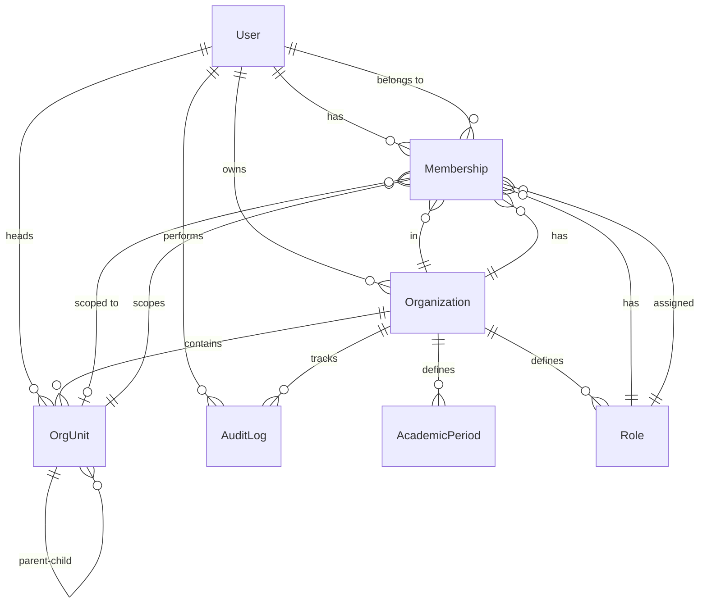

# EMS Arena Model Relationships

## Entity-Relationship Diagram



## Core Models

### Organization
Primary multi-tenant entity.

**Fields:**
- `id` (UUID): Primary key
- `name` (CharField): Organization name
- `slug` (SlugField): URL-friendly identifier
- `org_type` (CharField): Type (university, school, course_center, individual)
- `logo` (ImageField): Organization logo
- `description` (TextField): Description
- `email`, `phone`, `address`, `website`: Contact info
- `owner` (FK → User): Organization owner
- `enabled_apps` (JSONField): List of enabled features
- `settings` (JSONField): Organization-specific settings
- `is_active` (BooleanField): Active status
- `created_at`, `updated_at` (DateTimeField): Timestamps

**Relationships:**
- One-to-Many: OrgUnit, AcademicPeriod, Role, Membership
- Many-to-One: User (owner)

**Managers:**
- `objects`: Default manager
- `active`: Returns only active organizations

### OrgUnit
Hierarchical organizational units within an organization.

**Fields:**
- `id` (UUID): Primary key
- `organization` (FK → Organization): Parent organization
- `parent` (FK → self): Parent unit (nullable)
- `unit_type` (CharField): Type of unit (faculty, department, class, etc.)
- `name` (CharField): Unit name
- `slug` (SlugField): URL-friendly identifier
- `code` (CharField): Short code (e.g., "CS101")
- `head` (FK → User): Unit head/leader
- `settings` (JSONField): Unit-specific settings
- `order` (PositiveIntegerField): Display order
- `level` (PositiveIntegerField): Hierarchy depth (computed)
- `path` (CharField): Materialized path (e.g., "uuid1/uuid2/uuid3")
- `is_active` (BooleanField): Active status
- `created_at`, `updated_at` (DateTimeField): Timestamps

**Relationships:**
- Many-to-One: Organization, OrgUnit (parent), User (head)
- One-to-Many: OrgUnit (children), Membership (scope)

**Methods:**
- `get_ancestors()`: Get all parent units up the hierarchy
- `get_descendants()`: Get all child units down the hierarchy
- `get_children()`: Get direct children
- `get_full_path()`: Get human-readable hierarchy path
- `get_depth()`: Get depth in hierarchy

### AcademicPeriod
Academic calendar periods (semesters, quarters, etc.).

**Fields:**
- `id` (UUID): Primary key
- `organization` (FK → Organization): Parent organization
- `name` (CharField): Period name (e.g., "Fall 2024")
- `period_type` (CharField): Type (semester, trimester, quarter, year, term)
- `academic_year` (CharField): Academic year (e.g., "2024-2025")
- `start_date`, `end_date` (DateField): Period dates
- `is_current` (BooleanField): Whether this is the active period
- `is_active` (BooleanField): Active status
- `created_at`, `updated_at` (DateTimeField): Timestamps

**Relationships:**
- Many-to-One: Organization

**Validation:**
- Start date must be before end date
- No overlapping periods of same type

### Role
Role definitions with associated permissions.

**Fields:**
- `id` (UUID): Primary key
- `organization` (FK → Organization): Parent organization
- `name` (CharField): Internal name (e.g., "dean")
- `display_name` (CharField): Display name (e.g., "Dean")
- `description` (TextField): Role description
- `level` (PositiveIntegerField): Hierarchy level (1-100)
- `scope_type` (CharField): Scope (organization, unit, course)
- `permissions` (JSONField): List of permission strings
- `is_system` (BooleanField): Whether role is system-defined
- `is_active` (BooleanField): Active status
- `created_at`, `updated_at` (DateTimeField): Timestamps

**Relationships:**
- Many-to-One: Organization
- One-to-Many: Membership

**Permission Examples:**
- `["*"]`: All permissions
- `["course.*", "exam.*"]`: All course and exam permissions
- `["course.view", "course.create"]`: Specific permissions

### Membership
User membership in an organization with a role.

**Fields:**
- `id` (UUID): Primary key
- `user` (FK → User): Member user
- `organization` (FK → Organization): Organization
- `role` (FK → Role): Assigned role
- `scope_unit` (FK → OrgUnit): Optional unit scope
- `title` (CharField): Optional title (e.g., "Professor")
- `employee_id` (CharField): Employee/student ID
- `assigned_by` (FK → User): Who assigned this membership
- `is_primary` (BooleanField): Primary organization for user
- `is_active` (BooleanField): Active status
- `created_at`, `updated_at` (DateTimeField): Timestamps

**Relationships:**
- Many-to-One: User, Organization, Role, OrgUnit (scope), User (assigned_by)

**Constraints:**
- Unique: (user, organization, role, scope_unit)
- Only one primary membership per user per organization

**Methods:**
- `can_manage(target_membership)`: Check if can manage another membership

### AuditLog
Comprehensive audit logging.

**Fields:**
- `id` (UUID): Primary key
- `user` (FK → User): User who performed action
- `organization` (FK → Organization): Organization context
- `action` (CharField): Action type (create, update, delete, login, logout, etc.)
- `content_type` (FK → ContentType): Type of object acted upon
- `object_id` (CharField): ID of object
- `old_values` (JSONField): Values before change
- `new_values` (JSONField): Values after change
- `changes` (JSONField): Specific changes
- `reason` (TextField): Reason for action
- `ip_address` (GenericIPAddressField): Client IP
- `user_agent` (TextField): Browser user agent
- `request_id` (UUIDField): Request tracking ID
- `created_at` (DateTimeField): When action occurred

**Relationships:**
- Many-to-One: User, Organization
- Generic: Any model via ContentType

## Permission Model

Permissions are stored as JSON arrays in Role model:

```json
{
  "permissions": [
    "org.view",
    "org.edit",
    "structure.*",
    "members.view",
    "members.invite",
    "course.*",
    "exam.view",
    "exam.create"
  ]
}
```

**Permission Categories:**
- `organization`: org.view, org.edit, org.settings, org.delete
- `structure`: unit.view, unit.create, unit.edit, unit.delete
- `members`: member.view, member.invite, member.edit, member.remove
- `roles`: role.view, role.create, role.edit, role.assign, role.delete
- `courses`: course.view, course.create, course.edit, course.delete
- `grading`: grade.view, grade.input, grade.publish, grade.override
- `exams`: exam.view, exam.create, exam.edit, exam.host, exam.delete
- `appeal`: appeal.create, appeal.respond, appeal.decide
- `analytics`: analytics.view_own, analytics.view_unit, analytics.view_all
- `qa`: qa.view, qa.review, qa.flag
- `audit`: audit.view, audit.export

**Wildcard Support:**
- `*`: All permissions
- `category.*`: All permissions in a category (e.g., `course.*`)
- Exact match: Specific permission (e.g., `course.create`)

## Indexes and Performance

**Organizations:**
- Primary key (UUID)
- Unique index on `slug`
- Index on `org_type`
- Index on `is_active`

**OrgUnits:**
- Primary key (UUID)
- Composite unique: (organization, slug)
- Index on (organization, unit_type)
- Index on (organization, parent)
- Index on `path` for hierarchy queries
- Index on `level`

**Memberships:**
- Primary key (UUID)
- Composite unique: (user, organization, role, scope_unit)
- Index on (user, organization)
- Index on (organization, role)
- Index on (user, is_primary)

**AuditLogs:**
- Primary key (UUID)
- Index on (user, created_at)
- Index on (organization, created_at)
- Index on (action, created_at)
- Index on (content_type, object_id)

## Query Optimization Tips

1. **Use select_related()** for foreign keys:
   ```python
   Membership.objects.select_related('user', 'organization', 'role')
   ```

2. **Use prefetch_related()** for reverse relationships:
   ```python
   Organization.objects.prefetch_related('units', 'roles', 'memberships')
   ```

3. **Filter by organization early** to leverage indexes:
   ```python
   OrgUnit.objects.filter(organization=org, is_active=True)
   ```

4. **Use materialized path** for hierarchy queries:
   ```python
   OrgUnit.objects.filter(path__startswith=f"{parent.path}/")
   ```
