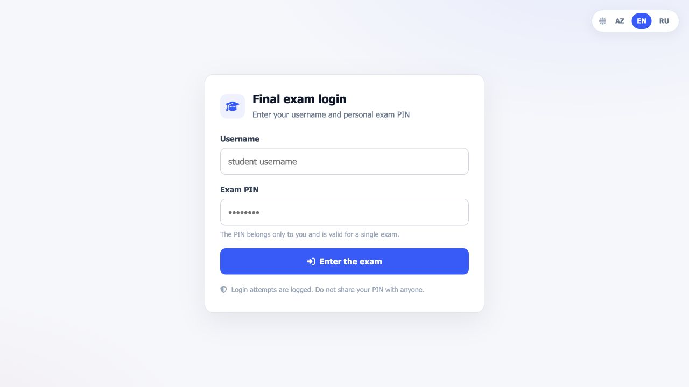
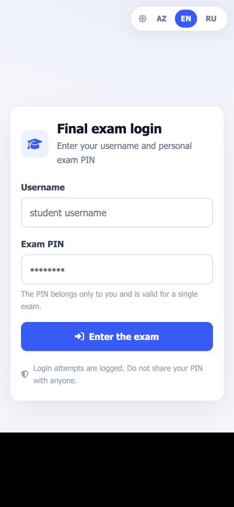
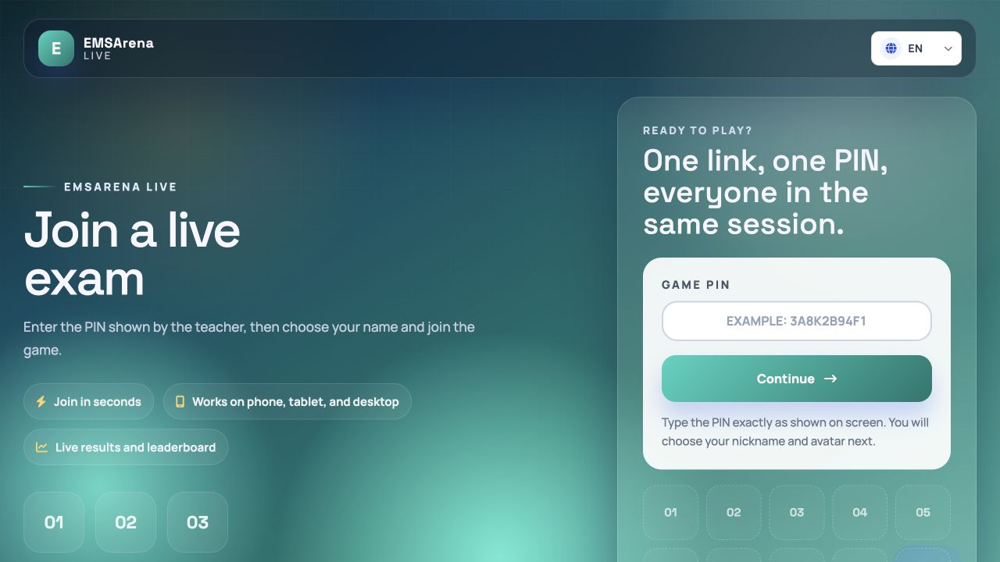

# EMSArena — imtahan sistemi üzrə prioritetli və tam repozitoriya auditi

**Audit tarixi:** 11 iyul 2026  
**Audit edilən iş sahəsi:** `/Users/elvin/Desktop/Programming Folders/EMSArena/EMSArena`  
**Kod snapshot-u:** `7c538163` (`Develop`); son QA-da tracked faylların byte-identical, source-of-truth olmayan ` 2` suffix-li 71 untracked duplikatı görünürdü  
**Əsas prinsip:** əvvəl imtahan sistemi tam audit edilib, yalnız bundan sonra ümumi layihə təhlili aparılıb  
**Tam fayl inventarı:** [EMSArena_Exam_System_File_Inventory_AZ_2026-07-11.md](./EMSArena_Exam_System_File_Inventory_AZ_2026-07-11.md)
**Məcburi exam matrisləri və diaqramları:** [EMSArena_Exam_Audit_Matrices_AZ_2026-07-11.md](./EMSArena_Exam_Audit_Matrices_AZ_2026-07-11.md)
**Bütün Python class/function simvolları:** [EMSArena_Exam_All_Python_Symbols_AZ_2026-07-11.md](./EMSArena_Exam_All_Python_Symbols_AZ_2026-07-11.md)  
**Bütün exam model/M2M DB cədvəlləri və field-lər:** [EMSArena_Exam_Database_Table_Inventory_AZ_2026-07-11.md](./EMSArena_Exam_Database_Table_Inventory_AZ_2026-07-11.md)

---

## 0. İcraçı xülasə

EMSArena geniş funksionallığa, yaxşı modul sərhədlərinə, mərkəzləşdirilmiş RBAC-a, güclü test bazasına və imtahan cəhdlərinin bir çox kritik hissəsində düzgün transaction/lock istifadəsinə malik yetkin Django monolitidir. Lakin hazırkı default production topologiyası tətbiqi PostgreSQL bootstrap superuser-i ilə qoşur. PostgreSQL superuser-i `FORCE ROW LEVEL SECURITY` olduqda belə RLS-i yan keçir. Bu fakt tenant izolyasiyasını tətbiq səviyyəli filtrlərə endirir və imtahan, qiymət, apellyasiya və audit məlumatları üçün əsas təhlükəsizlik zəmanətini aradan qaldırır.

Bundan əlavə, imtahan nəticəsinin tarixi dəyişməzliyi tam deyil, manual qiymətləndirmədə client tərəfindən göndərilən maksimum bal bütün sualı dəyişə bilir, test/coding nəticələri və düzgün cavablar çox erkən açıla bilir, per-question timer server tərəfindən icra olunmur, bir sıra imtahan cədvəllərində RLS siyasəti yoxdur və imtahanın həyat dövrü formal state machine deyil.

**Yekun qərar:** yüksək riskli, summativ və çox-tenant production imtahanı üçün **NO-GO**. Sistemin demo və məhdud, sintetik məlumatlı pilot kimi istifadəsi mümkündür, amma real qiymət və şəxsi məlumatla production buraxılışı kritik yol xəritəsi tamamlanmadan məqbul deyil.

| Yekun göstərici | Nəticə |
|---|---:|
| **İmtahan sistemi balı** | **43/100** |
| **Ümumi çəkili layihə balı** | **58/100** |
| **İmtahan production-readiness** | **NO-GO** |
| **Ümumi layihə production-readiness** | **NO-GO — şərti pilot istisna** |
| Kritik yol xəritəsindən sonra gözlənən imtahan balı | **85/100** |
| Kritik yol xəritəsindən sonra gözlənən ümumi bal | **84/100** |

---

## 1. Audit metodologiyası və sübut bazası

Audit yalnız ümumi tövsiyələrə deyil, mənbə koduna, miqrasiyalara, test nəticələrinə, deployment konfiqurasiyasına və mövcud əməliyyat sübutuna əsaslanır.

### 1.1. İcra edilmiş yoxlamalar

| Yoxlama | Faktiki nəticə | Şərh |
|---|---|---|
| Django system check | **Keçdi** | `DATABASE_URL=sqlite:// python manage.py check` |
| Miqrasiya qrafı | **Keçdi** | `0044_examanswer_question_snapshot` → `0043_exam_deleted_at_exam_is_deleted`; `makemigrations --check --dry-run`: no changes |
| Modul ölçü gate-i | **Keçdi** | `SOFT_CAP=600`; ratchet pozuntusu yoxdur |
| Modul sərhəd gate-i | **Keçdi** | Yeni cycle yoxdur; baseline 0 |
| Worker atomic coverage | **Keçdi** | 25 xarici DB entry-point sarınıb, 3 aktiv istisna |
| Qeyri-E2E SQLite testləri | **2,810 keçdi, 58 skip** | 2,868 test; 74.58 saniyə; `--ignore=tests/e2e --no-migrations` |
| İmtahan ailəsi testləri | **923 keçdi, 2 skip** | `apps/exams`, `appeals`, `live_exam`, `trial_exams` |
| GitHub CI + CodeQL, `7c538163` | **Keçdi** | [CI run 29144004156](https://github.com/equrbanov7/EducationManagementStudentArena/actions/runs/29144004156); CodeQL run 29144004097 |
| Black | **Keçdi** | 1,826 fayl |
| isort | **Keçdi** | Repository səviyyəsi |
| flake8 — məhsul kodu | **Keçdi** | `apps core config scripts manage.py` |
| flake8 — bütün `.` | **Məhsuldan kənar uğursuzluq** | `.claude/worktrees/` altında kölgə worktree duplikatları |
| Bandit | **0 high**, 3 medium, 53 low | High/high tapıntı yoxdur; medium-lar ayrıca manual triage tələb edir |
| pip-audit | **Məlum CVE yoxdur** | `requirements/base.txt` üzrə |
| Production Compose parse | **Keçdi** | Audit üçün dummy secret/env ilə `docker compose ... config -q` |
| `check --deploy`, lokal env | **4 warning** | HSTS, SSL redirect və secure cookie warning-ləri; açıq secure env override ilə keçir |
| Load-test sübutu | **Yoxdur** | k6 ssenariləri mövcuddur, faktiki baseline/result faylı boşdur |
| Restore-drill sübutu | **Yoxdur** | Runbook var, icra edilmiş bərpa nəticəsi yoxdur |

### 1.2. Məhdudiyyətlər

- Production verilənlər bazasına, real Sentry/Grafana panelinə və Cloudflare hesabına çıxış verilməyib.
- Authenticated müəllim/tələbə hesabı təqdim edilmədiyi üçün daxil olmuş imtahan UX-i kod və template səviyyəsində audit edilib; vizual yoxlama yalnız public login və PIN səhifələrində aparılıb.
- Mövcud k6 faylları real yük nəticəsi deyil. `docs/FAZA4_BASELINE_RESULTS.md` boş olduğu üçün heç bir throughput, p95/p99 və WebSocket limit rəqəmi təsdiqlənmiş sayılmayıb.
- Audit zamanı soft-delete dəyişiklikləri əvvəlcə lokal WIP idi; yekun delta-auditdən əvvəl `7c538163` commitinə daxil edildi, `0044` dependency-si `0043`-ə bağlandı və clean worktree-də miqrasiya qrafı yenidən yoxlanıb keçdi.
- Son QA-da görünən ` 2` suffix-li 71 untracked faylın hamısı uyğun tracked orijinalla SHA-256 səviyyəsində eynidir. Onlar dəyişdirilməyib və audit source inventarına daxil edilməyib. Bu qrupdakı `scripts/stress_exam_capacity 2.sh` də nəticə artifactı deyil, health/ping curl stress helper-in duplikatıdır.
- SQLite testləri PostgreSQL RLS davranışını sübut etmir; Postgres-marked testlər lokal run-da skip olunur.

---

# I HİSSƏ — İMTAHAN SİSTEMİNİN TAM AUDİTİ

## 2. İmtahan səthinin tam inventarı

İmtahan sistemi təkcə `apps/exams` deyil. Əsas source-of-truth sahələri bunlardır:

- `apps/exams/`: əsas exam definition, sual bankı, cəhd, cavab, timer, autosave, grading, coding, supervision, final-center, import/export, API/view/template/static/test səthi.
- `apps/appeals/`: apellyasiya yaratma, pəncərə, state machine, qərar, bal korreksiyası və tələbə/müəllim UI-si.
- `apps/live_exam/`: real-time raundlar, iştirakçılar, cavablar, scoreboard və WebSocket istehlakçıları.
- `apps/trial_exams/`: sınaq imtahanı lead/PDF/email axını; real cəhd mühərriki deyil.
- `apps/organizations/`: RBAC, tenant context, RLS miqrasiyası və Postgres transaction-pooling testləri.
- `apps/accounts/`: tələbə kabinetində imtahan, nəticə, pending review və təşkilat konteksti.
- `apps/courses/`, `apps/registrar/`: kurs əlaqəsi, final sessiya və qiymət inteqrasiyası.
- `apps/notifications/`, `apps/audit/`: nəticə/feedback bildirişi və hadisə auditi.
- `config/`, `docker-compose.prod.yml`, `docker/`, `.github/workflows/`, `k6/`: runtime, deployment, monitorinq, CI və load-test səthi.

Audit 653 birbaşa exam/appeals/live/trial faylını və 366 xarici inteqrasiya faylını müəyyən edib; cəmi 1,019 unikal source/config faylı əlavədə kateqoriya üzrə siyahılanıb. Build və byte-identical duplikatlar inventara daxil edilməyib.

Repo source ağacında `.jsx`, `.tsx`, Vue və Svelte component faylı, həmçinin React runtime istifadəsi aşkarlanmadı; exam frontend Django template + modular vanilla JavaScript/CSS üzərindədir. Buna görə ayrıca React component inventarı “mövcud deyil” kimi qiymətləndirilib.

Arxitektura, 40 mərhələli lifecycle, faktiki və tövsiyə olunan state machine, rol-icazə, exam type, grading, PIN abuse, dil parity, import, endpoint, DB/RLS, missing-test, performance, UX, incident və production checklist matrisləri ayrıca [məcburi matrislər əlavəsində](./EMSArena_Exam_Audit_Matrices_AZ_2026-07-11.md) verilib.

### 2.1. Əsas model qrupları

| Qrup | Modellər və source | Qiymətləndirmə |
|---|---|---|
| Exam definition | `Exam`, dil variantları, access policy — `apps/exams/domain/exam_definition.py`, `language.py`, `access_policy.py` | Funksional zəngindir, amma formal state machine yoxdur |
| Sual bankı | `ExamQuestion`, `ExamQuestionOption`, bank sualları — `domain/question_bank/*` | Import/AI/attachment güclüdür; versioning və publish freeze zəifdir |
| Cəhd və cavab | `ExamAttempt`, `ExamAnswer`, `ExamAnswerFile` — `domain/attempts.py` | Attempt constraint-ləri yaxşıdır; tarixi dəyişməzlik yarımçıqdır |
| Coding | `CodingExamQuestion`, testcase, file, submission — `domain/coding.py` | Prod-da disabled; aktiv edilərsə concurrency və sandbox limiti çatışmır |
| Student access | `ExamStudentPin`, `StudentExamAttemptGrant` — `domain/student_access.py` | Hash+cipher və throttle var; expiry/revoke/use lifecycle yoxdur |
| Supervision | config, incident, session state — `domain/supervision.py` | Auth düzəlişi var; client telemetry-yə həddən artıq etibar edilir |
| Final center | room/session/staff/computer/ticket — `domain/final_center.py` | State transition və lock baxımından sistemin ən güclü alt-hissəsidir |
| Import/submission | OCR/AI import job, question submission inbox | Async claim yaxşıdır; crash lease/retry və sync fallback riski var |
| Appeals | `Appeal`, `AppealItem`, `ScoreAdjustment` — `apps/appeals/models.py` | Pəncərə və score adjustment yaxşı; müstəqil reviewer nəzarəti zəifdir |
| Live exam | session/round/participant/answer/score | Server timer və imzalı tokenlər güclü; late-join/final lock çatışmır |
| Trial exam | request/PDF/email axını | Adına baxmayaraq tam exam runner deyil |

## 3. İmtahanın başdan sona həyat dövrü

Aşağıdakı trace yaradılmadan arxivə qədər faktiki kod axınını göstərir.

### 3.1. Yaradılma və konfiqurasiya

1. Müəllim form vasitəsilə `Exam` yaradır: başlıq, təşkilat, kurs, növ, vaxt, cəhd limiti, access code, randomization, dil və nəticə görünürlüğü.
2. Model `organization` tələb edir və slug-a random suffix əlavə edir: `apps/exams/domain/exam_definition.py:280-287`.
3. Sual manual form, question bank attach, bulk parser, PDF/OCR və AI generator vasitəsilə əlavə oluna bilir.
4. Test variantları edit zamanı yerində update edilmir; hamısı silinib yenidən yaradılır: `apps/exams/forms/question.py:362-367`.
5. Dil variantları ayrıca saxlanır, lakin variantlar arasında sual sayı, bal, düzgün cavab və publish parity-si üçün məcburi validator yoxdur.

**Nəticə:** authoring imkanları genişdir. Lakin “draft → review → approved → published” keçidi yoxdur və sual bankının version/freeze mexanizmi olmadığından aktiv exam definition dəyişə bilir.

### 3.2. Publish, planlama və giriş siyasəti

1. `is_active` publish rolunu oynayır; ayrıca approval və readiness check yoxdur.
2. `lifecycle_status` yalnız `archived/draft/scheduled/active` qaytarır; bitmiş exam da `active` etiketinə düşür: `exam_definition.py:303-321`.
3. `is_currently_active()` yalnız start/end vaxtını yoxlayır; `is_active`, `is_archived`, `is_deleted` nəzərə alınmır: `exam_definition.py:299-300`.
4. `can_user_see()` public exam üçün excluded-user yoxlamasından əvvəl `True` qaytarır: `access_policy.py:150-161`.
5. `can_user_start()` active və vaxtı yoxlayır, amma archive/delete guard yoxdur: `access_policy.py:177-199`.
6. Final/midterm fərdi PIN, digər növlər ümumi access code və ya assignment/course membership istifadə edir.

**Nəticə:** UI düymələrinin gizlənməsi təhlükəsizlik sərhədi kimi qəbul edilə bilməz. Direct URL/start service archived və ya soft-deleted exam üçün ayrıca sərt guard tələb edir.

### 3.3. Sualın hazırlanması və cəhdin yaradılması

1. Attempt service aktiv cəhdləri lazy şəkildə expire edir və max-attempt limitini yoxlayır.
2. Database partial unique constraint və `select_for_update`/gate mexanizmləri paralel start dublikatını əhəmiyyətli dərəcədə azaldır.
3. Randomizer hər cəhd üçün delivered question set-i `ExamAnswer` sətirləri kimi yaradır.
4. Cari branch `ExamAnswer.question_snapshot` əlavə edir; snapshot balı, answer mode-u və option ID + correctness-i dondurur.
5. Snapshot yalnız yeni çatdırılan cavablar üçün yaradılır; köhnə cavablar boş snapshot ilə canlı sualdan hesablanır: `domain/attempts.py:369-376`, `services/result_calculation.py:99-114`.

**Nəticə:** cəhd atomikliyi güclü tərəfdir. Snapshot düzəlişi düzgün istiqamətdir, amma hüquqi/akademik tarixçə üçün tam deyil.

### 3.4. İmtahanın çatdırılması, timer və autosave

1. Ümumi exam timer serverdən `remaining_seconds` alır və backend attempt deadline ilə qorunur.
2. Per-question timer brauzerdə `Date.now() + timeLimit` ilə yaradılır: `static/exams/js/take_exam/timers.js:85-116`.
3. Vaxt bitəndə input-lar `disabled` edilir: `timers.js:4-10`. Disabled input form payload-a daxil olmur; backend missing field-i “cavab silindi” kimi işləyərsə son saxlanmış cavabın itməsi mümkündür.
4. Səhifə reload-u serverdə per-question spent/deadline saxlamadığı üçün timer-i bərpa etmir; client saatının dəyişdirilməsi də təsir edə bilər.
5. Autosave default 300,000 ms + jitter-dir: `docker-compose.prod.yml:77-79`, `static/exams/js/take_exam/config.js:59-71`.
6. Draft tam cavab mətnlərini və seçilmiş variantları predictable localStorage key-də saxlayır: `draft.js:28-71`, `config.js:115-118`.
7. `answerRevision` yalnız eyni tab daxilində in-flight dəyişiklikləri qoruyur; request-də server revision/ETag göndərilmir. İki tabın “last write wins” problemi qalır.
8. Binary upload autosave default söndürülüb.

**Nəticə:** ümumi deadline yaxşıdır; per-question timer yüksək riskli exam üçün etibarlı deyil. 5 dəqiqəlik autosave məlumat itkisi pəncərəsini böyüdür.

### 3.5. Cavabın göndərilməsi və cəhdin tamamlanması

1. Draft və finish eyni take-exam POST səthi ilə emal olunur.
2. Client finish zamanı marked question state və CSRF-ni sync edir; total timer bitəndə submit edir.
3. Server attempt statusunu bitmiş vəziyyətə keçirir və test balını hesablayır.
4. Adi periodik “expired attempt sweep” yoxdur; expiry əsasən növbəti access zamanı lazy icra olunur.
5. Coding flow-da final submission üçün sərt unique constraint və idempotency key görünmür; paralel submit iki final sətir yarada bilər.

**Nəticə:** əsas test/written submit axını işlək və testlidir, amma idempotent finalization və stale-client conflict protokolu yoxdur.

### 3.6. Avtomatik və manual qiymətləndirmə

1. Test qiyməti delivered `ExamAnswer` set-i üzrə hesablanır; random exam üçün düzgündür.
2. Cari snapshot varsa correctness və points snapshot-dan alınır; selected option-lar hələ canlı M2M-dən oxunur: `result_calculation.py:99-123`.
3. Variant edit-i köhnə option-ları delete edir. `selected_options` through sətirləri də silindiyi üçün keçmiş cavab seçimi yox olur; snapshot bunu bərpa etmir.
4. `AnswerGradingMixin.auto_evaluate()` hələ canlı question/options istifadə edir: `domain/grading.py:14-28`.
5. Manual grading POST-dan `max_points_{question.id}` qəbul edir; score böyükdürsə max-ı score-a qaldırır və sonra `q.points`-i bütün exam üçün dəyişir: `views/teacher/results/_attempt_views.py:274-306`.
6. Teacher score üçün modeldə upper-bound constraint yoxdur.

**Nəticə:** manual qiymətləndirmə trust boundary pozuntusudur və bir tələbənin grade formu digər tələbələrin denominatorunu/tarixçəsini dəyişə bilər.

### 3.7. Nəticənin açıqlanması

1. Teacher `results_hidden_from_students` boolean-ını toggle edir.
2. Test və coding attempt-ləri hidden deyilsə dərhal `can_view_result=True` alır: `views/student/_helpers.py:28-35`.
3. Final-center nəticə səhifəsi submission-dan sonra 5 dəqiqə açıq qalır: `views/student/results.py:32,63-68,140-147`.
4. Result view canlı question options-u prefetch edir və template düzgün cavabı göstərə bilir: `results.py:179-187`, `templates/exams/student/exam_result.html:421-426`.
5. Eyni exam pəncərəsində digər tələbələr hələ işləyərkən erkən bitirən tələbə düzgün cavabları paylaşa bilər.
6. Yazılı exam-da `checked_by_teacher=False` olduqda helper yenə `can_view_result=True` qaytarır: `_helpers.py:38-49`; bu, natamam/0 nəticəni erkən göstərə bilər.

**Nəticə:** nəticə publication exam-wide, atomik və açıq state deyil. “Bütün sessiyalar bağlandı + grading tamamlandı + müəllim təsdiqi” gate-i lazımdır.

### 3.8. Apellyasiya

1. Ownership, pəncərə, status transition və score adjustment transaction-larla idarə olunur.
2. Bonus nəticəyə ayrıca adjustment kimi tətbiq edilir; bu, base score-u overwrite etməkdən daha sağlamdır.
3. Reviewer assignment, conflict-of-interest, ikinci təsdiq və “respond” ilə “decide” arasında sərt ayrılıq yoxdur.
4. Tələbə nəticə rəsmi publish olunmadan appeal aça bilər.
5. “Internal/reviewer note” tələbə detail template-də görünür; məxfi daxili qeyd semantikası pozulur.
6. Appeal/history modellərində CASCADE və mutable field-lər hüquqi audit tarixçəsini zəiflədir.

**Nəticə:** apellyasiya modulu sistemin güclü hissələrindəndir, amma yüksək-stakes qayda üçün reviewer independence və immutable decision log lazımdır.

### 3.9. Arxiv, soft-delete və retention

1. Arxiv `is_archived` boolean-ıdır; avtomatik deactivate etmir.
2. `7c538163` `is_deleted/deleted_at`, tenant-scoped default filtr, zibil qutusu və restore axını əlavə edir; soft-delete exam-ı deaktiv edir və restore onu draft saxlayır. `0043 → 0044` miqrasiya zənciri clean checkout-da keçir.
3. Hard delete əlaqəli attempt/answer/file/history-ni CASCADE ilə silə bilər.
4. İmtahan, cavab faylı, supervision event, AI/OCR input/output və appeal üçün vahid retention schedule yoxdur.
5. Legal hold, two-person purge və export-before-delete mexanizmi yoxdur.

**Nəticə:** archival sadəcə UI təşkilatıdır; compliance-grade record lifecycle deyil.

## 4. İmtahan sistemi üzrə kritik tapıntılar

### 4.1. P0 — buraxılışı bloklayan tapıntılar

#### EXAM-P0-01 — Default production DB istifadəçisi PostgreSQL superuser-dir

- `docker-compose.prod.yml:57` app, worker və beat üçün `DATABASE_URL`-i `${POSTGRES_USER}` ilə qurur.
- Eyni dəyişən `postgres` container bootstrap istifadəçisidir: `docker-compose.prod.yml:123-133`.
- Official Postgres image-də `POSTGRES_USER` initdb superuser yaradır. [Official Docker Postgres sənədi](https://github.com/docker-library/docs/blob/master/postgres/README.md).
- Layihənin öz RLS miqrasiyası superuser-in RLS-i həmişə bypass etdiyini açıq yazır: `apps/organizations/migrations/0003_rls_policies.py:25-31`.
- Ayrı `APP_DATABASE_USER` və ya login edən `NOSUPERUSER` app role provision-u tapılmadı.

**Təsir:** bir queryset-də tenant filter unudulması bütün tenantların exam, answer, grade və appeal məlumatını aça bilər. RLS-in production təhlükəsizlik zəmanəti faktiki yoxdur.

**Düzəlişin qəbul meyarı:** migration/DBA üçün ayrıca owner role; tətbiq üçün `LOGIN NOSUPERUSER NOBYPASSRLS`; bütün app/worker/beat/management command-lar həmin rol ilə; startup check `rolsuper=false AND rolbypassrls=false`; Postgres inteqrasiya testində cross-tenant raw SQL 0 sətir qaytarmalıdır.

#### EXAM-P0-02 — Bir sıra exam cədvəllərində RLS siyasəti yoxdur

Model-FK qrafının mövcud `CREATE POLICY` SQL-i ilə müqayisəsində bu exam cədvəlləri policy-siz qalıb:

- coding: `codingexamquestion`, `codingtestcase`, `codingfile`, `codingsubmission`;
- access/supervision: `examstudentpin`, `studentexamattemptgrant`, `examsupervisionconfig`, `supervisionincident`, `questionsubmission`;
- join tables: `exam_excluded_users`, `examroom_invigilators`, `examroomsession_staff`, `questionsubmission_student_groups`, `studentgroup_subjects`.

**Təsir:** non-superuser role düzəldilsə belə bu cədvəllər defense-in-depth-dən kənarda qalacaq.

**Qəbul meyarı:** bütün tenant-derived cədvəllər üçün direct/indirect `USING + WITH CHECK`; `FORCE RLS`; owner/app/bypass ssenariləri; hər cədvəl üçün cross-tenant SELECT/INSERT/UPDATE/DELETE Postgres testi; CI-də model→policy coverage gate.

#### EXAM-P0-03 — Keçmiş cavab və bal tam dəyişməz deyil

- Snapshot option correctness-i saxlayır, seçilmiş option ID-lərini və mətn/media/rubric/version-u saxlamır.
- `ExamAnswer.question` CASCADE, `selected_options` canlı M2M-dir: `domain/attempts.py:338-345`.
- Option edit delete/recreate edir: `forms/question.py:362-367`.
- Legacy cavablar canlı variantlara düşür; test bunu açıq təsdiqləyir: `tests/test_answer_snapshot.py:91-105`.

**Təsir:** müəllim edit-i keçmiş tələbə seçimini, balı və appeal sübutunu dəyişə bilər.

**Qəbul meyarı:** delivered question snapshot-da mətn, media hash/reference, points, answer mode, option ID/text/order/correctness; answer snapshot-da selected stable keys; grading həmin iki snapshot-dan; tarixçədə `PROTECT` və ya immutable exam version; legacy backfill və “unverifiable” marker.

#### EXAM-P0-04 — Manual grading client maksimum balına etibar edir

Sübut: `_attempt_views.py:274-306`. POST max balı artırır və `ExamQuestion.points`-i dəyişir.

**Təsir:** over-score, denominator manipulyasiyası, digər attempt nəticələrinin retroaktiv dəyişməsi.

**Qəbul meyarı:** max points yalnız immutable delivered snapshot/rubric-dən; score `0 <= score <= max`; DB CheckConstraint; teacher POST heç vaxt question definition-i dəyişməməli; grade event append-only audit və `select_for_update`.

#### EXAM-P0-05 — Düzgün cavab və nəticə exam bağlanmadan açıla bilər

Sübut: test/coding üçün dərhal görünürlük `_helpers.py:34`; final result 5 dəqiqə `results.py:32,63-68`; template doğru cavabı göstərir `exam_result.html:421-426`.

**Təsir:** erkən submit edən tələbədən aktiv tələbələrə cavab sızması.

**Qəbul meyarı:** `results_state=sealed|provisional|published|appeal_closed`; doğru cavab yalnız exam-wide window bağlandıqdan, bütün active attempts finalize olduqdan və müəllim atomik publish etdikdən sonra; ayrıca “score only” və “answer review” policy-si.

### 4.2. P1 — kritik yol xəritəsində həll edilməli tapıntılar

| ID | Tapıntı | Sübut | Praktik təsir |
|---|---|---|---|
| EXAM-P1-01 | Formal lifecycle state machine yoxdur | `lifecycle_status` 4 computed label; ended ayrıca state deyil | Yanlış start/publish/archive keçidləri |
| EXAM-P1-02 | Archive/delete start guard deyil | `access_policy.py:177-199` | Direct URL ilə giriş riski |
| EXAM-P1-03 | Public exam exclusion-u bypass edir | `access_policy.py:157-161` | Xüsusi bloklanmış user public exam görür |
| EXAM-P1-04 | Per-question timer client-only | `timers.js:85-116` | Reload/clock tamper; qayda icra olunmur |
| EXAM-P1-05 | Disabled field payload-dan düşür | `timers.js:4-10`, `draft.js:74-77` | Son saxlanmış cavab silinə bilər |
| EXAM-P1-06 | Autosave server OCC yoxdur | `draft.js:289-349` | İki tab stale overwrite edir |
| EXAM-P1-07 | Draft localStorage-da plaintextdir | `draft.js:28-71` | Shared cihaz/logout sonrası data qalığı |
| EXAM-P1-08 | Student PIN lifecycle natamamdır | `domain/student_access.py` | Expiry/revoke/use/rotation yoxdur |
| EXAM-P1-09 | Ümumi 6-rəqəmli access code plaintextdir | `Exam.access_code` | DB leak və brute-force blast radius |
| EXAM-P1-10 | Supervision incident payload etibarsızdır | supervision monitor/event endpoints | Arbitrary dict, zəif rate limit, count race |
| EXAM-P1-11 | Client telemetry proctoring sübutu kimi zəifdir | `static/exams/js/exam_supervision/*` | False positive/negative, spoof edilə bilər |
| EXAM-P1-12 | Live session late-join mümkündür | join yalnız lock/state-in bir hissəsini yoxlayır | Bitmiş/in-progress oyuna yeni iştirakçı |
| EXAM-P1-13 | Coding final submit idempotent deyil | coding submission model/service | Paralel iki final; gec submit |
| EXAM-P1-14 | Coding output əvvəlcə limitsiz yığılır | coding runtime execution/grading | Worker memory exhaustion |
| EXAM-P1-15 | Import job crash lease/retry yoxdur | import claim/task axını | `processing`-də daimi ilişmə |
| EXAM-P1-16 | 3 saniyədən sonra sync OCR/AI fallback | text extraction request helper | Pik vaxtda web worker bloklanması |
| EXAM-P1-17 | Dil variantı parity validatoru yoxdur | `domain/language.py`, exam forms | Dillər üzrə fərqli çətinlik/maximum |
| EXAM-P1-18 | Appeal reviewer independence yoxdur | appeals permission/decision services | Conflict-of-interest və zəif audit |
| EXAM-P1-19 | Hard delete CASCADE tarixçəni silir | exam/attempt/answer FK-ləri | Akademik sübut və appeal itir |
| EXAM-P1-20 | Exam biznes monitorinqi yoxdur | Prometheus/alerts | Səssiz autosave, submit və PIN failure-ları |

### 4.3. P2 — keyfiyyət və idarəetmə borcu

- Multiple-choice sual üçün ən az bir düzgün variant məcburi DB/business invariant deyil.
- Test/written/coding-dən kənar question type-lar, rubric və partial-credit modeli məhduddur.
- Appeal daxili qeydi tələbəyə görünə bilir.
- Attempt expiry yalnız lazy olduğuna görə dashboard/monitor statusu gecikə bilər.
- Final-center və legacy PIN mexanizmləri paralel mövcuddur; vahid credential lifecycle yoxdur.
- Trial exam real sınaq runner-i deyil; email/notification üçün daemon thread istifadə edir, proses dayananda iş itə bilər.
- Supervision event retention və privacy notice yoxdur.
- Authenticated imtahan UI-si üçün avtomatlaşdırılmış accessibility audit yoxdur.
- Result view canlı question text/options render etdiyindən snapshot düzəlsə belə göstərilən sübut tarixi vəziyyətə uyğun olmaya bilər.

## 5. Tenant, RBAC və təhlükəsizlik auditi

### 5.1. Güclü tərəflər

- RBAC mərkəzləşdirilib; permission name-lər role definition-lara bağlanır.
- Təşkilat context-i middleware və tenant-scoped selector-larla ötürülür.
- RLS migration direct və indirect policy pattern-i, `USING` və `WITH CHECK`, `FORCE RLS` tətbiq edir.
- Attempt ownership result view-də sərtdir: `get_object_or_404(... user=request.user)`, `results.py:128-131`.
- Current branch supervision WebSocket attempt-owner scope düzəlişi, Student PIN throttle və ticket PIN atomic counter düzəlişləri daşıyır.
- CSRF, secure upload validatorları, private media routing, CSP nonce və production admin 2FA mövcuddur.
- Final-center ticket PIN lock/revoke və state transition-ları transaction-lıdır.

### 5.2. Zəifliklər

- Superuser DB rolu bütün RLS dizaynını ləğv edir.
- RLS coverage model inkişafını izləmir; yeni exam cədvəlləri policy-siz əlavə olunub.
- Supervision incident POST tələbə brauzerindən gələn hadisəni etibarlı fakt kimi saxlayır; server attestation yoxdur.
- Public access path exclusion-u bypass edir.
- Access code və localStorage cavabları həssas məlumat kimi qorunmur.
- Result release məlumat sızmasına şərait yaradır.
- Proxy IP trust layihə-wide rate limitləri, o cümlədən PIN endpointlərini təsirsizləşdirə bilər; ümumi hissədə P0 olaraq izah edilir.

## 6. Performans və miqyaslana bilmə

### 6.1. Müsbət dizayn

- Exam start üçün global/per-exam concurrency limit və lease parametrləri var: `docker-compose.prod.yml:83-87`.
- Randomizer usage cache və bulk prefetch-lər N+1-in bir hissəsini azaldır.
- Result summary batch prefetch edir: `services/result_calculation.py:144-185`.
- Celery worker request-dən ayrılıb; request-external DB entry-point atomic gate-dən keçir.
- Final-center transition-larında row lock və server timestamp istifadə olunur.
- Nginx WebSocket/Daphne topologiyası və Redis channel layer mövcuddur.

### 6.2. Sübut olunmayan və riskli hissələr

- `docs/FAZA4_BASELINE_RESULTS.md` boşdur; “500 VU” haqqında başqa sənəddəki iddia ölçülmüş nəticə kimi qəbul edilə bilməz.
- k6 ssenarilərinin çoxu default 1 VU-dur; 100/500/1000 VU, ramp, soak və spike nəticəsi yoxdur.
- `scripts/stress_exam_capacity.sh` 200/300/500 parallel curl stage qurur, amma default yalnız `/ping/` və `/health/` çağırır; PIN, attempt, question, autosave, submit və WebSocket yolu olmadığı üçün exam capacity sübutu deyil.
- WebSocket supervision/live/final-center üçün connection fan-out, reconnect storm və Redis pub/sub testi yoxdur.
- Transaction pooling üçün testlər var, amma production rollout və PgBouncer ölçüsü üzrə faktiki capacity evidence yoxdur.
- Coding runtime üçün global executor semaphore, queue depth və memory/backpressure ölçüsü yoxdur.
- Sync OCR fallback pik request-lərdə cascading failure yarada bilər.

**Production gate:** ən azı 30 dəqiqəlik 100 VU, 15 dəqiqə 500 VU, qısa 1,000 VU spike; paralel 1,000 WebSocket; submit/autosave idempotency; p95/p99, error rate, DB connection, Redis latency, queue lag və data-loss invariant-ları ölçülməlidir.

## 7. İmtahan UX və accessibility auditi

### 7.1. Vizual sübut

Public login və final PIN giriş səhifələri desktop/mobile viewport-da yoxlanıb:

### 7.2. Müsbət nəticələr

- Public entry səhifələri responsiv, vizual iyerarxiyası aydın və əsas CTA-sı görünəndir.
- Base layout-da skip-link, language, focus-visible və reduced-motion pattern-ləri var.
- Form label və error pattern-ləri əsasən ardıcıldır.
- Exam UI üçün modular JS faylları mövcuddur; tək nəhəng scriptə bağlı deyil.

### 7.3. Problemlər

- Final exam info modalında subject, müəllim, sual sayı, total points, allowed attempts, privacy/proctoring notice və texniki tələblər tam görünmür.
- Entry locale seçimində AZ/EN/RU görünür, platformanın TR locale-i isə mövcud olduğu halda axında göstərilmir.
- Autosave statusu “serverdə təsdiqlənmiş revision” deyil; istifadəçidə yanlış təhlükəsizlik hissi yarada bilər.
- Per-question expiry input-u disable edir, amma “cavab serverdə saxlanıldı” təsdiqi və recovery state-i aydın deyil.
- Connection-loss/offline conflict və multi-tab warning-i yoxdur.
- Yalnız 3 basic a11y testi tapıldı; axe/pa11y, keyboard-only exam run, screen reader announcement, contrast və zoom testləri yoxdur.
- Authenticated səhifələr vizual yoxlanmadığı üçün həmin hissənin UX qiyməti orta etimadla verilib.

## 8. İmtahan test auditi

### 8.1. Güclü tərəflər

- Exam ailəsində 900-dən çox test var.
- Attempt constraint, total timer, result calculation, randomization, language variant, final-center, PIN, WebSocket auth, appeal window/scoring və tenant selector-ları üçün əhatə mövcuddur.
- Snapshot üçün regression test əlavə edilib.
- Postgres RLS və transaction pooling üçün ayrıca marked testlər var.
- CI Python 3.11/3.12, PostgreSQL və Redis istifadə edir; coverage gate 68%-dir.

### 8.2. Kritik boşluqlar

Aşağıdakılar üçün məqsədli test tapılmadı və ya mövcud davranış yanlış nəticəni təsdiqləyir:

1. Option delete/recreate-dən sonra keçmiş selected answer və score dəyişməzliyi.
2. Bütün exam pəncərəsi bağlanmadan correct-answer leakage-in bloklanması.
3. Server-side per-question deadline, reload və client clock tamper.
4. İki tab/server revision conflict və stale autosave overwrite.
5. Multiple-choice üçün sıfır correct option invariantı.
6. Manual grading max-points tamper və DB upper bound.
7. Archived/deleted exam-a direct start.
8. Public exam excluded user.
9. Coding concurrent final submit və deadline-dan sonra submit.
10. Policy-siz exam cədvəllərinə raw cross-tenant access.
11. Supervision incident rate limit, payload schema və counter race.
12. Live exam late join və finished-session lock.
13. Real Redis/WebSocket reconnect storm.
14. 100/500/1000 VU və soak testi.
15. Backup-dan exam/appeal/media bərpası.

## 9. İmtahan sistemi balı — 43/100

| Meyar | Çəki | Qazanılan | Əsas səbəb |
|---|---:|---:|---|
| Arxitektura və modul sərhədi | 5 | 4 | Yaxşı paketlənmə və fasadlar |
| Data modeli və tarixçə | 7 | 3 | Snapshot yarımçıq, CASCADE/mutable history |
| Business lifecycle | 6 | 2 | Formal state machine/publish gate yoxdur |
| Tətbiq təhlükəsizliyi | 7 | 1 | Result leak, grading trust, proxy təsiri |
| Tenant izolyasiyası | 7 | 1 | Default superuser + RLS boşluqları |
| RBAC | 5 | 3 | Mərkəzi model yaxşı, duty separation zəif |
| PIN/access control | 4 | 2 | Hash/throttle var, lifecycle natamam |
| Attempt etibarlılığı | 6 | 4 | Lock/constraint yaxşı; expiry/idempotency boşluğu |
| Timer | 5 | 1 | Total yaxşı, per-question client-only |
| Autosave/recovery | 4 | 2 | Lokal recovery var, server OCC yoxdur |
| Submission | 4 | 2 | Əsas flow testlidir, stale/idempotency boşluğu |
| Grading/integrity | 6 | 1 | Max tamper və canlı reference problemi |
| Çoxdillilik | 3 | 2 | 4 locale var, parity gate yoxdur |
| Apellyasiya | 4 | 3 | State/adjustment yaxşı, reviewer independence zəif |
| Performans | 4 | 1 | Optimizasiyalar var, ölçü yoxdur |
| Scalability | 4 | 1 | Topologiya var, capacity sübutu yoxdur |
| UX | 4 | 3 | Public flow yaxşı, authenticated audit məhdud |
| Accessibility | 3 | 2 | Base pattern yaxşı, avtomatik dərin audit yoxdur |
| Test keyfiyyəti | 6 | 4 | Böyük suite, kritik invariant boşluqları |
| Observability | 3 | 1 | Generic metrics; exam SLI/SLO yoxdur |
| Production readiness | 3 | 0 | P0-lar release-i bloklayır |
| **Cəmi** | **100** | **43** | |

---

# II HİSSƏ — TAM REPOZİTORİYA AUDİTİ

## 10. Repo və arxitektura

### 10.1. Ölçü

Audit snapshot-unda təxminən:

- 2,079 source/config faylı;
- 309,833 tətbiq sətri;
- 1,060 Python, 365 HTML, 256 JavaScript, 208 CSS, 46 Markdown faylı;
- 18 Django app;
- ən böyük sahələr: exams (~455 fayl), accounts (~427), live_exam (~131), registrar (~106), blog (~104).

### 10.2. Güclü arxitektura tərəfləri

- Modul dependency baseline-i sıfırdır; yeni cycle CI gate ilə bloklanır.
- `core/` → `apps/` importları aradan qaldırılıb.
- Cross-module inteqrasiya üçün `apps.<module>.public` fasadları var.
- View-lər rol qovluqlarına ayrılır: student/teacher/shared/org-admin/superadmin.
- Python god-file qalmayıb; asset ratchet mövcuddur.
- Settings component-lərə ayrılıb, shared namespace ardıcıllığı qorunub.
- Domain/service/view bölgüsü xüsusilə exam, registrar və organization-da yaxşıdır.

### 10.3. Borc

- 44 iri HTML/CSS/JS asseti ratchet-də dondurulub; böyümür, amma maintainability borcu qalır.
- Accounts dashboard çoxlu domain məlumatını hub kimi toplayır; bu legitimdir, lakin query budget və contract test tələb edir.
- Soft-delete commit-i 33 fayla və dörd locale kataloquna toxunur; davranış testləri keçsə də belə cross-cutting dəyişikliklər üçün gələcəkdə daha kiçik, ayrıca review olunan PR-lar risk idarəsini yaxşılaşdırar.
- Audit sonunda worktree clean, `manage.py check` və miqrasiya graph gate-i keçən vəziyyətdədir.

## 11. Verilənlər bazası və multi-tenancy

### 11.1. P0 — tətbiq superuser ilə qoşulur

Bu, bütün layihəyə aid ən ağır tapıntıdır. §4.1-dəki sübut eynidir. Təsir yalnız exam deyil: course, assignment, lab, project, registrar, AI və audit məlumatlarını əhatə edir.

### 11.2. RLS coverage boşluqları

Exam-dan əlavə aşağıdakı tenant məlumatlı cədvəllərdə policy tapılmadı:

- `accounts_userprofile`;
- `ai_assistant_aiassistantlog`;
- `audit_auditlog`;
- `labs_labanswer`, `labassignment`, `labblock`, `labquestion`, `labsubmission`;
- `projects_projectsubmission`.

App-layer tenant filter testləri defense-in-depth deyil; raw SQL, admin, task və gələcək service səhvində RLS tələb olunur.

### 11.3. Model invariant problemləri

- Assignment/project/lab max-attempt check count-then-create patternidir; row lock/unique attempt number olmadan paralel submit limiti aşa bilər.
- `task_submission_core.apply_grade` score-u 0..max aralığında clamp etmir; DB constraint yoxdur.
- Bulk grading unordered queryset-i score listi ilə `zip` edə bilər; bal yanlış tələbəyə gedə bilər.
- Lab child modellərində cross-parent consistency constraint yoxdur.
- Course slug tenant daxilində deyil, qlobal unique-dir; tenant UX və import konfliktləri yaradır.
- User email DB səviyyəsində unique deyil, login backend case-insensitive `.first()` istifadə edir; duplicate email qeyri-deterministik hesab seçə bilər.

## 12. Auth, authorization və ümumi təhlükəsizlik

### 12.1. Güclü tərəflər

- Production default `DEBUG=False`, HSTS/secure cookies/CSP/X-Frame, admin 2FA hard requirement.
- OTP hash saxlayır və verification transaction lock istifadə edir.
- Upload extension/size/zip-bomb yoxlamaları və private media X-Accel routing var.
- Structured JSON log masking və Sentry inteqrasiyası mövcuddur.
- Bandit high tapıntısı yoxdur, `pip-audit` məlum dependency CVE göstərməyib.
- CI-də CodeQL, Bandit, pip-audit, Gitleaks və Trivy job-ları var.

### 12.2. P0/P1 — etibarlı proxy sərhədi yoxdur

- Nginx client-in göndərdiyi `X-Forwarded-Proto`-nu map ilə qəbul edir: `docker/nginx/nginx.conf:14-22`.
- `CF-Connecting-IP` mənbənin Cloudflare olub-olmadığını təsdiqləmədən rate-limit key olur: `nginx.conf:24-32`.
- Django helper XFF-in ilk elementinə etibar edir: `core/utils.py:159-174`.
- Origin 80/443 açıqdır; Cloudflare-only firewall/manual hardening mühitdən asılıdır.

**Təsir:** birbaşa origin-ə çıxış varsa client IP spoof etməklə IP rate-limit, admin allowlist, audit attribution və scheme qərarları yan keçilə bilər.

**Düzəliş:** origin yalnız Cloudflare CIDR/mTLS Authenticated Origin Pull-dan qəbul etsin; Nginx `real_ip_header CF-Connecting-IP` və versiyalanmış trusted CIDR-lər; untrusted XFF/XFP-ni overwrite etsin; app yalnız Nginx REMOTE_ADDR/validated chain istifadə etsin.

### 12.3. Privacy və audit

- `audit_auditlog` RLS-sizdir; superuser admin delete edə bilir. Audit append-only və tamper-evident deyil.
- AI log full prompt və response summary saxlayır; RLS və retention yoxdur.
- AI chat history global localStorage key-də hesab dəyişikliyindən sonra qala bilər.
- Notification purge command var, Celery beat schedule-də tapılmadı.
- Exam answer/file, AI log, supervision incident və audit üçün vahid retention yoxdur.
- Registration modalında privacy mətni var, ayrıca Terms/Privacy route aşkarlanmadı.

## 13. Business modulları

### 13.1. Registrar

**Güclü:** explicit approval flow, grading scale, clamping, RLS, transfer/resit/final inteqrasiyası və 100+ test.

**Risklər:**

- Grade audit best-effort-dir və exception udulur: `apps/registrar/grade_audit.py:41-67`, `finals.py:260-278`. Qiymət commit olub audit yazılmaya bilər.
- Concurrent grade write üçün bütün yollarda `select_for_update` yoxdur.
- Offering result list hər enrollment üçün `compute_final_result` çağırır və FinalGrade/Resit sorğuları yarada bilər; N+1 riski.
- Layihə üzrə query-count testləri çox azdır.

### 13.2. Assignment, project və lab

**Güclü:** ortaq submission core, permission və tenant selector testləri.

**Risklər:** concurrent max-attempt bypass, score upper-bound yoxluğu, unordered bulk mapping, RLS-siz child/submission cədvəlləri və lab parent-consistency boşluğu.

### 13.3. AI assistant

**Güclü:** tenant-scoped context testləri, output secret redaction, provider config.

**Risklər:** input prompt privacy-si, RLS-siz log, retention yoxluğu, localStorage history və protocol-relative `//` linkə icazə verən renderer davranışı. Renderer HTML-i escape edir; hazırkı sübut birbaşa stored XSS göstərmir.

### 13.4. Blog/contact/notification/course

Bu modullarda tenant selector testləri və modular service qatları müsbətdir. Lakin notification retention job-un schedule edilməməsi, course slug scope və thread/process içində dayanıqsız background work patternləri əməliyyat riskidir.

## 14. Frontend, UX, i18n və accessibility

- AZ/EN/RU/TR locale katalogları var; untranslated entry tapılmadı.
- Hər katalogda təxminən 86 fuzzy entry var; terminoloji borc qalır.
- Base design system skip-link, keyboard focus və reduced-motion dəstəyi verir.
- JS üçün ESLint/unit/type-check pipeline yoxdur; yalnız Python lint və Playwright E2E-yə güvənilir.
- 44 iri asset ratchet-dədir; tədricən partial/component moduluna bölünməlidir.
- 3 basic accessibility testi böyük məhsul üçün kifayət deyil.
- Public exam giriş səhifələri polisheddir, lakin əsas authenticated journey-lər credential olmadan vizual audit olunmayıb.

## 15. Test və keyfiyyət mühəndisliyi

### 15.1. Güclü tərəflər

- 3,000-ə yaxın test collect edilir; qeyri-E2E əsas suite minlərlə case keçir.
- CI PostgreSQL 16, Redis və iki Python versiyasında işləyir.
- RLS transaction-pooling, migration apply, security header, tenant isolation və upload security testləri var.
- Coverage gate 68%, module size və dependency gate-ləri mövcuddur.
- Playwright E2E və production smoke job-ları yazılıb.

### 15.2. Zəifliklər

- Cari lokal runtime Django 5.2.13, requirement pin 5.2.16-dır; test environment drift var.
- SQLite sürətli suite Postgres-specific constraint/RLS sübutu deyil.
- Load, restore, chaos və real failover nəticəsi yoxdur.
- Query budget testləri çox azdır.
- JS unit/lint/type və a11y automation yoxdur.
- `0043/0044` ardıcıllığı yekunda düzəldilib və `makemigrations --check` keçir; bu yoxlama pre-commit və merge gate-də dəyişməz saxlanmalıdır.

## 16. CI/CD və deployment

### 16.1. Kritik pipeline problemi

`.github/workflows/ci.yml:203-223` Docker build, container scan, production smoke və E2E failure-larını yalnız warning edir. `ci-success` yenə keçir; `main` push-u bundan sonra production deploy-a gedir: `ci.yml:225-260`.

**Təsir:** build olunmayan, kritik image CVE-si olan, production settings-də açılmayan və E2E-si qırılan kod deploy edilə bilər.

### 16.2. Immutable release yoxdur

Production job source-u live serverə rsync edir və serverdə Compose rebuild edir. Test/scanned image digest-i promote edilmir. Migration app replace-dən əvvəl icra oluna bilər; backward-compatible schema və avtomatik rollback gate-i yoxdur.

### 16.3. Container hardening

- App image digest-pinned base və non-root runtime müsbətdir.
- Postgres/Redis/Nginx/Prometheus/Grafana kimi image-lər mutable tag istifadə edir.
- Piston `latest` və privileged-dir; profile ilə disabled olsa da aktivləşdirmə runbook-u sərt olmalıdır.
- App/worker/beat üçün `cap_drop`, `read_only`, `no-new-privileges` tam tətbiq edilməyib.
- Celery worker/beat healthcheck yoxdur.

## 17. Observability, backup və disaster recovery

### 17.1. Monitorinq

- Health endpoint DB və Redis-i yoxlayır.
- Prometheus/Grafana/Sentry və generic HTTP/host/DB alert-ləri mövcuddur.
- Celery queue lag, beat heartbeat, Redis exporter, PgBouncer exporter, channel layer, object storage, SMTP və AI provider health yoxdur.
- Prometheus yalnız `nginx:80` vasitəsilə `/metrics/` scrape edirsə, çox replica-da round-robin yalnız təsadüfi bir app processinin counter-larını görür.
- Exam start/submit/autosave/result-publish/PIN/supervision üçün business SLI və alert yoxdur.

### 17.2. Backup

- Lokal daily Postgres dump, gzip integrity check və retention scripti müsbətdir.
- Backup eyni hostdadır; host/ransomware/volume itkisinə qarşı dayanıqlı deyil.
- Off-site encrypted copy konfiqurasiya olunmayıb.
- Restore drill sənədi var, faktiki nəticə, RPO və RTO sübutu yoxdur.
- Object storage/media və database-in eyni point-in-time consistency planı yoxdur.

## 18. Sənədləşmə və idarəetmə

- Architecture, data dictionary, runbook və faza sənədləri genişdir.
- Bəzi sənədlər faktiki icra nəticəsi əvəzinə checklist/plan olaraq qalır.
- Load baseline faylının boş olması ilə başqa sənəddə “500 VU collapse” iddiası ziddiyyət təşkil edir.
- Standalone `LICENSE`, `CONTRIBUTING`, `SECURITY`, `CODEOWNERS`, `CHANGELOG` tapılmadı.
- Security disclosure, data retention owner və on-call/escalation ownership formal deyil.

### 18.1. Məhsul və biznes analizi

**Məhsul mövqeyi.** `OrganizationType` və `default_roles.py` platformanın universitet, məktəb, kurs mərkəzi və fərdi təşkilatları eyni multi-tenant nüvə üzərində hədəflədiyini göstərir. Exam, registrar, course, assignment/lab/project, notification və AI səthinin bir məhsulda olması güclü inteqrasiya dəyəridir. Ən fərqləndirici capability final-center room/session/ticket axını və dörd dilli exam authoring-dir.

**Capability həqiqəti.** Production settings coding/practical və supervision-u hard-disable edir; `trial_exams` isə real exam runner deyil, PDF/lead/email axınıdır. Satış, onboarding və müqavilə materialı source-dakı faktiki capability ilə eyni truth table-dan qurulmalıdır; “kodda var” production SLA demək deyil.

**Əməliyyat modeli.** Yüksək-stakes imtahan sadəcə SaaS feature deyil: exam-center lead, DBA/on-call, incident commander, appeal owner və privacy owner tələb edir. Repo runbook-ları texniki baza verir, lakin ölçülmüş RPO/RTO, restore/load drill və real on-call ownership olmadan universitet finalı üçün xidmət öhdəliyi əsaslandırılmır.

**Xərc və capacity.** OCR, AI generation/grading, object storage, email və coding sandbox per-exam dəyişən xərc yaradır. `GEMINI_MAX_OUTPUT_TOKENS`, AI rate limit və OCR page/DPI limitləri mövcuddur, amma tenant quota, cost attribution və budget alert-in tam məhsul modeli görünmür. Pilotdan əvvəl tenant/exam üzrə cost telemetry və hard quota lazımdır.

**Etibar və compliance.** Qiymətin dəyişməzliyi, appeal evidence, proctoring privacy, retention/legal hold və audit immutability məhsul və müqavilə riskidir. Bu mövzular P0/P1 texniki işlə yanaşı policy və istifadəçi-facing disclosure tələb edir.

**Tövsiyə olunan rollout.**

1. “Core learning” tier: course/assignment/registrar; aşağı riskli production.
2. “Low-stakes exam” tier: supervision/coding off, explicit result publish və non-superuser RLS-dən sonra məhdud pilot.
3. “High-stakes final” tier: bütün exam P0-ları, 500–1,000 participant rehearsal, restore drill və on-call sign-off-dan sonra.
4. Coding və client-telemetry supervision ayrıca beta capability kimi, müstəqil risk acceptance ilə.

**Məhsul KPI-ları:** exam start success, median/p95 start time, confirmed autosave success, submit success, manual recovery sayı, grading turnaround, result correction rate, appeal rate/qəbul faizi, incidentə düşən participant, support contact rate və exam başına infrastruktur/AI xərci. Bu KPI-lar hazırda tam instrumentasiya olunmayıb; generic HTTP metric məhsul etibarını ölçmür.

## 19. Ümumi layihə üzrə prioritetli tapıntılar

### P0

1. Production app PostgreSQL superuser ilə qoşulur; RLS faktiki bypass olunur.
2. Trusted proxy/IP sərhədi origin birbaşa əlçatandırsa spoof edilə bilər.
3. Exam grading/history/result-release bütövlüyü summativ qiyməti etibarsız edə bilər.

### P1

1. RLS coverage exam, labs, projects, AI, audit və profile cədvəllərində natamamdır.
2. Docker/CVE/E2E/prod-smoke job-ları deploy üçün blocking deyil.
3. Immutable image promotion və avtomatik rollback yoxdur.
4. Task submission concurrency və grade clamp invariantları yoxdur.
5. Audit yazısı best-effort və silinə biləndir.
6. Off-site backup və restore drill sübutu yoxdur.
7. Capacity/load/WebSocket nəticəsi yoxdur.
8. Celery/PgBouncer/Redis/business observability natamamdır.
9. Privacy/retention schedule yoxdur.
10. JS/a11y/query-budget keyfiyyət gate-ləri natamamdır.

## 20. Ümumi çəkili layihə balı — 58/100

| Kateqoriya | Çəki | Alt bal | Çəkili töhfə |
|---|---:|---:|---:|
| Arxitektura və maintainability | 12% | 85/100 | 10.20 |
| DB və tenant izolyasiyası | 14% | 35/100 | 4.90 |
| Auth və RBAC | 10% | 75/100 | 7.50 |
| Təhlükəsizlik və privacy | 12% | 45/100 | 5.40 |
| Business/data integrity | 12% | 55/100 | 6.60 |
| Performans və scalability | 10% | 35/100 | 3.50 |
| Frontend/UX/accessibility | 8% | 70/100 | 5.60 |
| Test və QA | 10% | 82/100 | 8.20 |
| DevOps və release | 7% | 50/100 | 3.50 |
| Observability/BCP/sənədlər | 5% | 50/100 | 2.50 |
| **Cəmi** | **100%** |  | **57.90 → 58/100** |

Bu bal “kod keyfiyyəti aşağıdır” demək deyil. Arxitektura və test yetkinliyi yüksəkdir; balı aşağı çəkən amillər production təhlükəsizlik sərhədi, akademik data integrity və əməliyyat sübutunun olmamasıdır.

---

# III HİSSƏ — QƏRAR VƏ KRİTİK YOL XƏRİTƏSİ

## 21. Production-readiness qərarları

### 21.1. İmtahan sistemi

**Qərar: NO-GO.**

Real summativ imtahan, universitet finalı, sertifikasiya və tenantlararası production üçün istifadəyə hazır deyil. Minimum açılış şərtləri:

- non-superuser application DB role;
- bütün exam cədvəlləri üzrə RLS və Postgres testləri;
- immutable question + answer snapshot;
- server lifecycle və nəticə publication gate-i;
- grading upper-bound/integrity;
- server per-question timer;
- load/WS və restore drill.

### 21.2. Ümumi layihə

**Qərar: NO-GO for unrestricted multi-tenant production; şərti demo/pilot mümkündür.**

Sintetik data və məhdud istifadəçi ilə demo/pilot yalnız coding/supervision high-risk funksiyalar söndürülmüş, origin məhdudlaşdırılmış və ayrıca non-superuser DB role qurulmuş halda mümkündür. Real şəxsi məlumat və rəsmi qiymətləndirmə üçün bütün P0 və əsas P1 gate-ləri bağlanmalıdır.

## 22. Top 10 kritik imtahan sistemi aksiyası

| Sıra | Aksiya | Prioritet | Qəbul meyarı |
|---:|---|---|---|
| 1 | App üçün ayrıca `NOSUPERUSER NOBYPASSRLS` DB role yarat | P0 | Startup assertion + raw cross-tenant Postgres test |
| 2 | Bütün exam və join cədvəllərinə RLS əlavə et | P0 | Model-policy coverage 100%, CRUD isolation testləri |
| 3 | Tam immutable delivered-question və selected-answer snapshot qur | P0 | Edit/delete keçmiş score/render/appeal-i dəyişmir |
| 4 | Server-side exam state machine və publish validatoru tətbiq et | P0 | Yalnız icazəli atomik keçidlər; archived/deleted start olmur |
| 5 | Nəticə və düzgün cavabı explicit exam-wide publish-ə bağla | P0 | Active peer varkən heç bir correct answer görünmür |
| 6 | Manual grading trust boundary-ni düzəlt | P0 | Snapshot max; DB clamp; question definition POST-dan dəyişmir |
| 7 | Per-question deadline-ni serverdə saxla və icra et | P1 | Reload/clock tamper keçmir; expired answer deterministikdir |
| 8 | Autosave/finish üçün revision, idempotency və conflict UI qur | P1 | Multi-tab stale write 409; retry duplicate yaratmır |
| 9 | PIN/access lifecycle və public exclusion-u sərtləşdir | P1 | Hash, expiry, revoke, one-use/rotation, throttle, exclusion test |
| 10 | Supervision/live/coding/import-u load, rate, lease və observability ilə harden et | P1 | WS/load SLO, schema/rate limit, late-join lock, task lease/retry |

## 23. Top 10 kritik layihə-wide aksiyası

| Sıra | Aksiya | Prioritet | Qəbul meyarı |
|---:|---|---|---|
| 1 | DB bootstrap owner ilə app login rolunu ayır | P0 | Heç bir runtime process superuser deyil |
| 2 | RLS coverage-i bütün tenant modellərinə tamamla və CI gate et | P0 | Policy coverage report + PostgreSQL CRUD test |
| 3 | Cloudflare/Nginx trusted proxy chain-i sərtləşdir | P0 | Direct origin bloklu; spoof testləri keçir |
| 4 | Exam lifecycle, snapshot, grading və result-release P0-larını vahid integrity proqramı kimi bağla | P0 | Golden attempt dəyişməzliyi, sərt state transition və publish gate |
| 5 | Docker build, Trivy, prod smoke və E2E-ni deploy üçün blocking et | P1 | Failure olduqda `ci-success` və deploy işləmir |
| 6 | Scanned immutable image promotion və rollback qur | P1 | Eyni digest staging→prod; tested rollback |
| 7 | Assignment/project/lab attempt və grading invariantlarını DB-də bağla | P1 | Concurrency test; 0..max constraint; deterministic bulk mapping |
| 8 | Off-site encrypted backup və restore drill qur | P1 | Aylıq drill; ölçülmüş RPO/RTO; media+DB consistency |
| 9 | 100/500/1000 VU HTTP+WS test və capacity plan icra et | P1 | p95/p99/error/queue/DB limit hesabatı |
| 10 | Business observability, retention və immutable audit qur | P1 | SLO/alerts, purge schedule, append-only/tamper evidence |

## 24. Tövsiyə olunan implementasiya ardıcıllığı

### Dalğa 0 — release freeze və reproducibility (1–2 gün)

- `7c538163` snapshot-unu release namizədi kimi tag-lə və sonrakı P0 dəyişikliklərini ayrıca, kiçik PR-lara böl.
- Fresh PostgreSQL bazasında `0043 → 0044` daxil olmaqla tam migrate və rollback rehearsal et.
- Branch protection və P0 freeze tətbiq et.
- Production DB role və origin vəziyyətinin read-only faktiki auditini et.

**Gate:** clean git tree; `manage.py check`; `makemigrations --check`; fresh Postgres migrate; rollback rehearsal.

### Dalğa 1 — təhlükəsizlik sərhədi (3–7 gün)

- Owner/migration/app DB role separation.
- RLS policy coverage və CI automation.
- Trusted proxy/origin restriction.
- Cross-tenant, spoof və management-command testləri.

**Gate:** bütün tenant raw CRUD testləri pass; runtime role startup assertion; direct-origin request bloklanır.

### Dalğa 2 — imtahan data integrity (1–2 sprint)

- Full question/answer snapshot və legacy backfill.
- Formal lifecycle/publish/result state machine.
- Manual grading clamp, immutable rubric və append-only grade events.
- Correct-answer release gate.

**Gate:** golden historical attempts edit/delete/appeal sonrası byte-for-byte eyni nəticə verir.

### Dalğa 3 — cəhd etibarlılığı (1 sprint)

- Server per-question deadline.
- Autosave revision/OCC, idempotency key və conflict UX.
- PIN lifecycle və public exclusion.
- Scheduled expiry/finalization sweep.

**Gate:** multi-tab, reload, clock tamper, duplicate submit və network retry testləri.

### Dalğa 4 — real-time və background işlər (1 sprint)

- Supervision event schema/rate/retention.
- Live late-join/final lock.
- Coding executor concurrency/output/deadline.
- Celery lease, retry və dead-letter/recovery command.

**Gate:** reconnect storm, task crash recovery və abuse tests.

### Dalğa 5 — layihə-wide business invariantları (1 sprint)

- Assignment/project/lab unique attempt və grade constraints.
- Registrar audit-i transaction-critical et.
- Deterministic bulk grading.
- AI/audit/lab/project RLS və retention.

### Dalğa 6 — release və capacity (1 sprint)

- Advisory CI job-larını blocking et.
- Immutable digest promotion və rollback.
- 100/500/1000 VU + WebSocket + soak.
- PgBouncer/Redis/Celery ölçülərini load nəticəsinə görə təyin et.

### Dalğa 7 — əməliyyat dayanıqlığı (1 sprint)

- Off-site encrypted backup.
- Full restore drill və ölçülmüş RPO/RTO.
- Redis/Celery/PgBouncer/per-replica metrics.
- Exam business SLI/SLO və alertlər.

### Dalğa 8 — UX, accessibility və governance (davamlı)

- Authenticated exam journey visual/a11y audit.
- Axe/keyboard/screen-reader CI.
- i18n fuzzy cleanup.
- Privacy/retention pages, SECURITY/CODEOWNERS/CHANGELOG.
- İri assetlərin ratchet üzrə bölünməsi.

## 25. Gözlənən bal dəyişimi

### İmtahan sistemi

Kritik yol xəritəsi tam və test sübutu ilə icra olunarsa:

- tenant/security: +12–15 bal;
- data integrity/grading/lifecycle: +15–18 bal;
- timer/autosave/submission: +7–9 bal;
- load/observability/BCP: +6–8 bal.

**Gözlənən nəticə: 85/100.**  
90+ üçün independent penetration test, iki tam production-like load/restore drill, formal accessibility conformance və ən az bir real exam sonrası incident-free evidence cycle tələb olunur.

### Ümumi layihə

DB/RLS/proxy/release P0-ları, business invariantları, off-site backup, capacity və observability tamamlanarsa:

**Gözlənən nəticə: 84/100.**  
90+ üçün ən azı 2–3 release boyunca SLO tarixi, audit/retention compliance, disaster recovery drill trendi və frontend/a11y keyfiyyət gate-lərinin sabitliyi lazımdır.

---

## 26. Son mövqe

EMSArena “yenidən yazılmalı” layihə deyil. Onun modul arxitekturası, test bazası, RBAC yanaşması, final-center state keçidləri və attempt concurrency işi yaxşı fundament yaradır. Problem funksiyanın azlığı deyil; production təhlükəsizlik sərhədinin deployment-da pozulması və akademik nəticənin dəyişməzliyinin tam formal invariant olmamasıdır.

Ən düzgün strategiya yeni feature-ləri müvəqqəti dondurub əvvəlcə Dalğa 0–3-ü bağlamaqdır. Bu addımlar tamamlandıqdan sonra sistem kontrollu production pilotuna buraxıla, Dalğa 4–7 ilə yüksək-stakes səviyyəsinə qaldırıla bilər.
