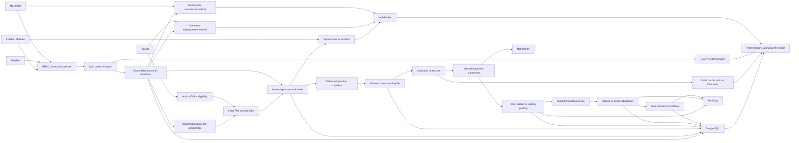
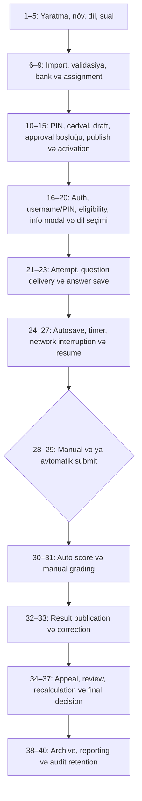
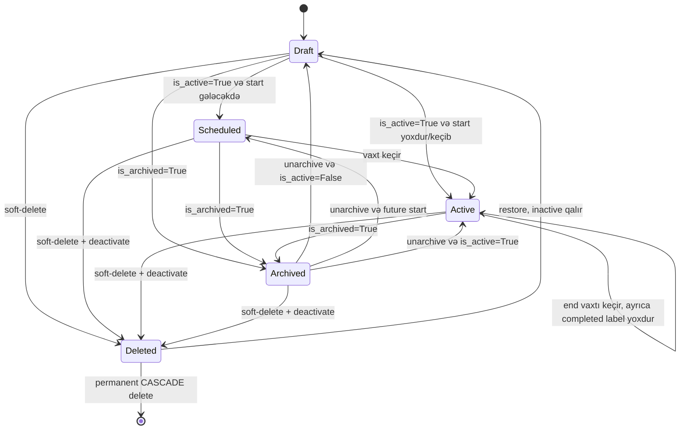
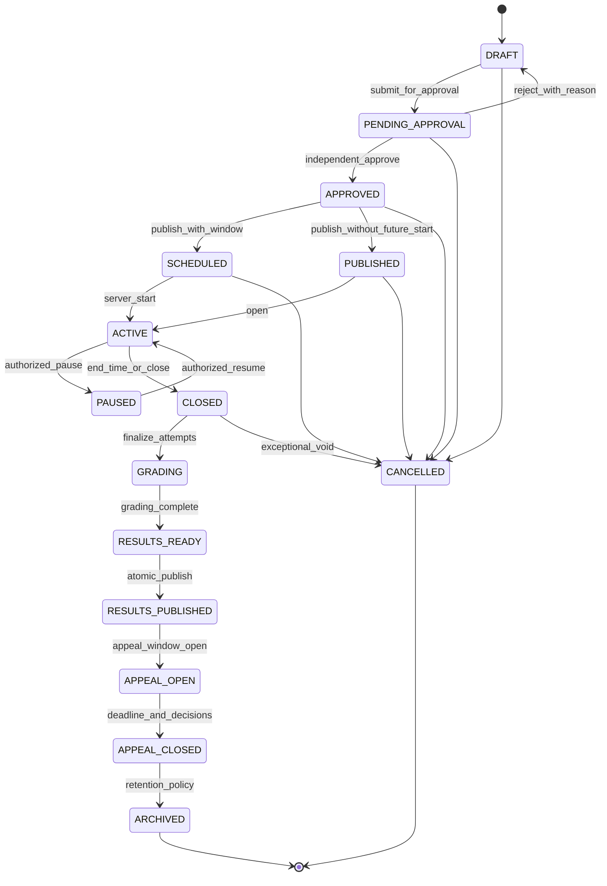
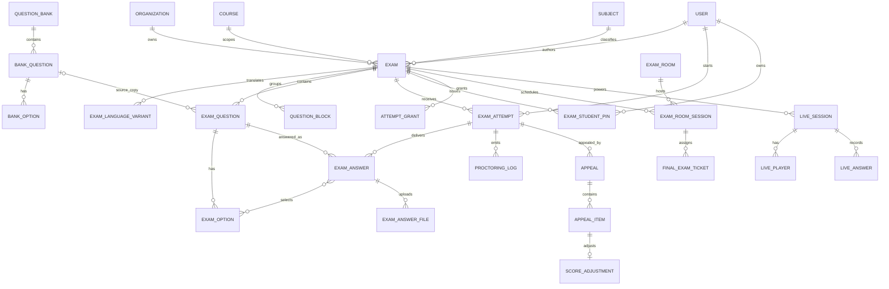

# EMSArena imtahan auditi — məcburi matrislər, diaqramlar və yoxlama siyahıları

**Snapshot:** `7c538163`, `Develop`  
**Audit tarixi:** 11 iyul 2026  
**Əsas hesabat:** [EMSArena_End_to_End_Audit_AZ_2026-07-11.md](./EMSArena_End_to_End_Audit_AZ_2026-07-11.md)  
**Tam fayl, simvol, cache və endpoint inventarı:** [EMSArena_Exam_System_File_Inventory_AZ_2026-07-11.md](./EMSArena_Exam_System_File_Inventory_AZ_2026-07-11.md)
**Bütün Python class/function deklarasiyaları:** [EMSArena_Exam_All_Python_Symbols_AZ_2026-07-11.md](./EMSArena_Exam_All_Python_Symbols_AZ_2026-07-11.md)  
**Bütün exam DB model/M2M cədvəlləri və field-lər:** [EMSArena_Exam_Database_Table_Inventory_AZ_2026-07-11.md](./EMSArena_Exam_Database_Table_Inventory_AZ_2026-07-11.md)

Bu əlavə ilkin tapşırıqda tələb olunan strukturlaşdırılmış çıxışları tamamlayır: komponent xəritəsi, arxitektura və lifecycle diaqramları, 40 mərhələli lifecycle matrisi, state machine, rol-icazə matrisi, endpoint və DB əlaqə təhlili, exam-type və grading matrisləri, təhlükəsizlik finding-ləri, yük hazırlığı, itkin testlər, incident checklist və production checklist.

---

## 1. İmtahan sistemi komponent xəritəsi

| Komponent | Əsas fayl/modul | Məqsəd | İstifadə edən rol | Cari vəziyyət | Əsas risk |
|---|---|---|---|---|---|
| Exam definition | `apps/exams/domain/exam_definition.py` | Növ, vaxt, kurs, assignment, görünürlük, limitlər | Müəllim, admin, exam center | İşlək | Formal state machine yoxdur |
| Access policy | `domain/access_policy.py`, `services/access_policy.py` | Görmə/start/content/room icazəsi | Bütün rollar | Qismən mərkəzi | Public exclusion və rol semantikası |
| Sual bankı | `domain/question_bank/*` | Bank, sual, variant, reuse, metadata | Exam center, müəllim | Zəngin | Version/approval/freeze natamam |
| Bulk/import | `services/parsing/*`, `bulk_workbench.py` | TXT/PDF/image extraction, preview, save | Exam center, müəllim | İşlək | Sync OCR fallback və import audit/lease |
| Dil variantı | `domain/language.py`, `services/language_variants.py` | AZ/EN/RU/TR exam variantları | Müəllim, tələbə | İşlək | Parity/publish validatoru yoxdur |
| Student/group assignment | `Exam.allowed_users`, `allowed_groups`, course membership | Eligibility | Müəllim, admin | İşlək | Join RLS boşluqları |
| Ümumi access code | `Exam.access_code` | Adi exam giriş kodu | Müəllim, tələbə | İşlək | Plaintext və zəif lifecycle |
| Fərdi student PIN | `domain/student_access.py`, `services/student_pins.py` | Final/midterm üçün exam+student PIN | Tələbə, exam center | Hash+cipher+throttle | Expiry/revoke/use state yoxdur |
| Final ticket PIN | `domain/final_center.py`, `services/final_center/pins.py` | Otaq/bilet giriş credentialı | Exam center, proctor, tələbə | Güclü | Paralel ikinci PIN sistemi |
| Attempt | `domain/attempts.py`, `services/attempts.py` | Cəhd, nömrə, status, vaxt, trial | Tələbə, müəllim | Constraint/lock yaxşı | Idempotency və scheduled sweep yoxdur |
| Delivered question | `services/randomizer.py` | Cəhdə sual setinin seçilməsi | Tələbə | İşlək | Tam snapshot və seed audit natamam |
| Answer | `ExamAnswer`, `ExamAnswerFile` | Seçim, mətn, paint, fayl | Tələbə, grader | İşlək | Canlı M2M tarixçəni dəyişə bilər |
| Autosave | `static/exams/js/take_exam/draft.js` və student view | Draft saving/recovery | Tələbə | İşlək | Server OCC yoxdur; plaintext localStorage |
| Timer | `static/.../timers.js`, `ExamAttempt` | Ümumi və sual vaxtı | Tələbə | Total server-authoritative | Per-question client-only |
| Submission | `views/student/attempts.py` | Save/finish/auto-finish | Tələbə | İşlək | Multi-tab/retry idempotency zəif |
| Test grading | `services/result_calculation.py` | Exact-match, point score | Sistem | İşlək | Incomplete snapshot/zero-correct multiple |
| Written grading | `views/teacher/results/_attempt_views.py` | Teacher score/feedback | Müəllim | İşlək | Client max-points question-u dəyişir |
| Coding grading | `services/coding_runtime/*` | Testcase execution və score | Sistem/müəllim | Prod-da disabled | Concurrency/output/backpressure |
| Result | `views/student/results.py` | Score, answer review, export | Tələbə, müəllim, admin | İşlək | Erkən correct-answer leakage |
| Appeal | `apps/appeals/*` | Pəncərə, review, adjustment | Tələbə, exam center | İşlək | Reviewer independence və snapshot |
| Supervision | `domain/supervision.py`, `services/supervision/*` | Incident, lock/resume, monitoring | Proctor, exam center | Prod-da disabled | Client telemetry etibarsızdır |
| Final center | `domain/final_center.py`, `services/final_center/*` | Room/session/ticket/computer | Exam center, proctor | Güclü state/lock | Join RLS və retention |
| Live exam | `apps/live_exam/*` | Lobby, question, reveal, score | Host, tələbə | İşlək | Late join/final lock və WS load |
| Trial exam | `apps/trial_exams/*` | PDF/lead/email request | Public/user/admin | İşlək lead flow | Real exam runner deyil; daemon thread |
| Notification | `apps/notifications/public.py` və exam calls | Assignment/feedback/appeal mesajı | Bütün rollar | İşlək | Purge schedule və delivery SLO yoxdur |
| Audit log | `apps/audit/*` və exam actions | Create/update/delete/grade izi | Admin/auditor | Qismən | RLS-siz, silinə bilən, best-effort yollar |
| PostgreSQL/RLS | `organizations/migrations/*rls*` | Tenant isolation, locking | Bütün backend axınları | Dizayn var | Default app superuser bypass edir |
| Redis/cache | `core/cache.py`, exam locks/rate keys | Cache, throttle, Channels, gates | Sistem | İşlək | Real HA/load sübutu və bəzi best-effort invalidation |
| Celery | `apps/exams/tasks/*` | OCR/export/AI/background work | Sistem | CAS claim yaxşı | Lease/retry/DLQ natamam |
| WebSocket | exam/live consumers və routing | Supervision/final/live real-time | Tələbə, proctor, host | Auth düzəlişləri var | Connection/load/retention sübutu yoxdur |
| Monitorinq | `core/metrics.py`, Prometheus/Grafana/Sentry | Texniki health və alert | Ops | Generic baza var | Exam business SLI/SLO yoxdur |

---

## 2. Tam imtahan arxitekturası

### 2.1. Əsas trust boundary-lər

1. **Brauzer → Django:** bütün score, max points, timer və incident payload-ları etibarsız inputdur.
2. **Django → PostgreSQL:** tenant təhlükəsizliyinin son sərhədi RLS olmalıdır; default Compose superuser-i bu sərhədi söndürür.
3. **Django/Celery → Redis:** throttle, lock, queue və Channels availability asılılığıdır.
4. **Django → coding sandbox:** prod-da disabled olsa da aktivləşəndə ən sərt execution/memory/network sərhədi olmalıdır.
5. **Cloudflare/Nginx → Django:** validated proxy chain olmadan IP-əsaslı nəzarət etibarlı deyil.
6. **Student telemetry → proctor:** client event sübut deyil, yalnız siqnaldır.

---

## 3. İmtahan lifecycle diaqramı

## 4. 40 mərhələli lifecycle matrisi

Qısaltmalar: **SA** — superadmin; **EC** — exam center; **T** — müəllim; **S** — tələbə; **P** — təyin edilmiş nəzarətçi.

| # | Mərhələ | Giriş şərti və rol/permission | DB/status əməliyyatı | Əsas failure/race/security riski | Test vəziyyəti |
|---:|---|---|---|---|---|
| 1 | Exam creation | Aktiv org; T/EC/SA; `exam.create` | `Exam` yaranır, adətən `is_active=False` | Org/author scope və incomplete config | Güclü view/form testləri |
| 2 | Konfiqurasiya | Exam owner və `exam.edit` | Vaxt, limit, access, course, settings update | Aktiv exam definition version-siz dəyişir | Əsas form testləri var |
| 3 | Növ seçimi | Create/edit | `exam_type=test/written/coding` | Coding prod-da disabled; type change köhnə data ilə ziddiyyət yarada bilər | Coding flag testləri var |
| 4 | Dil konfiqurasiyası | T/EC content access | `ExamLanguageVariant` və default language | Variant parity, missing translation | 7 language test; parity boşluğu |
| 5 | Sual yaratma | T; final üçün EC | `ExamQuestion`, options/media/block | Multiple üçün zero-correct; aktiv exam edit | Form/policy testləri var |
| 6 | Sual importu | Content permission və upload | `TextExtractionJob`, preview payload | Sync OCR fallback, partial/audit/lease | Extraction/bulk testləri güclü |
| 7 | Sual validasiyası | Preview/workbench | Parse warning və selected indices | UI warning publish-i bloklamır | Parser testləri var |
| 8 | Bank assignment | Final üçün EC; digər exam owner | Bank sualı exam-a kopyalanır | Source edit/version və NULL-org bank | Attach/isolation testləri var |
| 9 | Student/group assignment | `exam.edit/manage` | M2M allowed users/groups; course membership | Join RLS boşluğu, stale PIN | Assignment/PIN provisioning testləri var |
| 10 | Unique PIN | Final/midterm assignment | `ExamStudentPin` və ya `FinalExamTicket` | İki sistem; student PIN expiry/revoke/use yoxdur | PIN və throttle testləri var |
| 11 | Scheduling | Start/end form valid | Datetime fields update | Timezone/grace/overlap və room capacity validation | Əsas form/final-center testləri |
| 12 | Draft | `is_active=False` | Computed `draft` | Formal immutable draft version yoxdur | Dashboard testləri |
| 13 | Approval | **Tətbiq edilməyib** | Heç bir approved_by/approved_at yoxdur | Creator özü bir kliklə publish edir | Test yoxdur; feature yoxdur |
| 14 | Publication | Toggle action; `exam.edit` | `is_active=True` | Readiness/approval/parity check yoxdur | Toggle testləri var, invariant yox |
| 15 | Activation | Active + time window | Computed scheduled/active | Ended exam da `active` label; archive guard yoxdur | Vaxt/access testləri qismən |
| 16 | Student auth | Login və ya final entry | Session auth | Duplicate email, proxy rate-limit sərhədi | Auth/security testləri var |
| 17 | Username+PIN | Final entry; S | PIN hash verify; cache throttle | Student PIN username-only throttle, no durable failed audit | 5 throttle testi + PIN testləri |
| 18 | Eligibility | Active, vaxt, assignment, attempts | Read-only checks, stale attempt expire | Public exclusion bypass; archive direct method guard yoxdur | Çox access testi, bu iki ssenari boş |
| 19 | Exam-info modal | Eligibility-dən sonra UI | DB dəyişmir | Subject/teacher/count/points/privacy/technical info natamam | Visual manual audit |
| 20 | Dil seçimi | Active variant | `attempt.language/language_variant` | Startdan sonra switch/fallback/fairness | Əsas language testləri |
| 21 | Attempt creation | Eligibility və PIN | `ExamAttempt`; row locks; attempt number | Lost response/idempotency key yoxdur | Constraint/concurrency testləri güclü |
| 22 | Question delivery | Attempt active | `ExamAnswer` delivered rows + partial snapshot | Text/order/media/selected snapshot natamam | Randomizer/snapshot testləri |
| 23 | Answer save | Attempt owner, deadline | Answer/M2M/text/file update | Missing disabled field cavabı silə bilər | Save/view testləri var |
| 24 | Autosave | Dirty client state | Partial answer update | Out-of-order multi-tab overwrite; 5 dəq interval | UI behavior testləri qismən |
| 25 | Timer | Attempt active | Total deadline server; qTimer client | Reload/clock tamper və expiry data loss | Total timer testli; qTimer server testi yox |
| 26 | Network interruption | Client offline/timeout | localStorage draft | Plaintext/shared-device; binary save yoxdur | Məqsədli offline test yoxdur |
| 27 | Resume | Draft/in_progress attempt | Mövcud attempt qaytarılır | qTimer sıfırlanır; server revision yoxdur | Resume əsas axını qismən testli |
| 28 | Manual submit | Owner, active attempt | Final answer save, `submitted`, finished_at | Double device/retry və pending autosave race | Əsas submit testləri; idempotency boş |
| 29 | Auto submit | Total timeout və ya supervision | `expired/submitted` | Browser bağlıdırsa lazy expiry; qTimer client | Total expire testləri var |
| 30 | Score calculation | Test/coding submit | Decimal result/counters/submission score | Live M2M və legacy fallback tarixi dəyişir | Result calculation güclü, delete/recreate boş |
| 31 | Manual grading | `grade.input` və review window | answer/attempt teacher_score | POST max points global question-u dəyişir | Mövcud test davranışı qoruyur, tamper testi yox |
| 32 | Result publication | Hidden=false | Boolean toggle və view | Test/coding dərhal görünür; exam-wide seal yoxdur | Toggle/visibility testləri var |
| 33 | Result correction | 5 dəqiqə edit və ya appeal | Score/feedback/adjustment | Silent historical mutation və audit separation | Review-window testləri var |
| 34 | Appeal submission | Owner, pəncərə, `appeal.create` | `Appeal` + items | Result publish state ilə sərt bağlı deyil | Creation/window testləri yaxşı |
| 35 | Appeal review | EC; respond/decide | Item status/note | Reviewer assignment/conflict/second review yoxdur | State/scoring testləri var |
| 36 | Grade recalculation | Accepted item | One-to-one `ScoreAdjustment` | Snapshot exactness və fallback legacy | Idempotency/bonus testləri var |
| 37 | Final decision | EC | Appeal final status, resolved fields | Respond/decide eyni rol; internal note visibility | Əsas decision testləri |
| 38 | Archive | Owner/`exam.edit` | `is_archived/archived_at` | Archive deactivate etmir; direct start method guard yoxdur | Archive/soft-delete testləri var |
| 39 | Reporting | Teacher/EC/admin scope | XLSX/DOCX/HTML statistics | Export tenant/RBAC və large payload/query budget | Export testləri var; load/query budget zəif |
| 40 | Audit retention | Ops/admin | `AuditLog` və event tarixçəsi | RLS yoxdur; superuser delete; retention/legal hold yoxdur | Audit function testləri var, immutability yox |

---

## 5. Cari və tövsiyə olunan state machine

### 5.1. Faktiki Exam state-i

`Exam` üçün saxlanan vahid status yoxdur; `is_active`, `is_archived`, `is_deleted` və vaxtlardan computed label yaranır.

**Faktiki problem:** approval, published, paused, completed/closed, grading, results-ready, results-published, appeal-open/closed və cancelled exam state-ləri yoxdur. Attempt statusu ayrıca `draft/in_progress/submitted/expired`, supervision statusu ayrıca `active/warned/locked/removed/resumed`-dir.

### 5.2. Tövsiyə olunan server state machine

Hər transition transaction daxilində actor, reason, əvvəlki/yeni state, timestamp və definition version ilə append-only event yazmalıdır. Publish yalnız completeness, language parity, correct-answer, points, schedule, assignment və room-capacity validatorları keçdikdən sonra mümkündür.

---

## 6. İmtahan növləri və grading qaydası

### 6.1. Faktiki dəstəklənən exam və question tipləri

`Exam.exam_type` yalnız `test`, `written` və `coding` saxlayır; `quiz/midterm/final/placement/practice` ayrıca kateqoriyadır, question tipi deyil. `ExamQuestion.answer_mode` yalnız `single/multiple`-dır.

| Tələb olunan tip | DB təmsili | End-to-end vəziyyət | Save/grade | Appeal | Import/export | Nəticə |
|---|---|---|---|---|---|---|
| Single-choice MCQ | `test + answer_mode=single + options` | Tam | Exact option-set, all-or-nothing, question points | Var | Text/PDF/image import; DOCX/XLSX report/export | **Dəstəklənir** |
| Multiple-answer MCQ | `answer_mode=multiple` | Tam UI/save | Exact-set, partial credit yoxdur | Var | Eyni parser | **Dəstəklənir**, amma zero-correct validatoru yoxdur |
| True/false | Xüsusi type yoxdur; 2-option single kimi modellənə bilər | Xüsusi authoring/semantic validation yoxdur | Single-choice kimi | Var | Manual/generic | **Qismən**, ayrıca tip deyil |
| Short answer | `written + text_answer` | Generic textarea | Manual/AI suggestion | Var | Text import generic | **Qismən**, strukturlaşdırılmış tip deyil |
| Long written/essay | `written + text_answer` | Tam generic written flow | Teacher score/feedback | Var | Generic | **Dəstəklənir**, rubric/second review zəifdir |
| Fill-in-the-blank | Xüsusi field/token yoxdur | Generic written kimi mümkündür | Auto exact/normalization yoxdur | Written kimi | Generic | **Qismən** |
| Matching | Model/UI yoxdur | Yox | Yox | Yox | Yox | **Dəstəklənmir** |
| Ordering | Model/UI yoxdur | Yox | Yox | Yox | Yox | **Dəstəklənmir** |
| File-upload answer | `ExamAnswerFile`, written answer flow | Upload validatorları ilə | Manual | Var | Source import deyil | **Qismən dəstəklənir** |
| Paint/handwritten image | `paint_image/paint_data_url` | Written exam-da | Manual/AI | Written kimi | N/A | **Dəstəklənir**, payload/storage limiti vacibdir |
| Practical assignment | Ayrı model yoxdur | `coding` “practical” kimi adlandırılır | Coding testcase | Var | JSON test cases | **Prod-da deaktivdir** |
| Coding | CodingQuestion/TestCase/Submission/File | Geniş UI/runtime | Testcase point sum | Var | Form/JSON | **Kodda var, production.py-də deaktivdir** |
| Oral | Model/UI/recording/rubric yoxdur | Yox | Yox | Yox | Yox | **Dəstəklənmir** |
| Mixed-format | Exam-level type təkdir | Test+written eyni exam üçün rəsmi flow yoxdur | Qarışıq aggregator yoxdur | Natamam | Natamam | **Dəstəklənmir** |
| Adaptive | Ability model/next-question policy yoxdur | Yox | Yox | Yox | Yox | **Dəstəklənmir** |
| Live quiz | Ayrı `live_exam` session/player/answer | Tam ayrı flow | Live scoring | Əsas appeal flow-a bağlı deyil | Host question serialization | **Dəstəklənir**, summativ exam deyil |

### 6.2. Grading-rule matrisi

| Tip | Qayda | Precision/limit | Müsbət tərəf | Kritik boşluq |
|---|---|---|---|---|
| Single test | Selected ID set == correct ID set | `Decimal` points; percentage 0.1 | Delivered-answer set üzrə hesablanır | Selected answer canlı M2M; snapshot yarımçıq |
| Multiple test | Bütün düzgünlər və yalnız düzgünlər seçilməlidir | All-or-nothing | Sadə və deterministik | Partial credit/negative marking yoxdur; zero-correct mümkündür |
| Unanswered test | Selection boşdursa unanswered | 0 point | Ayrı sayğac | Option delete selection-u boşalda bilər |
| Written | `answer.teacher_score` və attempt total | PositiveInteger, üst bound yoxdur | Feedback və review window | Client max score question.points-i dəyişir |
| Paint/file written | Written qaydası | Fayl/paint ayrıca | Upload validatorları | Rubric, malware post-processing və immutable file hash yoxdur |
| Coding | Keçən testcase-lərin `point_value` cəmi | `Decimal` | Visible/hidden ayrılığı | Max total constraint, duplicate final, late submit və output cap |
| Appeal | Qəbul olunan item üçün default +1; max-a clamp | `Decimal(7,2)` | OneToOne idempotency və previous score | Fixed bonus akademik qaydanı əvəz etmir; snapshot/conflict |
| Pass/fail/grade scale | Exam result faizi; registrar inteqrasiyası ayrıca | Müxtəlif qatlar | Registrar daha formal scale verir | Exam-level vahid immutable grade rule/version yoxdur |
| Penalty/negative | Tətbiq edilməyib | — | — | Policy/UI/model yoxdur |
| Cancelled question | Tətbiq edilməyib | — | — | Denominator versioning və mass regrade yoxdur |

---

## 7. Rol və icazə matrisi

İcazə lüğəti: `exam.view/create/edit/manage/host/delete`, `grade.view/input/publish/override`, `appeal.create/respond/decide`. `exam.*` bütün exam permission-larını verir.

### 7.1. Rol səthinin xəritəsi

| Rol | Faktiki permission/scope | İmtahan davranışı | Risk/qeyd |
|---|---|---|---|
| Super Admin | `*`; tenant bypass yalnız idarəli GUC olmalıdır | Bütün exam/final/room/audit əməliyyatları | Güclü rol; two-person control yoxdur |
| Org owner / Rector / Director / Manager | `*` | Bütün təşkilat exam-ları | Academic duty separation yoxdur |
| Vice-Rector / Deputy Director | `exam.* + grade.*` | Tam idarəetmə | Çox geniş, formal approval rolu deyil |
| Dean / Chair Head / Section Head | Unit scope + `exam.*` | Scope daxilində tam idarəetmə | Scope enforcement hər endpointdə mərkəzi olmalıdır |
| Exam Center Head / legacy Exam Center | `exam.*`, grade view/publish, appeal respond/decide, audit view | Final content, PIN, monitor, result, appeal, invigilator assignment | Respond və decide eyni roldadır |
| Exam Center Staff | `exam.*`, grade.view, audit.view | Şərhdə monitor/PIN/report deyilir, permission isə create/edit/delete/host/manage də verir | **Over-privilege ziddiyyəti** |
| Teacher / Instructor | Teacher: explicit create/edit/host/delete + grade.input; instructor `exam.*` | Öz/scope exam authoring və grading | Active/published edit və max-score trust |
| Assistant / Teaching Assistant | Əsasən exam.view; lab assistant grade.input + view | Read-only və ya lab grading | Legacy profile flags ilə permission yoxlaması ayrılarsa drift riski |
| Observer | Canonical default role yoxdur | Generic read-only rol kimi modellənməyib | Ad-hoc access və audit boşluğu |
| Proctor / Invigilator | M2M assigned session; ayrıca canonical role məcburi deyil | Yalnız təyin olunmuş session supervise | Assignment lifecycle/retention və join RLS |
| Student | exam.view + appeal.create; object eligibility | Öz attempt/result/appeal | Public exclusion bug və early result |
| Head Student / Lead Student | Student + limited member/analytics | Öz exam/appeal; qrup görünürlüğü | Başqasının nəticəsini görməməlidir |
| HR / Parent | Exam permission yoxdur və ya yalnız analytics | Exam idarəetməsinə giriş olmamalıdır | Negative authorization test vacibdir |

### 7.2. Authoring və lifecycle əməliyyatları

İşarələr: **✅** — permission ilə; **O** — yalnız obyekt/scope şərti; **R** — read-only; **—** — yoxdur; **Y** — feature özü yoxdur.

| Rol | Yarat | Redaktə | Soft-delete | Permanent delete | Approval | Publish/activate | Cancel | Student assign | Sual əlavə/dəyiş | Correct answer gör |
|---|---:|---:|---:|---:|---:|---:|---:|---:|---:|---:|
| Superadmin | ✅ | ✅ | ✅ | ✅ | Y | ✅ | Y | ✅ | ✅ | ✅ |
| Rector/owner | ✅ | ✅ | ✅ | ✅ | Y | ✅ | Y | ✅ | ✅ | ✅ |
| Vice/dean/chair | O | O | O | O | Y | O | Y | O | O; final üçün EC guard | O |
| EC head | ✅ | ✅ | ✅ | ✅ | Y | ✅ | Y | ✅ | ✅ | ✅ |
| EC staff | ⚠ ✅ via `exam.*` | ⚠ ✅ | ⚠ ✅ | ⚠ ✅ | Y | ⚠ ✅ | Y | ✅ | ✅ | ✅ |
| Teacher | O | O | O | O | Y | O | Y | O | O; final deyil | O |
| Assistant | — | — | — | — | Y | — | Y | — | — | R |
| Assigned proctor | — | — | — | — | Y | — | Y | — | — | — |
| Student/lead student | — | — | — | — | Y | — | Y | — | — | — |

### 7.3. İcra, nəticə və appeal əməliyyatları

| Rol | PIN yarat/göstər | Start | Monitor | Pause/lock/resume | Time extend | Başqası üçün submit | Grade | Grade dəyiş | Result publish | Appeal review/decide | Export | Audit gör |
|---|---:|---:|---:|---:|---:|---:|---:|---:|---:|---:|---:|---:|
| Superadmin | ✅ | Trial/O | ✅ | ✅ | ✅ | Admin flow-dan asılı | ✅ | ✅ | ✅ | ✅ | ✅ | ✅ |
| Rector/owner | O | Trial/O | O | O | O | Məhdud | O | O | O | O | O | O |
| EC head | ✅ | Trial/O | ✅ | ✅ | ✅ | Final-center flow | View/publish; input semantikası parçalı | O | ✅ | ✅ | ✅ | ✅ |
| EC staff | ✅ | Trial/O | ✅ | O | O | Final-center flow | R | — | ⚠ `exam.*` ilə visibility toggle | Permission-də appeal decide yoxdur | ✅ | ✅ |
| Teacher | Öz exam | Trial/O | Öz exam | Supervision permission-dən asılı | O | Məhdud | ✅ | 5 dəq pəncərə | Visibility toggle | Appeal create; decide deyil | Öz exam | Adətən — |
| Assistant/lab assistant | — | — | R | — | — | — | Lab assistant `grade.input`, exam flow object check tələb edir | — | — | — | R | — |
| Assigned proctor | Session PIN görünürlüğü policy-yə bağlı | — | O | O | O | Force action varsa O | — | — | — | — | O | Hadisə izi |
| Student | Öz PIN | ✅, eligibility | — | — | Accommodation obyekti yoxdur | Öz attempt | — | — | — | Öz appeal create | Öz nəticə | — |
| Lead student | Öz PIN | ✅ | — | — | — | Öz | — | — | — | Öz appeal | Öz | — |

**Əsas RBAC finding — EXAM-RBAC-001:** `exam_center_staff` üçün şərh “monitor/PIN/report, invigilator təyin etmir” deyir, amma `exam.*` create/edit/manage/host/delete də verir. Xüsusi `can_assign_invigilators` guard bu bir əməliyyatı məhdudlaşdırır, digər geniş əməliyyatları yox. Rol least-privilege permission siyahısına parçalanmalıdır.

---

## 8. Final exam PIN sistemi

### 8.1. İki paralel sistem

| Xüsusiyyət | `ExamStudentPin` | `FinalExamTicket` PIN |
|---|---|---|
| Scope | exam + student unique | exam/session/ticket/student |
| Generator | `secrets.choice`, default 8 rəqəm | Eyni |
| Verification storage | Django salted hash | Django salted hash |
| Display storage | Fernet cipher | Fernet cipher |
| Visibility | Tələbə kabinetində dərhal | Exam startdan configurable dəqiqə əvvəl |
| Expiry | **Yoxdur** | exam end + grace |
| Revoke/regenerate | Model/service lifecycle yoxdur; reprovision mövcudu saxlayır | Explicit set/revoke/wipe |
| Failed attempts | Cache-də per-username 10/60s | DB atomic counter + temporary lock |
| Use/completion invalidation | Yoxdur | Ticket status/revoke/wipe |
| RLS | Policy tapılmadı | Final ticket cədvəlində var |
| Məqsəd | Biletsiz final/midterm giriş | Otaq/session final-center flow |

### 8.2. Abuse-case matrisi

| Ssenari | Cari müdafiə | Qalıq risk | Tələb olunan test/fix |
|---|---|---|---|
| Valid username + invalid PIN | Uniform failure; username throttle | Failed event durable audit deyil | Structured audit + metric; enumeration timing test |
| Invalid username + valid PIN | Dummy timing final ticket-də; student resolver user tapır sonra dayanır | Timing fərqi ölçülməlidir | Constant-cost lookup/hash test |
| Başqa tələbənin PIN-i | exam+student hash lookup | PIN+username birlikdə oğurlanarsa reuse | Device/session policy və concurrent-use gate |
| Başqa exam PIN-i | Exam relation ilə yoxlanır | Birdən çox aktiv final loop-u timing/ambiguity | Exact exam/session selector və test |
| Expired PIN | Ticket reject edir | Student PIN heç vaxt expire olmur | expires_at/revoked_at model |
| İstifadə olunmuş PIN | Ticket status qismən bağlayır | Student PIN completion sonrası işlək qalır | used_at/consumed_by_attempt |
| Regenerated köhnə PIN | Ticket hash dəyişir | Student PIN üçün public rotate yoxdur | Atomic rotate və old-PIN regression |
| Brute force | Student username cache throttle; ticket lock | Redis reset/fail-open və proxy/IP siqnalı yoxdur | Layered username+device/global anomaly limit |
| Paralel login | Attempt unique/lock kömək edir | PIN use özü atomik consume deyil | PIN consume + attempt create same transaction |
| Cross-tenant | App selector + ticket RLS | StudentPin RLS yoxdur; default superuser | RLS policy və raw SQL tests |
| Başqa cihazdan reuse | Yoxdur | Credential paylaşımı | Risk-based signal; policy, sərt device lock deyil |
| Startdan sonra PIN copy | Attempt active gate qismən | İkinci session eyni attempti aça bilər | Session binding/re-auth və concurrent tab policy |
| URL/log/history exposure | POST və hash/cipher dizaynı | Structured log masking təsdiqi lazımdır | Secret scanning/log assertion |
| PIN enumeration | Generic response və dummy hash qismən | Student path constant-time tam sübut olunmayıb | Latency distribution security test |

### 8.3. Tövsiyə olunan vahid PIN lifecycle

`ISSUED → VISIBLE → VERIFIED → CONSUMED → REVOKED/EXPIRED` state-i; PIN hash, optional encrypted display copy, `issued_at/expires_at/verified_at/consumed_at/revoked_at/rotation_version`; exam+student+version unique; consume və attempt creation eyni transaction; generic response; layered throttle; hər failure/success metric və privacy-safe audit; session bitəndə cipher wipe.

---

## 9. Çoxdilli exam matrisi

| Yoxlama | Cari implementasiya | Qiymət | Risk/fix |
|---|---|---:|---|
| Logical relation | `ExamLanguageVariant.exam` | ✅ | Relation var |
| Question mapping | Question variant FK və language | ⚠ | Cross-language stable question key yoxdur |
| Option mapping | Ayrı option sətirləri | ❌ | Stable option translation key yoxdur |
| Score equivalence | Hər sualda sərbəst `points` | ❌ | Publish parity validatoru |
| Count equivalence | Məcburi deyil | ❌ | Variant question count gate |
| Correct-answer consistency | Məcburi deyil | ❌ | Stable semantic answer mapping |
| Order equivalence | Ayrı order | ⚠ | Fairness policy açıq deyil |
| Missing translation | Variant qismən qala bilər | ❌ | Publish block + completeness report |
| Fallback | Default AZ/legacy logic | ⚠ | Fallback exam zamanı dil qarışdıra bilər |
| Attempt language | `attempt.language/language_variant` | ✅ | Tarixi görünürlük saxlanmalıdır |
| Answer language | Answer ayrıca language saxlamır | ⚠ | Snapshot-a language/version əlavə et |
| Report visibility | Qismən | ⚠ | Bütün export/appeal-də göstər |
| Appeal visibility | Question relation vasitəsilə | ⚠ | Exact translated snapshot lazımdır |
| Startdan sonra switch | Sərt immutable policy tam görünmür | ⚠ | Attempt yaradıldıqdan sonra lock |
| Dörd locale | AZ/EN/RU/TR constants | ✅ | Public entry-də TR görünürlüğü uyğunsuzdur |

**Publish bloklayıcı qayda:** hər stable question key üçün bütün aktiv dillərdə question mövcudluğu, eyni points, eyni answer mode, option cardinality, stable option mapping və eyni correct semantic key; fərq yalnız redaktə üçün açıq explicit waiver və independent approval ilə qəbul oluna bilər.

---

## 10. Sual bankı və import matrisi

### 10.1. Bank

| Sahə | Cari vəziyyət | Risk |
|---|---|---|
| Ownership/org | QuestionBank org nullable legacy; RLS NULL-u global görür | Legacy NULL bank tenantlararası görünə bilər |
| Subject/course | Bank metadata var, relationlar qismən | Scope policy hər query-də vacib |
| Difficulty/tags/topic | Difficulty, source, tags, block və analysis | AI/manual drift və taxonomy governance |
| Correct answer/explanation | Options/correct_answer/explanation | Version/freeze yoxdur |
| Reuse | Source bank question link + copy/attach | Keçmiş exam üçün source deyil, delivered snapshot əsas olmalıdır |
| Duplicate | Fingerprint/workbench warning | DB unique deyil; warning bypass edilə bilər |
| Approval/status | Tam bank approval/retirement workflow yoxdur | Keyfiyyətsiz sual publish |
| Version/history | Immutable version yoxdur | Edit historical nəticəyə təsir edə bilər |
| Import/export | Preview + XLSX/DOCX report/export | Export import formatı ilə eyni contract deyil |
| Audit | Action-lar qismən loglanır | Full before/after version event yoxdur |

### 10.2. Source import formatları

| Format | Dəstək | Faktiki yoxlama | Risk/qeyd |
|---|---:|---|---|
| TXT | ✅ | Size; UTF-8 `errors=ignore` | Encoding səhvi səssiz simvol itirə bilər |
| PDF text | ✅ | Size, %PDF magic, encrypted reject, active-content keyword scan | Keyword scan tam PDF sanitizer/sandbox deyil |
| Scanned PDF | ✅ | Text-layer detect → OCR; page/DPI limit | CPU burst; sync fallback |
| PNG/JPG | ✅ | Magic bytes + OCR | Decompression/memory ölçüsü və OCR cost |
| DOC/DOCX/DOCM/RTF | ❌ | Explicit reject | Təhlükəsizlik baxımından şüurlu qərar |
| CSV | ❌ | Source import flow yoxdur | Tapşırıqda gözlənilirsə dokumentasiya/UI bunu deməlidir |
| XLS/XLSX | ❌ import; ✅ report/export | Macro variants blocked | Formula injection export testləri ayrıca olmalıdır |
| ZIP | ❌ | Explicit blocked | Düzgün |
| EXE/JS/HTML/macro | ❌ | Extension block | MIME/content scanning defense-in-depth tələb edir |
| AI generation | Ayrı flow | Prompt → preview/workbench | Tenant rate/cost, hallucination və human confirmation |

**Transaction davranışı:** final save bulk path-larında transaction istifadəsi və preview mövcuddur; lakin import job crash lease, durable per-row audit, re-run idempotency və “heç nə yazılmadı” invariantı bütün yollar üçün vahid contract deyil.

---

## 11. Endpoint səthi

Runtime Django resolver **134 HTTP** endpoint, Channels routing isə **5 WebSocket** endpoint qaytarır. Hər URL pattern, namespace/name və callback-in tam cədvəli [fayl inventarının “Runtime endpoint cədvəlləri” hissəsində](./EMSArena_Exam_System_File_Inventory_AZ_2026-07-11.md) verilib.

| Endpoint ailəsi | Nümunə namespace/səth | Rol | Əsas nəzarət | Risk |
|---|---|---|---|---|
| Teacher exam CRUD | `exams:teacher_*` | Teacher/admin/EC | Login, org, permission, author/scope | Broad wildcard və lifecycle |
| Question/bank/import | `exams:*question*`, extract jobs | Teacher/EC | Content policy, upload validation | Version, sync OCR, final-only EC |
| Language | `exams:*language*` | Teacher/EC | Exam ownership/content | Parity gate yoxdur |
| Student list/start/take | `exams:student_*`, start/take | Student | Tenant, eligibility, PIN, attempt | Public exclusion, qTimer/OCC |
| Result/history | `exams:*result*` | Owner student/teacher/EC | Attempt ownership və scope | Early answer release |
| Coding API | Run/autosave/submit JSON | Student | Feature flag, ownership | Duplicate/late/output |
| Supervision API | Incident/snapshot/actions | Student/proctor/EC | Feature flag və object scope | Payload trust/rate |
| Final center | Room/session/ticket/PIN/monitor | EC/proctor/student | Object permission, signed WS | Join RLS, two PIN paths |
| Appeals | `appeals:*` | Student/EC | Ownership, window, org | Duty separation |
| Live HTTP/API v1 | `live_exam:*` | Host/player | Token/session/role/rate | Late join/state |
| Trial | `trial_exams:*` | Public/user/admin | Form/upload/email | Real exam deyil |
| WebSocket | supervision/final/live patterns | Student/proctor/host | Signed/session/object auth | Capacity/reconnect evidence yoxdur |

Serializasiya DRF model serializer-ları ilə deyil, əsasən `apps/live_exam/serializers.py` funksiyaları və JsonResponse payload builder-ları ilə aparılır. Tam serializer/API simvol indeksi inventardadır.

---

## 12. Database cədvəlləri və əlaqə təhlili

### 12.1. Əsas əlaqə diaqramı

### 12.2. RLS və tarixçə statusu

| Cədvəl/qrup | Tenant yolu | RLS | Tarixi dəyişməzlik | Qərar |
|---|---|---:|---:|---|
| `exams_exam` | direct organization | ✅ | ❌ mutable + permanent delete | RLS default app role ilə faktiki bypass olunur |
| Exam language/question/option/block | exam → org | ✅ | ❌ live mutable | Immutable definition version lazımdır |
| Exam allowed users/groups | exam → org | Qismən; bəzi through-lar var | N/A | `excluded_users` join policy-sizdir |
| `ExamAttempt` | exam → org | ✅ | ⚠ status mutable | Append-only transition event əlavə et |
| `ExamAnswer`/file/selected M2M | attempt → exam → org | ✅ | ❌ live FK/M2M | Full answer snapshot + PROTECT |
| Coding models | question/attempt → exam | ❌ | ❌ | Bütün CRUD üçün RLS |
| `ExamStudentPin` | exam → org | ❌ | Credential | RLS + lifecycle |
| `StudentExamAttemptGrant` | exam → org | ❌ | Mutable | RLS + audit |
| Supervision config/incident | exam/attempt → org | ❌ | Mutable event | RLS + append-only/retention |
| QuestionSubmission + groups | org/group | ❌ | Mutable review | RLS + decision history |
| Final room/session/ticket | direct org | ✅ | ⚠ mutable | Əsas cədvəllər yaxşı |
| Room invigilators/session staff joins | parent → org | ❌ | Assignment history yoxdur | RLS + effective dates |
| ExamRoomComputer | direct org | ✅ | Mutable | Device change audit |
| Appeals + item + adjustment | direct/indirect org | ✅ | ⚠ CASCADE/mutable/reverted | Snapshot və immutable decision event |
| Live session/player/answer | exam/session → org | ✅ | Session cleanup policy yoxdur | Retention + final lock |
| QuestionBank | nullable org | ✅, NULL global | Mutable | NULL backfill/fail-closed |
| AuditLog | organization | ❌ | ❌ admin delete | P0/P1 append-only/RLS |
| AI log | context/user/org-derived | ❌ | Mutable/CASCADE | RLS + retention/redaction |

### 12.3. Constraint analizi

**Güclü constraint-lər**

- `ExamAttempt(user, exam, attempt_number)` unique.
- Eyni user/exam üçün partial active attempt unique.
- `ExamAnswer(attempt, question)` unique.
- `ExamStudentPin(exam, student)` unique.
- `StudentExamAttemptGrant(exam, student)` unique.
- `AppealItem(appeal, question)` unique.
- `ScoreAdjustment.appeal_item` OneToOne.

**Çatışmayan constraint-lər**

- Teacher/answer score-un snapshot max-dan böyük olmaması.
- Multiple option set-də ən az bir correct; DB-də single üçün də cardinality constraint mümkün deyil, service gate lazımdır.
- Coding üçün bir final submission/question/attempt və deadline.
- Exam state transition/version.
- Supervision incident immutable schema/deduplication.
- PIN active version/expiry/consumed invariantı.
- Cross-field parent consistency: answer option eyni question-a aid olmalıdır; appeal question/answer eyni attemptə aid olmalıdır.
- Permanent delete üçün legal hold/retention gate.

---

## 13. Prioritetli exam təhlükəsizlik və business finding-ləri

| ID | Səviyyə | Dəqiq yer və sübut | Hücum/failure ssenarisi və biznes təsiri | Fix və verification testi |
|---|---|---|---|---|
| EXAM-SEC-001 | **P0/Kritik** | `docker-compose.prod.yml:57,123-133`; `organizations/0003_rls_policies.py:25-31` | Runtime bootstrap superuser ilə qoşulur; unudulmuş tenant filter raw olaraq bütün exam/answer/grade məlumatını açır | Owner/migration/app rollarını ayır; app `NOSUPERUSER NOBYPASSRLS`; startup assert; raw cross-tenant CRUD testi |
| EXAM-SEC-002 | **P0/Kritik** | Coding, PIN, grant, supervision, QuestionSubmission və join cədvəllərində policy yoxdur | Non-superuser düzəldildikdən sonra belə həmin child cədvəllər cross-tenant raw access verir | Model→policy coverage gate; hər cədvəl üçün SELECT/INSERT/UPDATE/DELETE Postgres test |
| EXAM-INTEGRITY-001 | **P0/Kritik** | `ExamAnswer.question_snapshot` yalnız points/mode/option id+correct; `selected_options` live M2M; `forms/question.py:362-367` delete/recreate | Müəllim option edit edir, keçmiş selection M2M silinir, score və appeal sübutu dəyişir | Full delivered+selected snapshot; edit/delete regression; legacy backfill/unverifiable marker |
| EXAM-LOGIC-001 | **P0/Kritik** | `_attempt_views.py:274-306` POST max score-u `q.points`-ə yazır | Grader böyük score/max göndərib exam denominatorunu və başqa attempt tarixçəsini dəyişir | Max yalnız snapshot/rubric; DB/service clamp; tamper POST test; question unchanged assertion |
| EXAM-LOGIC-002 | **P0/Yüksək** | `_helpers.py:34` test/coding result dərhal; `results.py:32,63-68`; result template correct answer | Erkən submit edən tələbə aktiv peer-lərə düzgün cavab ötürür | Exam-wide sealed/published state; active peer ssenarisi; pre-publish correct-answer 404/403 test |
| EXAM-RBAC-001 | **P1/Yüksək** | `default_roles.py` exam_center_staff şərhdə monitor/PIN/report, amma permission `exam.*` | Staff account exam yaradır, dəyişir, host və silir; least privilege pozulur | Explicit view/monitor/pin/export permission-ları; negative endpoint matrix testləri |
| EXAM-TIME-001 | **P1/Yüksək** | `static/.../timers.js:85-116` deadline `Date.now()`; input disable `:4-10` | Reload/clock change qTimer-i sıfırlayır; disabled field submitdə düşüb cavabı silir | Server question_started/deadline; expired answer contract; reload/clock/missing-field tests |
| EXAM-SAVE-001 | **P1/Yüksək** | `draft.js:289-349` revision yalnız client tabındadır, request version yoxdur | Yavaş tabın köhnə autosave-i yeni tab cavabını overwrite edir | Server monotonic revision/ETag, 409 conflict, idempotency; out-of-order integration test |
| EXAM-ACCESS-001 | **P1/Yüksək** | `domain/access_policy.py:157-161` public return exclusion-dan əvvəldir | Xüsusi excluded user public examı görür/başlayır | Exclusion-u public-dən əvvəl yoxla; public excluded start/list tests |
| EXAM-ACCESS-002 | **P1/Yüksək** | `can_user_start` archive/delete-i birbaşa yoxlamır; archive deactivate etmir | Raw service/direct object çağırışı archived exam üçün attempt yaradır | Central state guard; archived/deleted direct service test |
| EXAM-PIN-001 | **P1/Yüksək** | `ExamStudentPin` fields yalnız hash/cipher/timestamps; expiry/revoke/use yoxdur | PIN uzun müddət reuse edilir və completion sonrası da keçərlidir | Vahid PIN state/rotation/consume; expired/used/old/parallel tests |
| EXAM-PROCTOR-001 | **P1/Yüksək** | Browser supervision event capture + server incident endpoint | Student forged event göndərir və ya eventləri bloklayır; yanlış disciplinary decision | Typed schema, rate/dedup, server corroboration; telemetry “signal only”; forged/race tests |
| EXAM-LIVE-001 | **P1/Yüksək** | Live join state gate session-in bütün terminal/in-progress hallarını bağlamır | Player raund başlayandan və ya bitəndən sonra qoşulur, scoreboard integrity pozulur | Explicit joinable states, atomic final lock, late-join tests |
| EXAM-CODE-001 | **P1/Yüksək** | Coding submission-da final unique/idempotency yoxdur; subprocess output truncate-dən əvvəl yığılır | Parallel final submit və memory exhaustion | Unique final constraint, deadline, executor semaphore, streaming cap; concurrency/large-output tests |
| EXAM-OPS-001 | **P1/Yüksək** | k6 scripts var, `FAZA4_BASELINE_RESULTS.md` boş; exam SLI/alert yoxdur | Exam günü PIN/start/submit/WS saturation səssiz qalır | Production-like load + business metrics/alerts + runbook drill |
| EXAM-PRIV-001 | **P1/Yüksək** | localStorage full drafts; supervision retention yoxdur; audit silinə bilir | Shared cihazda cavab qalır, proctoring data limitsiz saxlanır, incident sübutu silinir | Namespaced encrypted/minimal client data, logout wipe, retention/legal hold, immutable audit |
| EXAM-STATE-001 | **P1/Yüksək** | `lifecycle_status` yalnız archived/draft/scheduled/active; ended active qalır | Approval-sız publish, result-before-grading, cancelled state yox | Formal state/event machine və transition/property tests |
| EXAM-IMPORT-001 | **P1/Orta** | OCR job CAS claim var, crash lease/autoretry yoxdur; 3s request fallback sync | Worker crash job-u processing-də saxlayır; pik upload web worker-i bloklayır | Lease heartbeat, retry/DLQ/recovery, queue-only production; crash test |
| EXAM-I18N-001 | **P1/Orta** | Variant relation var, stable question/option mapping və parity gate yoxdur | Fərqli dildə daha az sual/başqa correct/başqa max score | Stable translation keys, publish parity report və negative tests |
| EXAM-APPEAL-001 | **P1/Orta** | EC respond və decide; reviewer assignment/conflict/second approval yoxdur | Eyni şəxs öz/əlaqəli case-i qərarlandırır və score dəyişir | Assignment, COI, two-person threshold, append-only decision log; conflict test |

---

## 14. Performans və scalability

### 14.1. Kritik hotspot-lar

| Axın | Potensial yük | Mövcud müdafiə | Boşluq |
|---|---|---|---|
| PIN login | İmtahan açılışında N request bir neçə saniyədə | Username throttle, hash verify | Hash CPU, DB lookup, global anomaly metric yoxdur |
| Attempt creation | Eyni anda N transaction/locks | Global/per-exam gate, row locks | Capacity/timeout evidence yoxdur |
| Question delivery | N × delivered question/options/media | Prefetch/cache/randomizer | Payload size, cache stampede və media CDN ölçüsü yoxdur |
| Autosave | Default orta N/300 RPS + manual burst | 5 dəq interval + 0–60s jitter | 5 dəq data-loss; out-of-order və DB write amplification |
| WebSocket | N long-lived connection + monitor fan-out | Redis Channels/Daphne | 1k/5k connection/reconnect test yoxdur |
| Timeout submit | Enddə N submit/grade burst | Atomic entry points | Queue/backpressure və idempotency yoxdur |
| Result publish | Large report/export/notification burst | Batch prefetch və Celery export | Per-tenant queue, pagination və publish job state |
| OCR/AI import | CPU/network-heavy | Celery + limits | Sync fallback və lease |
| Coding | Per testcase subprocess/container | Prod disabled | Executor cap/output stream/queue capacity yoxdur |
| Monitoring | Frequent snapshots + incidents | WebSocket/JSON | Aggregation query budget və cardinality metric yoxdur |

### 14.2. Readiness təxmini

Aşağıdakı rəqəmlər **load-test nəticəsi deyil**. Yalnız kod/topologiya əsasında risk qiymətləndirməsidir.

`scripts/stress_exam_capacity.sh` adında 200/300/500 parallel curl helper-i var, lakin default `/ping/` və `/health/` endpointlərini vurur. O, tətbiqin exam transaction-larını, password hash/PIN, answer write, submit burst və WebSocket fan-out-u ölçmədiyi üçün cədvəldə faktiki sübut kimi istifadə edilməyib.

| Paralel iştirakçı | Autosave nəzəri orta yükü | HTTP/test exam təxmini | WebSocket/supervision | Production qərarı |
|---:|---:|---|---|---|
| 100 | ~0.33 RPS + burst | Arxitektura baxımından mümkün görünür | Sübut yoxdur | Yalnız ölçülmüş pilot |
| 500 | ~1.67 RPS + start/submit burst | Gate/DB pool ölçüsü məlum deyil | 500 connection test yoxdur | **Hazır sayılmır** |
| 1,000 | ~3.33 RPS + böyük burst | Lock, hash CPU, connection və payload sübutsuz | Redis/Daphne reconnect riski | **NO-GO** |
| 5,000 | ~16.67 RPS autosave ortası, amma minlərlə eyni-an submit | Horizontal app kifayət deyil; DB/Redis/Celery capacity planı yoxdur | Fan-out/monitor cardinality çox yüksək | **Qəti NO-GO** |

Autosave orta RPS aşağı görünə bilər, amma təhlükəli hadisə ortalama deyil: login/start və auto-submit eyni saniyələrdə toplanır, password hash verification CPU tələb edir, hər attempt çoxlu answer row yaradır və WebSocket connection uzunömürlüdür.

### 14.3. Məcburi load gate

1. 30 dəqiqə 100 participant; 0 data loss, p95 start <2s, autosave <1s, submit <3s.
2. 15 dəqiqə 500 participant ramp + eyni-an 60s submit burst.
3. 1,000 participant 5 dəqiqə spike və 1,000 WS reconnect storm.
4. 2 saat soak; DB connection leak, Redis memory, Celery lag, stale attempts.
5. 5,000 yalnız capacity model + staged rehearsal-dan sonra.
6. Hər run-da golden invariant: bir user/exam üçün bir active attempt; hər submitted answer son revision; score snapshotla sabit; tenant cross-read 0.
7. Nəticə artifactı repo-dan kənar immutable storage-da, commit/image digest və env parametrləri ilə saxlanmalıdır.

---

## 15. UX/UI və accessibility

### 15.1. Ayrı UX balları

| Təcrübə | Bal | Etimad | Güclü tərəf | Əsas problem |
|---|---:|---|---|---|
| Tələbə exam təcrübəsi | **68/100** | Orta | Responsiv public entry, aydın CTA, navigation/flag/progress | qTimer, offline/OCC, autosave interval və info modal |
| Müəllim exam idarəetməsi | **71/100** | Orta-aşağı | Geniş authoring, preview, import, bank, grading/report | Formal publish workflow yoxdur; grading max və çox mürəkkəb səth |
| İmtahan mərkəzi | **74/100** | Orta | Room/session/ticket monitor və state feedback yaxşıdır | Staff over-privilege, iki PIN modeli, incident evidence/retention |

Authenticated journey credentials olmadığı üçün ballar template/JS/code və public screenshot-a əsaslanır; tam visual/assistive-technology testi olmadan final WCAG iddiası deyil.

### 15.2. Prioritet UX finding-ləri

| ID | Səviyyə | Finding | Sübut/təsir | Tövsiyə |
|---|---|---|---|---|
| EXAM-UX-001 | P1 | Info modal natamamdır | Subject, müəllim, count, total points, attempts, privacy, technical requirements tam deyil | Startdan əvvəl immutable exam summary |
| EXAM-UX-002 | P1 | Autosave “saved” server revision zəmanəti vermir | Multi-tab stale write istifadəçiyə görünmür | Last confirmed timestamp/revision + conflict UI |
| EXAM-UX-003 | P1 | 5 dəqiqə autosave çox gecdir | Crash/disconnect böyük written answer itirə bilər | Debounced 3–10s incremental save, backoff |
| EXAM-UX-004 | P1 | qTimer expiry input-u disable edir | Payload-dan cavab düşə və nə baş verdiyi anlaşılmaya bilər | Server freeze + read-only state + saved confirmation |
| EXAM-UX-005 | P1 | Offline/reconnect state yoxdur | İstifadəçi cavabın serverdə olub-olmadığını bilmir | Persistent network banner, queued/failed/confirmed states |
| EXAM-UX-006 | P1 | Result correctness erkən göstərilir | Fairness/security problemi | Separate score-only və review-answers release |
| EXAM-UX-007 | P2 | TR locale entry-də görünmür | Platform 4 dil, giriş 3 dil | Locale parity |
| EXAM-UX-008 | P2 | Destructive permanent delete mövcuddur | Attempt/result CASCADE | Retention gate, typed confirmation, two-person approval |
| EXAM-A11Y-001 | P1 | Dərin a11y automation yoxdur | 3 basic test bütün examı əhatə etmir | axe + keyboard + SR announcement + 200% zoom |
| EXAM-A11Y-002 | P2 | Timer/autosave dynamic status announcement sübutu natamam | Screen-reader user critical state-i qaçıra bilər | `aria-live` polite/assertive strategiyası və test |

---

## 16. Missing-test matrisi

| Kritik axın | Mövcud test | Keyfiyyət | Çatışmayan ssenari | Prioritet |
|---|---|---:|---|---:|
| Exam create/edit | Form/view tests | Yaxşı | Active definition versioning və publish validation | P1 |
| Publish/activation | Toggle tests | Orta | Approval/parity/completeness və invalid transition | P0 |
| Role permissions | Exam center/teacher tests | Orta | EC staff negative matrix; dean/unit boundary; observer/proctor | P0 |
| Tenant isolation | App selector + bəzi Postgres RLS | Orta | Policy-siz bütün exam/join cədvəlləri raw CRUD | P0 |
| PIN generation/login | Güclü PIN/throttle tests | Yaxşı | Student expiry/use/rotation/parallel consume/timing distribution | P1 |
| Language | 7 test | Orta | Count/points/correct/options parity və post-start switch | P1 |
| Attempt create | Constraint/concurrency | Yaxşı | Lost response, idempotency key, 2-device retry | P1 |
| Timer | Total attempt timer | Yaxşı/qismən | Server qTimer, reload, clock tamper, sleep | P0 |
| Autosave | View/JS behavior qismən | Orta-aşağı | Out-of-order, 2 tab, lost response, pending autosave+finish | P0 |
| Submission | Əsas manual/auto | Orta | Double device, retry after commit, late request | P0 |
| Snapshot/history | 3 snapshot tests | Başlanğıc | Option delete/recreate, selected/text/media/order, legacy backfill | P0 |
| Manual grading | View tests | Orta | max_points tamper, score>max DB/service, concurrent grader | P0 |
| Result publication | Visibility tests | Orta | Active peer while early finisher, written not graded | P0 |
| Appeals | Creation/window/scoring | Yaxşı | COI, reviewer assignment, immutable snapshot, concurrent decide | P1 |
| File upload | Core + exam validators | Yaxşı/qismən | Malware pipeline, storage failure, orphan cleanup, large concurrent | P1 |
| Supervision | Consumer/action tests | Orta | Forged incident payload, rate, count race, privacy retention | P1 |
| Live exam | Böyük view/consumer suite | Yaxşı | Late join terminal states, final lock, reconnect storm | P1 |
| Coding | Service/view tests | Orta | Duplicate final, deadline, huge output, global concurrency | P1 |
| Celery import/export | Task tests | Yaxşı/qismən | Worker crash lease, retry-after-side-effect, DLQ recovery | P1 |
| Load/soak | k6 scripts | Zəif/sübut yoxdur | 100/500/1000/5000 + WS + submit burst | P0 |
| Restore | Runbook | Sübut yoxdur | DB+media+appeal full restore and RPO/RTO | P0 |
| Accessibility | 3 basic tests | Zəif | Full exam keyboard/axe/SR/zoom/mobile | P1 |

---

## 17. Observability və incident handling

### 17.1. Tələb olunan exam metrikləri

| Metrik | Label məhdudiyyəti | SLO/alert başlanğıcı |
|---|---|---|
| Active attempts | exam/tenant ID-ni yüksək-cardinality label etmə; bucketed/controlled mapping | Gözlənilən assignment-dan kəskin fərq |
| PIN success/failure/limited | endpoint və tenant tier | Failure ratio >20% və ya throttle spike |
| Attempt create latency | exam type, outcome | p95 >2s, error >1% |
| Question delivery latency/payload | exam type, question-count bucket | p95 >2s, payload > configured budget |
| Autosave success/failure/conflict | outcome, answer kind | success <99.9%, conflict spike |
| Autosave latency | outcome | p95 >1s |
| Submission success/idempotent replay | manual/auto, outcome | success <99.9%, p95 >3s |
| Auto-submit failure | cause | hər bir nonzero event urgent |
| Grading failure/score invariant | grade type | score>max hər bir event critical |
| Result publish job | state/outcome | stuck > threshold |
| WebSocket connection/disconnect | channel type | reconnect spike/Redis error |
| Celery queue depth/oldest age | queue | age > SLO |
| DB pool/lock wait | service/query family | saturation/lock wait |
| Redis latency/memory/eviction | cluster | eviction >0, p95 threshold |
| Cross-tenant denial | table/operation, privacy-safe | hər event security triage |
| Suspicious grade change | actor role/change bucket | published score change alert |

### 17.2. Exam incident checklist

**İmtahandan əvvəl**

- [ ] Image/commit digest, DB migration və rollback təsdiqlənib.
- [ ] Runtime DB rolu superuser/bypass deyil.
- [ ] RLS canary cross-tenant test keçir.
- [ ] Redis, Celery, beat, PgBouncer, object storage, SMTP və WS health yaşıl.
- [ ] Active exam definition hash və participant/PIN count dondurulub.
- [ ] On-call, exam-center lead və DBA escalation kanalı müəyyənləşib.
- [ ] Last successful backup və restore-drill tarixi yoxlanıb.
- [ ] Capacity headroom və dashboards açıqdır.

**Hadisə zamanı**

- [ ] Incident ID və server vaxtı aç.
- [ ] Təsir scope-u: tenant/exam/session/attempt; şəxsi məlumatı chat/loga çıxarma.
- [ ] Yeni startı dayandırmaqla active attempt-ləri qorumaq arasında seçim et.
- [ ] Autosave/submission write-larını kor-koranə retry etmə; idempotency/revision yoxla.
- [ ] DB, Redis, Celery, WS və proxy metriklərini eyni timeline-a yığ.
- [ ] Manual score/PIN dəyişikliklərini two-person təsdiqlə.
- [ ] Student communication üçün vahid, vaxt-möhürlü mesaj istifadə et.
- [ ] Evidence snapshot: logs, audit events, DB state, deploy digest; credential olmadan.

**Hadisədən sonra**

- [ ] Bütün active attempts deterministik finalize/reopen policy ilə reconciled.
- [ ] Missing/duplicate answer və score invariants query ilə yoxlanıb.
- [ ] Appeal window təsirə görə uzadılıbsa auditlə.
- [ ] Root cause, blast radius, timeline və qərarlar yazılıb.
- [ ] Security/privacy notification öhdəliyi qiymətləndirilib.
- [ ] Regression/load test və runbook yenilənib.
- [ ] SLO və capacity planına düzəliş edilib.

---

## 18. Tarixi data integrity matrisi

| Sonrakı dəyişiklik | Cari tarixi təsir | Risk | Tələb olunan invariant |
|---|---|---|---|
| Question text edit | Result UI canlı text göstərə bilər | Appeal sübutu dəyişir | Delivered text/media hash snapshot |
| Correct option flip | Yeni snapshot correctness-i qoruyur | Legacy answer dəyişir | Legacy backfill/version |
| Option delete/recreate | Selected M2M silinir | Score unanswered/wrong olur | Selected stable key snapshot |
| Points edit | Snapshot varsa test score qorunur | Written/legacy/result UI dəyişə bilər | Per-attempt rubric/points snapshot |
| Answer mode edit | Snapshot qismən saxlayır | UI/render live ola bilər | Snapshot-only render/grade |
| Question order edit | Exact delivered order ayrıca tam saxlanmır | Reconstruct çətin | AttemptQuestion sıra modeli/snapshot |
| Option order edit | Snapshot text/order yoxdur | Appeal seen-order itir | Delivered option order snapshot |
| Exam duration edit | Attempt started_at/duration var | Original configured duration bilinmir | Attempt timing policy snapshot |
| Student reassignment | Attempt qalır, access/pin dəyişə bilər | Historical eligibility izsizdir | Assignment-at-start snapshot |
| Teacher reassignment/deactivation | Author FK/CASCADE riskləri | Reviewer accountability | Actor display snapshot + SET_NULL/PROTECT |
| Org change | Exam org mutable olsa cross-tenant history | Tenant ownership dəyişir | Org immutable after publish |
| Grade correction | teacher_score overwrite | Original qiymət itə bilər | Append-only GradeEvent |
| Appeal decision | Adjustment previous/new saxlayır | Mutable/revert/CASCADE | Immutable decision event və reason |
| Question delete | Exam/answer CASCADE chain | Tarixçə silinir | PROTECT/retire |
| Soft-delete exam | Rows saxlanır və deactivate | Yaxşı, amma restore/version | Retention state |
| Permanent delete | Attempts/results CASCADE | Akademik/hüquqi sübut itir | Retention expiry + legal hold + two-person purge |
| User deletion | Bir çox FK CASCADE | Attempt/audit itə bilər | De-identification, not cascade |
| Media/file storage loss | DB reference qalır | Cavab sübutu yoxdur | Object version/hash/backup |

---

## 19. Exam production-readiness checklist

İşarələr: ✅ — sübutla hazır; ⚠️ — qismən; ❌ — release blocker/yoxdur.

### Təhlükəsizlik və tenant

- ❌ Runtime app DB role `NOSUPERUSER NOBYPASSRLS` deyil.
- ❌ Bütün exam və join cədvəlləri RLS ilə örtülməyib.
- ⚠️ Mərkəzi RBAC var, amma EC staff over-privilegedir.
- ⚠️ Proxy/IP trust origin restriction-dan asılı və source-da sərt deyil.
- ✅ CSRF, upload security, CSP və private media bazası var.
- ⚠️ Student PIN hash+cipher və throttle var, tam lifecycle yoxdur.
- ❌ Correct-answer pre-publish leakage bağlanmayıb.

### Data integrity və lifecycle

- ❌ Tam immutable exam/question/answer snapshot yoxdur.
- ❌ Manual grading max-score trust düzəlməyib.
- ❌ Formal exam/result state machine yoxdur.
- ⚠️ Attempt unique/lock constraint-ləri güclüdür.
- ⚠️ Appeal adjustment idempotentdir, reviewer independence yoxdur.
- ⚠️ Soft-delete var; permanent CASCADE retention gate-sizdir.
- ❌ Append-only grade/audit tarixçəsi yoxdur.

### Reliability

- ✅ Total exam deadline server-side-dır.
- ❌ Per-question deadline server-side deyil.
- ❌ Autosave server revision/OCC yoxdur.
- ❌ Final submit universal idempotency key daşımır.
- ⚠️ Celery CAS claim var; lease/DLQ natamamdır.
- ⚠️ Final-center transaction/state işi güclüdür.
- ⚠️ Coding və supervision prod-da söndürülüb; bu risk azaltmasıdır, readiness sübutu deyil.

### Test və capacity

- ✅ 2,810 qeyri-E2E test keçib, 58 skip.
- ✅ Exam ailəsi üzrə 923 test keçib, 2 skip.
- ✅ Module size/dependency/atomic gate-ləri keçir.
- ✅ Current `7c538163` CodeQL run-u keçib.
- ✅ Current `7c538163` CI bütün job-larla, o cümlədən PostgreSQL RLS, Docker build, Trivy, prod smoke və Playwright E2E ilə keçib: [run 29144004156](https://github.com/equrbanov7/EducationManagementStudentArena/actions/runs/29144004156).
- ❌ 100/500/1000/5000 VU faktiki nəticəsi yoxdur.
- ❌ WebSocket reconnect/soak nəticəsi yoxdur.
- ❌ Full backup restore drill sübutu yoxdur.

### Operations və UX

- ⚠️ Prometheus/Grafana/Sentry bazası var.
- ❌ Exam business SLI/SLO və alertlər yoxdur.
- ❌ Celery/beat/PgBouncer/Redis/per-replica metric coverage natamamdır.
- ⚠️ Public exam entry responsive və aydındır.
- ❌ Authenticated full journey visual/a11y audit tamamlanmayıb.
- ❌ Privacy/retention/legal-hold siyasəti formal deyil.
- ❌ Incident rehearsal və postmortem evidence yoxdur.

**Checklist nəticəsi:** 7 hazır, 11 qismən, 18 blocker/yoxdur səviyyəsində maddə. Yüksək-stakes production üçün qərar **NO-GO** olaraq qalır.
