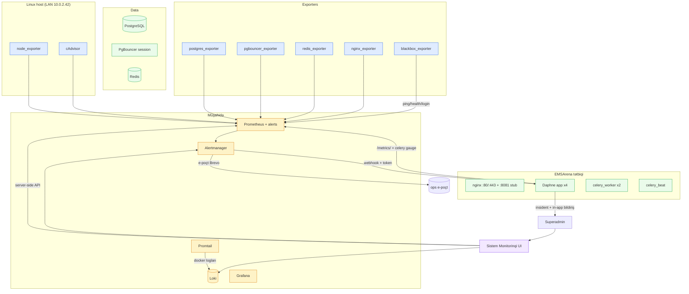

# EMSArena — Sistem Monitorinqi Mərkəzi

Superadmin-only server / infrastruktur / tətbiq / imtahan / təhlükəsizlik
müşahidə mərkəzi. Bu sənəd icra edilmiş işi, arxitekturanı, dəyişən faylları,
alert matrisini, deploy təlimatını və yoxlama siyahısını əhatə edir.

> **Kontekst:** Yerləşdirmə **LAN rejimindədir** (`EDGE_PROXY_MODE=lan`) —
> Cloudflare/publik domen YOXDUR. Orijinal tapşırıqdakı CF/DNS fərziyyələri
> LAN reallığına uyğunlaşdırılıb (blackbox probe-ları nginx üzərindən LAN
> host-a gedir; "Cloudflare failure" ayrıseçkisi çıxarılıb).

---

## 1. Mövcud sistem analizi (dublikat yaratmadan)

| Komponent | Əvvəldən var idi? | Nə edildi |
|---|---|---|
| Prometheus + alert qaydaları | ✅ (4 job, ~10 alert) | 7 yeni scrape job + 21 yeni alert qaydası əlavə edildi |
| Alertmanager (SMTP/Brevo) | ✅ | webhook receiver əlavə edildi (in-app insident axını) |
| Grafana | ✅ (1 dashboard) | dəyişdirilmədi — EMSArena daxili mərkəz əsas giriş nöqtəsidir |
| node_exporter, postgres_exporter | ✅ | saxlanıldı |
| Django `/metrics/` + exam biznes sayğacları | ✅ | Celery/backup gauge kollektoru əlavə edildi |
| `/ping/`, `/health/` | ✅ | blackbox probe hədəfi kimi istifadə edildi |
| Audit log, in-app bildirişlər, RBAC | ✅ | insident/təhlükəsizlik üçün yenidən istifadə edildi |
| cAdvisor, redis/nginx/pgbouncer/blackbox exporter | ❌ | **əlavə edildi** |
| Loki + Promtail (mərkəzi loglar) | ❌ | **əlavə edildi** |
| İnsident modeli + Təhlükəsizlik hadisələri | ❌ | **əlavə edildi** (`apps.monitoring`) |
| Superadmin monitorinq UI | ❌ | **əlavə edildi** (`system-monitoring` bölməsi) |

**Aşkarlanan risklər:** (a) exporter portları publik açılmamalı — hamısı yalnız
`emsarena-network` daxilindədir; (b) PgBouncer **session mode** RLS GUC-ları
üçün vacibdir — TOXUNULMADI; (c) yüksək-kardinallıqlı label riski — metriklərdə
istifadəçi/PIN/imtahan məzmunu YOXDUR.

---

## 2. Arxitektura



**Axın:** Prometheus scrape → alert → Alertmanager (dedup/qruplaşdırma/cooldown)
→ (e-poçt) + (webhook → Django → Incident + in-app bildiriş bütün
superadminlərə). Resolve gələndə bərpa bildirişi + müddət. Frontend heç vaxt
Prometheus/Loki/Alertmanager-ə birbaşa çıxmır — yalnız superadmin API-ları
üzərindən.

---

## 3. Dəyişən fayllar

### Yeni Django app: `apps/monitoring/`
- `models.py` — `Incident`, `SecurityEvent` (+ `IncidentStatus`, `Severity`, `SecurityEventType`)
- `permissions.py` — `superadmin_monitoring_required` (superadmin + rate-limit + audit-on-deny)
- `clients.py` — Prometheus/Loki/Alertmanager server-tərəfli müştəriləri (timeout+cache+degraded)
- `queries.py` — bölmə PromQL sorğuları (server/containers/application/database/redis-celery/exams)
- `views.py` — 13 API endpoint (overview…incidents + alertmanager-webhook)
- `urls.py` — API marşrutları
- `incidents.py` — webhook ingest, dedup, resolve, UI əməliyyatları, bildirişlər
- `security.py` — auth siqnalları (uğursuz login/brute-force/superadmin), dedup pəncərəsi
- `collectors.py` — Celery/backup gauge kollektoru (cache→/metrics/)
- `tasks.py` — beat task-ları (celery stats + backup age)
- `apps.py`, `migrations/0001_initial.py`
- `tests/` — `test_access.py`, `test_incidents.py`, `test_security_events.py` (29 test)

### Dəyişdirilən fayllar
- `docker-compose.prod.yml` — 5 exporter + Loki + Promtail servisi, `loki_data`/`promtail_positions` volume, `ALERTMANAGER_WEBHOOK_TOKEN` + monitorinq URL env-ləri, celery_worker-ə `./backups/postgres:ro` mount
- `docker/prometheus/prometheus.yml` — 7 yeni scrape job (cadvisor/redis/nginx/pgbouncer/alertmanager/loki/blackbox)
- `docker/prometheus/alerts.yml` — 21 yeni alert (host/container/redis/nginx/blackbox/celery/backup/TLS)
- `docker/alertmanager/alertmanager.tmpl.yml` — webhook receiver (`ops-all`)
- `docker/nginx/nginx.conf` — daxili `:8081 /stub_status` server (yalnız şəbəkədaxili)
- `docker/blackbox/blackbox.yml`, `docker/loki/loki-config.yml`, `docker/promtail/promtail-config.yml` — YENİ
- `config/settings/components/apps.py` — `apps.monitoring` qeydiyyatı
- `config/settings/components/integrations.py` — monitorinq URL-ləri + webhook token
- `config/settings/components/celery_cache.py` — 2 beat task
- `config/urls.py` — `api/superadmin/monitoring/` include
- `apps/accounts/views/_helpers/rbac.py` — `system-monitoring` allowed_sections (yalnız superadmin)
- `apps/accounts/views/profile/sections_api.py` — bölmə partial + AJAX-safe
- `apps/accounts/templates/accounts/profile.html` — bölmə dispatch branch
- `apps/accounts/templates/accounts/profile/sidebar/_org_menu_group.html` — sidebar menyu (superadmin-only)
- `apps/accounts/templates/accounts/profile/sections/superadmin/_system_monitoring.html` — UI (11 tab)
- `.env.production.example` — monitorinq env nümunələri

---

## 4. Verilənlər bazası dəyişiklikləri

Yeni `apps.monitoring` migration `0001_initial`:
- **Incident** — title, severity, status, source, service, alert_rule, fingerprint,
  started/detected/acknowledged/resolved_at, assigned/acknowledged/resolved_by,
  resolution_note, labels, annotations, delivery_log. İndekslər:
  `(fingerprint, status)`, `(severity, -started_at)`.
- **SecurityEvent** — event_type, severity, source_service, user, username_hint,
  organization, ip_address, request_info, message, count, resolved, incident.
  İndekslər: `(event_type, -last_seen_at)`, `(ip_address, event_type)`.

Hər ikisi platforma-səviyyəlidir (tenant-scoped deyil); yalnız superadmin
API-ları üzərindən əlçatandır.

---

## 5. Giriş nəzarəti (necə tətbiq olunur)

1. **Server-side:** hər API `@superadmin_monitoring_required` ilə sarınıb —
   `core.roles.is_superadmin_user` (yəni `is_superuser` VƏ YA platforma
   `is_superadmin`), `is_staff`-a **etibar edilmir**.
2. **401/403:** anonim → 401 JSON; qeyri-superadmin → 403 + SecurityEvent
   (`unauthorized_monitoring`, HIGH) + audit `access_denied`.
3. **Menyu:** sidebar linki yalnız `system-monitoring in allowed_sections`
   şərti ilə (yalnız superadmin) render olunur; profile.html dispatch branch-i
   də eyni şərtə tabedir (menyunu gizlətmək kifayət deyil — server yenidən
   yoxlayır).
4. **Webhook:** `alertmanager-webhook` CSRF-exempt (maşın-maşın), amma
   `ALERTMANAGER_WEBHOOK_TOKEN` ilə `hmac.compare_digest`; token boşdursa
   endpoint bağlıdır; nginx bu path-i publik marşruta çıxarmır.
5. **Rate-limit:** monitorinq API-larına per-user `240/1m`.
6. **Testlər:** `test_access.py` — superadmin 200, 8 org rolu + owner + is_staff
   403, anonim 401, icazəsiz cəhd SecurityEvent-ə yazılır.

---

## 6. Monitorinq əhatə matrisi

| Komponent | Metriklər | Loglar | Alertlər | Dashboard | Status |
|---|---|---|---|---|---|
| Linux host | ✅ node_exporter | ✅ Promtail | ✅ CPU/RAM/disk/inode/swap/load | ✅ Server tab | Hazır |
| Docker konteynerlər | ✅ cAdvisor | ✅ | ✅ down/restart-loop/OOM/mem | ✅ Konteynerlər | Hazır |
| Django tətbiqi | ✅ /metrics/ | ✅ | ✅ 5xx/latency | ✅ Tətbiq | Hazır |
| İmtahan sistemi | ✅ biznes sayğacları | ✅ | ✅ (mövcud) | ✅ İmtahanlar | Hazır |
| PostgreSQL | ✅ postgres_exporter | ✅ | ✅ down/conn/deadlock/backup | ✅ Baza | Hazır |
| PgBouncer | ✅ pgbouncer_exporter | ✅ | — | ✅ Baza | Hazır |
| Redis | ✅ redis_exporter | ✅ | ✅ down/mem/eviction/blocked | ✅ Redis·Celery | Hazır |
| Celery | ✅ gauge kollektor | ✅ | ✅ workers/beat/queue | ✅ Redis·Celery | Hazır |
| Nginx | ✅ nginx_exporter | ✅ | ✅ down | ✅ (İcmal) | Hazır |
| LAN endpoint-lər | ✅ blackbox | — | ✅ probe/TLS bitmə | ✅ (İcmal) | Hazır |
| Təhlükəsizlik | ✅ SecurityEvent | ✅ | ✅ brute-force/superadmin | ✅ Təhlükəsizlik | Hazır |
| İnsidentlər | ✅ Incident | — | ✅ | ✅ İnsidentlər | Hazır |

---

## 7. Alert matrisi (əsas)

| Alert | Xəbərdarlıq | Kritik | Kanal | Cooldown |
|---|---|---|---|---|
| Host CPU | >85% / 5dəq | >95% / 2dəq | e-poçt + in-app | 1s (crit), 4s |
| Host RAM (mövcud) | >92% | — | e-poçt + in-app | 4s |
| Disk | >80% (mövcud) | >90%, fövqəladə >97% | e-poçt + in-app | 4s |
| Inode | >85% | — | e-poçt + in-app | 4s |
| Swap | >30% / 10dəq | — | e-poçt + in-app | 4s |
| Konteyner down | — | 60s | e-poçt + in-app | 1s |
| Restart-loop | — | 3+/10dəq | e-poçt + in-app | 1s |
| OOM | — | dərhal | e-poçt + in-app | 1s |
| 5xx nisbəti (mövcud) | >2% / 5dəq | >10% / 2dəq | e-poçt + in-app | 1s (crit) |
| p95 latency (mövcud) | >2s / 10dəq | >5s / 3dəq | e-poçt + in-app | 4s |
| PostgreSQL down (mövcud) | — | 2dəq | e-poçt + in-app | 1s |
| PG conn (mövcud) | >170 | — | e-poçt + in-app | 4s |
| Redis down | — | 60s | e-poçt + in-app | 1s |
| Redis mem/eviction | >85% | eviction>0 | e-poçt + in-app | 1s (crit) |
| Celery worker down | — | 3dəq | e-poçt + in-app | 1s |
| Celery beat stale | — | 5dəq | e-poçt + in-app | 1s |
| Backup köhnə | — | >26 saat | e-poçt + in-app | 1s |
| TLS bitmə | <30 gün | <7 gün | e-poçt + in-app | 4s |
| Brute-force login | 10+ uğursuz/15dəq | — | in-app + audit | dedup 15dəq |

> **Hədlər:** Prometheus rule-ları `docker/prometheus/alerts.yml`-dədir;
> dəyişmək üçün faylı redaktə edib prometheus-u reload edin (deploy avtomatik
> edir). Alertmanager cooldown/qruplaşdırma `alertmanager.tmpl.yml`-dədir.

---

## 8. Deploy təlimatı

Bütün dəyişikliklər `docker-compose.prod.yml`-dədir; deploy pipeline-ı (`main`-ə
push) avtomatik tətbiq edir. Manual addımlar:

```bash
# 1) .env-ə webhook tokeni əlavə et (serverdə, bir dəfə)
echo "ALERTMANAGER_WEBHOOK_TOKEN=$(openssl rand -hex 24)" >> .env

# 2) Yeni miqrasiya (deploy release.sh avtomatik edir; manual:)
docker compose -f docker-compose.prod.yml run --rm app python manage.py migrate monitoring

# 3) Yeni servisləri qaldır (deploy avtomatik; manual:)
docker compose -f docker-compose.prod.yml up -d \
  cadvisor redis_exporter nginx_exporter pgbouncer_exporter \
  blackbox_exporter loki promtail

# 4) Prometheus + Alertmanager konfiqini reload
docker compose -f docker-compose.prod.yml exec prometheus kill -HUP 1
docker compose -f docker-compose.prod.yml up -d --force-recreate alertmanager

# 5) nginx (stub_status :8081 üçün) reload
docker compose -f docker-compose.prod.yml exec nginx nginx -s reload
```

**Rollback:** yeni servisləri dayandır (`docker compose stop cadvisor redis_exporter
...`), `docker/prometheus/*` və `alertmanager.tmpl.yml`-i backup-dan bərpa et,
prometheus/alertmanager reload. **Volume-ları SİLMƏ** (`loki_data` və s.).
Migration geri: `migrate monitoring zero` (yalnız zərurət olsa).

---

## 9. Yoxlama siyahısı

- [ ] `docker compose config` xətasız (YAML doğru)
- [ ] `promtool check rules docker/prometheus/alerts.yml` → SUCCESS
- [ ] Bütün exporter konteynerləri `healthy`/`running`
- [ ] Prometheus → Status → Targets: yeni 7 job `UP`
- [ ] `/api/superadmin/monitoring/overview/` superadmin üçün 200
- [ ] Eyni endpoint teacher/student üçün 403 + SecurityEvent yazılır
- [ ] Superadmin sidebar-da "Sistem Monitorinqi" görünür, digər rollarda YOX
- [ ] Prometheus söndürüləndə UI "degraded" göstərir (imtahan işləyir)
- [ ] Test alert (`amtool alert add`) → in-app bildiriş + insident yaranır
- [ ] Resolve → bərpa bildirişi + müddət
- [ ] Heç bir exporter portu host-dan əlçatan deyil (`curl host:9100` → refused)

---

## 10. Yekun qiymətləndirmə (0-100)

| Sahə | Bal | Qeyd |
|---|---|---|
| İnfrastruktur monitorinqi | 90 | node+cAdvisor+exporterlər tam; APM (Sentry) mövcud |
| Tətbiq monitorinqi | 88 | RTT/latency/status/slow-endpoint; template-render metriki gələcəkdə |
| Baza monitorinqi | 90 | PG+PgBouncer geniş; table-bloat gələcək iş |
| Təhlükəsizlik monitorinqi | 85 | brute-force/superadmin/icazəsiz; CSP-violation collector gələcək |
| Alerting | 90 | dedup/qruplaşdırma/cooldown/resolve/webhook |
| Loqlaşdırma | 82 | Loki+Promtail mərkəzi; struktur JSON + correlation-id gələcək faza |
| Giriş nəzarəti | 95 | server-side, audit, test-örtülü, is_staff-a etibar yoxdur |
| Performans | 88 | cache+timeout+degraded+limitlər; imtahan sisteminə təsirsiz |
| Etibarlılıq | 88 | graceful degradation, resource limitləri, persistent volume |
| İstifadəçi təcrübəsi | 88 | 11 tab, auto-refresh, degraded/empty/loading vəziyyətləri |
| Production hazırlığı | 88 | read-only, testli, rollback sənədli, portlar bağlı |

**Ümumi: ~88/100** — production-hazır, oxu-yalnız ilk versiya. Gələcək fazalar:
struktur JSON log + correlation-id, CSP-violation collector, table-bloat/N+1
query budcəsi, Grafana embed (auth ilə).
