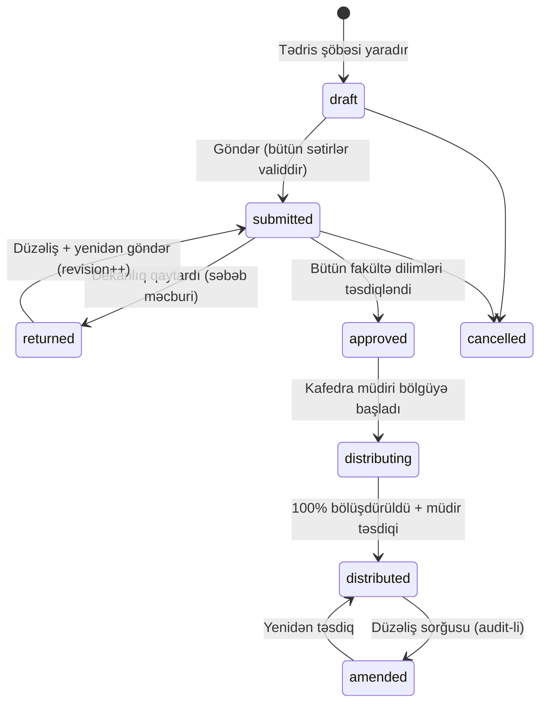

# Dərs Yükü (Tədris Tapşırığı) Modulu — Formalizasiya Sənədi

> **Status:** v1 qaralama — dizayn və icra planına giriş sənədi.
> **Mənbə:** «Tapşırıq-hazır» Excel faylı (2026/2027, 6 kafedra vərəqi) + kodbaza araşdırması
> (rollar, akademik modellər, workflow nümunələri) + normativ baza (NK №215, KQ-12/2024).
> **Yeni app:** `apps/workload`

---

> ⚠️ **v2 qeydi (2026-08-13):** axının **əvvəlinə** bir mərhələ əlavə olundu — dərs yükü
> boşluqdan yaranmır, **tədris planından törəyir** (NK №348 b. 3.2.12/3.2.13). Bax:
> [`TEDRIS_PLANI_SPEC.md`](TEDRIS_PLANI_SPEC.md). Dizayn təhlili:
> [`DESIGN_REVIEW_V1.md`](DESIGN_REVIEW_V1.md). Yenilənmiş dizayn promptu:
> [`DESIGN_PROMPT_V2.md`](DESIGN_PROMPT_V2.md).
> İki qayda bu sənəddə də dəyişdi: **(a)** kredit `Subject.ects`-dən `CurriculumSubject.credits`-ə
> keçir (eyni fənn ixtisasa görə fərqli kredit daşıyır — Excel-də 421 fənndən 35-i belədir);
> **(b)** aqreqatlarda kredit **təkrarsız fənn üzrə** sayılır, sətir-sətir toplanmır.

## 1. Məqsəd və əhatə

Universitetdə illik **tədris-pedaqoji tapşırığın** (dərs yükünün) tam elektron dövriyyəsi:

```
Kafedra tədris planını hazırlayır → Fakültə şurası → Tədris şöbəsi uzlaşdırır → Elmi Şura/rektor
→ İllik işçi tədris planı (tələbə sayları ilə) → Dekanlıq təsdiqləyir
→ Tədris şöbəsi kafedra tapşırıqlarını generasiya edir → Dekanlıq (dekan + koordinatorlar) təsdiqləyir
→ Kafedra müdiri müəllimlərə bölür → Müəllim öz yükünü görür / yükləyir
```

Bu sənəd **qalın hissədən** («Tədris şöbəsi kafedra tapşırıqlarını generasiya edir») sonrasını
əhatə edir; ondan əvvəlki mərhələlər `TEDRIS_PLANI_SPEC.md`-dədir.

Hər mərhələ izlənilir (kim, nə vaxt, nəyi dəyişdi), saat balansı avtomatik hesablanır
(bölündükcə qalıq azalır), yekunda bölgü elektron jurnalla (`CourseOffering`) birləşir.

---

## 2. Mənbə sənədin (Excel) təhlili

Fayl strukturu — bütün kafedralara **eyni 21 sütunlu standart şablon** («Xarici dillər»
vərəqi boş şablon kimi qalıb):

| # | Sütun | Qeyd |
|---|---|---|
| 1 | Semestr | `PAYIZ` / `YAZ` |
| 2 | Qruplar | Birləşmə ola bilər: `036 / 3/336 F`, `236 İ ing / 236 MRM ing` |
| 3 | Fənnin adı | Fənn + xüsusi sətirlər: `Təcrübə`, `Buraxılış işi`, `ATMF blokları` (seçmə fənn blokları) |
| 4 | İxtisas | Başqa fakültənin ixtisası da ola bilər (**xidməti tədris**: Proqramlaşdırma kafedrası psixologiya/filologiya qruplarına dərs deyir); `Magistr …` yazısı səviyyəni bildirir |
| 5 | Tələbələrin sayı | Birləşmədə hərəsi ayrıca: `30 / 50` |
| 6 | Birləşmələrin sayı | Mühazirə axını sayı |
| 7 | Qrup və yarımqrupların sayı | Seminar/lab bölgüsü üçün |
| 8–9 | Mühazirə: plan üzrə / cəmi | **cəmi = plan × birləşmə sayı** |
| 10–11 | Təcrübi-seminar: plan / cəmi | **cəmi = plan × qrup/yarımqrup sayı** |
| 12–13 | Laboratoriya: plan / cəmi | eyni qayda |
| 14 | Məsləhət | |
| 15 | İmtahan | |
| 16 | Buraxılış və dissertasiya işinə rəhbərlik | |
| 17 | Dissertant və doktorantlara rəhbərlik | |
| 18–19 | Təcrübələr: elmi-tədqiqat/elmi-pedaqoji / istehsalat | `Təcrübə` sətirləri yalnız bu sütunları doldurur |
| 20 | CƏMİ | Sətir üzrə yekun saat |
| 21 | Kreditlərin sayı | Birləşmədə fərqli ola bilər: `6 / 7` |

Altlıq: semestr üzrə yekunlar + «KAFEDRA ÜZRƏ YEKUN» (məs. Proqramlaşdırma: 8 965 saat,
Payız 4 665 / Yaz 4 300). Başlıqda: «Təsdiq edirəm: İcraçı prorektor …» — yəni real
proseslərdə **prorektor təsdiqi** də mövcuddur (aşağıda opsional mərhələ kimi salınıb).

---

## 3. Rollar və icazələr

### 3.1 Mövcud rollar (dəyişiklik tələb etmir)

| Rol (slug) | Level | Scope | Bu modulda funksiyası |
|---|---|---|---|
| `dean` | 80 | UNIT (fakültə) | Öz fakültəsinə aid tapşırıq dilimini təsdiqləyir / qaytarır |
| `program_coordinator` | 45 | UNIT (ixtisas) | Öz ixtisasının sətirlərinə rəy (viza) verir |
| `chair_head` | 70 | UNIT (kafedra) | Təsdiqlənmiş yükü müəllimlərə bölür |
| `teacher` | 50 | COURSE | Öz yükünü görür, export edir |
| `vice_rector` | 90 | ORG | (opsional) yekun təsdiq + ümumi dashboard |

### 3.2 Yeni rollar (DEFAULT_ROLES-a əlavə)

| Rol (slug) | Level | Scope | Funksiya |
|---|---|---|---|
| `teaching_office_head` | 85 | ORGANIZATION | Tədris şöbəsinin rəhbəri: tapşırıqları yaradır, göndərir, bütün prosesi izləyir |
| `teaching_office_staff` | 60 | ORGANIZATION | Tədris şöbəsi əməkdaşı: tapşırıq redaktoru ilə işləyir (göndərmə səlahiyyəti konfiqurasiyalıdır) |

> ⚠️ **Tələ:** level ≥ 80 rollara avtomatik `org_admin` alias verilir
> (`core/roles.py`), istisna siyahısı `ADMIN_ALIAS_EXEMPT_ROLE_NAMES`-dədir.
> `exam_center*` presedentində olduğu kimi `teaching_office_head` bu istisna
> siyahısına **mütləq əlavə olunmalıdır** — əks halda tədris şöbəsi rəhbəri bütün
> admin panellərə düşəcək.

### 3.3 Yeni permission ailəsi (`apps/organizations/permissions.py`)

```
workload.view          — tapşırığa baxış (öz scope-unda)
workload.manage        — tapşırıq yaratmaq/redaktə (tədris şöbəsi)
workload.submit        — dekanlıqlara göndərmək
workload.review        — koordinator vizası
workload.approve       — dekan/prorektor təsdiqi
workload.distribute    — kafedra bölgüsü
workload.report        — hesabat/export
```

Bütün view-lar mövcud `OrganizationRequiredMixin` + `PermissionRequiredMixin` /
`LevelRequiredMixin` (apps/organizations/decorators.py) ilə qorunur; unit-scope
məhdudiyyəti `organizations.scoping` (`user_scope_subtree_q`) ilə: dekan yalnız öz
fakültəsinin, koordinator yalnız öz ixtisasının, kafedra müdiri yalnız öz kafedrasının
məlumatını görür.

---

## 4. Proses axını (state machine)

Kanonik nümunə: exams final-center state machine (`status` + keçid cədvəli + şərti
UPDATE / compare-and-swap — `apps/exams/domain/final_center.py` üslubu).

### 4.1 Tapşırıq (kafedra-səviyyə sənəd) statusları



- **`submitted → approved`** avtomatikdir: tapşırığın toxunduğu **hər fakültə diliminin**
  təsdiqi tamamlananda (bax 4.2). Prorektor mərhələsi aktivdirsə, arada
  `pending_final_approval` statusu əlavə olunur.
- **`returned`** bütöv sənədi yox, konkret sətirləri qaytarır (qaytarılan sətirlər
  işarələnir) — tədris şöbəsi yalnız onları düzəldib yenidən göndərir.
- Təsdiqdən sonrakı hər dəyişiklik **amendment** (düzəliş) axını ilə gedir: səbəb +
  qeyd məcburi, köhnə dəyərlər snapshot-lanır (journal corrections nümunəsi:
  `apps/registrar/models/corrections.py` üslubu, PDF sənəd tələbi opsional).

### 4.2 Dekanlıq təsdiqi — fakültə dilimləri (əsas dizayn qərarı)

Excel təhlili göstərdi ki, bir kafedranın tapşırığında **başqa fakültələrin
ixtisasları** da olur (xidməti tədris). Ona görə təsdiq **sənəd-səviyyə yox,
dilim-səviyyədədir**:

1. Hər sətir bir ixtisasa → ixtisas bir fakültəyə (`OrgUnit.path`) aiddir.
2. `submitted` anında sistem tapşırığı **fakültə dilimlərinə** bölür: hər toxunulan
   fakültə üçün bir `TaskFacultySlice` (pending).
3. Hər fakültənin **proqram koordinatorları** öz ixtisasının sətirlərinə rəy verir
   (viza: `reviewed` / `flagged` + şərh) — org-konfiqurasiyası ilə məcburi və ya
   opsional.
4. **Dekan** dilimi bütöv təsdiqləyir (`approved`) və ya sətir seçib qaytarır
   (`returned`, səbəb məcburi).
5. Bütün dilimlər `approved` olanda sənəd `approved` olur və kafedra müdirinə düşür.

### 4.3 Kafedra bölgüsü

- Müdir hər sətri bir və ya bir neçə müəllimə bölür — **fəaliyyət növü üzrə ayrı-ayrı**
  (mühazirəni bir nəfər, seminarları iki nəfər, lab yarımqrup-yarımqrup və s.).
- Hər bölgüdə saat balansı yoxlanılır: `Σ bölünən ≤ sətrin cəmi` (fəaliyyət növü
  səviyyəsində). Qalıq real vaxtda görünür; sətir tam bölünəndə «tam» işarəsi alır.
- Müəllim tapılmayan saatlar üçün **«Vakant»** bölgüsü (teacher=NULL) — hesabatlarda
  saathesabı fondu / işə qəbul ehtiyacı kimi görünür.
- Bütün sətirlər 100% bölünəndə müdir bölgünü təsdiqləyir → `distributed` → müəllimlərə
  bildiriş gedir və (konfiqurasiya ilə) `CourseOffering` sinxronu işə düşür (bax §7.1).

---

## 5. Data modeli (`apps/workload`)

Hamısı `UUIDModel + TimeStampedModel`, `organization` FK (CASCADE), RLS siyasəti
(`apps/organizations/migrations/00NN_rls_workload.py`, `_direct_org_policy` helper-ləri),
cross-app FK-lər **string label** ilə (`"organizations.OrgUnit"`, `"registrar.Subject"`).

### 5.1 `TeachingTask` — kafedraya verilən illik tapşırıq

| Sahə | Tip / qeyd |
|---|---|
| `organization` | FK |
| `academic_year` | Char(20) — `"2026/2027"` (AcademicPeriod.academic_year konvensiyası) |
| `chair` | FK OrgUnit (`unit_type="chair"`) |
| `status` | draft / submitted / returned / pending_final_approval / approved / distributing / distributed / amended / cancelled |
| `revision` | int — hər qaytarma-göndərmə dövrü artırır |
| `created_by`, `submitted_by`, `submitted_at` | audit |
| `note` | Text |

Unikal: `(organization, academic_year, chair)` — kafedraya ildə bir sənəd.

### 5.2 `TeachingTaskRow` — tapşırıq sətri (Excel sətrinin 1:1 qarşılığı)

| Sahə | Tip / qeyd |
|---|---|
| `task` | FK TeachingTask |
| `season` | `fall` / `spring` / `summer` (Payız/Yaz/Yay — mövcud fəsil konvensiyası) |
| `period` | FK `"organizations.AcademicPeriod"` (null) — semestrə lövbər (offering sinxronu üçün) |
| `subject` | FK `"registrar.Subject"` (null, PROTECT) |
| `subject_text` | Char — fənn kataloqda yoxdursa / xüsusi sətir (`Təcrübə`, `Buraxılış işi`, ATMF blok adı) |
| `row_kind` | `teaching` / `practice` / `thesis` / `postgrad` / `other` — xüsusi sətir növləri |
| `specialty` | FK OrgUnit(`specialty`) (null) + `specialty_text` fallback |
| `faculty` | FK OrgUnit(`faculty`) — denormalizə (dilim marşrutu üçün; specialty.path-dan törədilir) |
| `groups` | M2M OrgUnit(`group`) + `groups_text` (birləşmə yazılışı: `036 / 336 F`) |
| `education_form` | `eyani` / `qiyabi` / `intensiv` / `distant` (**yeni anlayış — bax §8.1**) |
| `degree_level` | `bachelor` / `master` / `phd` (Program.degree_level dəyərləri) |
| `student_count` | int (birləşmədə cəm) + `student_count_text` (`30 / 50`) |
| `union_count`, `subgroup_count` | int — birləşmə sayı / qrup-yarımqrup sayı |
| `lecture_plan`, `lecture_total` | int — plan üzrə / cəmi |
| `seminar_plan`, `seminar_total` | int |
| `lab_plan`, `lab_total` | int |
| `consult_hours`, `exam_hours` | int |
| `thesis_hours` | int — buraxılış/dissertasiya rəhbərliyi |
| `postgrad_hours` | int — dissertant/doktorant rəhbərliyi |
| `practice_research_hours`, `practice_production_hours` | int |
| `total_hours` | int — DB-də saxlanır, servisdə yoxlanır: cəmilərin cəmi |
| `credits` | Char(20) — birləşmədə `6 / 7` ola bildiyi üçün mətn + `credits_value` int (əsas dəyər) |
| `review_status` | `pending` / `reviewed` / `flagged` / `returned` — koordinator/dekan işarələri |
| `order` | sıra (OrderedModel) |

Validasiya (servis qatı): `*_total`-lar `plan × say` düsturu ilə üst-üstə düşməyəndə
xəbərdarlıq (bloklamır — real fayllarda kənarlaşmalar var), `total_hours` cəm yoxlaması,
qrup seçiləndə specialty ilə uyğunluq.

### 5.3 `TaskFacultySlice` — fakültə təsdiq dilimi

| Sahə | Tip |
|---|---|
| `task` | FK |
| `faculty` | FK OrgUnit |
| `status` | `pending` / `approved` / `returned` |
| `approved_by`, `approved_at`, `comment` | audit |

Unikal: `(task, faculty, task.revision)` — hər revision-da təzələnir.

### 5.4 `TaskRowReview` — koordinator vizası

`row` FK, `coordinator` FK user, `status` (`reviewed`/`flagged`), `comment`, timestamp.
Koordinatorun ixtisas scope-u `Membership.scope_unit` ilə yoxlanılır.

### 5.5 `TeacherAssignment` — bölgü sətri

| Sahə | Tip / qeyd |
|---|---|
| `row` | FK TeachingTaskRow |
| `teacher` | FK user (null = **Vakant**) — kafedrada aktiv `teacher`/`assistant` membership yoxlanışı |
| `activity` | `lecture` / `seminar` / `lab` / `consult` / `exam` / `thesis` / `postgrad` / `practice_research` / `practice_production` |
| `hours` | int > 0 |
| `groups_note` | Char — hansı qrup/yarımqrup (məs. `236 İ ing, 2-ci yarımqrup`) |
| `is_hourly_paid` | bool — saathesabı fondundan |
| `assigned_by`, `note` | audit |

Constraint (servis + DB check): eyni `row + activity` üzrə `Σ hours ≤` sətrin həmin
fəaliyyət cəmi. Qalıq = cəmi − bölünən (hər fəaliyyət üzrə ayrıca göstərilir).

### 5.6 `TeacherWorkloadProfile` — müəllimin illik yük profili

| Sahə | Tip / qeyd |
|---|---|
| `organization`, `teacher`, `academic_year` | unikal üçlük |
| `position` | `professor` / `dosent` / `bas_muellim` / `muellim` / `assistent` (org-konfiqurasiyalı siyahı) |
| `staff_fraction` | Decimal — 0.25 / 0.5 / 0.75 / 1.0 / 1.25 / 1.5 ştat |
| `annual_norm_hours` | int — bu müəllim üçün illik norma (default: org settings × fraction) |
| `is_external` | bool — kənar (saathesabı) müəllim |

Bunun üzərindən: doluluq faizi, norma aşımı xəbərdarlıqları (bax §8.2 normativ
limitlər), «az yüklənmiş / həddən artıq yüklənmiş» hesabatları.

### 5.7 `WorkloadAmendment` — təsdiqdən sonrakı düzəlişlər

Journal-corrections nümunəsi ilə: `target` (row / assignment), köhnə-yeni dəyər
snapshot-ları (JSON), `reason` (enum) + `note` məcburi, `document` (PDF, opsional —
org siyasəti), `made_by`. Hər amendment `core.audit.log_action`-a da yazılır.

---

## 6. Ekranlar və dizayn brifi

Bütün səhifələr mövcud dizayn dili ilə: `--ems-*` tokenləri (ağ + mavi, light-only),
stat-kart + drill-down nümunəsi (`acr`/`ecs` bölmələri), cədvəl-ağır redaktə üçün
`jd2` grid nümunəsi, `bootstrap-select` + axtarışlı lazy picker-lər
(`EMSSearchableSelect`), skeleton loader-lər. CSS/JS yalnız xarici fayllarda
(CSP), AJAX-safe (`EMSReady`/`EMSDelegate`), profil SPA bölmə kontraktı
(`data-profile-section-panel`).

### 6.1 Tədris şöbəsi — «Dərs yükü mərkəzi» (profil bölməsi `workload-center`)

1. **İl paneli:** tədris ili seçimi + kafedra kartları (kafedra adı, status nişanı,
   yekun saat, Payız/Yaz bölgüsü, son hərəkət). Statuslar rəngli chip-lərlə
   (draft boz, submitted mavi, returned qırmızı, approved yaşıl, distributed tünd yaşıl).
2. **Tapşırıq redaktoru:** Excel-ə maksimal yaxın **grid** (jd2 üslubu: sticky birinci
   sütun, sətirdaxili redaktə, alt yekun zolağı). Sətir əlavə: fənn axtarışlı seçim
   (Subject kataloqu + sərbəst mətn), ixtisas → qruplar kaskadı, saat xanaları;
   `plan × say = cəmi` avtomatik təklif olunur, əl ilə düzəldilə bilir; sətir cəmi və
   sənəd cəmi (Payız/Yaz/Yekun) canlı hesablanır. Kütləvi əməliyyatlar: sətri kopyala
   (ing. sektor variantı üçün), semestri dəyiş, sil.
3. **Excel import sehrbazı:** mövcud TAPŞIRIQ fayllarını yükləmə (vərəq = kafedra),
   sütun xəritəsi önizləmə, fənn/qrup adlarının kataloqla **uyğunlaşdırma addımı**
   (tapılmayanlar `*_text` fallback ilə qalır, sarı işarələnir), idxal hesabatı.
4. **Göndərmə:** validasiya xülasəsi (xəbərdarlıqlar siyahısı) → «Dekanlıqlara göndər»
   → hansı fakültələrə dilim düşdüyü göstərilir.
5. **İzləmə paneli:** hər tapşırığın dilim-dilim vəziyyəti (fakültə × status matrisi),
   qaytarılan sətirlər qırmızı, koordinator şərhləri.

### 6.2 Dekanlıq — «Yük təsdiqi» (dekan + koordinator, bölmə `workload-approval`)

- **Koordinator görünüşü:** yalnız öz ixtisasının sətirləri; sətir-sətir «Baxdım» /
  «İrad» (şərh məcburi); tərəqqi göstəricisi (X/Y sətir baxılıb).
- **Dekan görünüşü:** fakültə diliminin tam cədvəli + koordinator vizalarının xülasəsi;
  stat-kartlar (cəmi saat, ixtisas sayı, iradlı sətir sayı); əməliyyatlar:
  «Dilimi təsdiqlə» / «Seçilmiş sətirləri qaytar» (səbəb modalı). Tarixçə tab-ı.

### 6.3 Kafedra müdiri — «Yük bölgüsü» (bölmə `workload-distribution`)

Modulun vitrini — iki panelli ekran:

- **Sol: tapşırıq sətirləri** (filtr: semestr, fənn, ixtisas, forma, bölünmə statusu).
  Hər sətirdə fəaliyyət-fəaliyyət qalıq çubuğu (mühazirə 30/30 yaşıl, seminar 15/45
  narıncı və s.).
- **Sətir bölgü modalı:** fəaliyyət növü seç → müəllim seç (kafedra müəllimləri,
  axtarışlı; hər adın yanında cari yükü/norması) → saat + qrup qeydi → əlavə et.
  Qalıq 0 olanda fəaliyyət bağlanır. «Vakant» seçimi ayrıca.
- **Sağ: müəllim yük paneli** — hər müəllim üçün kart: cəmi saat / norma
  **progress bar** (norma aşımında qırmızı), Payız/Yaz, forma (əyani/qiyabi/intensiv),
  səviyyə (bakalavr/magistr) breakdown-u; karta klik → müəllimin tam bölgü cədvəli.
- **Yekun:** «Bölgünü təsdiqlə» (yalnız 100% bölünəndə aktivdir; vakantlar xəbərdarlıqla
  buraxıla bilər) → müəllimlərə bildiriş + offering sinxronu.

### 6.4 Müəllim — «Dərs yüküm» (bölmə `my-workload`)

- Semestr tab-ları (Payız / Yaz / Yekun): cədvəl — fənn, qrup(lar), fəaliyyət növü,
  saat, forma, səviyyə; alt yekun. Stat-kartlar: illik cəmi, norma, doluluq %,
  saathesabı hissə.
- **Export:** «Excel yüklə» (fərdi yük cədvəli) və «Ümumi tapşırığa bax» (kafedra
  sənədinin təsdiqli yekun Excel-i — istifadəçinin istədiyi «ümumi yükə baxmaq»).
- Keçmiş illərin arxivi (yalnız oxunuş).

### 6.5 Rektorluq / prorektor (opsional mərhələ aktivdirsə)

Ümumi dashboard: fakültə/kafedra üzrə yekun saatlar, status xəritəsi, vakant fond,
norma kənarlaşmaları; «Yekun təsdiq» düyməsi (rəsmi sənəddəki «Təsdiq edirəm» qarşılığı).

---

## 7. Mövcud sistemlə inteqrasiya

### 7.1 `CourseOffering` sinxronu (modulun ən böyük dəyəri)

Bölgü `distributed` olanda (org-konfiqurasiyası ilə) hər uyğun `TeacherAssignment`
üçün `registrar.CourseOffering` yaradılır/yenilənir:

- Şərtlər: `row.subject` FK dolu + `row.period` dolu + qrup seçilib + müəllim vakant deyil.
- Xəritə: `subject=row.subject, period=row.period, group=qrup, instructor=teacher,
  lesson_hours=müvafiq kontakt saatı`. Mövcud unikal açar `(org, subject, period, group)`
  qorunur; mühazirə/seminar ayrı müəllimlərdədirsə **jurnal sahibi konfiqurasiya ilə**
  seçilir (default: mühazirəçi; qalanları offering-ə köməkçi kimi sonrakı fazada).
- Yaradılan offering avtomatik jurnal açır (mövcud `ensure_offering_course` +
  `ensure_assessment_scheme` zənciri) — **bölgü təsdiqləndi → elektron jurnal hazır**.
- Xüsusi sətirlər (Təcrübə, Buraxılış işi, subject-siz) sinxrona düşmür.
- Əks-yoxlama hesabatı: offering var, bölgüdə yoxdur / tərsi (uyğunsuzluq siyahısı).

### 7.2 Digər bağlantılar

| Sahə | İnteqrasiya |
|---|---|
| Semestrlər | `organizations.AcademicPeriod` (Payız/Yaz fəsil törətməsi mövcud konvensiya ilə) |
| Struktur | `OrgUnit` iyerarxiyası (faculty→chair→specialty→group), `Membership.scope_unit` scope-ları |
| Bildirişlər | `apps/notifications/public.py` — hazır `notify_*` nümunələri; yeni növ: `workload` |
| Audit | `core.audit.log_action` + amendment snapshot-ları |
| Export | openpyxl builder-lər (nümunə: `apps/registrar/journal_export.py`); böyük fayllar üçün async export-job registry (`apps/exams/export_registry.py` nümunəsi — workload öz mini-registrisini qurur, exams-a import yolu YOXDUR — boundary gate) |
| İmport | Excel upload: `FileUploadValidator` + `randomize_uploaded_filename`; ilkin miqrasiya üçün management command (`import_users_from_excel` nümunəsi) |
| PDF | PyMuPDF (`transcript_pdf.py` nümunəsi) — fərdi iş planı / rəsmi tapşırıq çapı |
| CI qapıları | modul ≤600 sətir, boundary-ratchet (workload→registrar/organizations yalnız `public.py` və ya string-FK/lazy `get_model`), worker-atomic, yeni setting-lər `production.py` import siyahısına |

---

## 8. Normativ baza və validasiya qaydaları

Rəsmi mənbələr (tam mətnləri yoxlanılıb):

- **NK №215 (24.11.2010):** professor-müəllim heyətinin bir ştat üzrə illik dərs yükü
  **≥500 saat**; auditoriya dərsləri illik yükün **≥60%-i**.
- **Elm və Təhsil Nazirliyi Kollegiyası KQ-12 (03.09.2024):** bir nəfərə maksimum
  **1,5 ştat** yük + könüllü **≤250 saat saathesabı**; elmi-fəal heyətin yükü 40%-dək
  azaldıla bilər (heyətin ≤5%-i). Fəaliyyət normaları cədvəli: doktoranta rəhbərlik
  80 saat/il (max 5 nəfər), buraxılış işi 20–30 saat/tələbə (max 5), magistr
  dissertasiyası 40–60 saat/il (max 5), imtahanqabağı məsləhət qrupa 1 saat və s.
- **Əmək Məcəlləsi m.58:** əvəzçilik ≤0,5 ştat.
- Vəzifə üzrə saat differensiasiyası (professor ~450–550, assistent yuxarı) **rəsmi
  deyil**, universitet-daxili praktikadır → **tenant-konfiqurasiyalı saxlanmalıdır**,
  hardcode YOX.

**Org-səviyyə konfiqurasiya (`WorkloadSettings` və ya `Organization.settings` açarları):**
illik norma (default 500), vəzifə üzrə normalar cədvəli, max ştat (1.5), saathesabı
tavanı (250), buraxılış işi saat aralığı, koordinator vizası məcburidirmi, prorektor
mərhələsi aktivdirmi, offering avto-sinxron aktivdirmi.

**Validasiya davranışı:** normativ limitlər **bloklamır, xəbərdarlıq edir** (sarı/qırmızı
nişanlar + hesabatlarda kənarlaşma siyahısı) — real həyatda istisnalar rəhbər qərarı
ilə olur; sistem isə izi saxlayır.

---

## 9. Əlavə lazım olanlar (istəkdə deyilməyən, amma vacib)

1. **Təhsil forması boşluğu** — sistemdə əyani/qiyabi heç yerdə modellənməyib.
   Minimum: `TeachingTaskRow.education_form`. Tövsiyə: qrup `OrgUnit.settings`-inə də
   yazmaq (gələcəkdə cədvəl/jurnal filtrləri üçün).
2. **Vəzifə/ştat reyestri** — `TeacherWorkloadProfile` (§5.6). Bunsuz norma müqayisəsi,
   doluluq faizi və saathesabı fondu hesablana bilməz. (HR modulu ilə gələcək bağlantı.)
3. **Vakant saat fondu** — bölünməmiş/müəllimsiz saatların hesabatı: işə qəbul planı və
   saathesabı büdcəsinin əsasıdır.
4. **Kənar (saathesabı) müəllimlər** — sistemə müəllim membership-i ilə əlavə olunmalı;
   `is_external` işarəsi + saathesabı tavan yoxlaması (240/480 saat qaydaları).
5. **İl rollover-i** — «keçən ilin tapşırığından kopyala» (fənn siyahısı dəyişməz,
   saylar yenilənir) — tədris şöbəsinin ən çox vaxt qazandıran funksiyası.
6. **Deadline-lar + eskalasiya** — hər mərhələyə son tarix (org config), gecikəndə
   bildiriş/xatırlatma (mövcud notifications + Celery beat).
7. **Hesabatlar paketi:** kafedra/fakültə yekunları (rəsmi TAPŞIRIQ formatında Excel),
   müəllim üzrə fərdi iş planı (KQ-12-nin icbari sənədi!), plan-fakt müqayisəsi
   (bölgü vs jurnalda faktiki keçirilən `Lesson.hours`), norma kənarlaşma hesabatı,
   saathesabı fond hesabatı.
8. **Plan-fakt izləməsi (gələcək faza)** — jurnal dərsləri yazıldıqca müəllimin faktiki
   saatı bölgü ilə tutuşdurulur; il sonu icra qeydi (KQ-12 tələbi).
9. **Dərs cədvəli bağlantısı (gələcək)** — `ScheduleSlot`-ların bölgü ilə üzləşdirilməsi
   (bölgüsü olmayan fənnə slot qoyulanda xəbərdarlıq).
10. **Seçmə fənn blokları (ATMF)** — Excel-də blok sətirləri var; `GroupElectiveChoice`
    qərarı veriləndə blok sətri konkret fənnə çevrilə bilər (fazalı).
11. **Yarımqrup anlayışının dəqiqləşdirilməsi** — hazırda say + mətn kimi saxlanır;
    gələcəkdə qrupun rəsmi yarımqrup modelinə keçid mümkündür.
12. **İngilis sektoru** — qruplar ayrı OrgUnit-lərdir (mövcud konvensiya); redaktorda
    «sektor variantını kopyala» əməliyyatı bunun üçündür.

---

## 10. Fazalı icra planı

| Faza | Əhatə | Nəticə |
|---|---|---|
| **F0 — Bünövrə** | `apps/workload` skeleti, modellər + migrasiyalar + RLS, yeni rollar + permission-lar, admin qeydiyyatı, seed | Data qatı hazır, testlər |
| **F1 — Tədris şöbəsi** | Tapşırıq redaktoru (grid), Excel import sehrbazı, validasiya + göndərmə, izləmə paneli | Tapşırıq elektron yaradılır |
| **F2 — Dekanlıq** | Dilim mexanizmi, koordinator vizası, dekan təsdiq/qaytarma, bildirişlər | Təsdiq dövriyyəsi işləyir |
| **F3 — Kafedra bölgüsü** | Bölgü ekranı, saat balansı, müəllim yük paneli, vakantlar, bölgü təsdiqi | Yük müəllimlərə bölünür |
| **F4 — Müəllim + export** | «Dərs yüküm» bölməsi, Excel/PDF exportlar (fərdi + rəsmi format), arxiv | Müəllim öz yükünü görür/yükləyir |
| **F5 — İnteqrasiya + hesabat** | CourseOffering sinxronu, hesabatlar paketi, amendment axını, rollover, deadline-lar | Tam dövriyyə + jurnal bağlantısı |

Hər faza ayrıca PR dəsti + CI qapıları (postgres RLS testləri daxil). Dizayn
mərhələsi F1–F4 ekranlarının HTML mockup-ları ilə başlayır (bax §6 briflər).

---

## 11. Açıq suallar (qərar tələb edir)

1. **Prorektor mərhələsi:** rəsmi sənəddə var — sistemdə aktiv olsun, yoxsa dekanlıq
   təsdiqi ilə bitsin? *(Tövsiyə: org-konfiqurasiyalı, default söndürülü.)*
2. **Koordinator vizası məcburiliyi:** dekan vizasız təsdiqləyə bilsinmi?
   *(Tövsiyə: konfiqurasiyalı, default — viza tövsiyə xarakterli.)*
3. **Jurnal sahibi:** mühazirə və seminar ayrı müəllimlərdə olanda offering-in
   `instructor`-u kim olsun? *(Tövsiyə: mühazirəçi; seminar müəllimləri üçün
   köməkçi-instruktor dəstəyi ayrıca işdir.)*
4. **Kafedra müdirinin sətir dəyişmə hüququ:** bölgü zamanı saat/qrup səhvi görsə,
   özü düzəldə bilsin, yoxsa yalnız tədris şöbəsinə qaytarsın?
   *(Tövsiyə: yalnız qaytarma — tək mənbə prinsipi.)*
5. **Education form dəyərləri:** əyani/qiyabi/intensiv/distant siyahısı kifayətdirmi?
